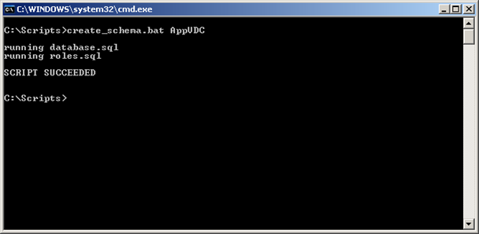
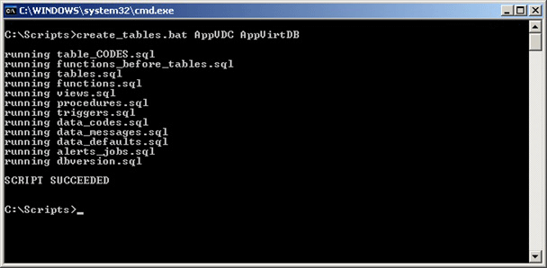
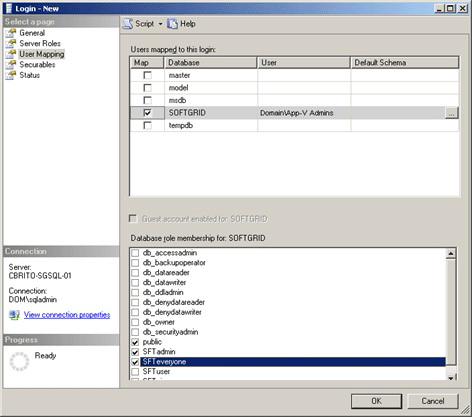
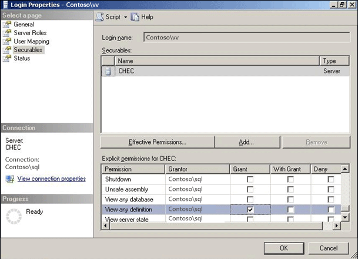
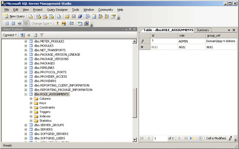

# Creating App-V 4.5 Databases Using SQL Scripting


**Who is this solution intended for?** Information technology professionals who manage Application Virtualization (App-V) 4.5 databases.

**How can this guide help you?** This solution explains and documents the procedure to install the Microsoft Application Virtualization Server when the administrator installing does not have “sysadmin” privileges to the SQL Server.

## Overview


One of the challenges of installing Microsoft Application Virtualization 4.5 (App-V) is that the install program assumes that the user installing the server features will not only be a local computer administrator, but also have SQL administrator privileges on the SQL server that will host the Data Store. This requirement is based on the fact that the database, as well as the appropriate roles and permissions, are created as part of the install. However, in most enterprises, SQL servers are managed separately from the infrastructure team who will be installing App-V. These security requirements will make it difficult to get SQL administrators to give the infrastructure administrator installing App-V adequate rights; similarly, the SQL administrators will not have the required privileges to install the product for the infrastructure team.

Currently, an administrator attempting the installation of App-V must have SQL “sysadmin” privileges. In previous versions of the product the setup allowed for the SQL administrators to either create a temporary “sysadmin” account or be present during installation to provide credentials with “sysadmin” privileges. In this release, scripts are provided in the released product for all administrators to use when implementing their infrastructure.

This whitepaper discusses the scenario in which the install will need to be divided into two separate tasks: creating the SQL database, and installing the App-V server features. The SQL administrators would be able to review the SQL scripts and make modifications to resolve any conflicts with other databases, or to support integration with other tools. The result of the scripts is to allow SQL administrators to prepare the database so that the infrastructure administrators do not have to be granted any advanced rights on the SQL server. This is important in environments where security policies would prohibit this.

### SQL Database Creation Process

The SQL scripts allow for SQL administrators to create the required database and also set up the privileges for the App-V administrators to successfully install and manage the environment. The steps for completing these tasks are listed later in this document.

This process separates the database creation and configuration actions from the actual App-V installation.

**Information to be provided to SQL administrators**

-   Name of AD group that is going to be the App-V admin’s

-   Name of the server where App-V Management Server will be installed

**Information to be returned to the Infrastructure administrators**

-   Name of the database server or instance and the name of the App-V database

Once the database has been prepared, the App-V administrators can run the App-V installation without SQL administrator privileges.

### Using the SQL Setup Scripts

**Requirements**

The following is a list of requirements for using the scripts which are located in the support\\createdb folder at the root of the selected extract location.

-   Scripts must be copied to a writeable location on the computer where they will be run (be sure to remove the read only attribute from these scripts after they have been copied) and SQL client tools must be loaded on that computer (osql is only required for running the sample batch files on the local computer).

-   The SQL Server must support Windows Authentication.

-   Ensure that the SQL Server Instance and SQL Agent Service are running.

-   Log on with a domain account that is a SQL administrator (sysadmin) on the computer where the scripts will be done.

The scripts runs under the logged-on user’s domain credentials.

**Database Creation Using SQL Scripts**

**Tasks to be performed by SQL administrators:**

1.  Copy the scripts contained in the support\\createdb folder from the root of the selected extract location to the computer where the scripts will be run. The following files are required for the scripts to run properly and must be called in the order presented below.

    -   database.sql

    -   roles.sql

    -   table\_CODES.sql

    -   functions\_before\_tables.sql

    -   tables.sql

    -   functions.sql

    -   views.sql

    -   procedures.sql

    -   triggers.sql

    -   data\_codes.sql

    -   data\_messages.sql

    -   data\_defaults.sql

    -   alerts\_jobs.sql

    -   dbversion.sql

2.  Review and modify, if necessary, the `database.sql` file. The default settings will name the database “APPVIRTDB.”

    -   If necessary replace instances of `APPVIRTDB` with the `database name` that will be used.

    -   Modify the `FILENAME` property in the script with the appropriate path for the SQL Server where the database will be created.

3.  Review and modify, if necessary, the `database name [APPVIRTDB]` in the `roles.sql` file that was used in the database.sql file.

****

### Example of how to automate the process using batch files

If used, the two sample batch files provided run the SQL scripts in the following manner:

1.  **Create\_schema.bat (1)**

    -   database.sql

    -   roles.sql

2.  **Create\_tables.bat (2)**

    -   table\_CODES.sql

    -   functions\_before\_tables.sql

    -   tables.sql

    -   functions.sql

    -   views.sql

    -   procedures.sql

    -   triggers.sql

    -   data\_codes.sql

    -   data\_messages.sql

    -   data\_defaults.sql

    -   alerts\_jobs.sql

    -   dbversion.sql

**Note**  
Careful consideration when modifying the scripts must be taken and should only be done by someone with the appropriate knowledge. Also, of the sample files presented only the following should be changed: **create\_schema.bat**, **create\_tables.bat**, **database.sql**, and **roles.sql**. All other files should not be modified in any way as this could cause the database to be created incorrectly, which will lead to the failure of App-V services to be installed.


The two sample batch files must be placed in the same directory where the rest of the SQL scripts were copied to on the computer.

1.  Run the sample **create\_schema.bat** file to create the database. This script will take several seconds to complete and should not be interrupted.

    -   Run the create schema.bat file from the directory where it was copied to. Syntax is: “Create\_schema.bat `SQLSERVERNAME`”

        

    -   If this script fails during the creation of the new “APPVIRTDB” database, check the log as indicated to correct the issue. It will be necessary to delete the database that was created with a partial running of the scripts in order to ensure that subsequent attempts will work properly.

2.  Run the `create_tables.bat` file to create the tables in the database. This script will take several seconds to complete and should not be interrupted.

    -   Run the create\_tables.bat file from the directory where it was copied. Syntax is: “create\_tables.bat `SQLSERVERNAME DBNAME`”

        

        If the script fails during the creation of the tables, check the log as indicated to correct the issue. It will be necessary to delete the database and run create\_schema.bat before attempting to run the create\_tables.bat file on all subsequent attempts.

### Setting permissions on the App-V database

The following accounts will need to be created on the SQL server with specific permissions and roles to the new database for the installation, deployment and ongoing administration of the App-V environment.

-   Create a login for the App-V administrators group on the SQL Server and the APPVIRTDB database for the “domain\\App-V Admins” (where “domain” and “App-V Admins” will be changed to reflect your own environment) and add them to the SFTAdmin and SFTEveryone database role.

    

-   Grant this group “VIEW ANY DEFINITION” permission at the global level (This allows the Microsoft Application Virtualization Management Server setup process to verify that the Management Server login already exists). Under MS-SQL 2005 and above access restrictions to the metadata contained in master.db were added. The user created in the previous step will by default not have the rights needed by the server installation. Open the properties of the previously created login, Login Properties-&gt;Securables. Add the Database instance and enable “GRANT” for “View any definition” as shown in the screenshot below.

    

-   Add a role to the ROLE\_ASSIGNMENTS table for the login created in the previous step to allow App-V administrators access to the Application Virtualization Management Console, with role = “ADMIN” and group\_ref = “domain\\App-V Admins” (where “domain” and “App-V Admins” will be changed to reflect your own environment).

    

-   Create login for SQL Server and App-V database for the Management Server. This account is used by the Microsoft Application Virtualization Management Server to connect to the data store and is responsible for servicing client requests for streamed applications. There are two options, depending on where the SQL Server and Management Server are to be installed:

    1.  If Management Server and SQL Server are going to be installed on the same computer, add a login for NT AUTHORITY\\NETWORK SERVICE and add it to the SFTUser and SFTEveryone database roles.

    2.  If the Management Server and SQL Server are to be installed on different computers, add a login for “domain\\App-V Server Name$” (where “App-V Server Name” is the name of the server where the App-V Management Server will be installed) and add it to the SFTUser and SFTEveryone database roles.

-   Open the query window on the SQL window and run the following SQL:

    ``` syntax
    USE APPVIRTDB
    GRANT ALTER ON ROLE::SFTuser TO “domain\App-V Admins”
    ```

    Where the APPVIRTDB is the name of the App-V Database created on the SQL Server in the previous step, and the user who is going to do the install of the App-v server needs to be a member of “domain\\App-V Admins” (where “domain” and “App-V Admins” will be changed to reflect your own environment).

### Tasks to be performed by the Infrastructure administrators

1.  Administrator in the “App-V Admins” group should install App-V.

    Use information from the SQL administrators for selecting the SQL Server and database created in the previous steps.

2.  Administrator in the “App-V Admins” group logs in to Application Virtualization Management Console and deletes the following objects from the Management Console.

    **Warning**  
    This is required as the traditional setup populates certain records in the database that are not populated if you run the install against an already existing database. Delete the following objects:

    -   Under “Server Groups,” “Default Server Group,” delete “Application Virtualization Management Server”

    -   Under “Server Groups,” delete “Default Server Group”

    -   Under “Provider Policies,” delete “Default Provider”


3.  Administrator in the App-V admins group should then create:

    -   Under “Provider Policies,” create a New Provider Policy

    -   Create a “Default Server Group”

        **Note**  
        You must create a “Default Server” group even if you will not be used. The server installer only looks for the "Default Server Group" when trying to add the server.  If there is no "Default Server Group" then the installation will fail. If you plan on using server groups other than the default that is fine, it’s just necessary to retain the "Default Server Group" if you plan on adding subsequent App-V Management Servers to your infrastructure.


~~~
-   Assign the App-V Users Group to the New Provider Policy created above

-   Under “Server Groups,” create a New Server Group, specifying the New Provider Policy

-   Under the New Server group, create a New Application Virtualization Management Server

    **Important**  
    Do not restart the service before completing all of the above steps!


-   Administrator restarts the Application Virtualization Management Server service.
~~~

## Conclusion


In conclusion, the information in this document allows an administrator to work with the SQL administrators to develop a deployment path that works for the security and administrative divisions in an organization. After reading this document and testing the tasks documented, an administrator should be ready to implement their App-V infrastructure in this type of environment.


