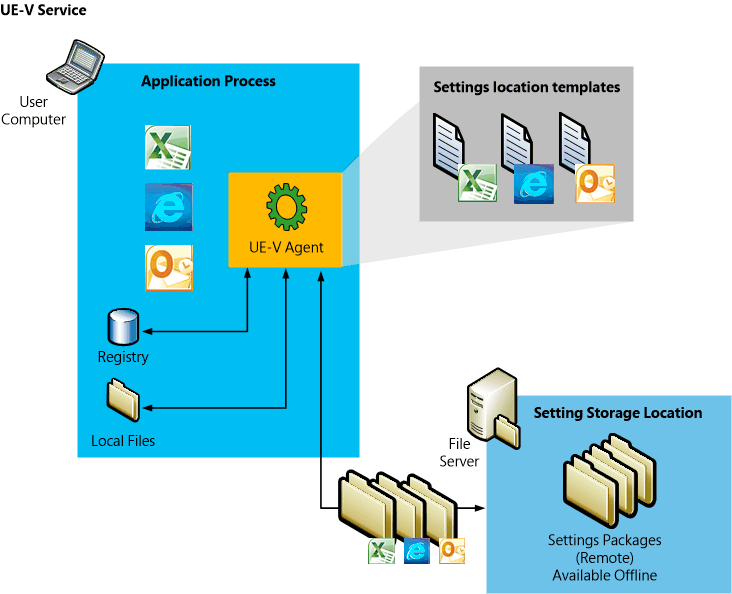

# High-Level Architecture for UE-V 1.0

This topic describes high-level architectural elements of the Microsoft User Experience Virtualization (UE-V) settings roaming solution. The following elements are part of a standard UE-V deployment.

The UE-V Agent monitors the applications and the operating system processes as they are identified in the UE-V settings location templates. When the application or operating system starts, the settings are read from the settings package and applied to the computer. When the application closes or when the operating system is locked or shut down, settings are saved in a UE-V settings package in the settings storage location.

## Settings storage location

The settings storage location is a file share that the User Experience Virtualization agent accesses to read and write settings. This location is either the Active Directory home directory or defined during the UE-V installation. You can set the location during the installation of the UE-V agent, or you can set it later with Group Policy, WMI, or PowerShell. The location can be on any common file share that users can access. If no setting storage location is set during installation then UE-V will use the home directory in Active Directory. The UE-V agent verifies the location and creates a system folder that is hidden from the user in which to store and access the user settings. For more information about settings storage, see [Preparing Your Environment for UE-V](preparing-your-environment-for-ue-v.md).

## UE-V Agent

The UE-V agent is installed on each computer with settings that are synchronized by User Experience Virtualization. The agent monitors the registered applications and the operating system for any changes to that are made to settings, and it synchronizes those settings between computers. Settings are applied from the settings storage location to the application when the application is started. The settings are then saved back to the settings storage location when the application closes. The operating system settings are applied when the user logs on, when the computer is unlocked, or when the user connects remotely to the computer by using remote desktop protocol (RDP). The agent saves settings when the user logs off, when the computer is locked, or when a remote connection is disconnected. For more information about the UE-V Agent, see [Preparing Your Environment for UE-V](preparing-your-environment-for-ue-v.md).

## Settings location templates

The settings location template is an XML file that defines the settings locations to be monitored by User Experience Virtualization. Only the settings locations defined in these settings templates are captured or applied on computers running the UE-V Agent. The settings location template does not contain settings values, only the locations where values are stored on the computer.

UE-V includes a set of settings location templates that specify settings locations for some Microsoft applications and Windows settings. An administrator can create custom settings location templates by using the UE-V Generator.

[Planning Which Applications to Synchronize with UE-V 1.0](planning-which-applications-to-synchronize-with-ue-v-10.md)

[Planning for Custom Template Deployment for UE-V 1.0](planning-for-custom-template-deployment-for-ue-v-10.md)

[Working with Custom UE-V Templates and the UE-V Generator](working-with-custom-ue-v-templates-and-the-ue-v-generator.md)

## Settings packages

Application settings and Windows settings are stored in settings packages, which are created by the UE-V Agent. A settings package is a collection of the settings that are represented in the settings location templates. These settings packages are built, locally stored, and then copied to the settings storage location. “Last write wins” determines which settings are preserved when a single user synchronizes the more than one computer to a storage location. The agent that runs on one computer reads and writes to the settings location independent of agents that run on other computers. The most recently written settings and values are applied when the next agent reads from the settings storage location.

## Settings template catalog

The settings template catalog is a folder path on UE-V computers or a Server Message Block (SMB) network share that stores all the custom settings location templates. The UE-V agent retrieves new or updated templates from this location. The UE-V agent checks this location once each day and it updates its synchronization behavior based on the templates in this folder. The templates that were added or updated in this folder since the last check are registered by the UE-V agent. The UE-V agent deregisters the templates that were removed from this folder. Templates are registered and unregistered one time per day by the task scheduler. If you will use only the default settings location templates that are included with UE-V, then a settings template catalog is unnecessary. For more information about settings deployment catalogs, see [Planning for Custom Template Deployment for UE-V 1.0](planning-for-custom-template-deployment-for-ue-v-10.md).

## User Experience Virtualization Generator

The User Experience Virtualization Generator enables you to create custom settings location templates which will store the settings locations of the applications that are used in the enterprise and that you want to include in the roaming settings solution. The UE-V Generator will seek to discover the locations of registry values and the settings files for applications and then it will record those locations in a settings location template XML file. You can then distribute these settings location templates to the user computers. The UE-V Generator also allows an administrator to edit an existing template or validate a template that was created with another XML editor.

The UE-V Generator monitors an application to discover and record where it stores its settings. To do this, it monitors where the application reads or writes in the HKEY\_CURRENT\_USER registry or in the file folders under **Users** \\ \[User name\] \\ **AppData** \\ **Roaming and Users** \\ \[User name\] \\ **AppData** \\ **Local**.

The discovery process excludes registry keys and files to which the logged-in user cannot write values. None of these will be included in the XML file. The discovery process also excludes registry keys and files that are associated with the core functionality of the Windows operating system.

For more information about the UE-V Generator, see [Installing the UE-V Generator](installing-the-ue-v-generator.md).

## Related topics

[Microsoft User Experience Virtualization (UE-V) 1.0](index.md)

[Getting Started With User Experience Virtualization 1.0](getting-started-with-user-experience-virtualization-10.md)

[About User Experience Virtualization 1.0](about-user-experience-virtualization-10.md)

[Working with Custom UE-V Templates and the UE-V Generator](working-with-custom-ue-v-templates-and-the-ue-v-generator.md)

 

 

