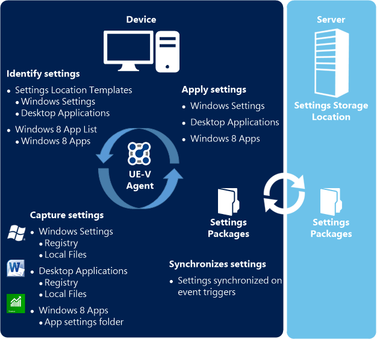
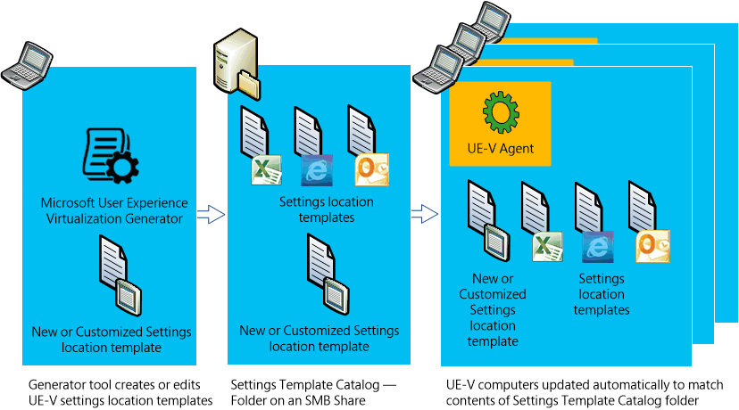

# Microsoft User Experience Virtualization (UE-V) 2.x

>[!NOTE]
>This documentation is a for version of UE-V that was included in the Microsoft Desktop Optimization Pack (MDOP). For information about the latest version of UE-V which is included in Windows 10 Enterprise, see [Get Started with UE-V](https://docs.microsoft.com/windows/configuration/ue-v/uev-getting-started).

Capture and centralize your users’ application settings and Windows OS settings by implementing Microsoft User Experience Virtualization (UE-V) 2.0 or 2.1. Then, apply these settings to the devices users access in your enterprise, like desktop computers, laptops, or virtual desktop infrastructure (VDI) sessions.

**With UE-V you can…**

-   Specify which application and desktop settings synchronize

-   Deliver the settings anytime and anywhere users work throughout the enterprise

-   Create custom templates for your third-party or line-of-business applications

-   Recover settings after hardware replacement or upgrade, or after reimaging a virtual machine to its initial state

## Components of UE-V 2.x

This diagram shows how deployed UE-V components work together to synchronize settings.

<table>
<colgroup>
<col width="50%" />
<col width="50%" />
</colgroup>
<thead>
<tr class="header">
<th align="left">Component</th>
<th align="left">Function</th>
</tr>
</thead>
<tbody>
<tr class="odd">
<td align="left">
<strong>UE-V Agent</strong>
</td>
<td align="left">
Installed on every computer that needs to synchronize settings, the <strong>UE-V Agent</strong> monitors registered applications and the operating system for any settings changes, then synchronizes those settings between computers.
</td>
</tr>
<tr class="even">
<td align="left">
<strong>Settings packages</strong>
</td>
<td align="left">
Application settings and Windows settings are stored in <strong>settings packages</strong> created by the UE-V Agent. Settings packages are built, locally stored, and copied to the settings storage location.

<ul>
<li>
The setting values for <strong>desktop applications</strong> are stored when the user closes the application.
</li>
<li>
Values for <strong>Windows settings</strong> are stored when the user logs off, when the computer is locked, or when the user disconnects remotely from a computer.
</li>
</ul>

The sync provider determines when the application or operating system settings are read from the <strong>Settings Packages</strong> and synchronized.
</td>
</tr>
<tr class="odd">
<td align="left">
<strong>Settings storage location</strong>
</td>
<td align="left">
This is a standard network share that your users can access. The UE-V Agent verifies the location and creates a hidden system folder in which to store and retrieve user settings.
</td>
</tr>
<tr class="even">
<td align="left">
<strong>Settings location templates</strong>
</td>
<td align="left">
UE-V uses XML files as settings location templates to monitor and synchronize desktop application settings and Windows desktop settings between user computers. By default, some settings location templates are included in UE-V . You can also create, edit, or validate custom settings location templates by <a href="#customapps" data-raw-source="[managing settings synchronization for custom applications](#customapps)">managing settings synchronization for custom applications</a>.

<strong>Note</strong> 
Settings location templates are not required for Windows apps.

</td>
</tr>
<tr class="odd">
<td align="left">
<strong>Windows app list</strong>
</td>
<td align="left">
Settings for Windows apps are captured and applied dynamically. The app developer specifies the settings that are synchronized for each app. UE-V determines which Windows apps are enabled for settings synchronization using a managed list of apps. By default, this list includes most Windows apps.

You can add or remove applications in the Windows app list by following the procedures shown <a href="https://technet.microsoft.com/library/dn458925.aspx" data-raw-source="[here](https://technet.microsoft.com/library/dn458925.aspx)">here</a>.
</td>
</tr>
</tbody>
</table>

### Managing Settings Synchronization for Custom Applications

Use these UE-V components to create and manage custom templates for your third-party or line-of-business applications.

<table>
<colgroup>
<col width="50%" />
<col width="50%" />
</colgroup>
<tbody>
<tr class="odd">
<td align="left">
<strong>UE-V Generator</strong>
</td>
<td align="left">
Use the <strong>UE-V Generator</strong> to create custom settings location templates that you can then distribute to user computers. The UE-V Generator also lets you edit an existing template or validate a template that was created by using another XML editor.
</td>
</tr>
<tr class="even">
<td align="left">
<strong>Settings template catalog</strong>
</td>
<td align="left">
The <strong>settings template catalog</strong> is a folder path on UE-V computers or a Server Message Block (SMB) network share that stores the custom settings location templates. The UE-V Agent checks this location once a day, retrieves new or updated templates, and updates its synchronization behavior.

If you use only the UE-V default settings location templates, then a settings template catalog is unnecessary. For more information about settings deployment catalogs, see <a href="https://technet.microsoft.com/library/dn458942.aspx#deploycatalogue" data-raw-source="[Configure a UE-V settings template catalog](https://technet.microsoft.com/library/dn458942.aspx#deploycatalogue)">Configure a UE-V settings template catalog</a>.
</td>
</tr>
</tbody>
</table>

## Settings Synchronized by Default

UE-V synchronizes settings for these applications by default. For a complete list and more detailed information, see [Settings that are automatically synchronized in a UE-V deployment](https://technet.microsoft.com/library/dn458932.aspx#autosyncsettings).

Microsoft Office 2013 applications (UE-V 2.1 SP1 and 2.1)

Microsoft Office 2010 applications (UE-V 2.1 SP1, 2.1, and 2.0)

Microsoft Office 2007 applications (UE-V 2.0 only)

Internet Explorer 8, 9, and 10

Internet Explorer 11 in UE-V 2.1 SP1 and 2.1

Many Windows applications, such as Xbox

Many Windows desktop applications, such as Notepad

Many Windows settings, such as desktop background or wallpaper

**Note**  
You can also [customize UE-V to synchronize settings](https://technet.microsoft.com/library/dn458942.aspx) for applications other than those synchronized by default.

## Compare UE-V to other Microsoft products

Use this table to compare UE-V to Synchronize Profiles in Windows 7, Synchronize Profiles in Windows 8, and the Sync PC Settings feature of Microsoft account.

<table style="width:100%;">
<colgroup>
<col width="14%" />
<col width="14%" />
<col width="14%" />
<col width="14%" />
<col width="14%" />
<col width="14%" />
<col width="14%" />
</colgroup>
<thead>
<tr class="header">
<th align="left">Feature</th>
<th align="left">Synchronize Profiles using Windows 7</th>
<th align="left">Synchronize Profiles using Windows 8</th>
<th align="left">Synchronize Profiles using Windows 10</th>
<th align="left">Microsoft account</th>
<th align="left">UE-V 2.0</th>
<th align="left">UE-V 2.1 and 2.1 SP1</th>
</tr>
</thead>
<tbody>
<tr class="odd">
<td align="left">
Synchronize settings between multiple computers
</td>
<td align="left">
●
</td>
<td align="left">
●
</td>
<td align="left">
●
</td>
<td align="left">
●
</td>
<td align="left">
●
</td>
<td align="left">
●
</td>
</tr>
<tr class="even">
<td align="left">
Synchronize settings between physical and virtual apps
</td>
<td align="left">

</td>
<td align="left">

</td>
<td align="left">

</td>
<td align="left">

</td>
<td align="left">
●
</td>
<td align="left">
●
</td>
</tr>
<tr class="odd">
<td align="left">
Synchronize Windows app settings
</td>
<td align="left">

</td>
<td align="left">

</td>
<td align="left">

</td>
<td align="left">
●
</td>
<td align="left">
●
</td>
<td align="left">
●
</td>
</tr>
<tr class="even">
<td align="left">
Manage via WMI
</td>
<td align="left">

</td>
<td align="left">
●
</td>
<td align="left">
●
</td>
<td align="left">

</td>
<td align="left">
●
</td>
<td align="left">
●
</td>
</tr>
<tr class="odd">
<td align="left">
Synchronize settings changes on a regular basis
</td>
<td align="left">

</td>
<td align="left">

</td>
<td align="left">

</td>
<td align="left">
●
</td>
<td align="left">
●
</td>
<td align="left">
●
</td>
</tr>
<tr class="even">
<td align="left">
Minimal configuration for Setup
</td>
<td align="left">
●
</td>
<td align="left">
●
</td>
<td align="left">
●
</td>
<td align="left">
●
</td>
<td align="left">
●
</td>
<td align="left">
●
</td>
</tr>
<tr class="odd">
<td align="left">
Supported on non-domain joined computers
</td>
<td align="left">

</td>
<td align="left">

</td>
<td align="left">

</td>
<td align="left">
●
</td>
<td align="left">

</td>
<td align="left">

</td>
</tr>
<tr class="even">
<td align="left">
Supports Primary Computer Active Directory attribute
</td>
<td align="left">

</td>
<td align="left">
●
</td>
<td align="left">
●
</td>
<td align="left">

</td>
<td align="left">

</td>
<td align="left">

</td>
</tr>
<tr class="odd">
<td align="left">
Synchronizes settings between virtual desktop infrastructure (VDI)/Remote Desktop Services (RDS) and rich desktops
</td>
<td align="left">

</td>
<td align="left">

</td>
<td align="left">

</td>
<td align="left">

</td>
<td align="left">
●
</td>
<td align="left">
●
</td>
</tr>
<tr class="even">
<td align="left">
Unlimited setting storage space
</td>
<td align="left">
●
</td>
<td align="left">
●
</td>
<td align="left">
●
</td>
<td align="left">

</td>
<td align="left">
●
</td>
<td align="left">
●
</td>
</tr>
<tr class="odd">
<td align="left">
Choice in which app settings to synchronize
</td>
<td align="left">

</td>
<td align="left">

</td>
<td align="left">

</td>
<td align="left">

</td>
<td align="left">
●
</td>
<td align="left">
●
</td>
</tr>
<tr class="even">
<td align="left">
Backup/Restore for IT Pro
</td>
<td align="left">

</td>
<td align="left">

</td>
<td align="left">

</td>
<td align="left">
●
</td>
<td align="left">
Partial
</td>
<td align="left">
●
</td>
</tr>
</tbody>
</table>

## UE-V 2.x Release Notes

For more information, and for late-breaking news that did not make it into the documentation, see

-   [Microsoft User Experience Virtualization (UE-V) 2.1 SP1 Release Notes](microsoft-user-experience-virtualization--ue-v--21-sp1-release-notes.md)

-   [Microsoft User Experience Virtualization (UE-V) 2.1 Release Notes](microsoft-user-experience-virtualization--ue-v--21-release-notesuevv21.md)

-   [Microsoft User Experience Virtualization (UE-V) 2.0 Release Notes](microsoft-user-experience-virtualization--ue-v--20-release-notesuevv2.md)

## Other resources for this product

-   [Get Started with UE-V 2.x](get-started-with-ue-v-2x-new-uevv2.md)

-   [Prepare a UE-V 2.x Deployment](prepare-a-ue-v-2x-deployment-new-uevv2.md)

-   [Administering UE-V 2.x](administering-ue-v-2x-new-uevv2.md)

-   [Troubleshooting UE-V 2.x](troubleshooting-ue-v-2x-both-uevv2.md)

-   [Technical Reference for UE-V 2.x](technical-reference-for-ue-v-2x-both-uevv2.md)

### More information

[MDOP TechCenter Page](https://go.microsoft.com/fwlink/p/?LinkId=225286)
Learn about the latest MDOP information and resources.

[MDOP Information Experience](https://go.microsoft.com/fwlink/p/?LinkId=236032)
Find documentation, videos, and other resources for MDOP technologies. You can also [send us feedback](mailto:MDOPDocs@microsoft.com) or learn about updates by following us on [Facebook](https://go.microsoft.com/fwlink/p/?LinkId=242445) or [Twitter](https://go.microsoft.com/fwlink/p/?LinkId=242447).

