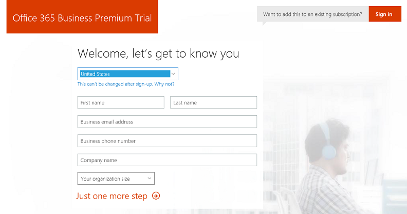
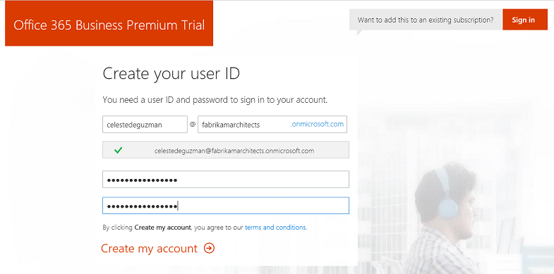
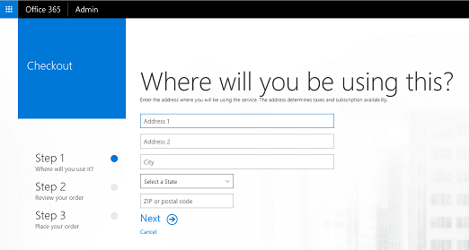

# Get started: Deploy and manage a full cloud IT solution for your business
**Applies to:**

-   Windows 10

> [!IMPORTANT]  
> This is placeholder content only. Everything is TBD.

In this walkthrough, we'll show you how to deploy and manage a full cloud IT solution for your small to medium business using Microsoft Azure AD, Intune, Office 365, and Windows. We'll show you the basics on how to:
- Acquire an Office 365 business domain
- Add Microsoft Intune and Azure Active Directory (AD) Premium licenses to your business tenant
- Set up Windows Store for Business and manage app deployment and sync with Intune
- Add users and groups in Azure AD and Intune
- Create policies and app deployment rules
- Log in as a user and start using the device

Go to the [Microsoft Business site](http://business.microsoft.com) and select **Products** to learn more about pricing and purchasing options for businesses.

## 1. Get ready
Here's a few things to keep in mind before you get started:
- You'll need a registered domain to successfully go through the walkthrough.
  - If you already own a domain, you can add this during the Office 365 setup.
  - If you don't already own a domain, you'll have the option to purchase a domain from the Office 365 admin center. We'll show how to do this as part of the walkthrough.
- You'll need an email address to create your Office 365 tenant.

## 2. Set up your cloud infrastructure
To set up a cloud infrastructure for your organization, follow the steps in this section.

### 2.1 Set up Office 365 for business
See [Set up Office 365 for business](https://support.office.com/en-us/article/Set-up-Office-365-for-business-6a3a29a0-e616-4713-99d1-15eda62d04fa) to learn more about the steps for businesses and nonprofits who have Office 365. You can watch the videos and learn about the steps you need to create Office 365 accounts and how to add your domain.

To set up your Office 365 business tenant, see [Get Started with Office 365 for business](https://support.office.com/en-us/article/Get-started-with-Office-365-for-Business-d6466f0d-5d13-464a-adcb-00906ae87029).

If this is the first time you're setting this up, you can follow these steps to get started:
1. Go to the [Office 365](https://business.microsoft.com/en-us/products/office-365) page in the [Microsoft Business site](http://business.microsoft.com). Select **Try now** to use the Office 365 Business Premium Trial or select **Buy now** to sign up for Office 365 Business Premium. In this walkthrough, we'll select **Try now**.

  **Figure 1** - Office 365 Business Premium Trial sign up page

  

2. Fill out the sign up form and provide information about you and your company.
3. Create a user ID and password to use to sign into your account.
  This step creates an onmicrosoft.com email address. You can use this email address to sign in to the various admin centers. Save your sign-in info so you can use it to sign into https://portal.office.com (the admin portal).

  **Figure 2** - Office 365 user ID

  

4. Select **Create my account** and then enter the phone number you used in step 2 to verify your identity. You'll be asked to enter your verification code.
5. Select **You're ready to go...** which will take you to the Office 365 portal.

  Icons that are greyed out are still installing.

  **Figure 3** - Office 365 portal

  

6. Select the **Admin** tile to go to the Office 365 admin center.
7. In the admin center, click **Next** to see the highlights and welcome info for the admin center. When you're done, click **Go to setup** to complete the Office 365 setup.

  This may take a half hour to complete.

  **Figure 4** - Office 365 admin center

  

8. Go back to the main admin center page. If you already have a domain, select **Go to setup** and skip to step X. Otherwise, buy a domain by following these steps:
  1. From the admin center, select the **Domains** option.

    **Figure 5** - Buy a new domain

    

  2. Select **+ Buy domain** to buy a domain. You'll be required to upgrade your trial plan in order to buy a domain.
  3. Select **Office 365 Business Premium** (the current trial plan) and click **Buy now**.
  4. Choose the subscription plan you want to use for your business: monthly or annual subscription. Click **Add to cart**.
  5. In the **Checkout** screen, provide the details to complete your order.

    **Figure 6** - Buy a new domain

    

  6. TBD

### 2.2 Add Microsoft Intune to your domain
In the Office 365 admin center, select **Admin centers > Intune**.

  > [!NOTE]
  > If you are using Microsoft Edge and you get an unsupported browser or browser mode error message, use Internet Explorer instead.

Once you've successfully added Intune, you will see the Intune dashboard.

**Figure 4** - Microsoft Intune dashboard

### 2.3 Add Azure AD to your domain
In the Office 365 admin center, select **Admin centers > Azure AD**.

  > [!NOTE]
  > You will need Azure AD Premium to configure automatic MDM enrollment with Intune.

You should see the Microsoft Azure portal once you've successfully added Azure AD.

**Figure 5** - Microsoft Azure portal

### 2.4 Assign licenses to users
Users need product licenses assigned to them to use services such as Microsoft Classroom and Office 365. You can assign product licenses to users in bulk or individually. For more info on how to do this, see the sections *Step 2: Assign licenses to global admins* and *Step 3: Assign licenses to teachers and students* in [Add Microsoft Classroom Preview and School Data Sync Preview to your Office 365 Education tenant](https://aka.ms/classroomsetup)

> [!TIP]
> - Assign **Enterprise Mobility + Security E5**, **Microsoft Classroom Preview**, and **Azure Active Directory Premium P2** to all users.
> - For all faculty, assign **Office 365 Education for faculty**.
> - For all students, assign **Office 365 Education for students**.

**Figure 6** - Assign product licenses to users

### 2.5 Configure automatic MDM enrollment with Azure AD and Intune
Read [this blog post](https://blogs.technet.microsoft.com/enterprisemobility/2015/08/14/windows-10-azure-ad-and-microsoft-intune-automatic-mdm-enrollment-powered-by-the-cloud/) to learn how you can combine login, Azure AD Join, and Intune MDM enrollment into an easy step so that you can bring your devices into a managed state that complies with the policies for your organization. We will use the blog post as our guide for this part of the walkthrough and we'll show how you can add new groups.

  > [!NOTE]
  > If you are using the new Azure portal, you may need to use the old Azure portal to make the steps work as outlined in the blog post. To go to the old Azure portal, type https://manage.windowsazure.com/@yourdomain#Workspaces/All/dashboard in your web browser. Replace *yourdomain* with your own domain name, such as contososchool.org.

**To configure the directory**
1. If this is the first time you're setting up your directory, When you navigate to the **Azure Active Directory** node in the Azure management portal you will see a screen informing you that your directory is ready for use.

  **Figure 7** - Active Directory is ready to use
  

2. Select the domain you want to configure.

  **Figure 8** - Select the directory or domain you want to configure
  

**To create groups**
1. After you have selected the domain (such as Contoso), select the **Groups** tab. You should see a list of all the groups you created as part of the SDS setup.
2. Select **Add Group** to create a new group. In the following example, this group is called **All Students**.

  **Figure 9** - Add an all students group

  

  After you create the new group, it will appear in the list of all groups.

3. In the **Groups** tab, select the arrow next to the **All Students** group to add all students as members of the group and then save your changes.

  **Figure 10** - Add group members
  

4. Repeat steps 1-3 and create an **All Teachers** group that includes all teachers and an **All Global Admins** group that includes all global administrators.

**To enable automatic MDM enrollment**
1. Select the **Applications** tab and verify that you can see Microsoft Intune in the list of applications. Click the arrow next to **Microsoft Intune** to configure the application.

  **Figure 11** - Microsoft Intune should appear in the list of applications
  

2. In the Microsoft Intune configuration page, select **Configure** to start automatic MDM enrollment configuration with Intune.
3. In the **Configure** tab:
  - In the **properties** section, you should see a list of URLs for MDM discovery, MDM terms of use, and MDM compliance. The URLs are automatically configured for your Azure AD tenant so you don't need to change them.
  - In the **manage devices for these users** section, you can specify which users' devices should be managed by Intune.
    - **All** will enable all users' Windows 10 devices to be managed by Intune.
    - **Groups** let you select whether only users that belong to a specific group will have their devices managed by Intune.

  <!-- Choose **Groups**, then click the **Select Groups** option to open the **Add groups** window. The list of groups should include the groups that were created as part of the SDS setup as well as the all students group that you created. -->

    > [!NOTE]
    > In this step, you must choose the group that contains all the users in your organization as members. This is the **All** group.

4. After you've chosen how to manage devices for users, select **Save** to enable automatic MDM enrollment with Intune.

### 2.6 Configure Windows Store for Business for app distribution
To distribute apps with a management tool, Configure Windows Store for Business. Follow the steps in [Manage apps you purchased from the Windows Store for Business with Microsoft Intune](https://docs.microsoft.com/en-us/intune/deploy-use/manage-apps-you-purchased-from-the-windows-store-for-business-with-microsoft-intune) to associate your Windows Store for Business account with Intune and configure Windows Store for Business synchronization.

**To associate your Windows Store for Business account with Intune**
1. Sign into the [Windows Store for Business](https://businessstore.microsoft.com/en-us/Store/Apps) using the same tenant account you used to sign into Intune.

  **Figure 13** - Windows Store for Business
  

2. In the Store portal, select **Settings > Management tools**.
3. From the Management tools page, choose **Add a management tool** or select **Microsoft Intune** if it's already on the list.
4. Click **Activate** to get Intune ready to use with Windows Store for Business.

  **Figure 14** - Intune is activated from the Store portal
  

**To configure synchronization**
1. From the [Microsoft Intune administration](https://manage.microsoft.com) console, choose **Admin**.
2. In the **Administration** workspace, expand **Mobile Device Management > Windows**, and then choose **Store for Business**.
3. Select **Configure Sync** to sync your Store for Business volume-purchased apps with Intune.
4. In the **Configure Windows Store for Business app sync** dialog box, select **Enable Windows Store for Business sync**. In the **Language** dropdown list, choose the language in which you want apps from the Store to be displayed in the Intune console and then click **OK**.

  **Figure 15** - Configure Store for Business app sync

  

**To synchronize apps**
1. If you haven't done so already, from the Windows Store for Business page, synchronize the apps you've purchased from the Store with Intune.
2. In the Microsoft Intune administration console, select **Apps > Apps**, then choose **Volume-Purchased Apps** to see the available apps and verify that the apps you purchased were imported correctly.

  **Figure 16** - Verify volume-purchased apps
  

**To add more apps**

If you have other apps that you want to deploy or manage, you must add it to Microsoft Intune. See [Add apps for enrolled devices to Intune](https://docs.microsoft.com/en-us/intune/deploy-use/add-apps-for-mobile-devices-in-microsoft-intune) for more info on how to do this.

In the following example, we'll show you how to buy apps through the Windows Store for Business and then add the apps to Intune.

**Example - Duolingo and Khan Academy**
1. In the Windows Store for Business page, search the Store for the free **Duolingo - Learn Languages for Free** app, and then select the app from the search result(s).
2. In the app's Store page, select the license type and then select **Get the app**.
3. You should see a dialog that confirms your order. Click **Close**.
4. In the app's Store page, select **Add to private store**.
5. Repeat steps 1-4 for the **Khan Academy** app.
6. Select **Manage > Inventory** and verify that the apps you purchased appear in your inventory.

  > [!NOTE]
  > It takes a few hours for the apps you purchased to show up in your organization's private store and in Microsoft Intune.

7. After a few hours, verify that the apps you bought from the Store show up in Microsoft Intune.

  **Figure 17** - Verify new apps bought from the Store show up in Intune
  

## 3. Set up devices

### 3.1 Set up new devices
To set up new Windows devices, go through the Windows initial device setup or first-run experience to configure your device.

**To set up a device**
1. Go through the Windows device setup experience. On a new or reset device, this starts with the **Hi there** screen.
2. If you don't have a Wi-Fi network configured, make sure you connect the device to the Internet through a wired/Ethernet connection.
3. Select the option to **Join this device to Azure Active Directory**.
4. Sign in using one of the accounts you set up for your education tenant.

### 3.2 Verify correct device setup
Verify that the device is set up correctly and boots without any issues.

**To verify that the device was set up correctly**
1. Click on the **Start** menu and select some of the options to make sure everything launches properly.
2. Confirm that the Store and built-in apps are working.

### 3.3 Verify the device is Azure AD joined
In the Intune management console, verify that the device is joined to Azure AD and shows up as being managed in Microsoft Intune.

**To verify if the device is joined to Azure AD**
1. Log in to the Intune management console.
2. Select **Groups** and go to **Groups > All Devices > All Mobile Devices**.
3. Select **All Direct Managed Devices** and then select the **Devices** tab.
4. See the list of devices and verify that the device you're signed into appears on the list.

  **Figure 18** - List of all direct managed devices
  

### 3.4 Reconfigure app deployment settings
In some cases, if an app is missing from the device, you need to reconfigure the deployment settings for the app and set the app to require installation as soon as possible.

**To reconfigure app deployment settings**
1. In the Intune management console, select **Apps** and go to **Apps > Volume-Purchased Apps**.
2. Select the app, right-click, then select **Manage Deployment...**.
3. Select the group(s) whose apps will be managed.
4. Check the **Deployment Action** setting for the app.
5. For each group that you selected, set **Approval** to **Required Install**. This automatically sets **Deadline** to **As soon as possible**. If **Deadline** is not automatically set, set it to **As soon as possible**.

  **Figure 19** - Reconfigure an app's deployment setting in Intune
  

6. Verify that the app shows up on the device. You can check which users and devices have the app installed by selecting the app and checking the status in the **General** tab or selecting the **Devices** or **Users** tab.

## 4. Manage device settings and features
You can use Microsoft Intune admin settings and policies to manage features on your organization's mobile devices and computers. For more info, see [Manage settings and features on your devices with Microsoft Intune policies](https://docs.microsoft.com/en-us/intune/deploy-use/manage-settings-and-features-on-your-devices-with-microsoft-intune-policies).

In this walkthrough, we'll show you how to add a new policy that will disable the camera for the Intune-managed devices and turn off Windows Hello and PINs during setup.

**To disable the camera**
1. In the Intune admin console, choose **Policy > Configuration Policies > Add**.
2. On the **Create a New Policy** page, select **Windows > General Configuration (Windows 10 Desktop and Mobile and later)**.
3. Click **Create Policy**.
4. On the **Create Policy** page, select **Device Capabilities**.
5. In the **General** section, add a name and description for this policy. For example:
  - **Name**: Test Policy - Disable Camera
  - **Description**: Disables the camera
6. In the **Hardware** section, configure **Allow camera** and choose **No** from the dropdown list.
7. Click **Save Policy**.
8. On the **Deploy Policy** dialog box, select **Yes** to deploy the policy now.
9. On the **Management Deployment** dialog box, select the user group(s) or device group(s) that you want to apply the policy to. For example, select **All Students**.
10. Click **OK**.

**To turn off Windows Hello and PINs during device setup**
1. In the Intune admin console, select **Admin**.
2. Navigate to **Mobile Device Management > Windows > Windows Hello for Business**.
3. In the **Windows Hello for Business** page, select **Disable Windows Hello for Business on enrolled devices**.
4. Click **Save**.

  > [!NOTE]
  > This policy is a tenant-wide Intune setting. It disables Windows Hello and required PINs during setup for all enrolled devices in a tenant.

## 5. Add more devices and users
After your cloud infrastructure is set up and you have a device management strategy in place, you may need to add more devices or users and you want the same policies to apply to these new devices and users. In this section, we'll show you how to do this.

### 5.1 Connect other devices to your cloud infrastructure
Adding a new device to your cloud-based tenant is easy. For new devices, you can follow the steps in [3. Set up devices](#3-set-up-devices). For other devices, such as those personally-owned by teachers who need to connect to the school network to access work or school resources (BYOD), you can follow the steps in this section to get these devices connected.

  > [!NOTE]
  > These steps enable users to get access to the organization's resources, but it also gives the organization some control over the device.

**To connect a device to your work or school**
1. On your Windows device, go to **Settings > Accounts**.
2. Select **Work access** and then click **Add a work or school account** to add an Azure AD account to the device.
3. Enter the work credentials for the account to authenticate the user.
4. If it appears, accept the MDM terms prescribed by the organization to allow the device to be managed.
  Once this is done, the device should be registered in Azure AD and enrolled in MDM and the account should have access to the organization's resources.

### 5.2 Add a new user
You can add new users to your tenant simply by adding them to the Office 365 groups. Adding new users to Office 365 groups automatically adds them to the corresponding groups in Microsoft Intune.

See [Add users to Office 365](https://support.office.com/en-us/article/Add-users-to-Office-365-for-business-435ccec3-09dd-4587-9ebd-2f3cad6bc2bc?ui=en-US&rs=en-US&ad=US&fromAR=1) to learn more. Once you're done adding new users, go to the Intune admin portal and verify that the same users were added to the Intune groups as well.
