# Get started: Deploy and manage a full cloud IT solution for your business

**Applies to:**

-   Office 365 Business Premium, Azure AD Premium, Intune, Microsoft Store for Business, Windows 10

Are you ready to move your business to the cloud or wondering what it takes to make this happen with Microsoft cloud services and tools?

In this walkthrough, we'll show you how to deploy and manage a full cloud IT solution for your small to medium business using Office 365 Business Premium, Microsoft Azure AD, Intune, Microsoft Store for Business, and Windows 10. We'll show you the basics on how to:
- Acquire an Office 365 business domain
- Add Microsoft Intune and Azure Active Directory (AD) Premium licenses to your business tenant
- Set up Microsoft Store for Business and manage app deployment and sync with Intune
- Add users and groups in Azure AD and Intune
- Create policies and app deployment rules
- Log in as a user and start using your Windows device

Go to the <a href="https://business.microsoft.com" target="_blank">Microsoft Business site</a> and select **Products** to learn more about pricing and purchasing options for your business.

## Prerequisites
Here's a few things to keep in mind before you get started:
- You'll need a registered domain to successfully go through the walkthrough.
  - If you already own a domain, you can add this during the Office 365 setup.
  - If you don't already own a domain, you'll have the option to purchase a domain from the Office 365 admin center. We'll show how to do this as part of the walkthrough.
- You'll need an email address to create your Office 365 tenant.
- We recommend that you use Internet Explorer for the entire walkthrough. Right click on Internet Explorer and then choose **Start InPrivate Browsing**.

## 1. Set up your cloud infrastructure
To set up a cloud infrastructure for your organization, follow the steps in this section.

### 1.1 Set up Office 365 for business
See <a href="https://support.office.com/en-us/article/Set-up-Office-365-for-business-6a3a29a0-e616-4713-99d1-15eda62d04fa" target="_blank">Set up Office 365 for business</a> to learn more about the setup steps for businesses and nonprofits who have Office 365. You can watch video and learn how to:
- Plan your setup
- Create Office 365 accounts and how to add your domain.
- Install Office

To set up your Office 365 business tenant, see <a href="https://support.office.com/en-us/article/Get-started-with-Office-365-for-Business-d6466f0d-5d13-464a-adcb-00906ae87029" target="_blank">Get Started with Office 365 for business</a>.

If this is the first time you're setting this up, and you'd like to see how it's done, you can follow these steps to get started:

1. Go to the <a href="https://business.microsoft.com/en-us/products/office-365" target="_blank">Office 365</a> page in the <a href="https://business.microsoft.com" target="_blank">Microsoft Business site</a>. Select **Try now** to use the Office 365 Business Premium Trial or select **Buy now** to sign up for Office 365 Business Premium. In this walkthrough, we'll select **Try now**.

  **Figure 1** - Try or buy Office 365

  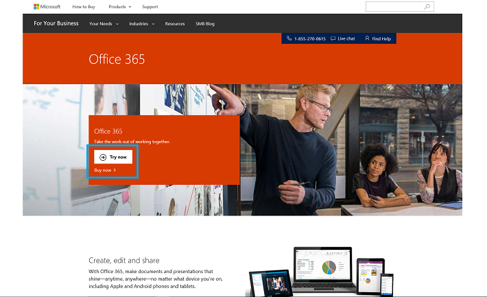

2. Fill out the sign up form and provide information about you and your company.
3. Create a user ID and password to use to sign into your account.

  This step creates an onmicrosoft.com email address. You can use this email address to sign in to the various admin centers. Save your sign-in info so you can use it to sign into <a href="https://portal.office.com" target="_blank">https://portal.office.com</a> (the admin portal).

4. Select **Create my account** and then enter the phone number you used in step 2 to verify your identity. You'll be asked to enter your verification code.
5. Select **You're ready to go...** which will take you to the Office 365 portal.

  > [!NOTE]  
  > In the Office 365 portal, icons that are greyed out are still installing.

  **Figure 2** - Office 365 portal

  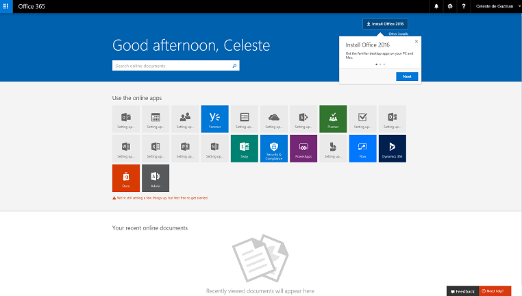

6. Select the **Admin** tile to go to the Office 365 admin center.
7. In the admin center, click **Next** to see the highlights and welcome info for the admin center. When you're done, click **Go to setup** to complete the Office 365 setup.

  This may take up to a half hour to complete.
  
  **Figure 3** - Office 365 admin center

  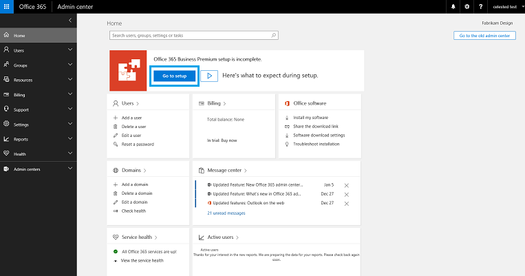

8. Go back to the <a href="https://portal.office.com/adminportal/home#/homepage" target="_blank">Office 365 admin center</a> to add or buy a domain.
  1. Select the **Domains** option.

    **Figure 4** - Option to add or buy a domain

    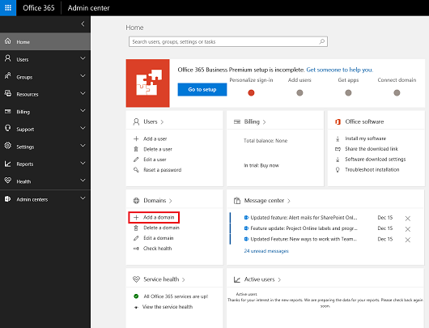
    

  2.  In the **Home > Domains** page, you will see the Microsoft-provided domain, such as *fabrikamdesign.onmicrosoft.com*.

    **Figure 5** - Microsoft-provided domain

    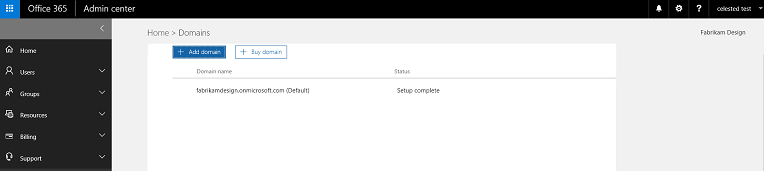

    - If you already have a domain, select **+ Add domain** to add your existing domain. If you select this option, you'll be required to verify that you own the domain. Follow the steps in the wizard to verify your domain.
    - If you don't already own a domain, select **+ Buy domain**. If you're using a trial plan, you'll be required to upgrade your trial plan in order to buy a domain. Choose the subscription plan to use for your business and provide the details to complete your order.

    Once you've added your domain, you'll see it listed in addition to the Microsoft-provided onmicrosoft.com domain.

    **Figure 6** - Domains

    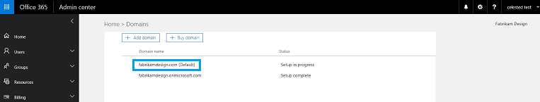

### 1.2 Add users and assign product licenses
Once you've set up Office and added your domain, it's time to add users so they have access to Office 365. People in your organization need an account before they can sign in and access Office 365. The easiest way to add users is to add them one at a time in the Office 365 admin center.

When adding users, you can also assign admin privileges to certain users in your team. You'll also want to assign **Product licenses** to each user so that subscriptions can be assigned to the person.

**To add users and assign product licenses**

1. In the <a href="https://portal.office.com/adminportal/home#/homepage" target="_blank">Office 365 admin center</a>, select **Users > Active users**.

  **Figure 7** - Add users

  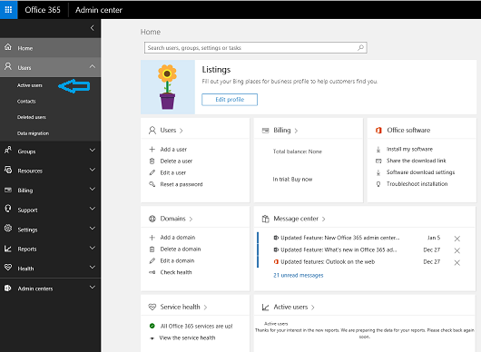

2. In the **Home > Active users** page, add users individually or in bulk.
  - To add users one at a time, select **+ Add a user**.

    If you select this option, you'll see the **New user** screen and you can add details about the new user including their name, user name, role, and so on. You also have the opportunity to assign **Product licenses**. For detailed step-by-step info on adding a user account, see *Add a user account in the Office 365 admin center* in <a href="https://support.office.com/en-us/article/Add-users-individually-or-in-bulk-to-Office-365-Admin-Help-1970f7d6-03b5-442f-b385-5880b9c256ec" target="_blank">Add users individually or in bulk to Office 365 - Admin Help</a>.

    **Figure 8** - Add an individual user

    

  - To add multiple users at once, select **More** and then choose **+ Import multiple users**. If you select this option, you'll need to create and upload a CSV file containing the list of users.

    The **Import multiple users** screen includes a link where you can learn more about importing multiple users and also links for downloading a sample CSV file (one with headers only and another with headers and sample user information). For detailed step-by-step info on adding multiple users to Office 365, see <a href="https://support.office.com/en-us/article/Add-several-users-at-the-same-time-to-Office-365-Admin-Help-1f5767ed-e717-4f24-969c-6ea9d412ca88" target="_blank">Add several users at the same time to Office 365 - Admin Help</a>. Once you've added all the users, don't forget to assign **Product licenses** to the new users.

    **Figure 9** - Import multiple users

    

3. Verify that all the users you added appear in the list of **Active users**. The **Status** should indicate the product licenses that were assigned to them.

  **Figure 10** - List of active users

  

### 1.3 Add Microsoft Intune
Microsoft Intune provides mobile device management, app management, and PC management capabilities from the cloud. Using Intune, organizations can provide their employees with access to apps, data, and corporate resources from anywhere on almost any device while helping to keep corporate information secure. To learn more, see <a href="https://docs.microsoft.com/intune/understand-explore/introduction-to-microsoft-intune" target="_blank">What is Intune?</a>

**To add Microsoft Intune to your tenant**

1. In the <a href="https://portal.office.com/adminportal/home#/homepage" target="_blank">Office 365 admin center</a>, select **Billing > Purchase services**.
2. In the **Home > Purchase services** screen, search for **Microsoft Intune**. Hover over **Microsoft Intune** to see the options to start a free 30-day trial or to buy now.
3. Confirm your order to enable access to Microsoft Intune.
4. In the admin center, the Intune licenses will show as available and ready to be assigned to users. Select **Users > Active users** and then edit the product licenses assigned to the users to turn on **Intune A Direct**.

  **Figure 11** - Assign Intune licenses

  

5. In the admin center, confirm that **Intune** shows up in the list under **Admin centers**. If it doesn't, sign out and then sign back in and then check again.
6. Select **Intune**. This will take you to the Intune management portal.

  **Figure 12** - Microsoft Intune management portal

  

Intune should now be added to your tenant. We'll come back to Intune later when we [Configure Microsoft Store for Business for app distribution](#17-configure-microsoft-store-for-business-for-app-distribution).

### 1.4 Add Azure AD to your domain
Microsoft Azure is an open and flexible cloud platform that enables you to quickly build, deploy, and manage apps across a global network of Microsoft-managed datacenters. In this walkthrough, we won't be using the full power of Azure and we'll primarily use it to create groups that we then use for provisioning through Intune. 

**To add Azure AD to your domain**

1. In the <a href="https://portal.office.com/adminportal/home#/homepage" target="_blank">Office 365 admin center</a>, select **Admin centers > Azure AD**.

  > [!NOTE]
  > You will need Azure AD Premium to configure automatic MDM enrollment with Intune.

2. If you have not signed up for Azure AD before, you will see the following message. To proceed with the rest of the walkthrough, you need to activate an Azure subscription.

  **Figure 13** - Access to Azure AD is not available

  

3. From the error message, select the country/region for your business. This should match with the location you specified when you signed up for Office 365.
4. Click **Azure subscription**. This will take you to a free trial sign up screen.

  **Figure 14** - Sign up for Microsoft Azure

  

5. In the **Free trial sign up** screen, fill in the required information and then click **Sign up**.
6. After you sign up, you should see the message that your subscription is ready. Click **Start managing my service**.

  **Figure 15** - Start managing your Azure subscription

  

  This will take you to the <a href="https://portal.azure.com" target="_blank">Microsoft Azure portal</a>.

### 1.5 Add groups in Azure AD
This section is the walkthrough is optional. However, we recommend that you create groups in Azure AD to manage access to corporate resources, such as apps, policies and settings, and so on. For more information, see <a href="https://docs.microsoft.com/azure/active-directory/active-directory-manage-groups" target="_blank">Managing access to resources with Azure Active Directory groups</a>.

To add Azure AD group(s), we will use the <a href="https://manage.windowsazure.com/" target="_blank">classic Azure portal (https://manage.windowsazure.com)</a>. See <a href="https://docs.microsoft.com/azure/active-directory/active-directory-accessmanagement-manage-groups" target="_blank">Managing groups in Azure Active Directory</a> for more information about managing groups.

**To add groups in Azure AD**

1. If this is the first time you're setting up your directory, when you navigate to the **Azure Active Directory** node in the <a href="https://manage.windowsazure.com/" target="_blank">classic Azure portal</a>, you will see a screen informing you that your directory is ready for use.

  Afterwards, you should see a list of active directories. In the following example, **Fabrikam Design** is the active directory.

  **Figure 16** - Azure first sign-in screen

  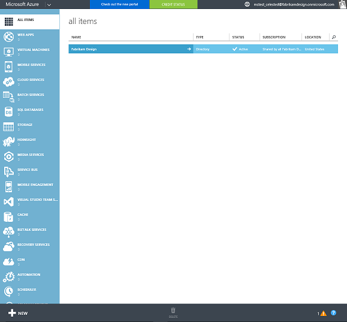

2. Select the directory (such as Fabrikam Design) to go to the directory's home page.

  **Figure 17** - Directory home page

  

3. From the menu options on top, select **Groups**.

  **Figure 18** - Azure AD groups

  

4. Select **Add a group** (from the top) or **Add group** at the bottom.
5. In the **Add Group** window, add a name, group type, and description for the group and click the checkmark to save your changes. The new group will appear on the groups list.

  **Figure 19** - Newly added group in Azure AD

  

6. In the **Groups** tab, select the arrow next to the group (such as **All users**), add members to the group, and then save your changes.

  The members that were added to the group will appear on the list.

  **Figure 20** - Members in the new group

  

7. Repeat steps 2-6 to add other groups. You can add groups based on their roles in your company, based on the apps that each group can use, and so on.

### 1.6 Configure automatic MDM enrollment with Intune
Now that you have Azure AD Premium and have it properly configured, you can configure automatic MDM enrollment with Intune, which allows users to enroll their Windows devices into Intune management, join their devices directly to Azure AD, and get access to Office 365 resources after sign in.

You can read <a href="https://blogs.technet.microsoft.com/enterprisemobility/2015/08/14/windows-10-azure-ad-and-microsoft-intune-automatic-mdm-enrollment-powered-by-the-cloud/" target="_blank">this blog post</a> to learn how you can combine login, Azure AD Join, and Intune MDM enrollment into an easy step so that you can bring your devices into a managed state that complies with the policies for your organization. We will use this blog post as our guide for this part of the walkthrough.

> [!IMPORTANT]  
> We will use the classic Azure portal instead of the new portal to configure automatic MDM enrollment with Intune.

**To enable automatic MDM enrollment**

1. In to the <a href="https://manage.windowsazure.com/" target="_blank">classic Azure portal</a>, click on your company's Azure Active Directory to go back to the main window. Select **Applications** from the list of directory menu options. 

  The list of applications for your company will appear. **Microsoft Intune** will be one of the applications on the list.

  **Figure 21** - List of applications for your company

  

2. Select **Microsoft Intune** to configure the application.
3. In the Microsoft Intune configuration page, click **Configure** to start automatic MDM enrollment configuration with Intune.

  **Figure 22** - Configure Microsoft Intune in Azure

  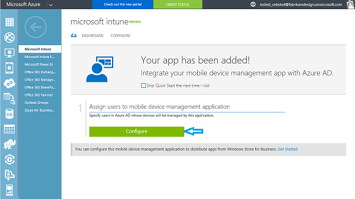

4. In the Microsoft Intune configuration page:
  - In the **Properties** section, you should see a list of URLs for MDM discovery, MDM terms of use, and MDM compliance.

    > [!NOTE]  
    > The URLs are automatically configured for your Azure AD tenant so you don't need to change them.

  - In the **Manage devices for these users** section, you can specify which users' devices should be managed by Intune.
    - **All** will enable all users' Windows 10 devices to be managed by Intune.
    - **Groups** let you select whether only users that belong to a specific group will have their devices managed by Intune.

    > [!NOTE]  
    > In this step, choose the group that contains all the users in your organization as members. This is the **All** group.

5. After you've chosen how to manage devices for users, select **Save** to enable automatic MDM enrollment with Intune.

  **Figure 23** - Configure Microsoft Intune

  

### 1.7 Configure Microsoft Store for Business for app distribution
Next, you'll need to configure Microsoft Store for Business to distribute apps with a management tool such as Intune.

In this part of the walkthrough, we'll be working on the <a href="https://manage.microsoft.com/" target="_blank">Microsoft Intune management portal</a> and <a href="https://businessstore.microsoft.com/en-us/Store/Apps" target="_blank">Microsoft Store for Business</a>.

**To associate your Store account with Intune and configure synchronization**

1. From the <a href="https://manage.microsoft.com/" target="_blank">Microsoft Intune management portal</a>, select **Admin**.
2. In the **Administration** workspace, click **Mobile Device Management**. If this is the first item you're using the portal, click **manage mobile devices** in the **Mobile Device Management** window. The page will refresh and you'll have new options under **Mobile Device Management**.

  **Figure 24** - Mobile device management

  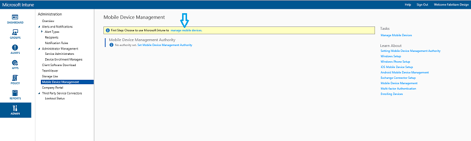

3. Sign into <a href="https://businessstore.microsoft.com/en-us/Store/Apps" target="_blank">Microsoft Store for Business</a> using the same tenant account that you used to sign into Intune.
4. Accept the EULA.
5. In the Store portal, select **Settings > Management tools** to go to the management tools page.
6. In the **Management tools** page, find **Microsoft Intune** on the list and click **Activate** to get Intune ready to use with Microsoft Store for Business.

  **Figure 25** - Activate Intune as the Store management tool

  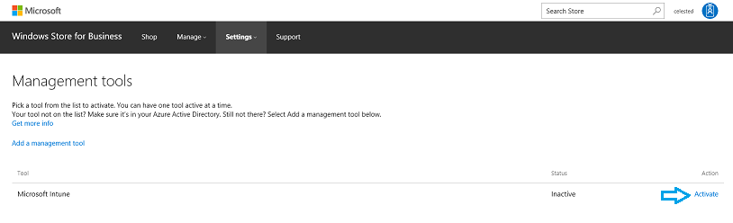

7. Go back to the <a href="https://manage.microsoft.com/" target="_blank">Intune management portal</a>, select **Admin > Mobile Device Management**, expand **Windows**, and then choose **Store for Business**.
8. In the **Microsoft Store for Business** page, select **Configure Sync** to sync your Store for Business volume-purchased apps with Intune.

  **Figure 26** - Configure Store for Business sync in Intune

  

9. In the **Configure Microsoft Store for Business app sync** dialog box, check **Enable Microsoft Store for Business sync**. In the **Language** dropdown list, choose the language in which you want apps from the Store to be displayed in the Intune console and then click **OK**.

  **Figure 27** - Enable Microsoft Store for Business sync in Intune

  

  The **Microsoft Store for Business** page will refresh and it will show the details from the sync.

**To buy apps from the Store**

In your <a href="https://businessstore.microsoft.com/en-us/Store/Apps" target="_blank">Microsoft Store for Business</a> portal, you can see the list of apps that you own by going to **Manage > Inventory**. You should see the following apps in your inventory:
- Sway
- OneNote
- PowerPoint Mobile
- Excel Mobile
- Word Mobile

In the <a href="https://manage.microsoft.com/" target="_blank">Intune management portal</a>, select **Apps > Apps > Volume-Purchased Apps** and verify that you can see the same list of apps appear on Intune.

In the following example, we'll show you how to buy apps through the Microsoft Store for Business and then make sure the apps appear on Intune.

**Example 1 - Add other apps like Reader and InstaNote**

1. In the <a href="https://businessstore.microsoft.com/en-us/Store/Apps" target="_blank">Microsoft Store for Business</a> portal, click **Shop**, scroll down to the **Made by Microsoft** category, and click **Show all** to see all the Microsoft apps in the list.

  **Figure 28** - Shop for Store apps

  

2. Click to select an app, such as **Reader**. This opens the app page.
3. In the app's Store page, click **Get the app**. You should see a dialog that confirms your order. Click **Close**. This will refresh the app's Store page.
4. In the app's Store page, click **Add to private store**.
5. Next, search for another app by name (such as **InstaNote**) or repeat steps 1-4 for the **InstaNote** app.
6. Go to **Manage > Inventory** and verify that the apps you purchased appear in your inventory.

  **Figure 29** - App inventory shows the purchased apps

  

  > [!NOTE]
  > Sync happens automatically, but it may take up to 24 hours for your organization's private store and 12 hours for Intune to sync all your purchased apps. You can force a sync to make this process happen faster. For more info, see [To sync recently purchased apps](#forceappsync).

**To sync recently purchased apps**

If you need to sync your most recently purchased apps and have it appear in your catalog, you can do this by forcing a sync.

1. In the <a href="https://manage.microsoft.com/" target="_blank">Intune management portal</a>, select **Admin > Mobile Device Management > Windows > Store for Business**.
2. In the **Microsoft Store for Business** page, click **Sync now** to force a sync.

  **Figure 30** - Force a sync in Intune

  

**To view purchased apps**
- In the <a href="https://manage.microsoft.com/" target="_blank">Intune management portal</a>, select **Apps > Apps** and then choose **Volume-Purchased Apps** to see the list of available apps. Verify that the apps you purchased were imported correctly.

**To add more apps**
- If you have other apps that you want to deploy or manage, you must add it to Microsoft Intune. To deploy Win32 apps and Web links, see <a href="https://docs.microsoft.com/intune/deploy-use/add-apps-for-mobile-devices-in-microsoft-intune" target="_blank">Add apps for enrolled devices to Intune</a> for more info on how to do this.

## 2. Set up devices

### 2.1 Set up new devices
To set up new Windows devices, go through the Windows initial device setup or first-run experience to configure your device.

**To set up a device**
1. Go through the Windows device setup experience. On a new or reset device, this starts with the **Hi there** screen on devices running Windows 10, version 1607 (Anniversary Update). The setup lets you:
  - Fill in the details in the **Hi there** screen including your home country/region, preferred language, keyboard layout, and timezone
  - Accept the EULA
  - Customize the setup or use Express settings

  **Figure 31** - First screen in Windows device setup

  

  > [!NOTE]  
  > During setup, if you don't have a Wi-Fi network configured, make sure you connect the device to the Internet through a wired/Ethernet connection.

2. In the **Who owns this PC?** screen, select **My work or school owns it** and click **Next**.
3. In the **Choose how you'll connect** screen, select **Join Azure Active Directory** and click **Next**.

  **Figure 32** - Choose how you'll connect your Windows device

  

4. In the **Let's get you signed in** screen, sign in using one of the user accounts you added in section [1.2 Add users and assign product licenses](#12-add-users-and-assign-product-licenses). We suggest signing in as one of the global administrators. Later, sign in on another device using one of the non-admin accounts.

  **Figure 33** - Sign in using one of the accounts you added

  

5. If this is the first time you're signing in, you will be asked to update your password. Update the password and continue with sign-in and setup.

  Windows will continue with setup and you may be asked to set up a PIN for Windows Hello if your organization has it enabled.

### 2.2 Verify correct device setup
Verify that the device is set up correctly and boots without any issues.

**To verify that the device was set up correctly**
1. Click on the **Start** menu and select some of the options to make sure everything launches properly.
2. Confirm that the Store and built-in apps are working.

### 2.3 Verify the device is Azure AD joined
In the <a href="https://manage.microsoft.com/" target="_blank">Intune management portal</a>, verify that the device is joined to Azure AD and shows up as being managed in Microsoft Intune.

**To verify if the device is joined to Azure AD**
1. Check the device name on your PC. To do this, on your Windows PC, select **Settings > System > About** and then check **PC name**.

  **Figure 34** - Check the PC name on your device

  
  
2. Log in to the <a href="https://manage.microsoft.com/" target="_blank">Intune management portal</a>.
3. Select **Groups** and then go to **Devices**.
4. In the **All Devices** page, look at the list of devices and select the entry that matches the name of your PC. 
  - Check that the device name appears in the list. Select the device and it will also show the current logged-in user in the **General Information** section.
  - Check the **Management Channel** column and confirm that it says **Managed by Microsoft Intune**.
  - Check the **AAD Registered** column and confirm that it says **Yes**.

  **Figure 35** - Check that the device appears in Intune

  

## 3. Manage device settings and features
You can use Microsoft Intune admin settings and policies to manage features on your organization's mobile devices and computers. For more info, see [Manage settings and features on your devices with Microsoft Intune policies](https://docs.microsoft.com/intune/deploy-use/manage-settings-and-features-on-your-devices-with-microsoft-intune-policies).

In this section, we'll show you how to reconfigure app deployment settings and add a new policy that will disable the camera for the Intune-managed devices and turn off Windows Hello and PINs during setup.

### 3.1 Reconfigure app deployment settings
In some cases, if an app is missing from the device, you need to reconfigure the deployment settings for the app and set the app to require installation as soon as possible.

**To reconfigure app deployment settings**
1. In the <a href="https://manage.microsoft.com/" target="_blank">Intune management portal</a>, select **Apps** and go to **Apps > Volume-Purchased Apps**.
2. Select the app, right-click, then select **Manage Deployment...**.
3. Select the group(s) whose apps will be managed, and then click **Add** to add the group.
4. Click **Next** at the bottom of the app deployment settings window or select **Deployment Action** on the left column to check the deployment settings for the app.
5. For each group that you selected, set **Approval** to **Required Install**. This automatically sets **Deadline** to **As soon as possible**. If **Deadline** is not automatically set, set it to **As soon as possible**.

  **Figure 36** - Reconfigure an app's deployment setting in Intune

  

6. Click **Finish**.
7. Repeat steps 2-6 for other apps that you want to deploy to the device(s) as soon as possible.
6. Verify that the app shows up on the device. To do this:
  - Make sure you're logged in to the Windows device.
  - Click the **Start** button and check the apps that appear in the **Recently added** section. If you don't see the apps that you deployed in Intune, give it a few minutes. Only apps that aren't already deployed on the device will appear in the **Recently added** section.

    **Figure 37** - Confirm that additional apps were deployed to the device

    

### 3.2 Configure other settings in Intune

**To disable the camera**
1. In the <a href="https://manage.microsoft.com/" target="_blank">Intune management portal</a>, select **Policy > Configuration Policies**.
2. In the **Policies** window, click **Add** to create a new policy.
3. On the **Create a New Policy** page, click **Windows** to expand the group, select **General Configuration (Windows 10 Desktop and Mobile and later)**, choose **Create and Deploy a Custom Policy**, and then click **Create Policy**.
4. On the **Create Policy** page, select **Device Capabilities**.
5. In the **General** section, add a name and description for this policy. For example:
  - **Name**: Test Policy - Disable Camera
  - **Description**: Disables the camera
6. Scroll down to the **Hardware** section, find **Allow camera is not configured**, toggle the button so that it changes to **Allow camera** and choose **No** from the dropdown list.

  **Figure 38** - Add a configuration policy

  

7. Click **Save Policy**. A confirmation window will pop up.
8. On the **Deploy Policy** confirmation window, select **Yes** to deploy the policy now.
9. On the **Management Deployment** window, select the user group(s) or device group(s) that you want to apply the policy to (for example, **All Users**), and then click **Add**. 
10. Click **OK** to close the window. 

  **Figure 39** - The new policy should appear in the **Policies** list.

  

**To turn off Windows Hello and PINs during device setup**
1. In the <a href="https://manage.microsoft.com/" target="_blank">Intune management portal</a>, select **Admin**.
2. Go to **Mobile Device Management > Windows > Windows Hello for Business**.
3. In the **Windows Hello for Business** page, select **Disable Windows Hello for Business on enrolled devices**.

  **Figure 40** - Policy to disable Windows Hello for Business

  

4. Click **Save**.

  > [!NOTE]
  > This policy is a tenant-wide Intune setting. It disables Windows Hello and required PINs during setup for all enrolled devices in a tenant.

To test whether these policies get successfully deployed to your tenant, go through [4. Add more devices and users](#4-add-more-devices-and-users) and setup another Windows device and login as one of the users. 

## 4. Add more devices and users
After your cloud infrastructure is set up and you have a device management strategy in place, you may need to add more devices or users and you want the same policies to apply to these new devices and users. In this section, we'll show you how to do this.

### 4.1 Connect other devices to your cloud infrastructure
Adding a new device to your cloud-based tenant is easy. For new devices, you can follow the steps in [2. Set up devices](#2-set-up-devices). 

For other devices, such as those personally-owned by employees who need to connect to the corporate network to access corporate resources (BYOD), you can follow the steps in this section to get these devices connected.

  > [!NOTE]
  > These steps enable users to get access to the organization's resources, but it also gives the organization some control over the device.

**To connect a personal device to your work or school**
1. On your Windows device, go to **Settings > Accounts**.
2. Select **Access work or school** and then click **Connect** in the **Connect to work or school** page.
3. In the **Set up a work or school account** window, click **Join this device to Azure Active Directory** to add an Azure AD account to the device.

  **Figure 41** - Add an Azure AD account to the device

  

4. In the **Let's get you signed in** window, enter the work credentials for the account and then click **Sign in** to authenticate the user.

  **Figure 42** - Enter the account details

  

5. You will be asked to update the password so enter a new password.
6. Verify the details to make sure you're connecting to the right organization and then click **Join**.

  **Figure 43** - Make sure this is your organization

  

7. You will see a confirmation window that says the device is now connected to your organization. Click **Done**.

  **Figure 44** - Confirmation that the device is now connected

  

8. The **Connect to work or school** window will refresh and will now include an entry that shows you're connected to your organization's Azure AD. This means the device is now registered in Azure AD and enrolled in MDM and the account should have access to the organization's resources.

  **Figure 45** - Device is now enrolled in Azure AD

  

9. You can confirm that the new device and user are showing up as Intune-managed by going to the <a href="https://manage.microsoft.com/" target="_blank">Intune management portal</a> and following the steps in [2.3 Verify the device is Azure AD joined](#23-verify-the-device-is-azure-ad-joined). It may take several minutes before the new device shows up so check again later.

### 4.2 Add a new user
You can add new users to your tenant simply by adding them to the Office 365 groups. Adding new users to Office 365 groups automatically adds them to the corresponding groups in Microsoft Intune.

See [Add users to Office 365](https://support.office.com/en-us/article/Add-users-to-Office-365-for-business-435ccec3-09dd-4587-9ebd-2f3cad6bc2bc?ui=en-US&rs=en-US&ad=US&fromAR=1) to learn more. Once you're done adding new users, go to the <a href="https://manage.microsoft.com/" target="_blank">Intune management portal</a> and verify that the same users were added to the Intune groups as well.

## Get more info

### For IT admins
To learn more about the services and tools mentioned in this walkthrough, and learn what other tasks you can do, follow these links:
- <a href="https://support.office.com/en-us/article/Set-up-Office-365-for-business-6a3a29a0-e616-4713-99d1-15eda62d04fa" target="_blank">Set up Office 365 for business</a>
- Common admin tasks in Office 365 including email and OneDrive in <a href="https://support.office.com/en-us/article/Common-management-tasks-for-Office-365-46c667f7-5073-47b9-a75f-05a60cf77d91" target="_blank">Manage Office 365</a>
- More info about managing devices, apps, data, troubleshooting, and more in <a href="https://docs.microsoft.com/intune/" target="_blank">Intune documentation</a>
- Learn more about Windows 10 in <a href="https://technet.microsoft.com/windows/windows10.aspx" target="_blank">Windows 10 guide for IT pros</a>
- Info about distributing apps to your employees, managing apps, managing settings, and more in <a href="https://technet.microsoft.com/itpro/windows/manage/windows-store-for-business" target="_blank">Microsoft Store for Business</a>

### For information workers
Whether it's in the classroom, getting the most out of your devices, or learning some of the cool things you can do, we've got teachers covered. Follow these links for more info:
- <a href="https://support.office.com/" target="_blank">Office help and training</a>
- <a href="https://support.microsoft.com/products/windows?os=windows-10" target="_blank">Windows 10 help</a>

## Related topics

- [Windows 10 and Windows 10 Mobile](https://technet.microsoft.com/itpro/windows/index)
