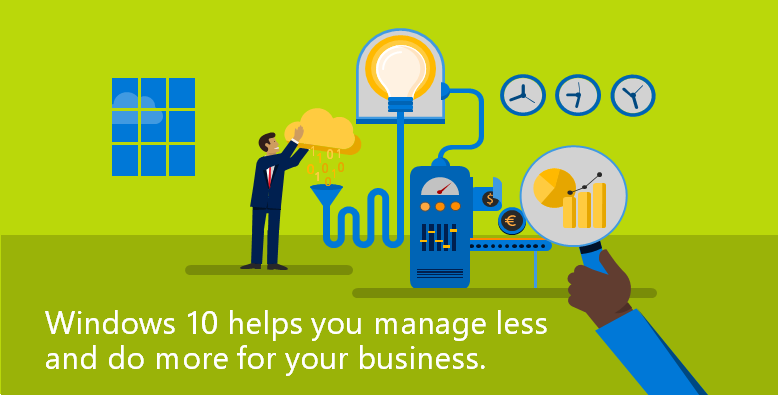

# Windows 10 for SMB

##  Learn

<b><a href="https://business.microsoft.com/en-us/products/windows" target="_blank">Windows 10 for business</a></b> Learn how Windows 10 and Windows devices can help your business.

<b><a href="https://blogs.business.microsoft.com/" target="_blank">SMB blog</a></b> Read about the latest stories, technology insights, and business strategies for SMBs.

<b><a href="https://business.microsoft.com/en-us/products" target="_blank">How to buy</a></b> Go here when you&#39;re ready to buy or want to learn more about Microsoft products you can use to help transform your business.

##  Deploy

<b><a href="cloud-mode-business-setup.md" data-raw-source="[Get started: Deploy and manage a full cloud IT solution for your business](cloud-mode-business-setup.md)">Get started: Deploy and manage a full cloud IT solution for your business</a></b> Find out how easy it is to deploy and manage a full cloud IT solution for your small to midsize business using Microsoft cloud services and tools.

 ## Related topics

- [Windows 10 and Windows 10 Mobile](https://technet.microsoft.com/itpro/windows/index)