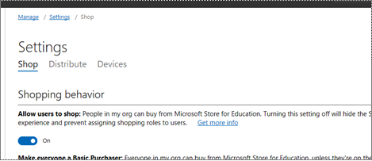

# Acquire apps in Microsoft Store for Business and Education
As an admin, you can acquire apps from the Microsoft Store for Business and Education for your employees. Some apps are free, and some have a price. For info on app types that are supported, see [Apps in the Microsoft Store for Business](apps-in-microsoft-store-for-business.md). The following sections explain some of the settings for shopping. 

## App licensing model
The Microsoft Store supports two options to license apps: online and offline. **Online** licensing is the default licensing model. Online licensed apps require users and devices to connect to the Microsoft Store services to acquire an app and its license. **Offline** licensing is a new licensing option for Windows 10. With offline licenses, organizations can cache apps and their licenses to deploy within their network. ISVs or devs can opt-in their apps for offline licensing when they submit them to the developer center. Admins control whether or not offline apps are available in Microsoft Store with an offline app visibility setting. For more information, see [offline license visibility](https://docs.microsoft.com/microsoft-store/update-microsoft-store-for-business-account-settings#offline-licensing). 

For more information on the Microsoft Store licensing model, see [licensing model](https://docs.microsoft.com/microsoft-store/apps-in-microsoft-store-for-business#licensing-model).

## Payment options
Some apps are free, and some have a price. Apps can be purchased in the Microsoft Store using your credit card. You can enter your credit card information on **Account Information**, or when you purchase an app. Currently, we accept these credit cards:
- VISA 
- MasterCard 
- Discover 
- American Express 
- Japan Commercial Bureau (JCB)

## Organization info
There are a couple of things we need to know when you pay for apps. You can add this info to the **Account information** or **Payments & billing** page before you buy apps. If you haven’t provided it, we’ll ask when you make a purchase. Either way works. Here’s the info you’ll need to provide:
- Legal business address
- Payment option (credit card)

## Allow users to shop

**Allow users to shop** controls the shopping experience in Microsoft Store for Education. When this setting is on, **Purchasers** and **Basic Purchasers** can purchase products and services from Microsoft Store for Education. If your school chooses to closely control how purchases are made, admins can turn off **Allow users to shop**. When the setting is off:
- The shopping experience is not availalbe 
- **Purchasers** and **Basic Purchasers** can't purchase products and services from Microsoft Store for Education
- Admins can't assign shopping roles to users
- Products and services previously purchased by **Basic Purchasers** can be managed by admins. 

**To manage Allow users to shop setting**
1. Sign in to [Microsoft Store for Business](https://businessstore.microsoft.com) or [Microsoft Store for Education](https://educationstore.microsoft.com) 
2. Select **Manage**, and then select **Settings**. 
3. On **Shop**, , under **Shopping behavior**, turn on or turn off **Allow users to shop**.

## Allow app requests

People in your org can request license for apps that they need, or that others need. When **Allow app requests** is turned on, app requests are sent to org admins. Admins for your tenant will receive an email with the request, and can decide about making the purchase. 

**To manage Allow app requests**
1. Sign in to [Microsoft Store for Business](https://businessstore.microsoft.com) or [Microsoft Store for Education](https://educationstore.microsoft.com) 
2. Select **Manage**, and then select **Settings**. 
3. On **Shop**, under **Shopping behavior** turn on or turn off **Allow app requests**.

## Acquire apps
**To acquire an app**  
1.	Sign in to http://businessstore.microsoft.com
2.	Select **Shop for my group**, or use Search to find an app. 
3.	Select the app you want to purchase. 
4.	On the product description page, choose your license type - either online or offline. 
5.  Free apps will be added to **Products & services**. For apps with a price, you can set the quantity you want to buy. Type the quantity and select **Next**.
6.	If you don’t have a payment method saved in **Billing & payments**, we will prompt you for one.
7.	Add your credit card or debit card info, and select **Next**. Your card info is saved as a payment option on **Billing & payments - Payment methods**.

You’ll also need to have your business address saved on **My organization - Profile**. The address is used to generate tax rates. For more information on taxes for apps, see [organization tax information](https://docs.microsoft.com/microsoft-store/update-microsoft-store-for-business-account-settings#organization-tax-information). 

Microsoft Store adds the app to your inventory. From **Products & services**, you can:
- Distribute the app: add to private store, or assign licenses
- View app licenses: review current licenses, reclaim and reassign licenses
- View app details: review the app details page and purchase more licenses

For info on distributing apps, see [Distribute apps to your employees from the Microsoft Store for Business](distribute-apps-to-your-employees-microsoft-store-for-business.md).

For info on offline-licensed apps, see [Distribute offline apps](distribute-offline-apps.md).
