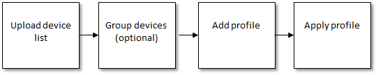
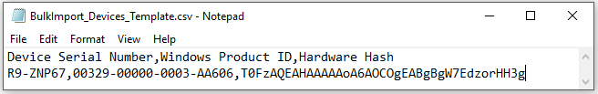
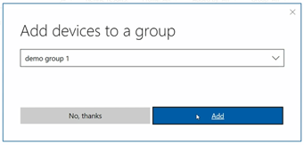

# Manage Windows device deployment with Windows AutoPilot Deployment

**Applies to**
-   Windows 10

Windows AutoPilot Deployment Program simplifies device set up for IT Admins. For an overview of benefits, scenarios, and prerequisites, see [Overview of Windows AutoPilot](https://docs.microsoft.com/windows/deployment/windows-10-auto-pilot). 

Watch this video to learn more about Windows AutoPilot in Micrsoft Store for Business. 

<iframe width="560" height="315" src="https://www.youtube.com/embed/IpLIZU_j7Z0" frameborder="0" allowfullscreen></iframe>

## What is Windows AutoPilot Deployment Program?
In Microsoft Store for Business, you can manage devices for your organization and apply an *AutoPilot deployment profile* to your devices. When people in your organization run the out-of-box experience on the device, the profile configures Windows based on the AutoPilot deployment profile you applied to the device. 

You can create and apply AutoPilot deployment profiles to these devices. The overall process looks like this. 

Figure 1 - Windows AutoPilot Deployment Program process

AutoPilot deployment profiles have two main parts: default settings that can't be changed, and optional settings that you can include. 

### AutoPilot deployment profiles - default settings
These settings are configured with all AutoPilot deployment profiles:
- Skip Cortana, OneDrive, and OEM registration setup pages
- Automatically setup for work or school
- Sign in experience with company or school brand 

### AutoPilot deployment profiles - optional settings
These settings are off by default. You can turn them on for your AutoPilot deployment profiles:
- Skip privacy settings

### Support for AutoPilot profile settings
AutoPilot profile settings are supported beginning with the version of Windows they were introduced in. This table summarizes the settings and what they are supported on. 

| Setting | Supported on  |
| ------- | ------------- |
| Deployment default features| Windows 10, version 1703 or later |
| Skip privacy settings | Windows 10, version 1703 or later |
| Disable local admin account creation on the device | Windows 10, version 1703 or later | 
| Skip End User License Agreement (EULA) | Windows 10, version 1709 or later.   [Learn about Windows AutoPilot EULA dismissal](https://docs.microsoft.com/windows/deployment/Windows-AutoPilot-EULA-note) |

## Windows AutoPilot deployment profiles in Microsoft Store for Business and Education
You can manage new devices in Microsoft Store for Business or Microsoft Store for Education. Devices need to meet these requirements:
- Windows 10, version 1703 or later
- New devices that have not been through Windows out-of-box experience. 

## Add devices and apply AutoPilot deployment profile
To manage devices through Microsoft Store for Business and Education, you'll need a .csv file that contains specific information about the devices. You should be able to get this from your Microsoft account contact, or the store where you purchased the devices. Upload the .csv file to Microsoft Store to add the devices. 

### Device information file format
Columns in the device information file need to use this naming and be in this order:
- Column A: Device Serial Number
- Column B: Windows Product ID 
- Column C: Hardware Hash

Here's a sample device information file:

When you add devices, you need to add them to an *AutoPilot deployment group*. Use these groups to apply AutoPilot deployment profiles to a group of devices. The first time you add devices to a group, you'll need to create an AutoPilot deployment group. 

> [!NOTE]
> You can only add devices to a group when you add devices to **Microsoft Store for Business and Education**. If you decide to reorganize devices into different groups, you'll need to delete them from **Devices** in **Microsoft Store**, and add them again. 

**Add and group devices**
1. Sign in to [Microsoft Store for Business](http://businessstore.microsoft.com) or [Microsoft Store for Education](https://educationstore.microsoft.com). 
2. Click **Manage**, and then click **Devices**.
3. Click **Add devices**, navigate to the *.csv file and select it. 
4. Type a name for a new AutoPilot deployment group, or choose one from the list, and then click **Add**.  
If you don't add devices to a group, you can select the individual devices to apply a profile to.    
 
 
5. Click the devices or AutoPilot deployment group that you want to manage. You need to select devices before you can apply an AutoPilot deployment profile. You can switch between seeing groups or devices by clicking **View groups** or **View devices**. 

**Apply AutoPilot deployment profile**
1. When you have devices selected, click **AutoPilot deployment**. 
2. Choose the AutoPilot deployment profile to apply to the selected devices.
 
    > [!NOTE]
    > The first time you use AutoPilot deployment profiles, you'll need to create one. See [Create AutoPilot profile](#create-autopilot-profile).
     
3. Microsoft Store for Business applies the profile to your selected devices, and shows the profile name on **Devices**.

## Manage AutoPilot deployment profiles
You can manage the AutoPilot deployment profiles created in Microsoft Store. You can create a new profile, edit, or delete a profile. 

### Create AutoPilot profile

1. Sign in to [Microsoft Store for Business](http://businessstore.microsoft.com) or [Microsoft Store for Education](https://educationstore.microsoft.com). 
2. Click **Manage**, and then click **Devices**.
3. Click **AutoPilot deployment**, and then click **Create new profile**. 
4. Name the profile, choose the settings to include, and then click **Create**. 
The new profile is added to the **AutoPilot deployment** list.  

### Edit or delete AutoPilot profile

1. Sign in to [Microsoft Store for Business](http://businessstore.microsoft.com) or [Microsoft Store for Education](https://educationstore.microsoft.com). 
2. Click **Manage**, and then click **Devices**.
3. Click **AutoPilot deployment**, click **Edit your profiles**, and then choose the profile to edit.
TBD: art
4. Change settings for the profile, and then click **Save**.  
-or- 
Click **Delete profile** to delete the profile. 

## Apply a different AutoPilot deployment profile to devices
After you've applied an AutoPilot deployment profile to a device, if you decide to apply a different profile, you can remove the profile and apply a new profile. 

> [!NOTE]
> The new profile will only be applied if the device has not been started, and gone through the out-of-box experience. Settings from a different profile can't be applied when another profile has been applied. Windows would need to be reinstalled on the device for the second profile to be applied to the device. 

## AutoPilot device information file error messages
Here's info on some of the errors you might see while working with AutoPilot deployment profiles in **Microsoft Store for Business and Education**. 

| Message Id | Message explanation | 
| ---------- | ------------------- |
| wadp001    | Check your file, or ask your device partner for a complete .csv file. This file is missing Serial Number and Product Id info. |
| wadp002    | Check your file, or ask your device partner for updated hardware hash info in the .csv file. Hardware hash info is invalid in the current .csv file. |
| wadp003    | Looks like you need more than one .csv file for your devices. The maximum allowed is 1,000 items. You’re over the limit! Divide this device data into multiple .csv files. |
| wadp004    | Try that again. Something happened on our end. Waiting a bit might help. |
| wadp005    | Check your .csv file with your device provider. One of the devices on your list has been claimed by another organization. |
| wadp006    | Try that again. Something happened on our end. Waiting a bit might help. |
| wadp007    | Check the info for this device in your .csv file. The device is already registered in your organization. |
| wadp008    | The device does not meet AutoPilot Deployment requirements. |
| wadp009    | Check with your device provider for an update .csv file. The current file doesn’t work |
| wadp010    | Try that again. Something happened on our end. Waiting a bit might help. |
