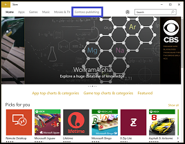

# Manage access to private store

**Applies to**

-   Windows 10
-   Windows 10 Mobile

You can manage access to your private store in Microsoft Store for Business and Microsoft Store for Education.

You can control the set of apps that are available to your employees and students, and not show the full set of applications that are in Microsoft Store. Using the private store with the Microsoft Store for Business and Education, admins can curate the set of apps that are available.

The private store is a feature in Store for Business that organizations receive during the sign up process. When admins add apps to the private store, all employees in the organization can view and download the apps. Your private store is available as a tab in Microsoft Store, and is usually named for your company or organization. Only apps with online licenses can be added to the private store. Your private store looks something like this:

Organizations can use either an MDM policy, or Group Policy to show only their private store in Microsoft Store.  

## Show private store only using MDM policy

Organizations using an MDM to manage apps can use a policy to show only the private store. When your MDM supports Microsoft Store for Business, the MDM can use the [Policy CSP](https://msdn.microsoft.com/library/windows/hardware/dn904962.aspx). More specifically, the [ApplicationManagement/RequirePrivateStoreOnly](https://msdn.microsoft.com/library/windows/hardware/dn904962.aspx#ApplicationManagement_RequirePrivateStoreOnly) policy. 

**ApplicationManagement/RequirePrivateStoreOnly** policy is supported on the following Windows 10 editions:
- Enterprise
- Education
- Mobile
- Mobile Enterprise

For more information on configuring an MDM provider, see [Configure an MDM provider](https://technet.microsoft.com/itpro/windows/manage/configure-mdm-provider-windows-store-for-business). 

## Show private store only using Group Policy 

If you're using Microsoft Store and you want employees to only see apps you're managing in your private store, you can use Group Policy to show only the private store. Microsoft Store app will still be available, but employees can't view or purchase apps. Employees can view and install apps that the admin has added to your organization's private store.  

**Only display the private store within Microsoft Store app** group policy is supported on the following Windows 10 editions:
- Enterprise
- Education

**To show private store only in Microsoft Store app**

1. Type **gpedit** in the search bar, and then select **Edit group policy (Control panel)** to find and start Group Policy Editor.

2. In the console tree of the snap-in, go to **User Configuration** or **Computer Configuration** > **Administrative Templates** > **Windows Components**, and then click **Store**.

3. Right-click **Only display the private store within Microsoft Store app** in the right pane, and click **Edit**.

    This opens the **Only display the private store within the Microsoft Store app** policy settings.

4. On the **Only display the private store within the Microsoft Store app** setting page, click **Enabled**, and then click **OK**.

You can also prevent employees from using Microsoft Store. For more information, see [Configure access to Microsoft Store](/windows/configuration/stop-employees-from-using-microsoft-store).

## Related topics

[Distribute apps using your private store](distribute-apps-from-your-private-store.md)
[Configure access to Microsoft Store](/windows/configuration/stop-employees-from-using-microsoft-store)
