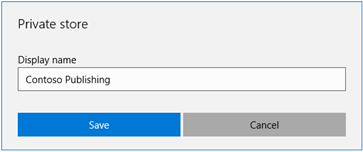
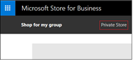
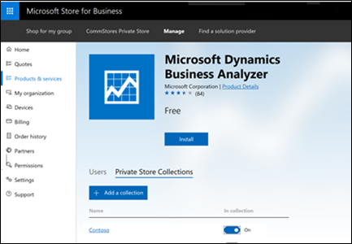

# Manage private store settings

**Applies to**

-   Windows 10
-   Windows 10 Mobile

The private store is a feature in Microsoft Store for Business and Education that organizations receive during the sign up process. When admins add apps to the private store, all people in the organization can view and download the apps. Only online-licensed apps can be distributed from your private store.

The name of your private store is shown on a tab in Microsoft Store app, or on [Microsoft Store for Business](https://businessstore.microsoft.com), or [Microsoft Store for Education](https://educationstore.microsoft.com).

You can change the name of your private store in Microsoft Store.

## Change private store name
**To change the name of your private store**

1.  Sign in to the [Microsoft Store for Business](https://businessstore.microsoft.com) or [Microsoft Store for Education](https://educationstore.microsoft.com).
2.  Click **Settings**, click **Distribute**.
3.  In the **Private store** section, click **Change**.
4.  Type a new display name for your private store, and click **Save**.

    

## Private store collections
You can create collections of apps within your private store. Collections allow you to group or categorize apps - you might want a group of apps for different job functions in your company, or classes in your school.

**To add a Collection to your private store**

You can add a collection to your private store from the private store, or from the details page for an app.

**From private store**
1. Sign in to [Microsoft Store for Business](https://businessstore.microsoft.com) or [Microsoft Store for Education](https://educationstore.microsoft.com).
2. Click your private store. 

    
3. Click **Add a Collection**. 

    

4. Type a name for your collection, and then click **Next**.
5. Add at least one product to your collection, and then click **Done**. You can search for apps and refine results based on the source of the app, or the supported devices.

> [!NOTE]
> New collections require at least one app, or they will not be created.

**From app details page**
1. Sign in to [Microsoft Store for Business](https://businessstore.microsoft.com) or [Microsoft Store for Education](https://educationstore.microsoft.com).
2. Click **Manage**, and then click **Products & services**.
3. Under **Apps & software**, choose an app you want to include in a new collection.
4. Under **Private Store Collections**, click **Add a collection**.

    

5. Type a name for your collection, and then click **Next**.
6. Add at least one product to your collection, and then click **Done**.

Currently, changes to collections will generally show within minutes in the Microsoft Store app on Windows 10. In some cases, it may take up an hour.

## Edit Collections
If you've already added a Collection to your private store, you can easily add and remove products, or rename the collection.

**To add or remove products from a collection**
1. Sign in to [Microsoft Store for Business](https://businessstore.microsoft.com) or [Microsoft Store for Education](https://educationstore.microsoft.com).
2. Click your private store. 

    

3. Click the ellipses next to the collection name, and click **Edit collection**.
4. Add or remove products from the collection, and then click **Done**.

You can also add an app to a collection from the app details page.
1. Sign in to [Microsoft Store for Business](https://businessstore.microsoft.com) or [Microsoft Store for Education](https://educationstore.microsoft.com).
2. Click **Manage**, and then click **Products & services**.
3. Under **Apps & software**, choose an app you want to include in a new collection.
4. Under **Private Store Collections**, turn on the collection you want to add the app to.

    

## Private store performance
We've recently made performance improvements for changes in the private store. This table includes common actions, and the current estimate for amount of time required for the change.

| Action                                                 | Estimated time |
| ------------------------------------------------------ | -------------- |
| Add a product to the private store   - Apps recently added to your inventory, including line-of-business (LOB) apps and new purchases, will take up to 36 hours to add to the private store. That time begins when the product is purchased, or added to your inventory.   - It will take an additional 36 hours for the product to be searchable in private store, even if you see the app available from the private store tab. | - 15 minutes: available on private store tab   - 36 hours: searchable in private store   - 36 hours: searchable in private store tab |
| Remove a product from private store |  - 15 minutes: private store tab   - 36 hours: searchable in private store |
| Accept a new LOB app into your inventory (under **Products & services)**) | - 15 minutes: available on private store tab   - 36 hours: searchable in private store |
| Create a new collection | 15 minutes|
| Edit or remove a collection | 15 minutes |
| Create private store tab | 4-6 hours |
| Rename private store tab | 4-6 hours |
