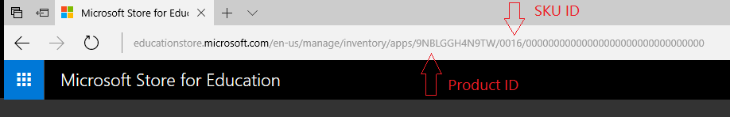

# Microsoft Store for Business and Education PowerShell module - preview

**Applies to**
-   Windows 10

Microsoft Store for Business and Education PowerShell module (preview) is now available on [PowerShell Gallery](https://go.microsoft.com/fwlink/?linkid=853459).

> [!NOTE]
> This is a preview and not intended for production environments. For production environments, continue to use **Microsoft Store for Business and Education** or your MDM tool to manage licenses. The sample scripts are not supported under any Microsoft standard support program or service. The sample scripts are provided AS IS without warranty of any kind. Microsoft further disclaims all implied warranties including, without limitation, any implied warranties of merchantability or of fitness for a particular purpose. The entire risk arising out of the use or performance of the sample scripts and documentation remains with you. In no event shall Microsoft, its authors, or anyone else involved in the creation, production, or delivery of the scripts be liable for any damages whatsoever (including, without limitation, damages for loss of business profits, business interruption, loss of business information, or other pecuniary loss) arising out of the use of or inability to use the sample scripts or documentation, even if Microsoft has been advised of the possibility of such damages.

You can use the PowerShell module to:
- View items you've purchased - shown in **Products & services**
- Manage licenses - assigning and removing
- Perform bulk operations with .csv files - automates license management for customers with larger numbers of licenses

>[!NOTE]
>Assigning apps to groups is not supported via this module. Instead, we recommend leveraging the Azure Active Directory Or MSOnline Modules to save members of a group to a CSV file and follow instructions below on how to use CSV file to manage assignments.

## Requirements
To use the Microsoft Store for Business and Education PowerShell module, you'll need:
- Administrator permission for the device
- Admin role for Microsoft Store for Business and Education


## Get started with Microsoft Store for Business and Education PowerShell module
All of the **Microsoft Store for Business and Education** PowerShell cmdlets follow the *Verb*-MSStore*Noun* pattern to clearly indicate that they work with **Microsoft Store for Business and Education** PowerShell module. You will need to install the module on your Windows 10 device once and then import it into each PowerShell session you start.

## Install Microsoft Store for Business and Education PowerShell module
> [!NOTE]
> Installing **Microsoft Store for Business and Education** PowerShell model using **PowerShellGet** requires [Windows Management Framework 5.0](https://www.microsoft.com/download/details.aspx?id=48729). The framework is included with Windows 10 by default).

To install **Microsoft Store for Business and Education PowerShell** with PowerShellGet, run this command:

```powershell
# Install the Microsoft Store for Business and Education PowerShell module from PowerShell Gallery

Install-Module -Name MSStore
```

## Import Microsoft Store for Business and Education PowerShell module into the PowerShell session
Once you install the module on your Windows 10 device, you will need to then import it into each PowerShell session you start.

```powershell
# Import the MSStore module into this session

Import-Module -Name MSStore
```

Next, authorize the module to call **Microsoft Store for Business and Education** on your behalf. This step is required once, per user of the PowerShell module.

To authorize the PowerShell module, run this command. You'll need to sign-in with your work or school account, and authorize the module to access your tenant.

```powershell
# Grant MSStore Access to your Microsoft Store for Business and Education

Grant-MSStoreClientAppAccess
```
You will be promted to sign in with your work or school account and then to authorize the PowerShell Module to access your **Microsoft Store for Business and Education** account. Once the module has been imported into the current PowerShell session and authorized to call into your **Microsoft Store for Business and Education** account, Azure PowerShell cmdlets are loaded and ready to be used.

## View items in Products and Services
Service management should encounter no breaking changes as a result of the separation of Azure Service Management and **Microsoft Store for Business and Education PowerShell** preview.

```powershell
# View items in inventory (Apps & software)

Get-MSStoreInventory
```

>[!TIP]
>**Get-MSStoreInventory** won't return the product name for line-of-business apps. To get the product ID and SKU for a line-of-business app:
>
>1. Sign in to [Microsoft Store for Business](https://go.microsoft.com/fwlink/p/?LinkId=691845) or [Microsoft Store for Education](https://businessstore.microsoft.com/).
>2. Click **Manage** and then choose **Apps & software**.
>3. Click the line-of-business app. The URL of the page will contain the product ID and SKU as part of the URL. For example:
>

## View people assigned to a product
Most items in **Products and Services** in **Microsoft Store for Business and Education** need to be assigned to people in your org. You can view the people in your org assigned to a specific product by using these commands:

```powershell
# View products assigned to people

Get-MSStoreSeatAssignments -ProductId 9NBLGGH4R2R6 -SkuId 0016
```

> [!Important]
> Microsoft Store for Business and Education identifies Minecraft: Education Edition license types using a combination of Product ID and SKU ID. To manage license assignments for your Minecraft: Education Edition, you need to specify Product and SKU IDs for the licenses you want to manage in the cmdlet. The following table lists the Product and SKU IDs.


| License Type | Product ID | SKU ID |
| ------------ | -----------| -------|
| Purchased through Microsoft Store for Business and Education with a credit card | CFQ7TTC0K5DR | 0001 |
| Purchased through Microsoft Store for Business and Education with an invoice | CFQ7TTC0K5DR | 0004 |
| Purchased through Microsoft Volume Licensing Agreement | CFQ7TTC0K5DR | 0002 |
| Acquired through Windows 10 device promotion | CFQ7TTC0K5DR | 0005 |

## Assign or reclaim products
Once you have enumerated items in **Products and Service**, you can assign or reclaim licenses to and from people in your org.

These commands assign a product to a user and then reclaim it.

```powershell
# Assign Product (Product ID and SKU ID combination) to a User (user@host.com)

Add-MSStoreSeatAssignment -ProductId 9NBLGGH4R2R6 -SkuId 0016 -Username 'user@myorganization.onmicrosoft.com'

# Reclaim a product (Product ID and SKU ID combination) from a User (user@host.com)

Remove-MSStoreSeatAssignment -ProductId 9NBLGGH4R2R6 -SkuId 0016 -Username 'user@myorganization.onmicrosoft.com'
```

## Assign or reclaim a product with a .csv file
You can also use the PowerShell module to perform bulk operations on items in **Product and Services**. You'll need a .CSV file with at least one column for “Principal Names” (for example, user@host.com). You can create such a CSV using the AzureAD PowerShell Module.

**To assign or reclaim seats in bulk:**

```powershell
# Assign Product (Product ID and SKU ID combination) to a User (user@host.com)

Add-MSStoreSeatAssignments  -ProductId 9NBLGGH4R2R6 -SkuId 0016 -PathToCsv C:\People.csv  -ColumnName UserPrincipalName

# Reclaim a product (Product ID and SKU ID combination) from a User (user@host.com)

Remove-MSStoreSeatAssignments  -ProductId 9NBLGGH4R2R6 -SkuId 0016 -PathToCsv C:\People.csv -ColumnName UserPrincipalName
```

## Uninstall Microsoft Store for Business and Education PowerShell module
You can remove **Microsoft Store for Business and Education PowerShell** from your computer by running the following PowerShell Command.

```powershell
# Uninstall the MSStore Module

Get-InstalledModule -Name "MSStore" -RequiredVersion 1.0 | Uninstall-Module
```
