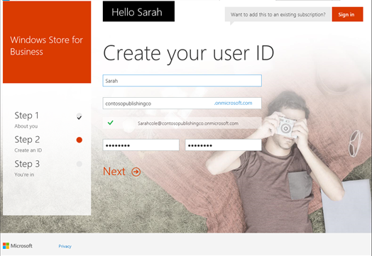
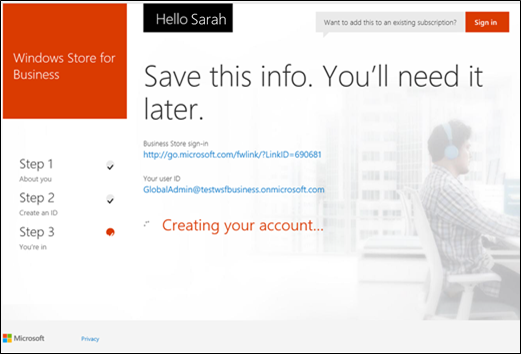
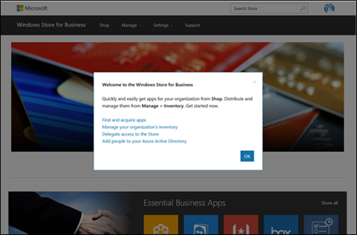

# Sign up for Microsoft Store for Business or Microsoft Store for Education

**Applies to**

-   Windows 10
-   Windows 10 Mobile

Before you sign up for Microsoft Store for Business or Microsoft Store for Education, you'll need an Azure Active Directory (AD) or Office 365 account for your organization, and you'll need to be the global administrator for your organization. If your organization is already using Azure AD, you can go ahead and sign up for Microsoft Store for Business or Microsoft Store for Education. If not, we'll help you create an Azure AD or Office 365 account and directory as part of the sign up process.

## Sign up for Microsoft Store

Before signing up for Microsoft Store, make sure you're the global administrator for your organization.

**To sign up for Microsoft Store**

1.  Go to [https://www.microsoft.com/business-store](https://www.microsoft.com/business-store), or [https://www.microsoft.com/education-store](https://www.microsoft.com/education-store) and click **Sign up**.

    -   If you start Microsoft Store sign-up process, and don't have an Azure AD directory for your organization, we'll help you create one. For more info, see [Sign up for Azure AD accounts](#o365-welcome).

    <!-- -->

    -   If you already have an Azure AD directory, you'll [sign in to Store for Business](#sign-in), and then accept Store for Business terms.

    

    **To sign up for Azure AD accounts through Office 365 for Business**

    -   Signing up for Microsoft Store will create an Azure AD directory and global administrator account for you. There are just a few steps.

        Step 1: About you.

        Type the required info and click **Next.**

        

    -   Step 2: Create an ID.

        We'll use info you provided on the previous page to build your user ID. Check the info and click **Next**.

        

    -   Step 3: You're in.

        Let us know how you'd like to receive a verification code, and click either **Text me**, or **Call me**. We'll send you a verification code

        

    -   Verification.

        Type your verification code and click **Create my account**.

        

    -   Save this info.

        Be sure to save the portal sign-in page and your user ID info. Click **You're ready to go**.

        

    -   At this point, you'll have an Azure AD directory created with one user account. That user account is the global administrator. You can use that account to sign in to Store for Business.

2.  Sign in with your Azure AD account.

    

3.  Read through and accept Microsoft Store for Business and Education terms.

4.  Welcome to the Store for Business. Click **Next** to continue.

    

## Next steps

After signing up for Microsoft Store for Business or Microsoft Store for Education, you can:

- **Add users to your Azure AD directory**. If you created your Azure AD directory during sign up, additional user accounts are required for employees to install apps you assign to them, or to browse the private store in Store app. For more information, see [Manage user accounts in Microsoft Store for Business and Education](manage-users-and-groups-microsoft-store-for-business.md).
- **Assign roles to employees**. For more information, see [Roles and permissions in Microsoft Store for Business and Education](roles-and-permissions-microsoft-store-for-business.md).

 

 

