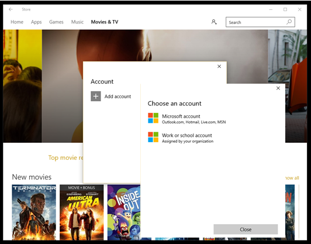

# Troubleshoot Microsoft Store for Business

**Applies to:**

- Windows 10

> [!IMPORTANT]
>
> - The retirement of Microsoft Store for Business and Microsoft Store for Education has been postponed. We will update this notice when a new retirement date is announced. You can continue to use the current capabilities of free apps until that time. For more information about this change, see [Update to Intune integration with the Microsoft Store on Windows](https://techcommunity.microsoft.com/t5/windows-it-pro-blog/update-to-endpoint-manager-integration-with-the-microsoft-store/ba-p/3585077) and [FAQ: Supporting Microsoft Store experiences on managed devices](https://techcommunity.microsoft.com/t5/windows-management/faq-supporting-microsoft-store-experiences-on-managed-devices/m-p/3585286).
> - In April 2023 the Microsoft Store for Business tab was removed from Microsoft Store apps on Windows 10 and Windows 11 PCs. An interaction with existing MDM and GPO policies may lead to customers seeing errors when accessing the Microsoft Store app. For more information see [Microsoft Store for Business tab removed](manage-access-to-private-store.md#microsoft-store-for-business-tab-removed).

Troubleshooting topics for Microsoft Store for Business.

## Can't find apps in private store

The private store for your organization is a page in Microsoft Store app that contains apps that are private to your organization. After your organization acquires an app, your Store for Business admin can add it to your organization's private store. Your private store usually has a name that is close to the name of your organization or company. If you can't see your private store, there are a couple of things to check:

- **No apps in the private store** - The private store page is only available in Microsoft Store on Windows 10 if there are apps added to your private store. You won't see your private store page with no apps listed on it. If your Microsoft Store for Business admin has added an app to the private store, and the private store page is still not available, they can check the private store status for the app on **Product & services - Apps**. If the status under **Private store** is **Add in progress**, wait and check back.
- **Signed in with the wrong account** - If you have multiple accounts that you use in your organization, you might be signed in with the wrong account. Or, you might not be signed in. Use this procedure to sign in with your organization account.

**To sign in with organization account in Microsoft Store app**

1.  Click the people icon in Microsoft Store app, and click **Sign in**.

    

2.  Click **Add account**, and then click **Work or school account**.

    

3.  Type the email account and password, and click **Sign in**.

    

4.  You should see the private store for your organization. In our example, the page is named **Contoso publishing**.

    

    Click the private store to see apps in your private store.

    

## Troubleshooting Microsoft Store for Business integration with Microsoft Configuration Manager

If you encounter any problems when integrating Microsoft Store for Business with Configuration Manager, use the [troubleshooting guide](/troubleshoot/mem/configmgr/troubleshoot-microsoft-store-for-business-integration).

## Still having trouble?

If you are still having trouble using Microsoft Store or installing an app, Admins can sign in and look for topics on our **Support** page.
   
**To view Support page** 

1. Sign in to [Microsoft Store for Business](https://businessstore.microsoft.com).
2.Choose **Manage**> **Support**. 
