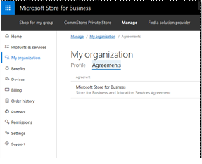
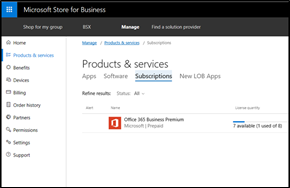
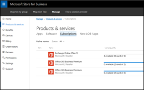
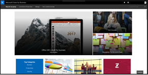
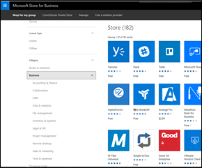

# What's new in Microsoft Store for Business and Education

Microsoft Store for Business and Education regularly releases new and improved feaures.  

## Latest updates for Store for Business and Education

**October 2017**

We’ve been working on bug fixes and performance improvements to provide you a better experience. Stay tuned for new features!

<!---
|  |  |
|-----------------------|---------------------------------|
| <iframe width="288" height="232" src="https://www.youtube.com/embed/IpLIZU_j7Z0" frameborder="0" allowfullscreen></iframe>| **Manage Windows device deployment with Windows AutoPilot Deployment**    In Microsoft Store for Business, you can manage devices for your organization and apply an AutoPilot deployment profile to your devices. When people in your organization run the out-of-box experience on the device, the profile configures Windows, based on the AutoPilot deployment profile you applied to the device.  [Get more info](add-profile-to-devices.md)  **Applies to**:  Microsoft Store for Business   Microsoft Store for Education  |
|  |**Request an app**  People in your organization can reqest additional licenses for apps in your private store, and then Admins or Purchasers can make the purchases.   [Get more info](https://docs.microsoft.com/microsoft-store/acquire-apps-microsoft-store-for-business#request-apps)  **Applies to**:  Microsoft Store for Business   Microsoft Store for Education |
|  |**My organization**   **My organization** shows you all Agreements that apply to your organization. You can also update profile info for you org, such as mailing address and email associated with your account.    **Applies to**:  Microsoft Store for Business   Microsoft Store for Education |
|  |**Manage prepaid Office 365 subscriptions**  Office 365 prepaid subscriptions can be redeemed using a prepaid token. Tokens are available through 3rd-party businesses, outside of Microsoft Store for Business or the Office 365 Admin portal. After redemming prepaid subscriptions, Admins can add more licenses or extend the subscription's expiration date.   **Applies to**:  Microsoft Store for Business   Microsoft Store for Education  |
|  |**Manage Office 365 subscriptions acquired by partners**  Office 365 subscriptions purchased for your organization by a partner or reseller can be managed in Microsoft Store for Business. Admins can assign and manage licenses for these subscriptions.   **Applies to**:  Microsoft Store for Business   Microsoft Store for Education  | 
|  |**Edge extensions in Microsoft Store**  Edge Extensions are now available from Microsoft Store! You can acquire and distribute them from Microsoft Store for Business just like any other app.   **Applies to**:  Microsoft Store for Business   Microsoft Store for Education |
|  |**Search results in Microsoft Store for Business**  Search results now have sub categories to help you refine search results.   **Applies to**:  Microsoft Store for Business   Microsoft Store for Education |
-->

## Previous releases and updates

[September 2017](release-history-microsoft-store-business-education.md#september-2017)
- Manage Windows device deployment with Windows AutoPilot Deployment
- Request an app
- My organization
- Manage prepaid Office 365 subscriptions
- Manage Office 365 subscriptions acquired by partners
- Edge extensions in Microsoft Store
- Search results in Microsoft Store for Business
 
