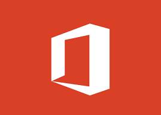
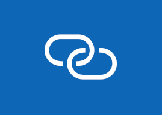
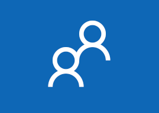

# What's new in Microsoft Store for Business and Education

Microsoft Store for Business and Education regularly releases new and improved features.  

## Latest updates for Store for Business and Education

**January &amp; February, 2018**

|  |  |
|--------------------------------------|---------------------------------|
|  |**One place for apps, software, and subscriptions**   The new **Products &amp; services** page in Microsoft Store for Business and Education gives customers a single place to manage all products and services. This includes Apps, Software, and Subscriptions that your organization acquired or manages through Microsoft Store for Business. This change centralizes these products, but the platform changes also improve overall performance.   **Applies to**:  Microsoft Store for Business   Microsoft Store for Education |
|  |**Create collections of apps in your private store**   Use **collections** to customize your private store. Collections allow you to create groups of apps that are commonly used in your organization or school -- you might create a collection for a Finance department, or a 6th-grade class.  [Get more info](https://docs.microsoft.com/microsoft-store/manage-private-store-settings#private-store-collections)  **Applies to**:  Microsoft Store for Business   Microsoft Store for Education |
|   |**Upgrade Office 365 trial subscription**   Customers with Office 365 trials can now transition their trial to a paid subscription in Microsoft Store for Business. This works for trials you acquired from Microsoft Store for Business, or Office Admin Portal.   **Applies to**:  Microsoft Store for Business   Microsoft Store for Education |
|   |**Supporting Microsoft Product and Services Agreement customers**  If you are purchasing under the Microsoft Products and Services Agreement (MPSA), you can use Microsoft Store for Business. Here you will find access to Products & Services purchased, Downloads & Keys, Software Assurance benefits, Order history, and Agreement details. Also, we added the ability to associate your purchasing account to your tenant.   **Applies to**:  Microsoft Store for Business   Microsoft Store for Education |
|   |**Microsoft Product and Services Agreement customers can invite people to take roles**   MPSA admins can invite people to take Microsoft Store for Business roles even if the person is not in their tenant. You provide an email address when you assign the role, and we'll add the account to your tenant and assign the role.   **Applies to**:  Microsoft Store for Business   Microsoft Store for Education |

<!---
We’ve been working on bug fixes and performance improvements to provide you a better experience. Stay tuned for new features!
|  |  |
|-----------------------|---------------------------------|
|  |**Performance improvements in private store**   We've made it significantly faster for you to update the private store. Many changes to the private store are available immediately after you make them.   [Get more info](https://docs.microsoft.com/microsoft-store/manage-private-store-settings#private-store-performance)  **Applies to**:  Microsoft Store for Business   Microsoft Store for Education |
| <iframe width="288" height="232" src="https://www.youtube.com/embed/IpLIZU_j7Z0" frameborder="0" allowfullscreen></iframe>| **Manage Windows device deployment with Windows AutoPilot Deployment**    In Microsoft Store for Business, you can manage devices for your organization and apply an AutoPilot deployment profile to your devices. When people in your organization run the out-of-box experience on the device, the profile configures Windows, based on the AutoPilot deployment profile you applied to the device.  [Get more info](add-profile-to-devices.md)  **Applies to**:  Microsoft Store for Business   Microsoft Store for Education  |
|  |**Request an app**  People in your organization can reqest additional licenses for apps in your private store, and then Admins or Purchasers can make the purchases.   [Get more info](https://docs.microsoft.com/microsoft-store/acquire-apps-microsoft-store-for-business#request-apps)  **Applies to**:  Microsoft Store for Business   Microsoft Store for Education |
||   |**Private store collections**   You can groups of apps in your private store with **Collections**. This can help you organize apps and help people find apps for their job or classroom.   [Get more info](https://review.docs.microsoft.com/microsoft-store/manage-private-store-settings?branch=msfb-14856406#add-a-collection)  **Applies to**:  Microsoft Store for Business   Microsoft Store for Education |
-->

## Previous releases and updates

[December 2017](release-history-microsoft-store-business-education.md#december-2017)
- Bug fixes and permformance improvements

[November 2017](release-history-microsoft-store-business-education.md#november-2017)
- Export list of Minecraft: Education Edition users
- Bug fixes and performance improvements

[October 2017](release-history-microsoft-store-business-education.md#october-2017)
- Bug fixes and permformance improvements 

[September 2017](release-history-microsoft-store-business-education.md#september-2017)
- Manage Windows device deployment with Windows AutoPilot Deployment
- Request an app
- My organization
- Manage prepaid Office 365 subscriptions
- Manage Office 365 subscriptions acquired by partners
- Edge extensions in Microsoft Store
- Search results in Microsoft Store for Business
 
