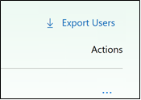

# What's new in Microsoft Store for Business and Education

Microsoft Store for Business and Education regularly releases new and improved feaures.  

## Latest updates for Store for Business and Education

**November 2017**

|  |  |
|-----------------------|---------------------------------|
|  |**Export list of Minecraft: Education Edition users**  Admins and teachers can now export a list of users who have Minecraft: Education Edition licenses assigned to them. Click **Export users**, and Store for Education creates an Excel spreadsheet for you, and saves it as a .csv file.  **Applies to**:  Microsoft Store for Education |

<!---
We’ve been working on bug fixes and performance improvements to provide you a better experience. Stay tuned for new features!
|  |  |
|-----------------------|---------------------------------|
| <iframe width="288" height="232" src="https://www.youtube.com/embed/IpLIZU_j7Z0" frameborder="0" allowfullscreen></iframe>| **Manage Windows device deployment with Windows AutoPilot Deployment**    In Microsoft Store for Business, you can manage devices for your organization and apply an AutoPilot deployment profile to your devices. When people in your organization run the out-of-box experience on the device, the profile configures Windows, based on the AutoPilot deployment profile you applied to the device.  [Get more info](add-profile-to-devices.md)  **Applies to**:  Microsoft Store for Business   Microsoft Store for Education  |
|  |**Request an app**  People in your organization can reqest additional licenses for apps in your private store, and then Admins or Purchasers can make the purchases.   [Get more info](https://docs.microsoft.com/microsoft-store/acquire-apps-microsoft-store-for-business#request-apps)  **Applies to**:  Microsoft Store for Business   Microsoft Store for Education |
||   |**Private store collections**   You can groups of apps in your private store with **Collections**. This can help you organize apps and help people find apps for their job or classroom.   [Get more info](https://review.docs.microsoft.com/microsoft-store/manage-private-store-settings?branch=msfb-14856406#add-a-collection)  **Applies to**:  Microsoft Store for Business   Microsoft Store for Education |
-->

## Previous releases and updates

[October 2017](release-history-microsoft-store-business-education.md#october-2017)
- Bug fixes and permformance improvements. 

[September 2017](release-history-microsoft-store-business-education.md#september-2017)
- Manage Windows device deployment with Windows AutoPilot Deployment
- Request an app
- My organization
- Manage prepaid Office 365 subscriptions
- Manage Office 365 subscriptions acquired by partners
- Edge extensions in Microsoft Store
- Search results in Microsoft Store for Business
 
