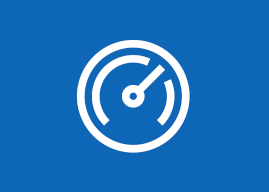
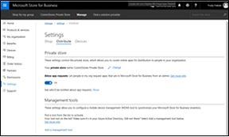

# What's new in Microsoft Store for Business and Education

> [!IMPORTANT]
>
> - The retirement of Microsoft Store for Business and Microsoft Store for Education has been postponed. We will update this notice when a new retirement date is announced. You can continue to use the current capabilities of free apps until that time. For more information about this change, see [Update to Intune integration with the Microsoft Store on Windows](https://techcommunity.microsoft.com/t5/windows-it-pro-blog/update-to-endpoint-manager-integration-with-the-microsoft-store/ba-p/3585077) and [FAQ: Supporting Microsoft Store experiences on managed devices](https://techcommunity.microsoft.com/t5/windows-management/faq-supporting-microsoft-store-experiences-on-managed-devices/m-p/3585286).

## Latest updates for Store for Business and Education

**May 2023**

**Removal of Microsoft Store for Business tab from Microsoft Store app on Windows 10 PCs**

The Microsoft Store for Business tab was removed from the Microsoft Store app on Windows 10. The Microsoft Store for Business tab is still available on HoloLens devices.

Users on Windows 10 PCs can no longer do the following tasks:

- see Line of Business (LOB) products listed in the Microsoft Store for Business tab
- acquire or install [online apps](/mem/configmgr/apps/deploy-use/manage-apps-from-the-windows-store-for-business#online-and-offline-apps)
- assign licenses for existing [online apps](/mem/configmgr/apps/deploy-use/manage-apps-from-the-windows-store-for-business#online-and-offline-apps) using the Store for Business portal or Store for Business app

[Offline app](/mem/configmgr/apps/deploy-use/manage-apps-from-the-windows-store-for-business#online-and-offline-apps) distribution and licensing scenarios aren't impacted by this change.

We recommend that you add your apps through the new Microsoft Store app experience in Intune. If an app isn’t available in the Microsoft Store, you must retrieve an app package from the vendor and install it as an LOB app or Win32 app. For instructions, read the following articles:

- [Add Microsoft Store apps to Microsoft Intune](/mem/intune/apps/store-apps-microsoft)
- [Add a Windows line-of-business app to Microsoft Intune](/mem/intune/apps/lob-apps-windows)
- [Add, assign, and monitor a Win32 app in Microsoft Intune](/mem/intune/apps/apps-win32-add)

Follow the [Intune Customer Success blog](https://aka.ms/IntuneCustomerSuccess) where we will publish more information about this change.

<!---
We've been working on bug fixes and performance improvements to provide you a better experience. Stay tuned for new features!
|  |  |
|-----------------------|---------------------------------|
|  |**Performance improvements in private store**   We've made it significantly faster for you to update the private store. Many changes to the private store are available immediately after you make them.   [Get more info](./manage-private-store-settings.md#private-store-performance)  **Applies to**:  Microsoft Store for Business   Microsoft Store for Education |
| <iframe width="288" height="232" src="https://www.youtube-nocookie.com/embed/IpLIZU_j7Z0" frameborder="0" allowfullscreen></iframe>| **Manage Windows device deployment with Windows Autopilot Deployment**    In Microsoft Store for Business, you can manage devices for your organization and apply an Autopilot deployment profile to your devices. When people in your organization run the out-of-box experience on the device, the profile configures Windows, based on the Autopilot deployment profile you applied to the device.  [Get more info](add-profile-to-devices.md)  **Applies to**:  Microsoft Store for Business   Microsoft Store for Education  |
|  |**Request an app**  People in your organization can request additional licenses for apps in your private store, and then Admins or Purchasers can make the purchases.   [Get more info](./acquire-apps-microsoft-store-for-business.md#request-apps)  **Applies to**:  Microsoft Store for Business   Microsoft Store for Education |
||   |**Private store collections**   You can groups of apps in your private store with **Collections**. This can help you organize apps and help people find apps for their job or classroom.   [Get more info](https://review.learn.microsoft.com/microsoft-store/manage-private-store-settings?branch=msfb-14856406#add-a-collection)  **Applies to**:  Microsoft Store for Business   Microsoft Store for Education |
-->

## Previous releases and updates

[April 2023](release-history-microsoft-store-business-education.md#april-2023)
- Tab removed from Microsoft Store apps on Windows 10 and Windows 11 PCs.

[October 2018](release-history-microsoft-store-business-education.md#october-2018)
- Use security groups with Private store apps

[September 2018](release-history-microsoft-store-business-education.md#september-2018)
- Performance improvements

[August 2018](release-history-microsoft-store-business-education.md#august-2018)
- App requests 

[July 2018](release-history-microsoft-store-business-education.md#july-2018)
- Bug fixes and performance improvements

[June 2018](release-history-microsoft-store-business-education.md#june-2018)
- Change order within private store collection
- Performance improvements in private store

[May 2018](release-history-microsoft-store-business-education.md#may-2018)
- Immersive Reading app available in Microsoft Store for Education

[April 2018](release-history-microsoft-store-business-education.md#april-2018)
- Assign apps to larger groups
- Change collection order in private store
- Office 365 subscription management

[March 2018](release-history-microsoft-store-business-education.md#march-2018)
- Performance improvements in private store
- Private store collection updates
- Manage Skype communication credits
- Upgrade Office 365 trial subscription

[January &amp; February, 2018](release-history-microsoft-store-business-education.md#january-and-february-2018)
- One place for apps, software, and subscriptions
- Create collections of apps in your private store
- Upgrade Office 365 trial subscription
- Supporting Microsoft Product and Services Agreement customers
- Microsoft Product and Services Agreement customers can invite people to take roles

[December 2017](release-history-microsoft-store-business-education.md#december-2017)
- Bug fixes and performance improvements

[November 2017](release-history-microsoft-store-business-education.md#november-2017)
- Export list of Minecraft: Education Edition users
- Bug fixes and performance improvements

[October 2017](release-history-microsoft-store-business-education.md#october-2017)
- Bug fixes and performance improvements 

[September 2017](release-history-microsoft-store-business-education.md#september-2017)
- Manage Windows device deployment with Windows Autopilot Deployment
- Request an app
- My organization
- Manage prepaid Office 365 subscriptions
- Manage Office 365 subscriptions acquired by partners
- Edge extensions in Microsoft Store
- Search results in Microsoft Store for Business
