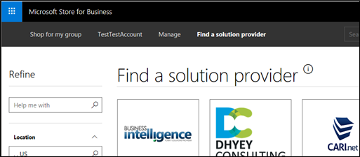
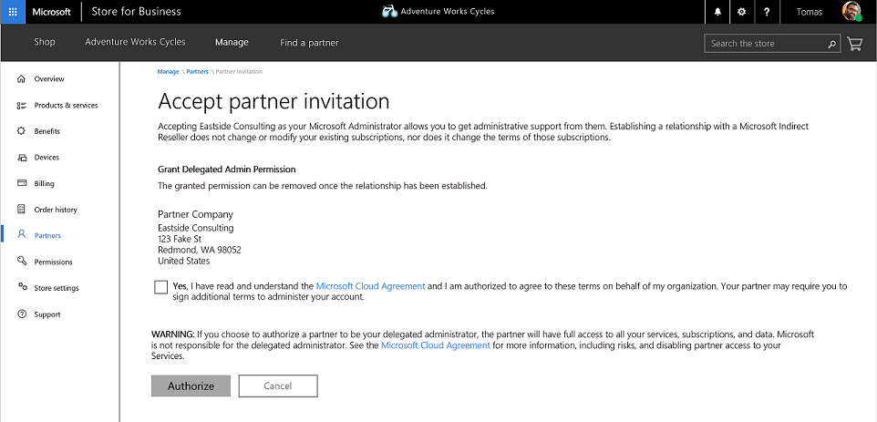

# Working with solution providers in Microsoft Store for Business

You can work with Microsoft-certified solution providers to purchase and manage products and services for your organization or school. There's a few steps involved in getting the things set up. 

The process goes like this:
- Admins find and contact a solution provider using **Find a solution provider** in Microsoft Store for Business. 
- Solution providers send a request from Partner center to customers to become their solution provider.
- Customers accept the invitation in Microsoft Store for Business and start working with the solution provider.
- Customers can manage settings for the relationship with Partner in Microsoft Store for Business. 

## What can a solution provider do for my organization or school?

There are several ways that a solution provider can work with you. Solution providers will choose one of these when they send their request to work as a partner with you.

| Solution provider function | Description | 
| ------ | ------------------- | 
| Reseller | Solution providers sell Microsoft products to your organization or school. |
| Delegated administrator | Solution provider manages products and services for your organization or school. In Azure Active Directory (AD), the Partner will be a Global Administrator for tenant. This allows them to manage services like creating user accounts, assigning and managing licenses, and password resets. |
| Reseller & delegated administrator | Solution providers that sell and manage Microsoft products and services to your organization or school. |
| Partner | You can give your solution provider a user account in your tenant, and they work on your behalf with other Microsoft services. |
| Microsoft Products & Services Agreement (MPSA) partner | If you've worked with multiple solution providers through the MPSA program, you can allow partners to see purchases made by each other. |
| OEM PC partner | Solution providers can upload device IDs for PCs that you're [managing with Autopilot](https://docs.microsoft.com/microsoft-store/add-profile-to-devices).   |
| Line-of-business (LOB) partner | Solution providers can develop, submit, and manage LOB apps specific for your organization or school. |

## Find a solution provider

You can find partner in Microsoft Store for Business and Education. 

1. Sign in to [Microsoft Store for Business](https://businessstore.microsoft.com/) or [Microsoft Store for Education](https://educationstore.microsoft.com/).
2. Select **Find a solution provider**.

    

3. Refine the list, or search for a solution provider. 

    

4. When you find a solution provider you're interested in working with, click **Contact**.
5. Complete and send the form.

The solution provider will get in touch with you. You'll have a chance to learn more about them. If you decide to work with the solution provider, they will send you an email invitation from Partner Center. 

## Work with a solution provider

Once you've found a solution provider and decided to work with them, they'll send you an invitation to work together from Partner Center. In Microsoft Store for Business or Education, you'll need to accept the invitation. After that, you can manage their permissions.

**To accept a solution provider invitation**
1. **Follow email link** - You'll receive an email with a link to accept the solution provider invitation from your solution provider. The link will take you to Microsoft Store for Business or Education.
2. **Accept invitation** - On **Accept Partner Invitation**, select **Authorize** to accept the invitation, accept terms of the Microsoft Cloud Agreement, and start working with the solution provider. 

 
## Delegate admin privileges

Depending on the request made by the solution provider, part of accepting the invitation will include agreeing to give delegated admin privileges to the solution provider. This will happen when the solution provider request includes acting as a delegated administrator. For more information, see [Delegated admin privileges in Azure AD](https://docs.microsoft.com/partner-center/customers_revoke_admin_privileges#delegated-admin-privileges-in-azure-ad). 

If you don't want to delegate admin privileges to the solution provider, you'll need to cancel the invitation instead of accepting it. 

If you delegate admin privileges to a solution provider, you can remove that later. 

**To remove delegate admin privileges**
1. Sign in to [Microsoft Store for Business](https://businessstore.microsoft.com/) or [Microsoft Store for Education](https://educationstore.microsoft.com/).
2. Select **Partner**
3. Choose the Partner you want to manage.
4. Select **Remove Delegated Permissions**. 

The solution provider will still be able to work with you, for example, as a Reseller. 
