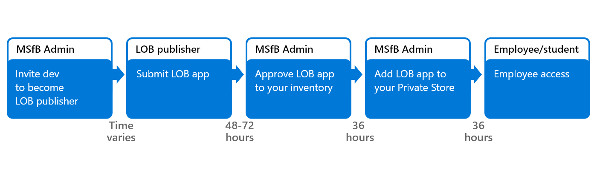

# Working with line-of-business apps

**Applies to**

-   Windows 10
-   Windows 10 Mobile

Your company or school can make line-of-business (LOB) applications available through Microsoft Store for Business or Microsoft Store for Education. These apps are custom to your school or organization – they might be internal apps, or apps specific to your school, business, or industry.

Developers within your organization, or ISVs that you invite, can become LOB publishers and submit apps to Microsoft Store for your company or school. Once an LOB publisher submits an app for your company, the app is only available to your company. LOB publishers submit apps through the Windows Dev Center using the same process as all apps that are in Microsoft Store, and then can be managed or deployed using the same process as any other app that has been acquired through Microsoft Store.

One advantage of making apps available through Microsoft Store for Business is that the app has been signed by Microsoft Store, and uses the standard Microsoft Store policies. For organizations that can’t submit their application through the Windows Dev Center (for example, those needing additional capabilities or due to compliance purposes), [Sideloading](https://go.microsoft.com/fwlink/p/?LinkId=623433) is also supported on Windows 10.

## Adding LOB apps to your private store

Admins and ISVs each own different parts of the process for getting LOB apps created, submitted, and deployed to your employees or students. Admins use Microsoft Store for Business  or Microsoft Store for Education portal; ISVs or devs use the Windows Dev center on MSDN. 

Here’s what’s involved:
-   Microsoft Store for Business admin invites a developer or ISV to become an LOB publisher for your company.
-   LOB publisher develops and submits app to Microsoft Store, tagging the app so it is only available to your company.
-   Microsoft Store for Business admin accepts the app and can distribute the app to employees in your company.

You'll need to set up:
-   Your company needs to be signed up with Microsoft Store for Business or Microsoft Store for Education.
-   LOB publishers need to have an active developer account. To learn more about account options, see [Ready to sign up](https://go.microsoft.com/fwlink/p/?LinkId=623432).
-   LOB publishers need to have an app in Microsoft Store, or have an app ready to submit to the Store.

The process and timing look like this:

## Add an LOB publisher (Admin)
Admins need to invite developer or ISVs to become an LOB publisher.

**To invite a developer to become an LOB publisher**

1. Sign in to [Microsoft Store for Business](https://businessstore.microsoft.com).
2. Click **Manage**, click **Permissions**, and then choose **Line-of-business publishers**.
3. On the Line-of business publishers page, click **Invite** to send an email invitation to a developer.
 
   >[!Note]
   > This needs to be the email address listed in contact info for the developer account.
  
## Submit apps (LOB publisher)

The developer receives an email invite to become an LOB publisher for your company. Once they accept the invite, they can log in to the Windows Dev Center to create an app submission for your company. The info here assumes that devs or ISVs have an active developer account.

After an app is published and available in the Store, ISVs publish an updated version by creating another submission in their dashboard. Creating a new submission allows the ISV to make the changes required to create a LOB app for your company. To learn more about updates to an app submission, see [App submissions](https://go.microsoft.com/fwlink/p/?LinkId=623463) and [Distributing LOB apps to enterprises](https://go.microsoft.com/fwlink/p/?LinkId=627543).

**To create a new submission for an app**

1.  Sign in to the [Windows Dev Center](https://go.microsoft.com/fwlink/p/?LinkId=623486), go to your Dashboard, and click the app you want to make available as an LOB app.
2.  On the App overview page, under **Action**, click **Update**.

    -OR-

    Submit your app following the guidelines in [App submissions](https://go.microsoft.com/fwlink/p/?LinkId=623463). Be sure to completed steps 3 and 4 when you set app pricing and availability options.

3.  On the **Pricing and availability** page, under **Distribution and visibility**, click **Line-of-business (LOB) distribution**, and then choose the enterprise(s) who will get the LOB app. No one else will have access to the app.
4.  Under **Organizational licensing**, click **Show options**.

    Organizational licensing options apply to all apps, not just LOB apps:

    -   **Store-managed (online) volume licensing** - This is required. You must select this item to make your app available as an a LOB app. By default, it will be selected. This won't make the app available to anyone outside of the enterprise(s) that you selected in **Distribution and visibility**.

    -   **Disconnected (offline) licensing** - This is optional for LOB apps.

5.  Click **Save** to save your changes and start the app submission process.

For more information, see [Organizational licensing options]( https://go.microsoft.com/fwlink/p/?LinkId=708615) and [Distributing LOB apps to enterprises](https://go.microsoft.com/fwlink/p/?LinkId=627543). 
 
 >[!Note]
 > In order to get the LOB app, the organization must be located in a [supported market](https://docs.microsoft.com/microsoft-store/microsoft-store-for-business-overview#supported-markets), and you must not have excluded that market when submitting your app.

## Add app to inventory (admin)

After an ISV submits the LOB app for your company or school, someone with Microsoft Store for Business and Education admin permissions needs to accept the app.

**To add the LOB app to your inventory**

1.  Sign in to the [Microsoft Store for Business](https://businessstore.microsoft.com).
2.  Click **Manage**, click **Products & services**, and then choose **New LOB apps**.
3.  Click the ellipses under **Action** for the app you want to add to your inventory, and then choose **Add to inventory**.

After you add the app to your inventory, you can choose how to distribute the app. For more information, see:
-   [Distribute apps to your employees from the Microsoft Store for Business](distribute-apps-to-your-employees-microsoft-store-for-business.md)
-   [Distribute apps from your private store](distribute-apps-from-your-private-store.md)
-   [Assign apps to employees](assign-apps-to-employees.md)
-   [Distribute offline apps](distribute-offline-apps.md)
