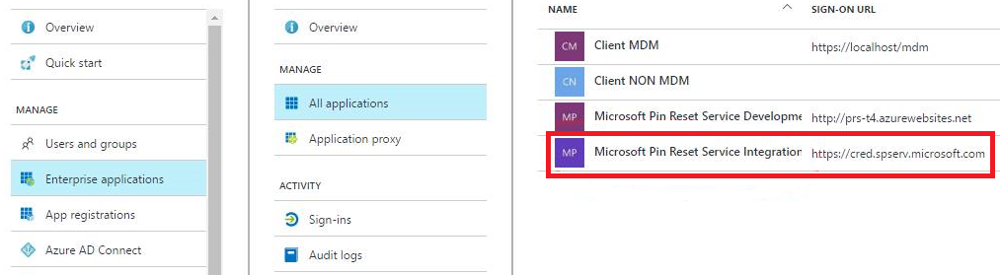

# Windows Hello for Business Features

Consider these additional features you can use after your organization deploys Windows Hello for Business. 

* [Conditional access](#conditional-access)
* [Dynamic lock](#dynamic-lock)
* [PIN reset](#pin-reset)
* [Privileged credentials](#privileged-credentials)
* [Mulitfactor Unlock](#multifactor-unlock)


## Conditional access 

**Requirements:**
* Azure Active Directory  
* Hybrid Windows Hello for Business deployment 


In a mobile-first, cloud-first world, Azure Active Directory enables single sign-on to devices, apps, and services from anywhere. With the proliferation of devices (including BYOD), work off corporate networks, and 3rd party SaaS apps, IT professionals are faced with two opposing goals:+  
* Empower the end users to be productive wherever and whenever
* Protect the corporate assets at any time
 
To improve productivity, Azure Active Directory provides your users with a broad range of options to access your corporate assets. With application access management, Azure Active Directory enables you to ensure that only the right people can access your applications. What if you want to have more control over how the right people are accessing your resources under certain conditions? What if you even have conditions under which you want to block access to certain apps even for the right people? For example, it might be OK for you if the right people are accessing certain apps from a trusted network; however, you might not want them to access these apps from a network you don't trust. You can address these questions using conditional access.

Read [Conditional access in Azure Active Directory](https://docs.microsoft.com/en-us/azure/active-directory/active-directory-conditional-access-azure-portal) to learn more about Conditional Access.  Afterwards, read [Getting started with conditional access in Azure Active Directory](https://docs.microsoft.com/en-us/azure/active-directory/active-directory-conditional-access-azure-portal-get-started) to start deploying Conditional access.


## Dynamic lock

**Requirements:**
* Windows 10, version 1703

Dynamic lock enables you to configure Windows 10 devices to automatically lock when bluetooth paired device signal falls below the maximum Recieved Signal Stregnth Indicator (RSSI) value.  You configure the dynamic lock policy using Group Policy.  You can locate the policy setting at **Computer Configuration\Administrative Templates\Windows Components\Windows Hello for Busines**.  The name of the policy is **Configure dynamic lock factors**.

The Group Policy Editor, when the policy is enabled, creates a default signal rule policy with the following value:

>[!IMPORTANT]
>Microsoft recommends using the default values for this policy settings.  Measurements are relative based on the varying conditions of each environment.  Therefore, the same values may produce different results. Test policy settings in each environment prior to broadly deploying the setting. 

```
<rule schemaVersion="1.0"> 
	<signal type="bluetooth" scenario="Dynamic Lock" classOfDevice="512" rssiMin="-10" rssiMaxDelta="-10"/> 
</rule>
```

For this policy setting, the **type** and **scenario** attribute values are static and cannot change.  The **classofDevice** attribute defaults Phones and uses the values from the following table 

|Description|Value|
|:-------------|:-------:|
|Miscellaneous|0|
|Computer|256|
|Phone|512|
|LAN/Network Access Point|768|
|Audio/Video|1024|
|Peripheral|1280|
|Imaging|1536|
|Wearable|1792|
|Toy|2048|
|Health|2304|
|Uncategorized|7936|

The **rssiMin** attribute value signal strength needed for the device to be considered "in-range".  The default value of **-10** enables a user to move about an average size office or cubicle without triggering Windows to lock the device.  The **rssiMaxDelta** has a default value of **-10**, which instruct Windows 10 to lock the device once the signal strength weakens by more than measurement of 10.  

RSSI measurements are relative and lower as the bluetooth signals between the two paired devices reduces. Therefore a measurement of 0 is stronger than -10, which is stronger than -60, which is an indicator the devices are moving further apart from each other.

## PIN reset

### Hybrid Deployments

**Requirements:**
* Azure Active Directory
* Hybrid Windows Hello for Business deployment
* Modern Management - Microsoft Intune, or compatible mobile device management (MDM)
* Remote reset - Windows 10, version 1703
* Reset above Lock - Windows 10, version 1709
 
The Microsoft PIN reset services enables you to help users who have forgotten their PIN.  Using Microsoft Intune or a compatible MDM, you can configure Windows 10 devices to securely use the Microsoft PIN reset service that enables you to remotely push a PIN reset or enables users to reset their forgotten PIN above the lock screen without requiring reenrollment.

#### Onboarding the Microsoft PIN reset service to your Intune tenant

Before you can remotely reset PINs, you must onboard the Microsoft PIN reset service to your Intune or MDM tenant, and configure devices you manage. Follow these instructions to get that set up:

#### Connect Intune with the PIN reset service

1. Visit [Microsoft PIN Reset Service Integration website](https://login.windows.net/common/oauth2/authorize?response_type=code&client_id=b8456c59-1230-44c7-a4a2-99b085333e84&resource=https%3A%2F%2Fgraph.windows.net&redirect_uri=https%3A%2F%2Fcred.microsoft.com&state=e9191523-6c2f-4f1d-a4f9-c36f26f89df0&prompt=admin_consent), and sign in using the tenant administrator account you use to manage your Intune tenant.
2. After you log in, click **Accept** to give consent for the PIN reset service to access your account.<br>

3. In the Azure portal, you can verify that Intune and the PIN reset service were integrated from the Enterprise applications - All applications blade as shown in the following screenshot:<br>

4. Log in to [this website](https://login.windows.net/common/oauth2/authorize?response_type=code&client_id=9115dd05-fad5-4f9c-acc7-305d08b1b04e&resource=https%3A%2F%2Fcred.microsoft.com%2F&redirect_uri=ms-appx-web%3A%2F%2FMicrosoft.AAD.BrokerPlugin%2F9115dd05-fad5-4f9c-acc7-305d08b1b04e&state=6765f8c5-f4a7-4029-b667-46a6776ad611&prompt=admin_consent) using your Intune tenant admin credentials and, again, choose **Accept** to give consent for the service to access your account.

#### Configure Windows devices to use PIN reset

To configure PIN reset on Windows devices you manage, use an [Intune Windows 10 custom device policy](https://docs.microsoft.com/en-us/intune/custom-settings-windows-10) to enable the feature. Configure the policy using the following Windows policy configuration service provider (CSP):

- **For devices** - **./Device/Vendor/MSFT/PassportForWork/*tenant ID*/Policies/EnablePinRecovery**

*tenant ID* refers to your Azure Active Directory, Directory ID which you can obtain from the **Properties** page of Azure Active Directory.

Set the value for this CSP to **True**.

Read the [Steps to reset the passcode](https://docs.microsoft.com/en-us/intune/device-windows-pin-reset#steps-to-reset-the-passcode) section to removely reset a PIN on an Intune managed device.

### On-premises Deployments

** Requirements**
* Active Directory
* On-premises Windows Hello for Business deployment
* Reset from settings - Windows 10, version 1703
* Reset above Lock - Windows 10, version 1709

On-premises deployments provide users with the ability to reset forgotton PINs either through the settings page or from above the user's lock screen.  Users must know or be provider their password for authentication, must perform a second factor of authentication, and then reprovision Windows Hello for Business.

>[!IMPORTANT]
>Users must have corporate network connectivity to domain controllers and the AD FS server to reset their PINs.

#### Reset PIN from Settings
1. Sign-in to Windows 10, version 1703 or later using an alternate credential.
2. Open **Settings**, click **Accounts**, click **Sign-in options**.
3. Under **PIN**, click **I forgot my PIN** and follow the instructions.

#### Reset PIN above the Lock Screen
 1. On Windows 10, version 1709, click **I forgot my PIN** from the Windows Sign-in
 2. Enter your password and press enter.
 3. Follow the instructions provided by the provisioning process
 4. When finished, unlock your desktop using your newly creeated PIN.

>[!NOTE]
> Visit the [Frequently Asked Questions](https://docs.microsoft.com/en-us/windows/access-protection/hello-for-business/hello-identity-verification#frequently-asked-questions) section of the Windows Hello for Business page and watch the **What happens when the user forgets their PIN?** video.

## Privileged Credentials

**Requirements**
* Hybrid and On-premises Windows Hello for Business deployments
* Domain Joined or Hybird Azure joined devices
* Windows 10, version 1709

The privileged credentials scenario enables administrators to perform elevated, admistrative funcions by enrolling both their non-privileged and privileged credentials on their device.

By design, Windows 10 does not enumerate all Windows Hello for Business users from within a user's session.  Using the computer Group Policy setting, Allow enumeration of emulated smartd card for all users, you can configure a device to all this enumeration on selected devices.  

With this setting, administrative users can sign-in to Windows 10, version 1709 using their non-privileged Windows Hello for Business credentials for normal workflow such as email, but can launch Microsoft Managment Consoles (MMCs), Remote Desktop Services clients, and other applications by selecting **Run as different user** or **Run as administrator**, selecting the privileged user account, and providing their PIN.  Administrators can also take advantage of this feature with command line applications by using **runas.exe** combined with the **/smartcard** argument.  This enables administrators to perform their day-to-day operations without needing to sign-in and out, or use fast user switching when alternativing between privileged and non-privileged workloads.

## Multifactor Unlock

**Requirements:**
* Windows Hello for Business deployment (Hybrid or On-premises)
* Hybird Azure AD joined (Hybrid deployments)
* Domain Joined (on-premises deployments) 
* Windows 10, version 1709
* Bluetooth, Bluetooth capable smartphone - optional

Windows, today, natively only supports the use of a single credential (password, PIN, fingerprint, face, etc.) for unlocking a device. Therefore, if any of those credentials are compromised (shoulder surfed), an attacker could gain access to the system.

Windows 10 offers Multifactor device unlock by extending Windows Hello with trusted signals, administrators can configure Windows 10 to request a combination of factors and trusted signals to unlock their devices. 

Which organizations can take advanage of Multifactor unlock? Those who:
* Have expressed that PINs alone do not meet their security needs.
* Want to prevent Information Workers from sharing credentials.
* Want their orgs to comply with regulatory two-factor authentication policy.
* Want to retain the familiar Windows logon UX and not settle for a custom solution.

>[!IMPORTANT]
>Once the you deploy multifactor unlock policies, users are not be able to unlock their devices if they do not have the required factors. The fall back options are to use passwords or smart cards (both of which could be disabled as needed).
 
You enable multifactor unlock using Group Policy.  The **Configure device unlock factors** policy setting is located under **Computer Configuration\Administrative Templates\Windows Components\Windows Hello for Business**.

The policy setting has three components:
* First unlock factor credential provider
* Second unlock factor credential provider 
* Signal rules for device unlock 

### The Basics: How it works

First unlock factor credential provider and Second unlock credential provider are repsonsible for the bulk of the configuration.  Each of these components contains a globally unqiue identifier (GUID) that represents a different Windows credential provider.  With the policy setting enabled, users unlock the device using at least one credenital provider from each category before Windows allows the user to proceed to their desktop.

The credenital providers included in the default policy settings are:

|Credential Provider| GUID|
|:------------------|:----:|
|PIN | \{D6886603-9D2F-4EB2-B667-1971041FA96B}|  
|Fingerprint | \{BEC09223-B018-416D-A0AC-523971B639F5}|
|Facial Recognition | \{8AF662BF-65A0-4D0A-A540-A338A999D36F}|
|Trusted Signal | \{27FBDB57-B613-4AF2-9D7E-4FA7A66C21AD}|

The default credential providers for the **First unlock factor credential provider** include:
* PIN
* Fingerprint
* Facial Recongition

The default credential providers for the **Second unlock factor credential provider** include:
* Trusted Signal
* PIN

The **Signal rules for device unlock** setting contains the rules the Trusted Signal credential provider uses to satisfy unlocking the device. 

The default signal rules for the policy setting include the proximity of any paired bluetooth smartphone.

To successfully reach their desktop, the user must satisfy one credential provider from each category.  The order in which the user satisfies each credential provider does not matter.  Therefore, using the default policy setting a user can provide:
* PIN and Fingerprint
* PIN and Facial Recognition
* Fingerprint and PIN
* Facial Recognition and Trusted Signal (bluetooth paired smartphone)

>[!IMPORTANT]
> * PIN **must** be in at least one of the groups
> * Trusted signals **must** be combined with another credential provider
> * You cannot use the same unlock factor to satisfy both categories. Therefore, if you include any credential provider in both categories, it means it can be used to satisfy either category, but not both.  


