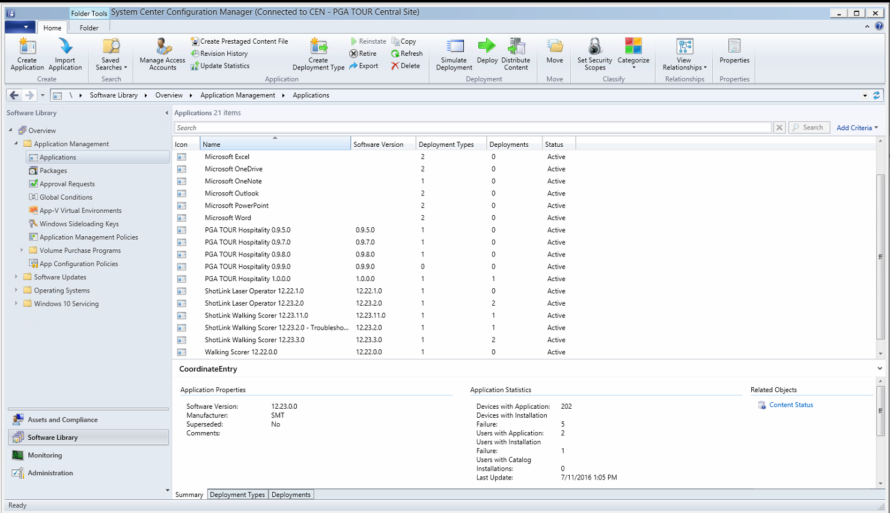
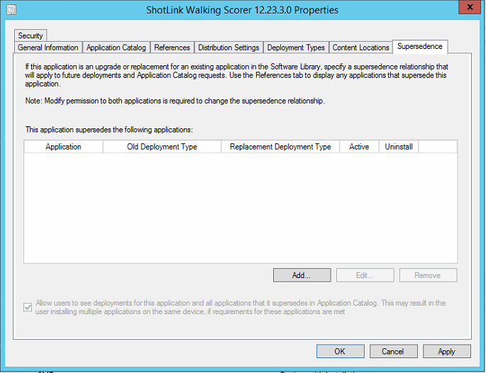
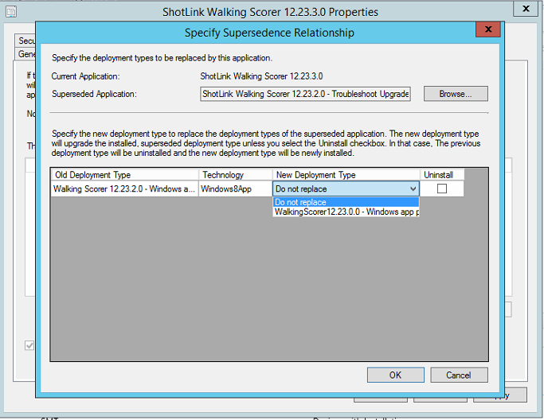
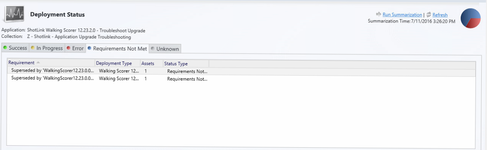

# Deploy application upgrades on Windows 10 Mobile

> Applies to: Windows 10

When you have a new version of an application, how do you get that to the Windows 10 Mobile devices in your environment? With  [application supersedence in System Center Configuration Manager](/sccm/apps/deploy-use/revise-and-supersede-applications#application-supersedence).

There are two steps to deploy an app upgrade:

1. [Define the supersedence](#define-app-supersedence) - this lets Configuration Manager know that the old version should be replaced by the new version.
2. [Deploy the upgrade](#deploy-the-app-upgrade) to your users.

The following steps walk you through the upgrade deployment process - we have an upgraded version of the Walking Scorer app (moving from version 12.23.2.0 to 12.23.3.0). Because we previously used Configuration Manager to deploy the existing version, we'll use it now to upgrade the app. 

Before you can deploy the upgrade, make sure you import the new version of the app and distribute it to your manage.microsoft.com distribution point.

## Define app supersedence

1. In the Configuration Manager console, open the Software Library, and then find the new version of your app.
   

2. Right-click the new version, and then click **Properties**.
3. Click the **Supersedence** tab - there shouldn't be any supersedence rules yet. We'll add one next.
   

4. Click **Add**, browse to the existing (older) version of the app that you're upgrading, and then click **OK**.
5. Under **New Deployment Type** select the new version of the app. (When you imported the new version, it comes in as a new deployment type. If you're upgrading a Universal application, you'll see only one type here.)
   
   > [!IMPORTANT]
   > Do **NOT** select **Uninstall**. This tells Configuration Manager to uninstall the old version, but it does **NOT** then install the new version.

6. Click **OK**.
7. If you have other versions of the same app, repeat steps 4-6 for each version. Click **OK** when you're done.

> [!NOTE]
> Need to remove a supersedence? (Maybe the new version turned out to be flaky and you don't want users to get it yet.) On the **Supersedence** tab for the *new* version of the app, double-click the older version in the list of supersedence rules, and then change the **New Deployment Type** to **Do not replace**.

## Deploy the app upgrade

You're now ready to deploy the upgrade. On the **Home** tab in Configuration Manager, select the new version of the app, and then click **Deploy**, and follow the instructions in the wizard. When asked, set the **Purpose** to **Required**.

You don't need to delete the deployment associated with the older version of the app. The status for that deployment will change to **Requirements not met** in the **Monitoring** view:

If you haven't deployed an app through Configuration Manager before, check out [Deploy applications with System Center Configuration Manager](https://docs.microsoft.com/sccm/apps/deploy-use/deploy-applications). You can also see how to delete deployments (although you don't have to) and notify users about the upgraded app.
