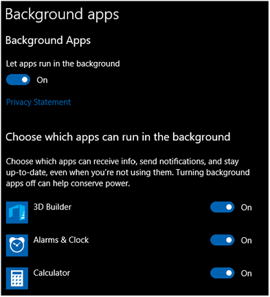
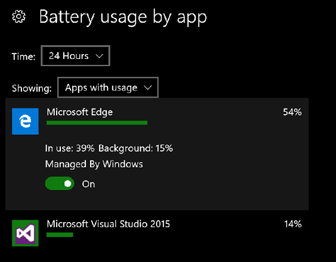
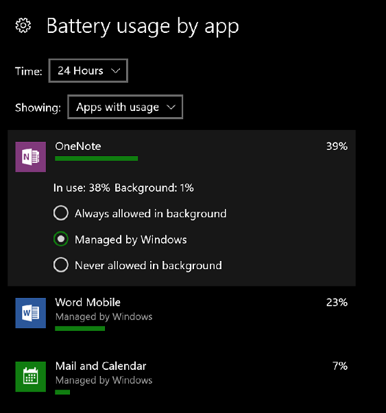

# Remove background task resource restrictions

To provide the best experience for consumers, Windows provides controls that give users the choice of which experiences may run in the background.

By default, resource limits are imposed on applications. Foreground apps are given the most memory and execution time; background apps get less. Users are thus protected from poor foreground app performance and heavy battery drain.

Enterprise users want the same ability to enable or limit background activity. Starting with Windows 10 version 1703, enterprises can now configure settings via policy and provisioning that control background activity.

## Background activity controls

Users have the ability to control background activity for their device through two interfaces in the **Settings** app: the **Background apps** page and the **Battery usage by app** page. The **Background apps** page has a master switch to turn background activity on or off for all apps, and provides individual switches to control each app's ability to run in the background. 

The **Battery usage by app** page allows fine-grained tuning of background activity. Users have the ability to set background activity to by **Managed By Windows**, and turning it on or off for each app. Only devices with a battery have this page available in the **Settings** app. Here's the set of available controls on desktop: 

Here's the set of available controls for mobile devices: 

Although the user interface differs across editions of the operating system, the policy and developer interface is consistent across Windows clients. For more information about these controls, see [Optimize background activity](/windows/uwp/debug-test-perf/optimize-background-activity).

## Enterprise background activity controls 

Starting with Windows 10, version 1703, enterprises can control background activity through mobile device management (MDM) or Group Policy. The user controls discussed above can be controlled with the following policies: 

`./Vendor/Microsoft/Policy/Config/Privacy/LetAppsRunInBackground` 
`./Vendor/Microsoft/Policy/Config/Privacy/LetAppsRunInBackground_ForceAllowTheseApps`
`./Vendor/Microsoft/Policy/Config/Privacy/LetAppsRunInBackground_ForceDenyTheseApps` 
`./Vendor/Microsoft/Policy/Config/Privacy/LetAppsRunInBackground_UserInControlOfTheseApps`

These policies control the background activity battery settings for Universal Windows Platform (UWP) apps. They enable apps to not be managed by the Windows system policies and not be restricted when battery saver is active. Applying these policies to a device will disable the user controls for the applications specified in the policies in the **Settings** app. For more information about these policies, visit [Policy CSP](/windows/client-management/mdm/policy-configuration-service-provider#privacy-letappsruninbackground).

An app can determine which settings are in place for itself by using [BackgroundExecutionManager.RequestAccessAsync](/uwp/api/Windows.ApplicationModel.Background.BackgroundAccessStatus) before any background activity is attempted, and then examining the returned  [BackgroundAccessStatus](/uwp/api/windows.applicationmodel.background.backgroundaccessstatus) enumeration. The values of this enumeration correspond to settings in the **battery usage by App** settings page: 
  
- **AlwaysAllowed**: Corresponds to **Always Allowed in Background** and **Managed By User**. This correspondence enables apps to run as much as possible in the background, including while the device is in battery saver mode.
  
- **AllowedSubjectToSystemPolicy**: This value is the default one. It corresponds to **Managed by Windows**. This correspondence enables apps to run in the background as determined by Windows. If the device is currently in the battery saver state, then background activities don't run. 
  
- **DeniedDueToSystemPolicy**: Corresponds to **Managed by Windows** and indicates that the system has determined that the app can't currently run in the background. 
  
- **DeniedByUser**: Corresponds to **Never Allowed in the Background**. The app can't run in the background. Either the configuration in the settings app, or enterprise policy, has defined that this app isn't allowed to run in the background. 

The Universal Windows Platform ensures that consumers will have great battery life and that foreground apps will perform well. Enterprises have the ability to change settings to enable scenarios specific to their business needs. Administrators can use the **Background apps** policies to enable or disable whether a UWP app can run in the background.

## See also

- [Run in the background indefinitely](/windows/uwp/launch-resume/run-in-the-background-indefinetly)
- [Policy CSP](/windows/client-management/mdm/policy-configuration-service-provider#privacy-letappsruninbackground)
[Optimize background activity](/windows/uwp/debug-test-perf/optimize-background-activity)
