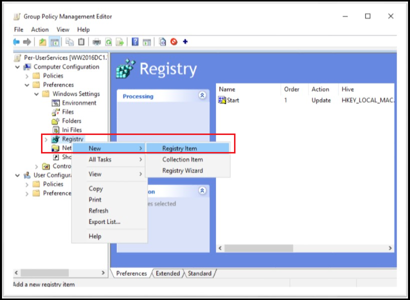
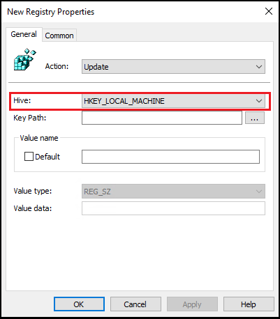
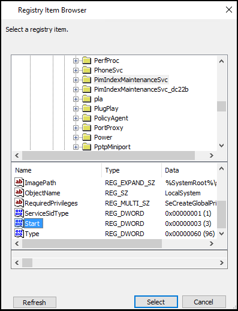
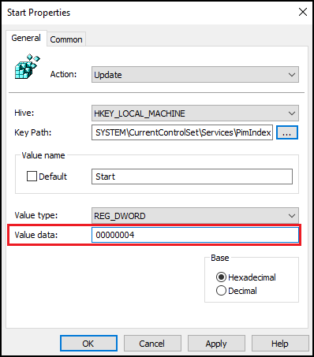
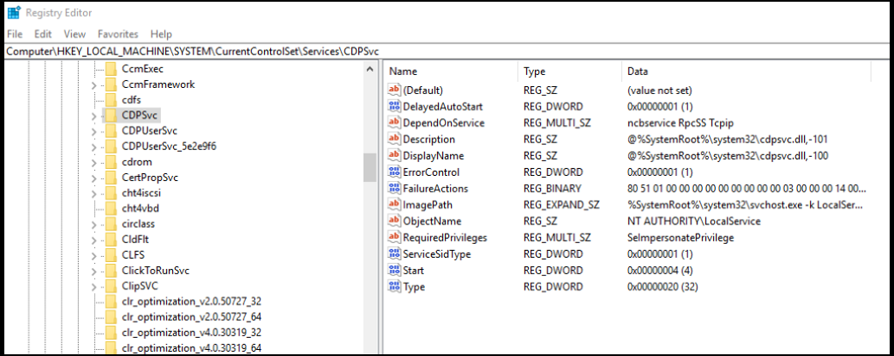
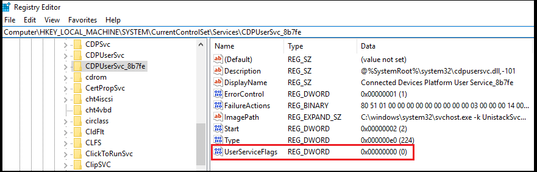
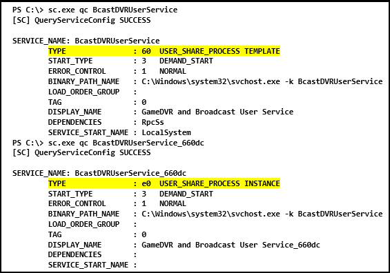

# Per-user services in Windows 10 and Windows Server 

> Applies to: Windows 10, Windows Server

Per-user services are services that are created when a user signs into Windows or Windows Server and are stopped and deleted when that user signs out. These services run in the security context of the user account - this provides better resource management than the previous approach of running these kinds of services in Explorer, associated with a preconfigured account, or as tasks. 

> [!NOTE]
> Per-user services are only in available in Windows Server if you have installed the Desktop Experience. If you are running a Server Core or Nano Server installation, you won't see these services.

You can set the template service's **Startup Type** to **Disabled** to create per-user services in a stopped and disabled state.

> [!IMPORTANT]
> Carefully test any changes to the template service's Startup Type before deploying to a production environment. 

Use the following information to understand per-user services, change the template service Startup Type, and manage per-user services through Group Policy and security templates. 
For more information about disabling system services for Windows Server, see [Guidance on disabling system services on Windows Server with Desktop Experience](https://docs.microsoft.com/windows-server/security/windows-services/security-guidelines-for-disabling-system-services-in-windows-server).

## Per-user services

The following table lists per-user services and when they were added to Windows 10 and Windows Server with the Desktop Experience. The template services are located in the registry at HKEY_LOCAL_MACHINE\SYSTEM\CurrentControlSet\Services.

Before you disable any of these services, review the **Description** column in this table to understand the implications, including dependent apps that will no longer work correctly.

| Windows version | Key name               | Display name                            | Default start type | Dependencies | Description                                                                                                                                                                           |
|-----------------|------------------------|-----------------------------------------|--------------------|--------------|---------------------------------------------------------------------------------------------------------------------------------------------------------------------------------------|
| 1803            | BcastDVRUserService    | GameDVR and Broadcast User Service      | Manual             |              | Used for Game Recordings and Live Broadcasts                                                                                                                                          |
| 1803            | BluetoothUserService   | Bluetooth User Support Service          | Manual             |              | Supports proper functionality of Bluetooth features relevant to each user session                                                                                                     |
| 1803            | CaptureService         | CaptureService                          | Manual             |              | OneCore Capture Service                                                                                                                                                               |
| 1607            | CDPUserSvc             | CDPUserSvc                              | Auto               | - Network Connection Broker</br>- Remote Procedure Call (RPC)</br>- TCP/IP Protocol Driver | Used for Connected Devices Platform scenarios                                                                 |
| 1803            | DevicePickerUserSvc    | DevicePicker                            | Manual             |              | Device Picker                                                                                                                                                                         |
| 1703            | DevicesFlowUserSvc     | DevicesFlow                             | Manual             |              | Device Discovery and Connecting                                                                                                                                                       |
| 1703            | MessagingService       | MessagingService                        | Manual             |              | Service supporting text messaging and related functionality                                                                                                                           |
| 1607            | OneSyncSvc             | Sync Host                               | Auto (delayed)     |              | Synchronizes mail, contacts, calendar, and other user data. Mail and other applications dependent on this service don't work correctly when this service is not running.              |
| 1607            | PimIndexMaintenanceSvc | Contact Data                            | Manual             | UnistoreSvc  | Indexes contact data for fast contact searching. If you stop or disable this service, search results might not display all contacts.                                                  |
| 1709            | PrintWorkflowUserSvc   | PrintWorkflow                           | Manual             |              | Print Workflow                                                                                                                                                                        |
| 1607            | UnistoreSvc            | User Data Storage                       | Manual             |              | Handles storage of structured user data, including contact info, calendars, and messages. If you stop or disable this service, apps that use this data might not work correctly.      |
| 1607            | UserDataSvc            | User Data Access                        | Manual             | UnistoreSvc  | Provides apps access to structured user data, including contact info, calendars, and messages. If you stop or disable this service, apps that use this data might not work correctly. |
| 1607            | WpnUserService         | Windows Push Notifications User Service | Manual             |              | Hosts Windows notification platform, which provides support for local and push notifications. Supported notifications are tile, toast, and raw.                                       |

## Disable per-user services

The template service isn't displayed in the Services console (services.msc) so you need to edit the registry directly, either with Group Policy or a scripted solution, to disable a per-user service.

> [!NOTE]
> Disabling a per-user service simply means that it is created in a stopped and disabled state. When the user signs out, the per-user service is removed.

You can't manage all of the per-user service templates services using normal Group Policy management methods. Because the per-user services aren't displayed in the Services management console, they're also not displayed in the Group Policy Services policy editor UI. 

Additionally, there are four template services that can't be managed with a security template:
- PimIndexMaintenanceSvc
- UnistoreSvc
- UserDataSvc
- WpnUserService

In light of these restrictions, you can use the following methods to manage per-user services template services:

- A combination of a security template and a script or Group Policy preferences registry policy
- Group Policy preferences for all of the services
- A script for all of the services

### Manage template services using a security template

You can manage the CDPUserSvc and OneSyncSvc per-user services with a [security template](/windows/device-security/security-policy-settings/administer-security-policy-settings#bkmk-sectmpl). See [Administer security policy settings](/windows/device-security/security-policy-settings/administer-security-policy-settings) for more information.

For example: 

```
[Unicode]
Unicode=yes
[Version]
signature="$CHICAGO$"
Revision=1
[Service General Setting]
"CDPUserSVC".4,""
```

### Manage template services using Group Policy preferences

If a per-user service can't be disabled using a the security template, you can disable it by using Group Policy preferences.

1. On a Windows Server domain controller or Windows 10 PC that has the [Remote Server Administration Tools (RSAT)](https://www.microsoft.com/en-us/download/details.aspx?id=45520) installed, click **Start**, type GPMC.MSC, and then press **Enter** to open the **Group Policy Management Console**.

2. Create a new Group Policy Object (GPO) or use an existing GPO.  

3. Right-click the GPO and click **Edit** to launch the Group Policy Object Editor.

4. Depending on how you want to target the Group Policy, under **Computer configuration** or **User configuration** browse to Preferences\Windows Settings\Registry.

5. Right-click **Registry** > **New** > **Registry Item**.

    
   
6. Make sure that  HKEY_Local_Machine is selected for Hive and then click ... (the ellipses) next to Key Path.

     
    
7. Browse to **System\CurrentControlSet\Services\PimIndexMaintenanceSvc**. In the list of values, highlight **Start** and click **Select**.

      
   
8. Change **Value data** from **00000003** to **00000004** and click **OK**. Note setting the Value data to **4** = **Disabled**. 

      
   
9. To add the other services that cannot be managed with a Group Policy templates, edit the policy and repeat steps 5-8.  

### Managing Template Services with reg.exe

If you cannot use Group Policy Preferences to manage the per-user services, you can edit the registry with reg.exe. 
To disable the Template Services, change the Startup Type for each service to 4 (disabled). 
For example:

```code
REG.EXE ADD HKLM\System\CurrentControlSet\Services\CDPUserSvc /v Start /t REG_DWORD /d 4 /f
REG.EXE ADD HKLM\System\CurrentControlSet\Services\OneSyncSvc /v Start /t REG_DWORD /d 4 /f
REG.EXE ADD HKLM\System\CurrentControlSet\Services\PimIndexMaintenanceSvc /v Start /t REG_DWORD /d 4 /f
REG.EXE ADD HKLM\System\CurrentControlSet\Services\UnistoreSvc /v Start /t REG_DWORD /d 4 /f
REG.EXE ADD HKLM\System\CurrentControlSet\Services\UserDataSvc /v Start /t REG_DWORD /d 4 /f
REG.EXE ADD HKLM\System\CurrentControlSet\Services\WpnUserService /v Start /t REG_DWORD /d 4 /f
``` 

> [!CAUTION]
> We recommend that you do not directly edit the registry unless there is no other alternative. Modifications to the registry are not validated by the Registry Editor or by the Windows operating system before they are applied. As a result, incorrect values can be stored, and this can result in unrecoverable errors in the system. When possible, instead of editing the registry directly, use Group Policy or other Windows tools such as the Microsoft Management Console (MMC) to accomplish tasks. If you must edit the registry, use extreme caution. 

### Managing Template Services with regedit.exe 

If you cannot use Group Policy preferences to manage the per-user services, you can edit the registry with regedit.exe. To disable the template services, change the Startup Type for each service to 4 (disabled):

 

> [!CAUTION]
> We recommend that you do not directly edit the registry unless there is no other alternative. Modifications to the registry are not validated by the Registry Editor or by the Windows operating system before they are applied. As a result, incorrect values can be stored, and this can result in unrecoverable errors in the system. When possible, instead of editing the registry directly, use Group Policy or other Windows tools such as the Microsoft Management Console (MMC) to accomplish tasks. If you must edit the registry, use extreme caution. 

Beginning with Windows 10, version 1709 and Windows Server, version 1709, you can prevent the per-user service from being created by setting **UserServiceFlags** to 0 under the same service configuration in the registry:



### Manage template services by modifying the Windows image

If you're using custom images to deploy Windows, you can modify the Startup Type for the template services as part of the normal imaging process.

### Use a script to manage per-user services

You can create a script to change the Startup Type for the per-user services. Then use Group Policy or another management solution to deploy the script in your environment.

Sample script using [sc.exe](https://technet.microsoft.com/library/cc990290%28v=ws.11%29.aspx?f=255&MSPPError=-2147217396):

```
sc.exe configure <service name> start= disabled
```
Note that the space after "=" is intentional.

Sample script using the [Set-Service PowerShell cmdlet](https://technet.microsoft.com/library/ee176963.aspx):

```powershell
Set-Service <service name> -StartupType Disabled
```

## View per-user services in the Services console (services.msc)

As mentioned you can't view the template services in the Services console, but you can see the user-specific per-user services - they are displayed using the \<service name>_LUID format (where LUID is the locally unique identifier).

For example, you might see the following per-user services listed in the Services console:

- CPDUserSVC_443f50
- ContactData_443f50
- Sync Host_443f50
- User Data Access_443f50
- User Data Storage_443f50

## View per-user services from the command line

You can query the service configuration from the command line. The **Type** value indicates whether the service is a user-service template or user-service instance.


