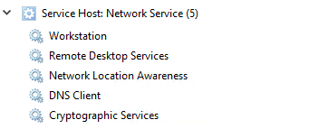
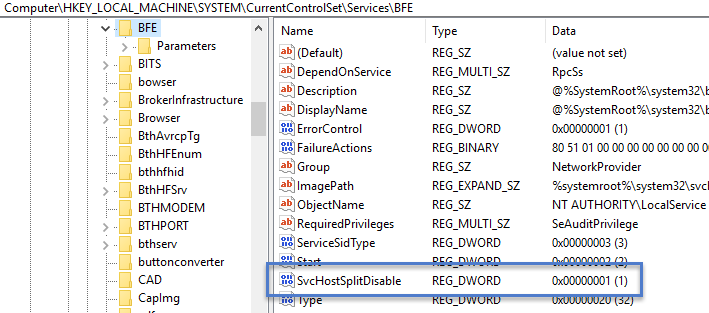
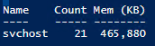
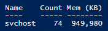

# Changes to Service Host grouping in Windows 10

> Applies to: Windows 10

The **Service Host (svchost.exe)** is a shared-service process that serves as a shell for loading services from DLL files. Services are organized into related host groups, and each group runs inside a different instance of the Service Host process. In this way, a problem in one instance does not affect other instances. Service Host groups are determined by combining the services with matching security requirements. For example:

* Local Service
* Local Service No Network
* Local Service Network Restricted
* Local System
* Local System Network Restricted 
* Network Service

## Separating SvcHost services

Beginning with Windows 10 Creators Update (version 1703), services that were previously grouped will instead be separated - each will run in its own SvcHost process. This change is automatic for systems with **more than 3.5 GB** of RAM running the Client Desktop SKU. On systems with 3.5 GB or less RAM, we'll continue to group services into a shared SvcHost process. 

Benefits of this design change include:

* Increased reliability by insulating critical network services from the failure of another non-network service in the host, and adding the ability to restore networking connectivity seamlessly when networking components crash.
* Reduced support costs by eliminating the troubleshooting overhead associated with isolating misbehaving services in the shared host.
* Increased security by providing additional inter-service isolation 
* Increased scalability by allowing per-service settings and privileges 
* Improved resource management through per-service CPU, I/O and memory management and increase clear diagnostic data (report CPU, I/O and network usage per service).

>**Try This**
>
> To see the refactoring behavior, create a Windows 10 version 1703 VM and configure the memory settings as follows:
> 1. To see grouped processes, set the RAM to 3484 MB or less. Restart the VM and then open Task Manager.
> 2. To see separated processes, set the RAM to 3486 MB or greater. Restart the VM and then open Task Manager.


Refactoring also makes it easier to view running processes in Task Manager. You can look at Task Manager and know exactly which service is using what resources, without having to expand many separate host groups.

For example, here are the running processes displayed in Task Manager in Windows 10 version 1607:

 
  
Compare that to the same view of running processes in Windows 10 version 1703:


  
 


## Exceptions
Some services will continue to be grouped on PCs running with 3.5GB or higher RAM. For example, the Base Filtering Engine (BFE) and the Windows Firewall (Mpssvc) will be grouped together in a single host group, as will the RPC Endpoint Mapper and Remote Procedure Call services.

If you need to identify services that will continue to be grouped, in addition to seeing them in Task Manager and using command line tools, you can look for the *SvcHostSplitDisable* value in their respective service keys under 
HKEY_LOCAL_MACHINE\SYSTEM\CurrentControlSet\Services.

The default value of **1** prevents the service from being split.

For example, this is the registry key configuration for BFE:


## Memory footprint

Be aware that separating services increases the total number of SvcHost instances, which increases memory utilization. (Service grouping provided a modest reduction to the overall resource footprint of the services involved.) 

Consider the following:


|Grouped Services (< 3.5GB) | Split Services (3.5GB+)
|--------------------------------------- | ------------------------------------------ | 
|   |       |

> [!NOTE]
> The above represents the peak observed values.

The total number of service instances and the resulting memory utilization varies depending on activity. Instance counts can typically range from approximately 17-21 for grouped services, and 67-74 for separated services. 

> **Try This**
>
>To determine the impact of splitting hosted services on a Windows 10 version 1703 PC, run the following Windows PowerShell cmdlet, before and after toggling the memory settings:
>
> ```powershell
> Get-Process SvcHost | Group-Object -Property ProcessName | Format-Table Name, Count, @{n='Mem (KB)';e={'{0:N0}' -f (($_.Group|Measure-Object WorkingSet -Sum).Sum / 1KB)};a='right'} -AutoSize
>```
