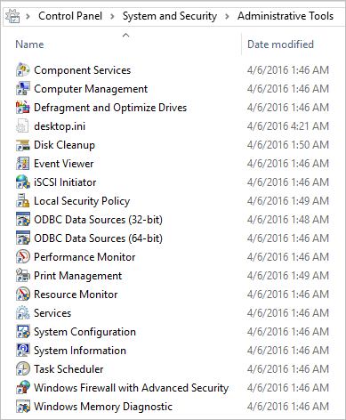

# Administrative Tools in Windows 10

**Applies to**

-   Windows 10

Administrative Tools is a folder in Control Panel that contains tools for system administrators and advanced users. 

The tools in the folder might vary depending on which edition of Windows you are using. 

These tools were included in previous versions of Windows and the associated documentation for each tool should help you use these tools in Windows 10. The following list links to documentation for each tool.

 

-   [Component Services]( https://go.microsoft.com/fwlink/p/?LinkId=708489)
-   [Computer Management](https://support.microsoft.com/kb/308423)
-   [Defragment and Optimize Drives](https://go.microsoft.com/fwlink/p/?LinkId=708488)
-   [Disk Cleanup](https://go.microsoft.com/fwlink/p/?LinkID=698648)
-   [Event Viewer](https://go.microsoft.com/fwlink/p/?LinkId=708491)
-   [iSCSI Initiator](https://go.microsoft.com/fwlink/p/?LinkId=708492)
-   [Local Security Policy](https://go.microsoft.com/fwlink/p/?LinkId=708493)
-   [ODBC Data Sources]( https://go.microsoft.com/fwlink/p/?LinkId=708494)
-   [Performance Monitor](https://go.microsoft.com/fwlink/p/?LinkId=708495)
-   [Print Management](https://go.microsoft.com/fwlink/p/?LinkId=708496)
-   [Resource Monitor](https://go.microsoft.com/fwlink/p/?LinkId=708497)
-   [Services](https://go.microsoft.com/fwlink/p/?LinkId=708498)
-   [System Configuration](https://go.microsoft.com/fwlink/p/?LinkId=708499)
-   [System Information]( https://go.microsoft.com/fwlink/p/?LinkId=708500)
-   [Task Scheduler](https://go.microsoft.com/fwlink/p/?LinkId=708501)
-   [Windows Firewall with Advanced Security](https://go.microsoft.com/fwlink/p/?LinkId=708503)
-   [Windows Memory Diagnostic]( https://go.microsoft.com/fwlink/p/?LinkId=708507)

> [!TIP]  
> If the content that is linked to a tool in the following list doesn't provide the information you need to use that tool, send us a comment by using the **Was this page helpful?** feature on this **Administrative Tools in Windows 10** page. Details about the information you want for a tool will help us plan future content. 

## Related topics

[Diagnostic Data Viewer](https://docs.microsoft.com/windows/privacy/diagnostic-data-viewer-overview)

 

