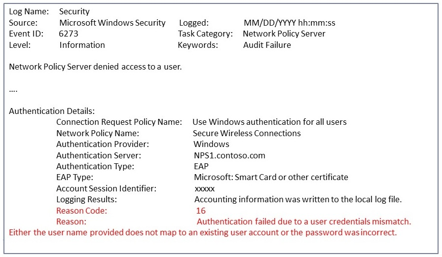
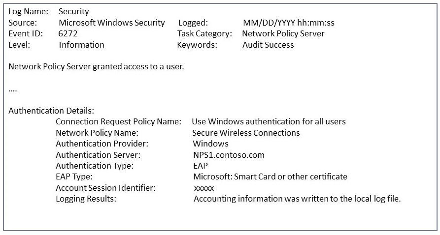
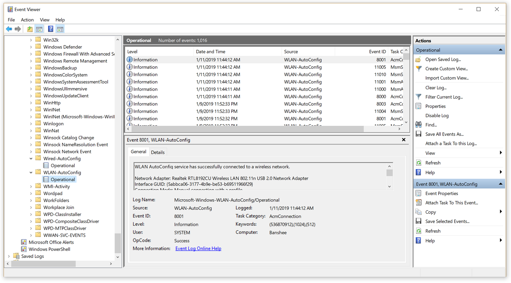
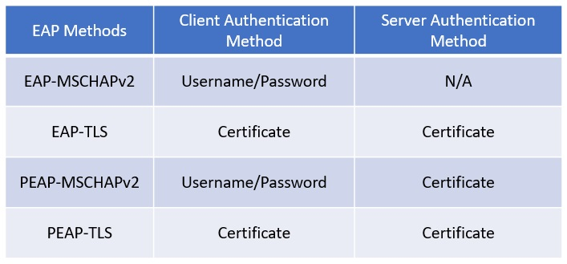
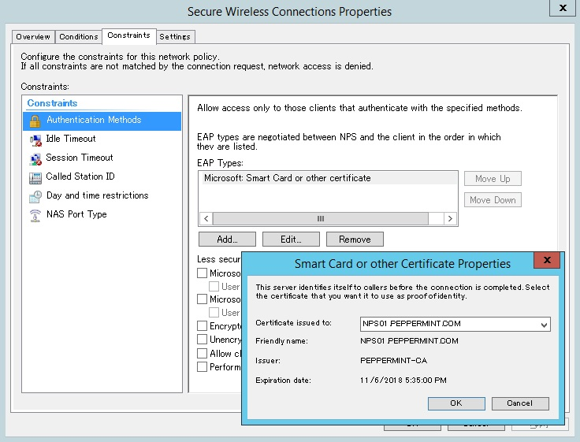
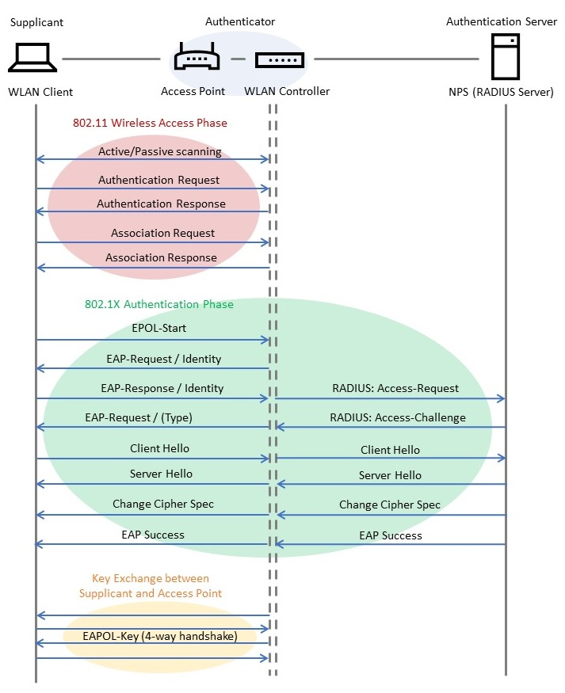
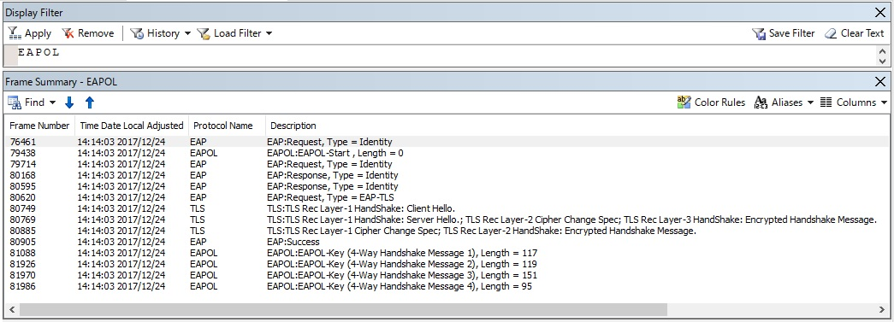
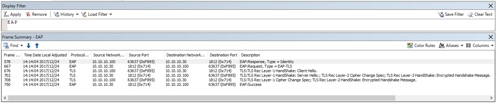
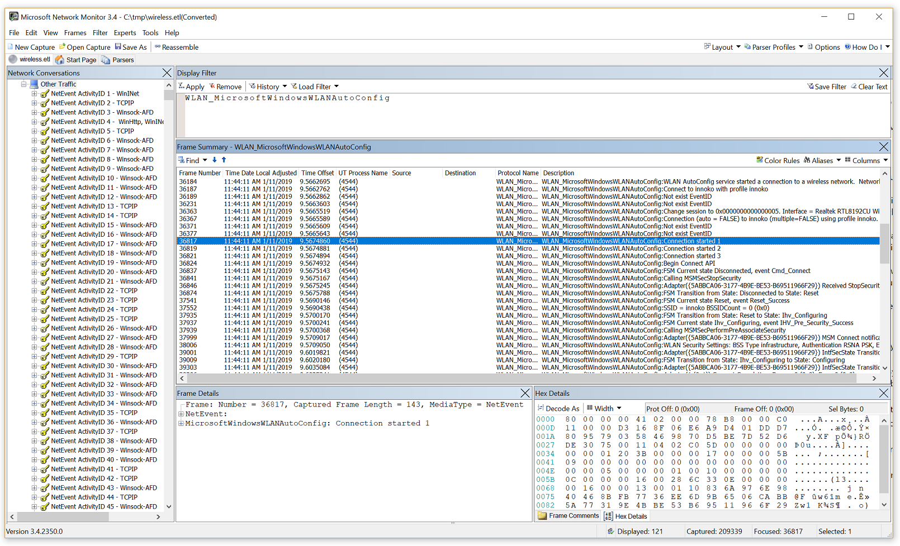

 
# Advanced troubleshooting 802.1X authentication
 
## Overview

This is a general troubleshooting of 802.1X wireless and wired clients. With 802.1X and wireless troubleshooting, it's important to know how the flow of authentication works, and then figuring out where it's breaking. It involves a lot of third party devices and software. Most of the time, we have to identify where the problem is, and another vendor has to fix it. Since we don't make access points or wwitches, it won't be an end-to-end Microsoft solution.
 
## Scenarios

This troubleshooting technique applies to any scenario in which wireless or wired connections with 802.1X authentication is attempted and then fails to establish. The workflow covers Windows 7 - 10 for clients, and Windows Server 2008 R2 - 2012 R2 for NPS.
 
## Known Issues

None
 
## Data Collection

See [Advanced troubleshooting 802.1X authentication data collection](data-collection-for-802-authentication.md).
 
## Troubleshooting

Viewing [NPS authentication status events](https://docs.microsoft.com/previous-versions/windows/it-pro/windows-server-2008-R2-and-2008/cc735320(v%3dws.10)) in the Windows Security [event log](https://docs.microsoft.com/previous-versions/windows/it-pro/windows-server-2008-R2-and-2008/cc722404(v%3dws.11)) is one of the most useful troubleshooting methods to obtain information about failed authentications.

NPS event log entries contain information on the connection attempt, including the name of the connection request policy that matched the connection attempt and the network policy that accepted or rejected the connection attempt. If you are not seeing both success and failure events, see the section below on [NPS audit policy](#audit-policy).

Check Windows Security Event log on the NPS Server for NPS events corresponding to rejected ([event ID 6273](https://docs.microsoft.com/previous-versions/windows/it-pro/windows-server-2008-R2-and-2008/cc735399(v%3dws.10))) or accepted ([event ID 6272](https://docs.microsoft.com/previous-versions/windows/it-pro/windows-server-2008-R2-and-2008/cc735388(v%3dws.10))) connection attempts.
 
In the event message, scroll to the very bottom, and check the [Reason Code](https://docs.microsoft.com/previous-versions/windows/it-pro/windows-server-2008-R2-and-2008/dd197570(v%3dws.10)) field and the text associated with it.
 
   
   *Example: event ID 6273 (Audit Failure)*<br><br>
‎
   
   *Example: event ID 6272 (Audit Success)*<br>

‎The WLAN AutoConfig operational log lists information and error events based on conditions detected by or reported to the WLAN AutoConfig service. The operational log contains information about the wireless network adapter, the properties of the wireless connection profile, the specified network authentication, and, in the event of connectivity problems, the reason for the failure. For wired network access, Wired AutoConfig operational log is equivalent one.

On the client side, navigate to **Event Viewer (Local)\Applications and Services Logs\Microsoft\Windows\WLAN-AutoConfig/Operational** for wireless issues. For wired network access issues, navigate to  **..\Wired-AutoConfig/Operational**. See the following example:


 
Most 802.1X authentication issues are due to problems with the certificate that is used for client or server authentication (e.g. invalid certificate, expiration, chain verification failure, revocation check failure, etc.). 

First, validate the type of EAP method being used:
 


If a certificate is used for its authentication method, check if the certificate is valid. For server (NPS) side, you can confirm what certificate is being used from the EAP property menu:


 
The CAPI2 event log will be useful for troubleshooting certificate-related issues.
This log is not enabled by default. You can enable this log by expanding **Event Viewer (Local)\Applications and Services Logs\Microsoft\Windows\CAPI2**, right-clicking **Operational** and then clicking **Enable Log**.


 
The following article explains how to analyze CAPI2 event logs:
[Troubleshooting PKI Problems on Windows Vista](https://docs.microsoft.com/en-us/previous-versions/windows/it-pro/windows-vista/cc749296%28v=ws.10%29).

When troubleshooting complex 802.1X authentication issues, it is important to understand the 802.1X authentication process. The following figure is an example of wireless connection process with 802.1X authentication:


 
If you [collect a network packet capture](troubleshoot-tcpip-netmon.md) on both the client and the server (NPS) side, you can see a flow like the one below. Type **EAPOL** in the Display Filter in for a client side capture, and **EAP** for an NPS side capture. See the following examples:


*Client-side packet capture data*<br><br>

 
*NPS-side packet capture data*<br>
‎

> [!NOTE]
> If you have a wireless trace, you can also [view ETL files with network monitor](https://docs.microsoft.com/windows/desktop/ndf/using-network-monitor-to-view-etl-files) and apply the **ONEX_MicrosoftWindowsOneX** and **WLAN_MicrosoftWindowsWLANAutoConfig** Network Monitor filters. Follow the instructions under the **Help** menu in Network Monitor to load the reqired [parser](https://blogs.technet.microsoft.com/netmon/2010/06/04/parser-profiles-in-network-monitor-3-4/) if needed. See the example below.

 

## Audit policy

NPS audit policy (event logging) for connection success and failure is enabled by default. If you find that one or both types of logging are disabled, use the following steps to troubleshoot.

View the current audit policy settings by running the following command on the NPS server:
```
auditpol /get /subcategory:"Network Policy Server"
```

If both success and failure events are enabled, the output should be:
<pre>
System audit policy
Category/Subcategory                      Setting
Logon/Logoff
  Network Policy Server                   Success and Failure
</pre>

If it shows ‘No auditing’, you can run this command to enable it:

```
auditpol /set /subcategory:"Network Policy Server" /success:enable /failure:enable
```

Even if audit policy appears to be fully enabled, it sometimes helps to disable and then re-enable this setting. You can also enable Network Policy Server logon/logoff auditing via Group Policy. The success/failure setting can be found under **Computer Configuration -> Policies -> Windows Settings -> Security Settings -> Advanced Audit Policy Configuration -> Audit Policies -> Logon/Logoff -> Audit Network Policy Server**.

## Additional references

[Troubleshooting Windows Vista 802.11 Wireless Connections](https://technet.microsoft.com/library/cc766215%28v=ws.10%29.aspx)<br>
[Troubleshooting Windows Vista Secure 802.3 Wired Connections](https://technet.microsoft.com/library/cc749352%28v=ws.10%29.aspx)

