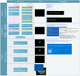

# Advanced troubleshooting for Windows boot problems

> [!NOTE]
> This article is intended for use by support agents and IT professionals. If you're looking for more general information about recovery options, see [Recovery options in Windows 10](https://support.microsoft.com/help/12415).

## Summary

There are several reasons why a Windows-based computer may have problems during startup. To troubleshoot boot problems, first determine in which of the following phases the computer gets stuck:


| **Phase** |   **Boot Process**   |              **BIOS**              |             **UEFI**              |
|-----------|----------------------|------------------------------------|-----------------------------------|
|     1     |       PreBoot        |      MBR/PBR (Bootstrap Code)      |           UEFI Firmware           |
|     2     | Windows Boot Manager |       %SystemDrive%\bootmgr        | \EFI\Microsoft\Boot\bootmgfw.efi  |
|     3     |  Windows OS Loader   | %SystemRoot%\system32\winload.exe  | %SystemRoot%\system32\winload.efi |
|     4     | Windows NT OS Kernel | %SystemRoot%\system32\ntoskrnl.exe |                                   |

**1. PreBoot**

The PC’s firmware initiates a Power-On Self Test (POST) and loads firmware settings. This pre-boot process ends when a valid system disk is detected. Firmware reads the master boot record (MBR), and then starts Windows Boot
Manager.

**2. Windows Boot Manager**

Windows Boot Manager finds and starts the Windows loader (Winload.exe) on the Windows boot partition.

**3. Windows operating system loader**

Essential drivers required to start the Windows kernel are loaded and the kernel starts to run.

**4. Windows NT OS Kernel**

The kernel loads into memory the system registry hive and additional drivers that are marked as BOOT_START.

The kernel passes control to the session manager process (Smss.exe) which initializes the system session, and loads and starts the devices and drivers that are not marked BOOT_START.

Here is a summary of the boot sequence, what will be seen on the display, and typical boot problems at that point in the sequence. Before starting troubleshooting, you have to understand the outline of the boot process and display status to ensure that the issue is properly identified at the beginning of the engagement.

<br>
[Click to enlarge](img-boot-sequence.md)<br>


Each phase has a different approach to troubleshooting. This article provides troubleshooting techniques for problems that occur during the first three phases.

> [!NOTE]
> If the computer repeatedly boots to the recovery options, run the following command at a command prompt to break the cycle:
>
> `Bcdedit /set {default} recoveryenabled no`
>
> If the F8 options don't work, run the following command:
>
> `Bcdedit /set {default} bootmenupolicy legacy`


## BIOS phase

To determine whether the system has passed the BIOS phase, follow these steps:

1. If there are any external peripherals connected to the computer, disconnect them.
2. Check whether the hard disk drive light on the physical computer is working. If it is not working, this indicates that the startup process is stuck at the BIOS phase.
3. Press the NumLock key to see whether the indicator light toggles on and off. If it does not, this indicates that the startup process is stuck at BIOS.

If the system is stuck at the BIOS phase, there may be a hardware problem.

## Boot loader phase

If the screen is completely black except for a blinking cursor, or if you receive one of the following error codes, this indicates that the boot process is stuck in the Boot Loader phase:

-   Boot Configuration Data (BCD) missing or corrupted
-   Boot file or MBR corrupted
-   Operating system Missing
-   Boot sector missing or corrupted
-   Bootmgr missing or corrupted
-   Unable to boot due to system hive missing or corrupted

To troubleshoot this problem, use Windows installation media to start the computer, press Shift+F10 for a command prompt, and then use any of the following methods.


### Method 1: Startup Repair tool

The Startup Repair tool automatically fixes many common problems. The tool also lets you quickly diagnose and repair more complex startup problems. When the computer detects a startup problem, the computer starts the Startup Repair tool. When the tool starts, it performs diagnostics. These diagnostics include analyzing startup log files to determine the cause of the problem. When the Startup Repair tool determines the cause, the tool tries to fix the problem automatically.

To do this, follow these steps.

> [!NOTE]
> For additional methods to start WinRE, see [Windows Recovery Environment (Windows RE)](https://docs.microsoft.com/windows-hardware/manufacture/desktop/windows-recovery-environment--windows-re--technical-reference#span-identrypointsintowinrespanspan-identrypointsintowinrespanspan-identrypointsintowinrespanentry-points-into-winre).

1. Start the system to the installation media for the installed version of Windows.  
    **Note** For more information, see [Create installation media for Windows](https://support.microsoft.com/help/15088).

2. On the **Install Windows** screen, select **Next** > **Repair your computer**.

3. On the **System Recovery Options** screen, select **Next** > **Command Prompt**.

4. After Startup Repair, select **Shutdown**, then turn on your PC to see if Windows can boot properly.

The Startup Repair tool generates a log file to help you understand the startup problems and the repairs that were made. You can find the log file in the following location:

**%windir%\System32\LogFiles\Srt\Srttrail.txt**


For more information see, [A Stop error occurs, or the computer stops responding when you try to start Windows Vista or Windows 7](https://support.microsoft.com/help/925810/a-stop-error-occurs-or-the-computer-stops-responding-when-you-try-to-s)


### Method 2: Repair Boot Codes

To repair boot codes, run the following command:

```dos
BOOTREC /FIXMBR
```

To repair the boot sector, run the following command:

```dos
BOOTREC /FIXBOOT
```

> [!NOTE]
> Running **BOOTREC** together with **Fixmbr** overwrites only the master boot code. If the corruption in the MBR affects the partition table, running **Fixmbr** may not fix the problem.

### Method 3: Fix BCD errors

If you receive BCD-related errors, follow these steps:

1. Scan for all the systems that are installed. To do this, run the following command:
   ```dos
   Bootrec /ScanOS
   ```

2. Restart the computer to check whether the problem is fixed.

3. If the problem is not fixed, run the following command:
    ```dos
    Bootrec /rebuildbcd
    ```

4. You might receive one of the following outputs:

    - Scanning all disks for Windows installations. Please wait, since this may take a while ...
    Successfully scanned Windows installations. Total identified Windows installations: 0
    The operation completed successfully.

    - Scanning all disks for Windows installations. Please wait, since this may take a while ...
    Successfully scanned Windows installations. Total identified Windows installations: 1
    D:\Windows  
    Add installation to boot list? Yes/No/All:

If the output shows **windows installation: 0**, run the following commands:

```dos
bcdedit /export c:\bcdbackup

attrib c:\\boot\\bcd -r –s -h

ren c:\\boot\\bcd bcd.old

bootrec /rebuildbcd
```

After you run the command, you receive the following output:

    Scanning all disks for Windows installations. Please wait, since this may take a while...
    Successfully scanned Windows installations. Total identified Windows installations: 1
    {D}:\Windows
    Add installation to boot list? Yes/No/All: Y

5. Try restarting the system.

### Method 4: Replace Bootmgr

If methods 1 and 2 do not fix the problem, replace the Bootmgr file from drive C to the System Reserved partition. To do this, follow these steps:

1. At a command prompt, change the directory to the System Reserved partition.

2. Run the **attrib** command to unhide the file:
    ```dos
    attrib -r -s -h
    ```

3. Run the same **attrib** command on the Windows (system drive):
    ```dos
    attrib -r -s -h
    ```

4. Rename the Bootmgr file as Bootmgr.old:
    ```dos
    ren c:\bootmgr bootmgr.old
    ```

5. Navigate to the system drive.

6. Copy the Bootmgr file, and then paste it to the System Reserved partition.

7. Restart the computer.

### Method 5: Restore System Hive

If Windows cannot load the system registry hive into memory, you must restore the system hive. To do this, use the Windows Recovery Environment or use Emergency Repair Disk (ERD) to copy the files from the C:\Windows\System32\config\RegBack to C:\Windows\System32\config.

If the problem persists, you may want to restore the system state backup to an alternative location, and then retrieve the registry hives to be replaced.


## Kernel Phase

If the system gets stuck during the kernel phase, you experience multiple symptoms or receive multiple error messages. These include, but are not limited to, the following:

-   A Stop error appears after the splash screen (Windows Logo screen).

-   Specific error code is displayed.
    For example, "0x00000C2" , "0x0000007B" , "inaccessible boot device" and so on.
    (To troubleshoot the 0x0000007B error, see [Error code INACCESSIBLE_BOOT_DEVICE (STOP    0x7B)](https://internal.support.services.microsoft.com/help/4343769/troubleshooting-guide-for-windows-boot-problems#0x7bstoperror))

-   The screen is stuck at the "spinning wheel" (rolling dots) "system busy" icon.

-   A black screen appears after the splash screen.

To troubleshoot these problems, try the following recovery boot options one at a time.

**Scenario 1: Try to start the computer in Safe mode or Last Known Good Configuration**

On the **Advanced Boot Options** screen, try to start the computer in **Safe Mode** or **Safe Mode with Networking**. If either of these options works, use Event Viewer to help identify and diagnose the cause of the boot problem. To view events that are recorded in the event logs, follow these steps:

1.  Use one of the following methods to open Event Viewer:

    -   Click **Start**, point to **Administrative Tools**, and then click
        **Event Viewer**.

    -   Start the Event Viewer snap-in in Microsoft Management Console (MMC).

2.  In the console tree, expand Event Viewer, and then click the log that you
    want to view. For example, click **System log** or **Application log**.

3.  In the details pane, double-click the event that you want to view.

4.  On the **Edit** menu, click **Copy**, open a new document in the program in
    which you want to paste the event (for example, Microsoft Word), and then
    click **Paste**.

5.  Use the Up Arrow or Down Arrow key to view the description of the previous
    or next event.


### Clean boot

To troubleshoot problems that affect services, do a clean boot by using System Configuration (msconfig).
Select **Selective startup** to test the services one at a time to determine which one is causing the problem. If you cannot find the cause, try including system services. However, in most cases, the problematic service is third-party.

Disable any service that you find to be faulty, and try to start the computer again by selecting **Normal startup**.

For detailed instructions, see [How to perform a clean boot in Windows](https://support.microsoft.com/help/929135/how-to-perform-a-clean-boot-in-windows).

If the computer starts in Disable Driver Signature mode, start the computer in Disable Driver Signature Enforcement mode, and then follow the steps that are documented in the following article to determine which drivers or files require driver signature enforcement:
[Troubleshooting boot problem caused by missing driver signature (x64)](https://blogs.technet.microsoft.com/askcore/2012/04/15/troubleshooting-boot-issues-due-to-missing-driver-signature-x64/)

>[!NOTE]
>If the computer is a domain controller, try Directory Services Restore mode (DSRM).
>
>This method is an important step if you encounter Stop error "0xC00002E1" or "0xC00002E2"


**Examples**

>[!WARNING]
>Serious problems might occur if you modify the registry incorrectly by using Registry Editor or by using another method. These problems might require that you reinstall the operating system. Microsoft cannot guarantee that these
problems can be solved. Modify the registry at your own risk.

*Error code INACCESSIBLE_BOOT_DEVICE (STOP 0x7B)*

To troubleshoot this Stop error, follow these steps to filter the drivers:

1.  Go to Window Recovery Environment (WinRE) by putting an ISO disk of the system in the disk drive. The ISO should be of same version of Windows or a later version.

2.  Open the registry.

3.  Load the system hive, and name it as "test."

4.  Under the following registry subkey, check for lower filter and upper filter items for Non-Microsoft Drivers:  
      
    **HKEY_LOCAL_MACHINE\\SYSTEM\\ControlSet001\\Control\\Class**  
    
5.  For each third-party driver that you locate, click the upper or lower filter, and then delete the value data.

6.  Search through the whole registry for similar items. Process as an appropriate, and then unload the registry hive.

7.  Restart the server in Normal mode.

For additional troubleshooting steps, see the following articles:

- [Troubleshooting a Stop 0x7B in Windows](https://blogs.technet.microsoft.com/askcore/2013/08/05/troubleshooting-a-stop-0x7b-in-windows/)  
  
- [Advanced troubleshooting for "Stop error code 0x0000007B (INACCESSIBLE_BOOT_DEVICE)" errors in Windows XP](https://internal.support.services.microsoft.com/help/324103).

To fix problems that occur after you install Windows updates, check for pending updates by using these steps:

1. Open a Command Prompt winodw in WinRE.

2. Run the command:
    ```dos
    dism /image:C:\ /get-packages
    ```

3. If there are any pending updates, uninstall them by running the following commands:
    ```dos
    DISM /image:C:\ /remove-package /packagename: name of the package
    ```
    ```dos
    Dism /Image:C:\ /Cleanup-Image /RevertPendingActions
    ```

Try to start the computer.

If the computer does not start, follow these steps:

1.  Open A Command Prompt window in WinRE, and start a text editor, such as Notepad.

2.  Navigate to the system drive, and search for windows\winsxs\pending.xml.

3.  If the Pending.xml file is found, rename the file as Pending.xml.old.

4.  Open the registry, and then load the component hive in HKEY_LOCAL_MACHINE as a test.

5.  Highlight the loaded test hive, and then search for the **pendingxmlidentifier** value.

6.  If the **pendingxmlidentifier** value exists, delete the value.

7.  Unload the test hive.

8.  Load the system hive, name it as "test".

9.  Navigate to the following subkey:  
      
    **HKEY_LOCAL_MACHINE\\SYSTEM\\ControlSet001\\Services\\TrustedInstaller**  
    
10. Change the **Start** value from **1** to **4**

11. Unload the hive.

12. Try to start the computer.

If the Stop error occurs late in the startup process, or if the Stop error is still being generated, you can capture a memory dump. A good memory dump can help determine the root cause of the Stop error. For details, see the following Knowledge Base article:

- [969028](https://support.microsoft.com/help/969028) How to generate a kernel or a complete memory dump file in Windows Server 2008 and Windows Server 2008 R2

For more information about page file problems in Windows 10 or Windows Server 2016, see the following Knowledge Base article:

- [4133658](https://support.microsoft.com/help/4133658) Introduction of page file in Long-Term Servicing Channel and Semi-Annual Channel of Windows

For more information about Stop errors, see the following Knowledge Base article:

- [3106831](https://support.microsoft.com/help/3106831) Troubleshooting Stop error problems for IT Pros


If the dump file shows an error that is related to a driver (for example, windows\system32\drivers\stcvsm.sys is missing or corrupted), follow these guidelines:

- Check the functionality that is provided by the driver. If the driver is a third-party boot driver, make sure that you understand what it does.

- If the driver is not important and has no dependencies, load the system hive, and then disable the driver.

- If the stop error indicates system file corruption, run the system file checker in offline mode.
    - To do this, open WinRE, open a command prompt, and then run the following command:
        ```dos
        SFC /Scannow /OffBootDir=C:\ /OffWinDir=E:\Windows
        ```
        For more information, see [Using System File Checker (SFC) To Fix  Issues](https://blogs.technet.microsoft.com/askcore/2007/12/18/using-system-file-checker-sfc-to-fix-issues/)

    - If there is disk corruption, run the check disk command:
        ```dos
        chkdsk /f /r
        ```

    - If the Stop error indicates general registry corruption, or if you believe that new drivers or services were installed, follow these steps:

        1. Start WinRE, and open a Command Prompt window.
        2. Start a text editor, such as Notepad.
        3. Navigate to C:\Windows\System32\Config\.
        4. Rename the all five hives by appending ".old" to the name.
        5. Copy all the hives from the Regback folder, paste them in the Config folder, and then try to start the computer in Normal mode.
