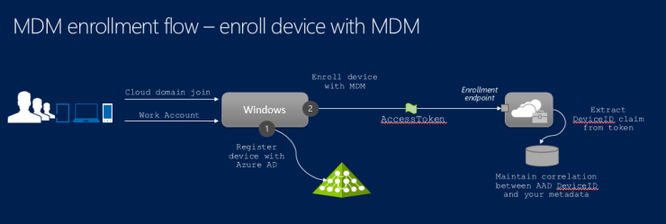

# Azure Active Directory integration with MDM

Azure Active Directory is the world's largest enterprise cloud identity management service. It's used by organizations to access Microsoft 365 and business applications from Microsoft and third-party software as a service (SaaS) vendors. Many of the rich Windows experiences for organizational users (such as store access or OS state roaming) use Azure AD as the underlying identity infrastructure. Windows integrates with Azure AD, allowing devices to be registered in Azure AD and enrolled into MDM in an integrated flow.

Once a device is enrolled in MDM, the MDM:

- Can enforce compliance with organization policies, add or remove apps, and more.
- Can report a device's compliance in Azure AD.
- Azure AD can allow access to organization resources or applications secured by Azure AD to devices that comply with policies.

To support these rich experiences with their MDM product, MDM vendors can integrate with Azure AD.

## Integrated MDM enrollment and UX

There are several ways to connect your devices to Azure AD:

- [Join device to Azure AD](/azure/active-directory/devices/concept-azure-ad-join)
- [Join device to on-premises AD and Azure AD](/azure/active-directory/devices/concept-azure-ad-join-hybrid)
- [Add a Microsoft work account to Windows](/azure/active-directory/devices/concept-azure-ad-register)

In each scenario, Azure AD authenticates the user and the device. It provides a verified unique device identifier that can be used for MDM enrollment. The enrollment flow provides an opportunity for the MDM service to render its own UI, using a web view. MDM vendors should use the UI to render the Terms of Use (TOU), which can be different for company-owned and bring-your-own-device (BYOD) devices. MDM vendors can also use the web view to render more UI elements, such as asking for a one-time PIN.

In Windows 10, the web view during the out-of-the-box scenario is displayed as full-screen by default, providing MDM vendors with the capability to create a seamless edge-to-edge user experience. However, in Windows 11 the web view is rendered within an iframe. It's important that MDM vendors who integrate with Azure AD respect the Windows design guidelines. This step includes using a responsive web design and respecting the Windows accessibility guidelines. For example, include the forward and back buttons that are properly wired to the navigation logic. More details are provided later in this article.

For Azure AD enrollment to work for an Active Directory Federated Services (AD FS) backed Azure AD account, you must enable password authentication for the intranet on the ADFS service. For more information, see [Configure Azure MFA as authentication provider with AD FS](/windows-server/identity/ad-fs/operations/configure-ad-fs-and-azure-mfa).

Once a user has an Azure AD account added to Windows and enrolled in MDM, the enrollment can be managed through **Settings** > **Accounts** > **Access work or school**. Device management of either Azure AD Join for organization scenarios or BYOD scenarios is similar.

> [!NOTE]
> Users can't remove the device enrollment through the **Access work or school** user interface because management is tied to the Azure AD or work account.

### MDM endpoints involved in Azure AD integrated enrollment

Azure AD MDM enrollment is a two-step process:

1. Display the Terms of Use and gather user consent: This consent is a passive flow where the user is redirected in a browser control (webview) to the URL of the Terms of Use of the MDM.
1. Enroll the device: This step is an active flow where Windows OMA DM agent calls the MDM service to enroll the device.

To support Azure AD enrollment, MDM vendors must host and expose a **Terms of Use endpoint** and an **MDM enrollment endpoint**.

- **Terms of Use endpoint**: Use this endpoint to inform users of the ways in which their organization can control their device. The **Terms of Use** page is responsible for collecting user's consent before the actual enrollment phase begins.

    It's important to understand the Terms of Use flow is an "opaque box" to Windows and Azure AD. The whole web view is redirected to the Terms of Use URL. The user should be redirected back after approving or rejecting the Terms. This design allows the MDM vendor to customize their Terms of Use for different scenarios. For example, different levels of control are applied on BYOD vs. organization-owned devices. Or, implement user/group based targeting, like users in certain geographies may have stricter device management policies.

    The Terms of Use endpoint can implement more business logic, such as collecting a one-time PIN provided by IT to control device enrollment. However, MDM vendors must not use the Terms of Use flow to collect user credentials, which can be a degraded user experience. It's not needed, since part of the MDM integration ensures that the MDM service can understand tokens issued by Azure AD.

- **MDM enrollment endpoint**: After the users accept the Terms of Use, the device is registered in Azure AD. Automatic MDM enrollment begins.

    The following diagram illustrates the high-level flow involved in the actual enrollment process. The device is first registered with Azure AD. This process assigns a unique device identifier to the device and presents the device with the ability to authenticate itself with Azure AD (device authentication). Then, the device is enrolled for management with the MDM. This step calls the enrollment endpoint and requests enrollment for the user and device. At this point, the user has been authenticated and device has been registered and authenticated with Azure AD. This information is available to the MDM in the form of claims within an access token presented at the enrollment endpoint.

    [](images/azure-ad-enrollment-flow.png#lightbox)

    The MDM is expected to use this information about the device (Device ID) when reporting device compliance back to Azure AD using the [Microsoft Graph API](/azure/active-directory/develop/active-directory-graph-api). A sample for reporting device compliance is provided later in this article.

## Make MDM a reliable party of Azure AD

To participate in the integrated enrollment flow outlined in the previous section, the MDM must consume access tokens issued by Azure AD. To report compliance with Azure AD, the MDM must authenticate itself to Azure AD and obtain authorization in the form of an access token that allows it to invoke the [Microsoft Graph API](/azure/active-directory/develop/active-directory-graph-api).

### Cloud-based MDM

A cloud-based MDM is a SaaS application that provides device management capabilities in the cloud. It's a multi-tenant application. This application is registered with Azure AD in the home tenant of the MDM vendor. When an IT admin decides to use this MDM solution, an instance of this application is made visible in the tenant of the customer.

The MDM vendor must first register the application in their home tenant and mark it as a multi-tenant application. For more information about how to add multi-tenant applications to Azure AD, see the [Integrate an app that authenticates users and calls Microsoft Graph using the multi-tenant integration pattern (SaaS)](https://go.microsoft.com/fwlink/p/?LinkId=613661) code sample on GitHub.

> [!NOTE]
> For the MDM provider, if you don't have an existing Azure AD tenant with an Azure AD subscription that you manage, follow these step-by-step guides:
>
> - [Quickstart: Create a new tenant in Azure Active Directory](/azure/active-directory/fundamentals/active-directory-access-create-new-tenant) to set up a tenant.
> - [Associate or add an Azure subscription to your Azure Active Directory tenant](/azure/active-directory/fundamentals/active-directory-how-subscriptions-associated-directory) to add a subscription, and manage it via the Azure Portal.

The MDM application uses keys to request access tokens from Azure AD. These keys are managed within the tenant of the MDM provider and not visible to individual customers. The same key is used by the multi-tenant MDM application to authenticate itself with Azure AD, in the customer tenant where the managed device belongs.

> [!NOTE]
> All MDM apps must implement Azure AD V2 tokens before we certify that integration works. Due to changes in the Azure AD app platform, using Azure AD V2 tokens is a hard requirement. For more information, see [Microsoft identity platform access tokens](/azure/active-directory/develop/access-tokens#token-formats).

### On-premises MDM

An on-premises MDM application is different than a cloud MDM. It's a single-tenant application that is present uniquely within the tenant of the customer. Customers must add the application directly within their own tenant. Also, each instance of an on-premises MDM application must be registered separately and have a separate key for authentication with Azure AD.

To add an on-premises MDM application to the tenant, use the Azure AD service, specifically under **Mobility (MDM and MAM)** > **Add application** > **Create your own application**. Administrators can configure the required URLs for enrollment and Terms of Use.

Your on-premises MDM product must expose a configuration experience where administrators can provide the client ID, app ID, and the key configured in their directory for that MDM application. You can use this client ID and key to request tokens from Azure AD when reporting device compliance.

For more information about registering applications with Azure AD, see [Basics of Registering an Application in Azure AD](/previous-versions/azure/dn499820(v=azure.100)).

### Key management and security guidelines

The application keys used by your MDM service are a sensitive resource. They should be protected and rolled over periodically for greater security. Access tokens obtained by your MDM service to call the Microsoft Graph API are bearer tokens and should be protected to avoid unauthorized disclosure.

For security best practices, see [Microsoft Azure Security Essentials](/dotnet/api/system.identitymodel.tokens.jwt.jwtsecuritytokenhandler).

For cloud-based MDM, you can roll over the application keys without requiring a customer interaction. There's a single set of keys across all customer tenants managed by the MDM vendor in their Azure AD tenant.

For the on-premises MDM, the Azure AD authentication keys are within the customer tenant and the customer's administrator must roll over the keys. To improve security, provide guidance to customers about rolling over and protecting the keys.

## Publish your MDM app to Azure AD app gallery

IT administrators use the Azure AD app gallery to add an MDM for their organization to use. The app gallery is a rich store with over 2400 SaaS applications that are integrated with Azure AD.

### Add cloud-based MDM to the app gallery

> [!NOTE]
> You should work with the Azure AD engineering team if your MDM application is cloud-based and needs to be enabled as a multi-tenant MDM application

To publish your application, [submit a request to publish your application in Azure Active Directory application gallery](/azure/active-directory/manage-apps/v2-howto-app-gallery-listing)

The following table shows the required information to create an entry in the Azure AD app gallery.

| Item                | Description                                                                                                                                                                                                    |
|---------------------|----------------------------------------------------------------------------------------------------------------------------------------------------------------------------------------------------------------|
| **Application ID**  | The client ID of your MDM app that is configured within your tenant. This ID is the unique identifier for your multi-tenant app.                                                                               |
| **Publisher**       | A string that identifies the publisher of the app.                                                                                                                                                             |
| **Application URL** | A URL to the landing page of your app where your administrators can get more information about the MDM app and contains a link to the landing page of your app. This URL isn't used for the actual enrollment. |
| **Description**     | A brief description of your MDM app, which must be under 255 characters.                                                                                                                                       |
| **Icons**           | A set of logo icons for the MDM app. Dimensions: 45 X 45, 150 X 122, 214 X 215                                                                                                                                 |

### Add on-premises MDM to the app gallery

There are no special requirements for adding on-premises MDM to the app gallery. There's a generic entry for administrators to add an app to their tenant.

However, key management is different for on-premises MDM. You must obtain the client ID (app ID) and key assigned to the MDM app within the customer's tenant. The ID and key obtain authorization to access the Microsoft Graph API and  report device compliance.

## Themes

The pages rendered by the MDM in the integrated enrollment process must use Windows templates ([Download the Windows templates and CSS files (1.1.4)](https://download.microsoft.com/download/0/7/0/0702afe3-dc1e-48f6-943e-886a4876f6ca/MDM-ISV_1.1.4.zip)). These templates are important for enrollment during the Azure AD Join experience in OOBE where all of the pages are edge-to-edge HTML pages. Avoid copying the templates because it is difficult to get the button placement right.

There are three distinct scenarios:

1. MDM enrollment as part of Azure AD Join in Windows OOBE.
1. MDM enrollment as part of Azure AD Join, after Windows OOBE from **Settings**.
1. MDM enrollment as part of adding a Microsoft work account on a personal device (BYOD).

These scenarios support Windows Pro, Enterprise, and Education.

The CSS files provided by Microsoft contain version information and we recommend that you use the latest version. There are separate CSS files for Windows client devices, OOBE, and post-OOBE experiences. [Download the Windows templates and CSS files (1.1.4)](https://download.microsoft.com/download/0/7/0/0702afe3-dc1e-48f6-943e-886a4876f6ca/MDM-ISV_1.1.4.zip).

- For Windows 10, use **oobe-desktop.css**
- For Windows 11, use **oobe-light.css**

### Using themes

An MDM page must adhere to a predefined theme depending on the scenario that is displayed. For example, if the CXH-HOSTHTTP header is FRX, which is the OOBE scenario, then the page must support a dark theme with blue background color, which uses WinJS file Ui-dark.css ver 4.0 and oobe-desktop.css ver 1.0.4.

|CXH-HOST (HTTP HEADER)|Scenario|Background Theme|WinJS|Scenario CSS|
|--- |--- |--- |--- |--- |
|FRX|OOBE|Dark theme + blue background color|Filename: Ui-dark.css|Filename: oobe-dekstop.css|
|MOSET|Settings/Post OOBE|Light theme|Filename: Ui-light.css|Filename: settings-desktop.css|

## Terms of Use protocol semantics

The MDM server hosts the **Terms of Use** endpoint. During the Azure AD Join protocol flow, Windows does a full-page redirect to this endpoint. This redirect enables the MDM to display the terms and conditions that apply. It allows the user to accept or reject the terms associated with enrollment. After the user accepts the terms, the MDM redirects back to Windows for the enrollment process to continue.

### Redirect to the Terms of Use endpoint

This redirect is a full page redirect to the Terms of User endpoint hosted by the MDM. Here's an example URL, `https://fabrikam.contosomdm.com/TermsOfUse`.

The following parameters are passed in the query string:

| Item              | Description                                                                                                                                                                                  |
|-------------------|----------------------------------------------------------------------------------------------------------------------------------------------------------------------------------------------|
| redirect_uri      | After the user accepts or rejects the Terms of Use, the user is redirected to this URL.                                                                                                      |
| client-request-id | A GUID that is used to correlate logs for diagnostic and debugging purposes. Use this parameter to log or trace the state of the enrollment request to help find the root cause of failures. |
| api-version       | Specifies the version of the protocol requested by the client. This value provides a mechanism to support version revisions of the protocol.                                                 |
| mode              | Specifies that the device is organization owned when mode=azureadjoin. This parameter isn't present for BYOD devices.                                                                        |

### Access token

Azure AD issues a bearer access token. The token is passed in the authorization header of the HTTP request. Here's a typical format:

**Authorization: Bearer** CI6MTQxmCF5xgu6yYcmV9ng6vhQfaJYw...

The following claims are expected in the access token passed by Windows to the Terms of Use endpoint:

| Item      | Description                                                                                  |
|-----------|----------------------------------------------------------------------------------------------|
| Object ID | Identifier of the user object corresponding to the authenticated user.                       |
| UPN       | A claim containing the user principal name (UPN) of the authenticated user.                  |
| TID       | A claim representing the tenant ID of the tenant. In the example above, it's Fabrikam.       |
| Resource  | A sanitized URL representing the MDM application. Example: `https://fabrikam.contosomdm.com` |

> [!NOTE]
> There's no device ID claim in the access token because the device may not yet be enrolled at this time.

To retrieve the list of group memberships for the user, you can use the [Microsoft Graph API](/azure/active-directory/develop/active-directory-graph-api).

Here's an example URL:

```http
https://fabrikam.contosomdm.com/TermsOfUse?redirect_uri=ms-appx-web://ContosoMdm/ToUResponse&client-request-id=34be581c-6ebd-49d6-a4e1-150eff4b7213&api-version=1.0
Authorization: Bearer eyJ0eXAiOi
```

The MDM is expected to validate the signature of the access token to ensure it is issued by Azure AD and that the recipient is appropriate.

### Terms of Use content

The MDM may do other more redirects as necessary before displaying the Terms of Use content to the user. The appropriate Terms of Use content should be returned to the caller (Windows) so it can be displayed to the end user in the browser control.

The Terms of Use content should contain the following buttons:

- **Accept** - the user accepts the Terms of Use and proceeds with enrollment.
- **Decline** - the user declines and stops the enrollment process.

The Terms of Use content must be consistent with the theme used for the other pages rendered during this process.

### Terms of Use endpoint processing logic

At this point, the user is on the Terms of Use page shown during the OOBE or from the Setting experiences. The user has the following options on the page:

- **User clicks on the Accept button** - The MDM must redirect to the URI specified by the redirect\_uri parameter in the incoming request. The following query string parameters are expected:
  - **IsAccepted** - This Boolean value is required, and must be set to true.
  - **OpaqueBlob** - Required parameter if the user accepts. The MDM may use this blob to make some information available to the enrollment endpoint. The value persisted here is made available unchanged at the enrollment endpoint. The MDM may use this parameter for correlation purposes.
  - Here's an example redirect - `ms-appx-web://MyApp1/ToUResponse?OpaqueBlob=value&IsAccepted=true`
- **User clicks on the Decline button** - The MDM must redirect to the URI specified in redirect\_uri in the incoming request. The following query string parameters are expected:
  - **IsAccepted** - This Boolean value is required, and must be set to false. This option also applies if the user skipped the Terms of Use.
  - **OpaqueBlob** - This parameter isn't expected to be used. The enrollment is stopped with an error message shown to the user.

Users skip the Terms of Use when they're adding a Microsoft work account to their device. However, they can't skip it during the Azure AD Join process. Don't show the decline button in the Azure AD Join process. The user can't decline the MDM enrollment if configured by the administrator for the Azure AD Join.

We recommend that you send the client-request-id parameters in the query string as part of this redirect response.

### Terms Of Use Error handling

If an error occurs during the terms of use processing, the MDM can return two parameters - an `error` and `error_description` parameter in its redirect request back to Windows. The URL should be encoded, and the contents of the `error_description` should be in English plain text. This text isn't visible to the end-user. So, localization of the `error_description` text isn't a concern.

Here's the URL format:

```console
HTTP/1.1 302
Location:
<redirect_uri>?error=access_denied&error_description=Access%20is%20denied%2E

Example:
HTTP/1.1 302
Location: ms-appx-web://App1/ToUResponse?error=access_denied&error_description=Access%20is%20denied%2E
```

The following table shows the error codes.

| Cause                                                                                            | HTTP status | Error               | Description                 |
|--------------------------------------------------------------------------------------------------|-------------|---------------------|-----------------------------|
| api-version                                                                                      | 302         | invalid_request     | unsupported version         |
| Tenant or user data are missing or other required prerequisites for device enrollment aren't met | 302         | unauthorized_client | unauthorized user or tenant |
| Azure AD token validation failed                                                                 | 302         | unauthorized_client | unauthorized_client         |
| internal service error                                                                           | 302         | server_error        | internal service error      |

## Enrollment protocol with Azure AD

With Azure integrated MDM enrollment, there's no discovery phase and the discovery URL is directly passed down to the system from Azure. The following table shows the comparison between the traditional and Azure enrollments.

|Detail|Traditional MDM enrollment|Azure AD Join (organization-owned device)|Azure AD adds a work account (user-owned device)|
|--- |--- |--- |--- |
|MDM auto-discovery using email address to retrieve MDM discovery URL|Enrollment|Not applicable<br>Discovery URL provisioned in Azure||
|Uses MDM discovery URL|Enrollment<br>Enrollment renewal<br>ROBO|Enrollment<br>Enrollment renewal<br>ROBO|Enrollment<br>Enrollment renewal<br>ROBO|
|Is MDM enrollment required?|Yes|Yes|No<br>User can decline.|
|Authentication type|OnPremise<br>Federated<br>Certificate|Federated|Federated|
|EnrollmentPolicyServiceURL|Optional (all auth)|Optional (all auth)|Optional (all auth)|
|EnrollmentServiceURL|Required (all auth)|Used (all auth)|Used (all auth)|
|EnrollmentServiceURL includes OS Version, OS Platform, and other attributes provided by MDM discovery URL|Highly recommended|Highly recommended|Highly recommended|
|AuthenticationServiceURL used|Used (Federated auth)|Skipped|Skipped|
|BinarySecurityToken|Custom per MDM|Azure AD issued token|Azure AD issued token|
|EnrollmentType|Full|Device|Full|
|Enrolled certificate type|User certificate|Device certificate|User certificate|
|Enrolled certificate store|My/User|My/System|My/User|
|CSR subject name|User Principal Name|Device ID|User Principal Name|
|EnrollmentData Terms of Use binary blob as AdditionalContext for EnrollmentServiceURL|Not supported|Supported|Supported|
|CSPs accessible during enrollment|Windows 10 support: <br/>- DMClient <br/>- CertificateStore <br/>- RootCATrustedCertificates <br/> - ClientCertificateInstall <br/>- EnterpriseModernAppManagement <br/> - PassportForWork <br/> - Policy <br/> - w7 APPLICATION|||

## Management protocol with Azure AD

There are two different MDM enrollment types that integrate with Azure AD, and use Azure AD user and device identities. Depending on the enrollment type, the MDM service may need to manage a single user or multiple users.

- **Multiple user management for Azure AD-joined devices**

  In this scenario, the MDM enrollment applies to every Azure AD user who signs in to the Azure AD joined device - call this enrollment type a device enrollment or a multi-user enrollment. The management server can determine the user identity, determine what policies are targeted for this user, and send corresponding policies to the device. To allow management server to identify current user that is logged on to the device, the OMA DM client uses the Azure AD user tokens. Each management session contains an extra HTTP header that contains an Azure AD user token. This information is provided in the DM package sent to the management server. However, in some circumstances Azure AD user token isn't sent over to the management server. One such scenario happens immediately after MDM enrollments completes during Azure AD join process. Until Azure AD join process is finished and Azure AD user signs on to the machine, Azure AD user token isn't available to OMA-DM process. Typically, MDM enrollment completes before Azure AD user sign in to machine and the initial management session doesn't contain an Azure AD user token. The management server should check if the token is missing and only send device policies in such case. Another possible reason for a missing Azure AD token in the OMA-DM payload is when a guest is logged on to the device.

- **Adding a work account and MDM enrollment to a device**:

  In this scenario, the MDM enrollment applies to a single user who initially added their work account and enrolled the device. In this enrollment type, the management server can ignore Azure AD tokens that may be sent over during management session. Whether Azure AD token is present or missing, the management server sends both user and device policies to the device.

- **Evaluating Azure AD user tokens**:

  The Azure AD token is in the HTTP Authorization header in the following format:

  ```console
  Authorization:Bearer <Azure AD User Token Inserted here>
  ```

  More claims may be present in the Azure AD token, such as:

  - User - user currently logged in
  - Device compliance - value set the MDM service into Azure
  - Device ID - identifies the device that is checking in
  - Tenant ID

  Access tokens issued by Azure AD are JSON web tokens (JWTs). Windows presents a valid JWT token to the MDM enrollment endpoint to start the enrollment process. There are a couple of options to evaluate the tokens:

  - Use the JWT Token Handler extension for WIF to validate the contents of the access token and extract claims required for use. For more information, see [JwtSecurityTokenHandler Class](/dotnet/api/system.identitymodel.tokens.jwt.jwtsecuritytokenhandler).
  - Refer to the Azure AD authentication code samples to get a sample for working with access tokens. For an example, see [NativeClient-DotNet](https://go.microsoft.com/fwlink/p/?LinkId=613667).

## Device Alert 1224 for Azure AD user token

An alert is sent when the DM session starts and there's an Azure AD user logged in. The alert is sent in OMA DM package #1. Here's an example:

```xml
Alert Type: com.microsoft/MDM/AADUserToken

Alert sample:
<SyncBody>
 <Alert>
  <CmdID>1</CmdID>
  <Data>1224</Data>
  <Item>
   <Meta>
    <Type xmlns= "syncml:metinf ">com.microsoft/MDM/AADUserToken</Type>
   </Meta>
   <Data>UserToken inserted here</Data>
  </Item>
 </Alert>
 ... other XML tags ...
</SyncBody>
```

## Determine when a user is logged in through polling

An alert is sent to the MDM server in DM package \#1.

- Alert type - `com.microsoft/MDM/LoginStatus`
- Alert format - `chr`
- Alert data - provide sign-in status information for the current active logged in user.
  - Signed-in user who has an Azure AD account - predefined text: user.
  - Signed-in user without an Azure AD account- predefined text: others.
  - No active user - predefined text:none

Here's an example.

```xml
<SyncBody>
 <Alert>
  <CmdID>1</CmdID>
  <Data>1224</Data>
  <Item>
   <Meta>
    <Type xmlns= "syncml:metinf ">com.microsoft/MDM/LoginStatus</Type>
   </Meta>
   <Data>user</Data>
  </Item>
 </Alert>
 ... other XML tags ...
</SyncBody>
```

## Report device compliance to Azure AD

Once a device is enrolled with the MDM for management, organization policies configured by the IT administrator are enforced on the device. MDM evaluates the device compliance with configured policies and then reports it to Azure AD. This section covers the Graph API call you can use to report a device compliance status to Azure AD.

For a sample that illustrates how an MDM can obtain an access token using OAuth 2.0 client\_credentials grant type, see [Daemon\_CertificateCredential-DotNet](https://go.microsoft.com/fwlink/p/?LinkId=613822).

- **Cloud-based MDM** - If your product is a cloud-based multi-tenant MDM service, you have a single key configured for your service within your tenant. To obtain authorization, use this key to authenticate the MDM service with Azure AD.
- **On-premises MDM** - If your product is an on-premises MDM, customers must configure your product with the key used to authenticate with Azure AD. This key configuration is because each on-premises instance of your MDM product has a different tenant-specific key. So, you may need to expose a configuration experience in your MDM product that enables administrators to specify the key to be used to authenticate with Azure AD.

### Use Microsoft Graph API

The following sample REST API call illustrates how an MDM can use the Microsoft Graph API to report compliance status of a managed device.

> [!NOTE]
> This API is only applicable for approved MDM apps on Windows devices.

```console
Sample Graph API Request:

PATCH https://graph.windows.net/contoso.com/devices/db7ab579-3759-4492-a03f-655ca7f52ae1?api-version=beta HTTP/1.1
Authorization: Bearer eyJ0eXAiO.........
Accept: application/json
Content-Type: application/json
{  "isManaged":true,
   "isCompliant":true
}
```

Where:

- **contoso.com** - This value is the name of the Azure AD tenant to whose directory the device has been joined.
- **db7ab579-3759-4492-a03f-655ca7f52ae1** - This value is the device identifier for the device whose compliance information is being reported to Azure AD.
- **eyJ0eXAiO**......... - This value is the bearer access token issued by Azure AD to the MDM that authorizes the MDM to call the Microsoft Graph API. The access token is placed in the HTTP authorization header of the request.
- **isManaged** and **isCompliant** - These Boolean attributes indicates compliance status.
- **api-version** - Use this parameter to specify which version of the graph API is being requested.

Response:

- Success - HTTP 204 with No Content.
- Failure/Error - HTTP 404 Not Found. This error may be returned if the specified device or tenant can't be found.

## Data loss during unenrollment from Azure Active Directory Join

When a user is enrolled into MDM through Azure Active Directory Join and then disconnects the enrollment, there's no warning that the user will lose Windows Information Protection (WIP) data. The disconnection message doesn't indicate the loss of WIP data.


## Error codes

[!INCLUDE [Enrollment error codes](includes/mdm-enrollment-error-codes.md)]
