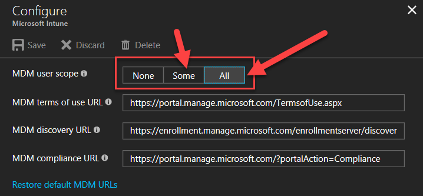

# Automatic MDM enrollment in the Intune admin center

Windows devices can be enrolled in to Intune automatically when they join or register with Microsoft Entra ID. Automatic enrollment can be configured in Azure portal.

1. Go to your Microsoft Entra admin center.
1. Select **Mobility (MDM and MAM)**, and find the Microsoft Intune app.
1. Select **Microsoft Intune** and configure the enrollment options. You can specify settings to allow **All** users to enroll a device, or choose to allow **Some** users (and specify a group).

   

1. Select **Save** to configure MDM autoenrollment for Microsoft Entra joined devices and bring-your-own-device scenarios.
