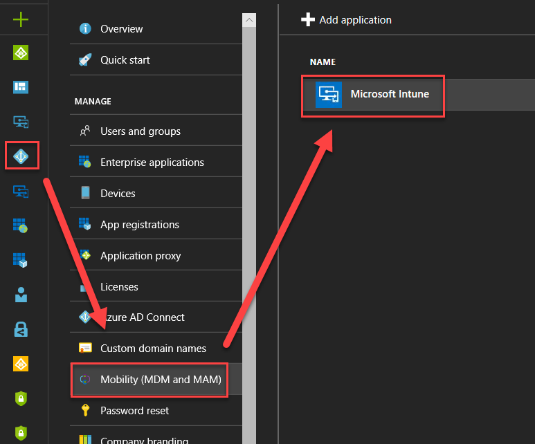

# Azure AD and Microsoft Intune: Automatic MDM enrollment in the Endpoint Manager admin center

Microsoft Intune can be accessed directly using its own admin center. For more information, go to:

- [Tutorial: Walkthrough Intune in Microsoft Endpoint Manager admin center](/mem/intune/fundamentals/tutorial-walkthrough-endpoint-manager)
- Sign in to the [Microsoft Endpoint Manager admin center](https://go.microsoft.com/fwlink/?linkid=2109431).

If you use the Azure portal, then you can access Intune using the following steps:

1. Go to your Azure AD Blade.
2. Select **Mobility (MDM and MAM)**, and find the Microsoft Intune app.
3. Select **Microsoft Intune** and configure the blade. 

 

Configure the blade                                                                      

 

You can specify settings to allow all users to enroll a device and make it Intune ready, or choose to allow some users (and then add a group of users). 
