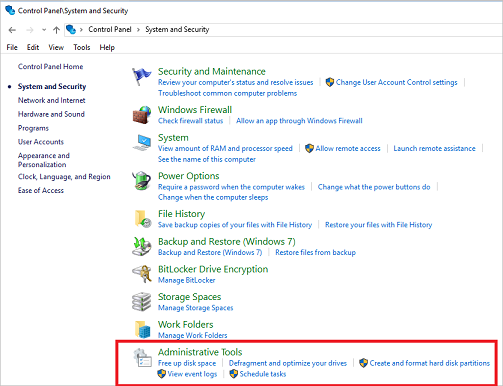

# Windows Tools

::: zone pivot="windows-11"

**Windows Tools** is a folder in the Windows 11 Control Panel. This folder contains tools for system administrators and advanced users.

::: zone-end

::: zone pivot="windows-10"

**Administrative Tools** is a folder in the Windows 10 Control Panel. This folder contains tools for system administrators and advanced users.

::: zone-end

::: zone pivot="windows-11"

## Windows Tools folder

The following graphic shows the **Windows Tools** folder in Windows 11:

:::image type="content" source="images/win11-control-panel-windows-tools.png" alt-text="Screenshot of the Control Panel in Windows 11, highlighting the Administrative Tools folder." lightbox="images/win11-control-panel-windows-tools.png":::

The tools in the folder might vary depending on which edition of Windows you use.

:::image type="content" source="images/win11-windows-tools.png" alt-text="Screenshot of the contents of the Windows Tools folder in Windows 11." lightbox="images/win11-windows-tools.png":::

::: zone-end

::: zone pivot="windows-10"

## Administrative Tools folder

The following graphic shows the **Administrative Tools** folder in Windows 10:

The tools in the folder might vary depending on which edition of Windows you use.

::: zone-end

## Related articles

[Diagnostic data viewer](/windows/privacy/diagnostic-data-viewer-overview)
