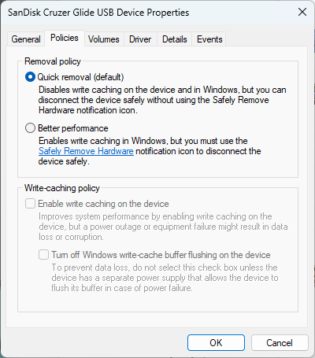

# Manage default media removal policy

Windows defines two main policies, **Quick removal** and **Better performance**, that control how the system interacts with external storage devices such as USB thumb drives or Thunderbolt-enabled external drives. Beginning in Windows 10 version 1809, the default policy is **Quick removal**. In earlier versions of Windows, the default policy was **Better performance**.

You can change the policy setting for each external device, and the policy that you set remains in effect if you disconnect the device and then connect it again to the same computer port.

## More information

You can use the storage device policy setting to change the manner in which Windows manages storage devices to better meet your needs. The policy settings have the following effects:

- **Quick removal**: This policy manages storage operations in a manner that keeps the device ready to remove at any time. You can remove the device without using the Safely Remove Hardware process. However, to do this, Windows can't cache disk write operations. This can degrade system performance.
- **Better performance**: This policy manages storage operations in a manner that improves system performance. When this policy is in effect, Windows can cache write operations to the external device. However, you must use the Safely Remove Hardware process to remove the external drive. The Safely Remove Hardware process protects the integrity of data on the device by making sure that all cached operations finish.

> [!IMPORTANT]
> If you use the **Better performance** policy, you must use the Safely Remove Hardware process to remove the device. If you remove or disconnect the device without following the safe removal instructions, you risk losing data.

> [!NOTE]
> If you select **Better performance**, we recommend that you also select **Enable write caching on the device**.

To change the policy for an external storage device:

1. Connect the device to the computer.
1. Right-click **Start**, then select **File Explorer**.
1. In File Explorer, identify the letter or label that is associated with the device (for example, **USB Drive (D:)**).
1. Right-click **Start**, then select **Disk Management**.
1. In the lower section of the Disk Management window, right-click the label of the device, and then select **Properties**.

   

1. Select **Policies**.

   > [!NOTE]
   > Some recent versions of Windows may use a different arrangement of tabs in the disk properties dialog box.
   >
   > If you do not see the **Policies** tab, select **Hardware**, select the removable drive from the **All disk drives** list, and then select **Properties**. The **Policies** tab should now be available.

1. Select the policy that you want to use.

   
