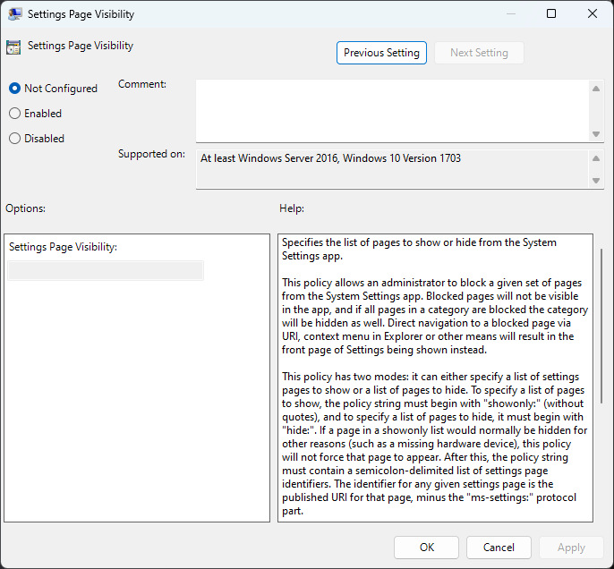

# Manage the Settings app with Group Policy

You can manage the pages that are shown in the Settings app by using Group Policy. When you use Group Policy to manage pages, you can hide specific pages from users.

> [!NOTE]
> To make use of the Settings App group policies on Windows server 2016, install fix [4457127](https://support.microsoft.com/help/4457127/windows-10-update-kb4457127) or a later cumulative update. Each server that you want to manage access to the Settings App must be patched.

If your organization uses the [Central Store](/troubleshoot/windows-client/group-policy/create-and-manage-central-store) for Group Policy management, to manage the policies, copy the ControlPanel.admx and ControlPanel.adml file to PolicyDefinitions folder.

This policy is available for both User and Computer configurations.

- **Computer Configuration** > **Administrative Templates** > **Control Panel** > **Settings Page Visibility**.
- **User Configuration** > **Administrative Templates** > **Control Panel** > **Settings Page Visibility**.

## Configuring the Group Policy

The Group Policy can be configured in one of two ways: specify a list of pages that are shown or specify a list of pages to hide. To do this, add either **ShowOnly:** or **Hide:** followed by a semicolon-delimited list of URIs in **Settings Page Visibility**. For a full list of URIs, see the URI scheme reference section in [Launch the Windows Settings app](/windows/uwp/launch-resume/launch-settings-app#ms-settings-uri-scheme-reference).

> [!IMPORTANT]
> When you specify the URI in the Settings Page Visibility textbox, don't include **ms-settings:** in the string.

For example:

- To show only the Ethernet and Proxy pages, set the **Settings App Visibility** textbox to **ShowOnly:Network-Proxy;Network-Ethernet**.
- To hide the Ethernet and Proxy pages, set the **Settings App Visibility** textbox to **Hide:Network-Proxy;Network-Ethernet**.
