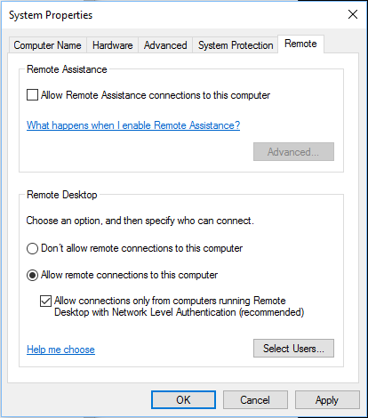

# Connect to remote Azure Active Directory-joined PC

**Applies to**

-   Windows 10

From its release, Windows 10 has supported remote connections to PCs that are joined to Active Directory. Starting in Windows 10, version 1607, you can also connect to a remote PC that is [joined to Azure Active Directory (Azure AD)](https://docs.microsoft.com/azure/active-directory/user-help/device-management-azuread-joined-devices-setup).

>[!TIP]
>Starting in Windows 10, version 1809, you can [use biometrics to authenticate to a remote desktop session.](https://docs.microsoft.com/windows/whats-new/whats-new-windows-10-version-1809#remote-desktop-with-biometrics)

## Set up

- Both PCs (local and remote) must be running Windows 10, version 1607 (or later). Remote connection to an Azure AD-joined PC that is running earlier versions of Windows 10 is not supported.
- Ensure [Remote Credential Guard](/windows/access-protection/remote-credential-guard), a new feature in Windows 10, version 1607, is turned off on the client PC that you are using to connect to the remote PC.
- On the PC that you want to connect to:
  1. Open system properties for the remote PC. 
  2. Enable **Allow remote connections to this computer** and select **Allow connections only from computers running Remote Desktop with Network Level Authentication**. 

   

  3. If the user who joined the PC to Azure AD is the only one who is going to connect remotely, no additional configuration is needed. To allow additional users to connect to the PC, you must allow remote connections for the local **Authenticated Users** group. Click **Select Users**. 
  >[!NOTE]
  >You can specify individual Azure AD accounts for remote connections by having the user sign in to the remote device at least once and then running the following PowerShell cmdlet:
  >
  >`net localgroup "Remote Desktop Users" /add "AzureAD\the-UPN-attribute-of-your-user"`, where *FirstnameLastname* is the name of the user profile in C:\Users\, which is created based on DisplayName attribute in Azure AD.
  >
  >In Windows 10, version 1709, the user does not have to sign in to the remote device first.
  >
  >In Windows 10, version 1709, you can add other Azure AD users to the **Administrators** group on a device in **Settings** and restrict remote credentials to **Administrators**. If there is a problem connecting remotely, make sure that both devices are joined to Azure AD and that TPM is functioning properly on both devices.

  4. Enter **Authenticated Users**, then click **Check Names**. If the **Name Not Found** window opens, click **Locations** and select this PC.

  >[!TIP]
  >When you connect to the remote PC, enter your account name in this format: `AzureAD UPN`. The local PC must either be domain-joined or Azure AD-joined. The local PC and remote PC must be in the same Azure AD tenant.

 
## Supported configurations
 
In organizations that have integrated Active Directory and Azure AD, you can connect from a domain-joined PC to an Azure AD-joined PC using:

- Password
- Smartcards
- Windows Hello for Business, if the domain is managed by System Center Configuration Manager

In organizations that have integrated Active Directory and Azure AD, you can connect from an Azure AD-joined PC to an AD-joined PC when the Azure AD-joined PC is on the corporate network using:

- Password
- Smartcards
- Windows Hello for Business, if the organization has a mobile device management (MDM) subscription. 

In organizations that have integrated Active Directory and Azure AD, you can connect from an Azure AD-joined PC to another Azure AD-joined PC using:

- Password
- Smartcards
- Windows Hello for Business, with or without an MDM subscription. 

 
In organizations using only Azure AD, you can connect from an Azure AD-joined PC to another Azure AD-joined PC using:

- Password
- Windows Hello for Business, with or without an MDM subscription. 

## Related topics

[How to use Remote Desktop](https://support.microsoft.com/instantanswers/ff521c86-2803-4bc0-a5da-7df445788eb9/how-to-use-remote-desktop)

 

 

