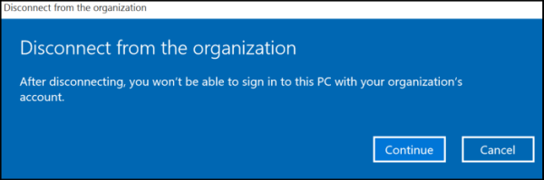

# Disconnecting from the management infrastructure (unenrollment)

The Disconnecting process is done either locally by the user who uses a phone or remotely by the IT administrator using management server. The user-initiated disconnection process is similar to the initial connection, wherein its initiation is from the same location in the Setting Control Panel as creating the workplace account.
The users choose to disconnect for any number of reasons, such as leaving the company or getting a new device or not needing access to their LOB apps on the old device anymore. When an IT administrator initiates a disconnection, the enrollment client performs the disconnection during the next regular maintenance session. Administrators choose to disconnect users' device after they've left the company or because the device is regularly failing to comply with the organization's security settings policy.

During disconnection, the client executes the following tasks:

- Removes the enterprise application token that allowed installing and running LOB apps. Any business applications associated with this enterprise token are removed as well.
- Removes certificates that are configured by MDM server.
- Ceases enforcement of the settings policies applied by the management infrastructure.
- Removes the device management client configuration and other setting configuration added by MDM server, including the scheduled maintenance task. The client remains dormant unless the user reconnects it to the management infrastructure.
- Reports successfully initiated disassociation to the management infrastructure if the admin initiated the process. In Windows, a user-initiated disassociation is reported to the server as a best effort.

## User-initiated disconnection

In Windows, after the user confirms the account deletion command and before the account is deleted, the MDM client will notify to the MDM server that the account will be removed. This notification is a best-effort action as no retry is built in to ensure the notification is successfully sent to the device.

This action utilizes the OMA DM generic alert 1226 function to send a user an MDM unenrollment user alert to the MDM server after the device accepts the user unenrollment request, but before it deletes any enterprise data. The server should set the expectation that unenrollment can succeed or fail, and the server can check whether the device is unenrolled by either checking whether the device calls back at scheduled time or by sending a push notification to the device to see whether it responds back. If the server plans to send a push notification, it should allow for some delay to give the device the time to complete the unenrollment work.

> [!NOTE]
> The user unenrollment is an OMA DM standard. For more information about the 1226 generic alert, see the OMA Device Management Protocol specification (OMA-TS-DM\_Protocol-V1\_2\_1-20080617-A), available from the [OMA website](https://www.openmobilealliance.org/release/DM/V1_1_2-20031209-A/).

The vendor uses the Type attribute to specify what type of generic alert it is. For device initiated MDM unenrollment, the alert type is **com.microsoft:mdm.unenrollment.userrequest**.

After the user elects to unenroll, any active MDM OMA DM sessions are terminated. After that, the DMClient starts a DM session, including a user unenroll generic alert in the first package that it sends to the server.

The following sample shows an OMA DM first package that contains a generic alert message. For more information on WP OMA DM support, see the [OMA DM protocol support](oma-dm-protocol-support.md) article.

```xml
<SyncML xmlns=&#39;SYNCML:SYNCML1.2&#39;>
   <SyncHdr>
      <VerDTD>1.2</VerDTD>
      <VerProto>DM/1.2</VerProto>
      <SessionID>1</SessionID>
      <MsgID>1</MsgID>
      <Target>
         <LocURI>{unique device ID}</LocURI>
      </Target>
      <Source>
         <LocURI>https://www.thephone-company.com/mgmt-server</LocURI>
      </Source>
   </SyncHdr>
   <SyncBody>
      <Alert>
    <CmdID>2</CmdID>
        <Data>1226</Data> <!-- generic alert -->
        <Item>
          <Meta>
             <Type xmlns="syncml:metinfo"> com.microsoft:mdm.unenrollment.userrequest</Type>
          <Format xmlns= "syncml:metinfo">int</Format>
           </Meta>
        <Data>1</Data>
         </Item>
       </Alert>

<!-- other device information -->
      <Replace>
         <CmdID>2</CmdID>
         <Item>
            <Source>
               <LocURI>./DevInfo/DevID</LocURI>
            </Source>
         <Data>{unique device ID}</Data>
         </Item>
         <Item>
        ...
         </Item>
      </Replace>
      <Final/>
   </SyncBody>
</SyncML>
```

After the previous package is sent, the unenrollment process begins.

## Server-initiated disconnection

When the server initiates disconnection, all undergoing sessions for the enrollment ID are aborted immediately to avoid deadlocks. The server doesn't get a response for the unenrollment, instead a generic alert notification is sent with `messageid=1`.

```xml
<Alert>
      <CmdID>4</CmdID>
      <Data>1226</Data>
      <Item>
        <Meta>
          <Type xmlns="syncml:metinf">com.microsoft:mdm.unenrollment.userrequest</Type>
         <Format xmlns="syncml:metinf">int</Format>
        </Meta>
        <Data>1</Data>
      </Item>
</Alert>
```

## Unenrollment from Work Access settings page

If the user is enrolled into MDM using a Microsoft Entra ID (Microsoft Entra join or by adding a Microsoft work account), the MDM account shows up under the Work Access page. However, the **Disconnect** button is greyed out and not accessible. Users can remove that MDM account by removing the Microsoft Entra association to the device.

You can only use the Work Access page to unenroll under the following conditions:

- Enrollment was done using bulk enrollment.
- Enrollment was created using the Work Access page.

## Unenrollment from Microsoft Entra join

When a user is enrolled into MDM through Microsoft Entra join and later, the enrollment disconnects, there's no warning that the user will lose Windows Information Protection (WIP) data. The disconnection message doesn't indicate the loss of WIP data.



During the process in which a device is enrolled into MDM through Microsoft Entra join and then remotely unenrolled, the device can get into a state where it must be reimaged. When devices are remotely unenrolled from MDM, the Microsoft Entra association is also removed. This safeguard is in place to avoid leaving the corporate devices in unmanaged state.

Before remotely unenrolling corporate devices, you must ensure that there is at least one admin user on the device that isn't part of Microsoft Entra ID, otherwise the device won't have any admin user after the operation.

In mobile devices, remote unenrollment for Microsoft Entra joined devices fails. To remove corporate content from these devices, we recommend you remotely wipe the device.

## IT admin-requested disconnection

The server requests an enterprise management disconnection by issuing an Exec OMA DM SyncML XML command to the device, using the DMClient configuration service provider's Unenroll node during the next client-initiated DM session. The Data tag inside the Exec command should be the value of the provisioned DM server ProviderID. For more information, see the Enterprise-specific DMClient configuration article.

When the disconnection is completed, the user is notified that the device has been disconnected from enterprise management.
