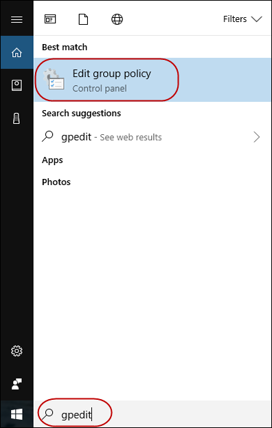
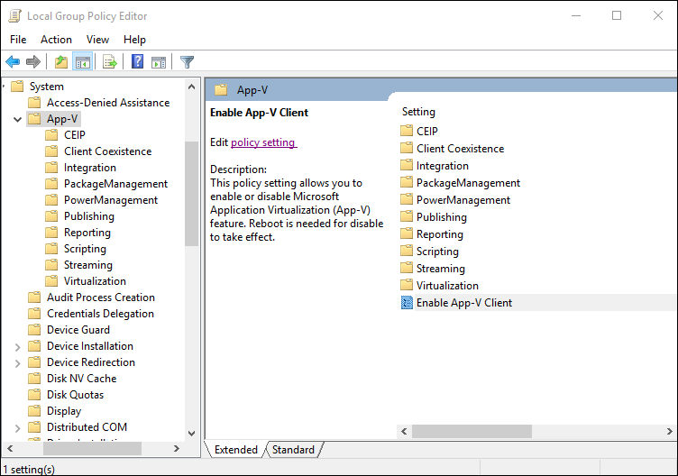
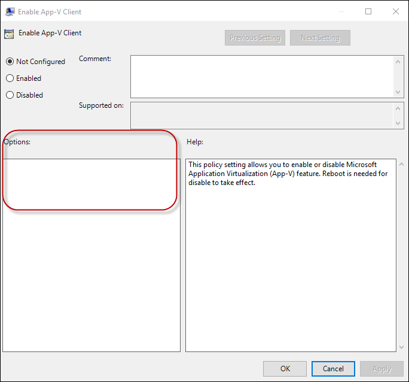
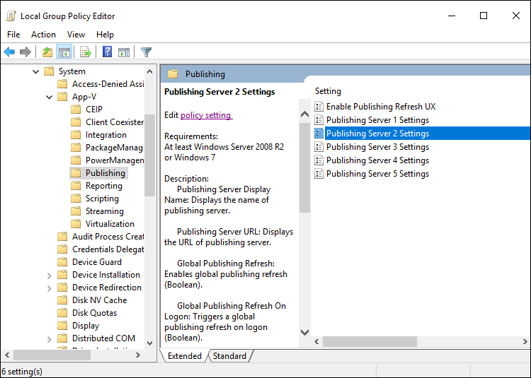
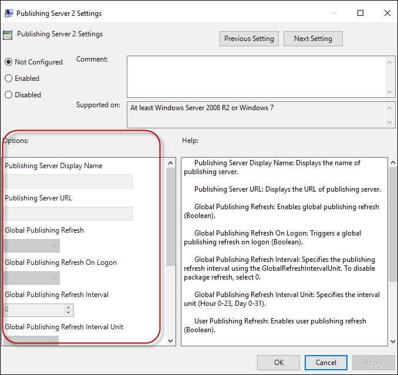
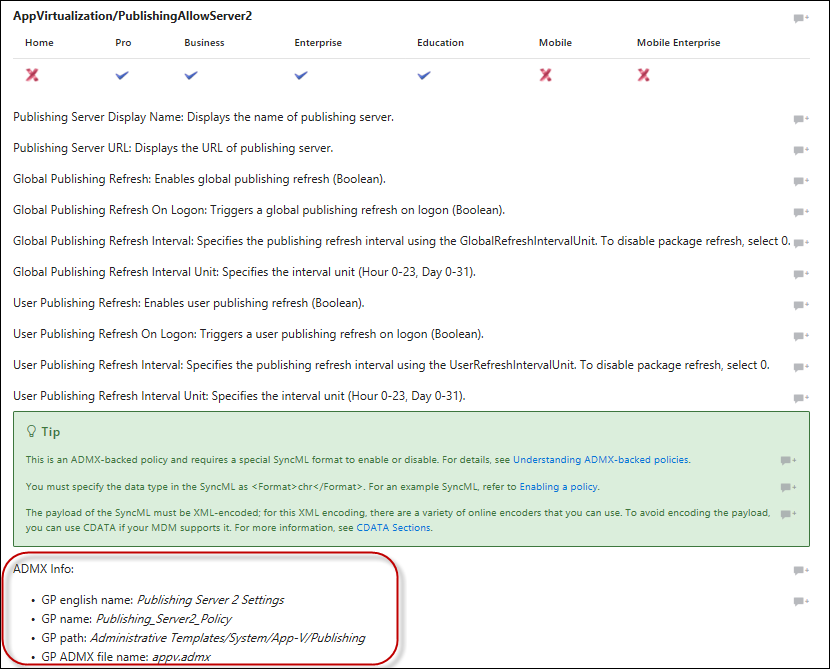

# Enable ADMX policies in MDM

Starting in Windows 10, Mobile Device Management (MDM) policy configuration support was expanded to allow access of [selected set of Group Policy administrative templates (ADMX policies)](mdm/policies-in-policy-csp-admx-backed.md) for Windows PCs via the [Policy configuration service provider (CSP)](mdm/policy-configuration-service-provider.md). Configuring ADMX policies in Policy CSP is different from the typical way you configure a traditional MDM policy.

Summary of steps to enable a policy:

- Find the policy from the list ADMX policies.
- Find the Group Policy related information from the MDM policy description.
- Use the Group Policy Editor to determine whether there are parameters necessary to enable the policy.
- Create the data payload for the SyncML.

See [Support Tip: Ingesting Office ADMX policies using Microsoft Intune](https://techcommunity.microsoft.com/t5/Intune-Customer-Success/Support-Tip-Ingesting-Office-ADMX-Backed-policies-using/ba-p/354824) and [Deploying ADMX policies using Microsoft Intune](/archive/blogs/senthilkumar/intune-deploying-admx-backed-policies-using-microsoft-intune) for a walk-through using Intune.

## Enable a policy

> [!NOTE]
> See [Understanding ADMX policies in Policy CSP](understanding-admx-backed-policies.md).

1. Find the policy from the list [ADMX policies](mdm/policies-in-policy-csp-admx-backed.md). You need the following information listed in the policy description.
    - GP Friendly name
    - GP name
    - GP ADMX file name
    - GP path

1. Use the Group Policy Editor to determine whether you need additional information to enable the policy. Run GPEdit.msc

    1. Select **Start**, then in the text box type **gpedit**.

    2. Under **Best match**, select **Edit group policy** to launch it.

       

    3. In **Local Computer Policy** navigate to the policy you want to configure.

       In this example, navigate to **Administrative Templates >  System > App-V**.

       

    4. Double-click **Enable App-V Client**.

       The **Options** section is empty, which means there are no parameters necessary to enable the policy. If the **Options** section isn't empty, follow the procedure in [Enable a policy that requires parameters](#enable-a-policy-that-requires-parameters)

       

1. Create the SyncML to enable the policy that doesn't require any parameter.

    In this example, you configure **Enable App-V Client** to **Enabled**.

    > [!NOTE]
    > The \<Data> payload must be XML encoded. To avoid encoding, you can use CData if your MDM supports it. For more information, see [CDATA Sections](http://www.w3.org/TR/REC-xml/#sec-cdata-sect). If you are using Intune, select String as the data type.

    ```xml
    <SyncML xmlns="SYNCML:SYNCML1.2">
      <SyncBody>
        <Replace>
          <CmdID>2</CmdID>
          <Item>
            <Meta>
              <Format>chr</Format>
              <Type>text/plain</Type>
            </Meta>
            <Target>
              <LocURI>./Device/Vendor/MSFT/Policy/Config/AppVirtualization/AllowAppVClient </LocURI>
            </Target>
            <Data><Enabled/></Data>
          </Item>
        </Replace>
        <Final/>
      </SyncBody>
    </SyncML>
    ```

## Enable a policy that requires parameters

   1. Create the SyncML to enable the policy that requires parameters.

      In this example, the policy is in **Administrative Templates >  System > App-V > Publishing**.

   1. Double-click **Publishing Server 2 Settings** to see the parameters you need to configure when you enable this policy.

      

      

   1. Find the variable names of the parameters in the ADMX file.

      You can find the ADMX file name in the policy description in Policy CSP. In this example, the filename appv.admx is listed in [AppVirtualization/PublishingAllowServer2](mdm/policy-csp-appvirtualization.md#publishingallowserver2).

      

   1. Navigate to **C:\Windows\PolicyDefinitions** (default location of the ADMX files) and open appv.admx.

   1. Search for GP name **Publishing_Server2_policy**.

   1. Under **policy name="Publishing_Server2_Policy"** you can see the `<elements>` listed. The `text id` and `enum id` represent the `data id` you need to include in the SyncML data payload. They correspond to the fields you see in the Group Policy Editor.

      Here's the snippet from appv.admx:

      ```xml
      <!-- Publishing Server 2  -->
      <policy name="Publishing_Server2_Policy" class="Machine" displayName="$(string.PublishingServer2)"
          explainText="$(string.Publishing_Server_Help)" presentation="$(presentation.Publishing_Server2)"
          key="SOFTWARE\Policies\Microsoft\AppV\Client\Publishing\Servers\2">
      <parentCategory ref="CAT_Publishing" />
      <supportedOn ref="windows:SUPPORTED_Windows7" />
      <elements>
      <text id="Publishing_Server2_Name_Prompt" valueName="Name" required="true"/>
      <text id="Publishing_Server_URL_Prompt" valueName="URL" required="true"/>
      <enum id="Global_Publishing_Refresh_Options" valueName="GlobalEnabled">
        <item displayName="$(string.False)">
          <value>
            <decimal value="0"/>
          </value>
        </item>
        <item displayName="$(string.True)">
          <value>
            <decimal value="1"/>
          </value>
        </item>
      </enum>
      <enum id="Global_Refresh_OnLogon_Options" valueName="GlobalLogonRefresh">
        <item displayName="$(string.False)">
          <value>
            <decimal value="0"/>
          </value>
        </item>
        <item displayName="$(string.True)">
          <value>
            <decimal value="1"/>
          </value>
        </item>
      </enum>
      <decimal id="Global_Refresh_Interval_Prompt" valueName="GlobalPeriodicRefreshInterval" minValue="0" maxValue="31"/>
      <enum id="Global_Refresh_Unit_Options" valueName="GlobalPeriodicRefreshIntervalUnit">
        <item displayName="$(string.Hour)">
          <value>
            <decimal value="0"/>
          </value>
        </item>
        <item displayName="$(string.Day)">
          <value>
            <decimal value="1"/>
          </value>
        </item>
      </enum>
      <enum id="User_Publishing_Refresh_Options" valueName="UserEnabled">
        <item displayName="$(string.False)">
          <value>
            <decimal value="0"/>
          </value>
        </item>
        <item displayName="$(string.True)">
          <value>
            <decimal value="1"/>
          </value>
        </item>
      </enum>
      <enum id="User_Refresh_OnLogon_Options" valueName="UserLogonRefresh">
        <item displayName="$(string.False)">
          <value>
            <decimal value="0"/>
          </value>
        </item>
        <item displayName="$(string.True)">
          <value>
            <decimal value="1"/>
          </value>
        </item>
      </enum>
      <decimal id="User_Refresh_Interval_Prompt" valueName="UserPeriodicRefreshInterval" minValue="0" maxValue="31"/>
      <enum id="User_Refresh_Unit_Options" valueName="UserPeriodicRefreshIntervalUnit">
        <item displayName="$(string.Hour)">
          <value>
            <decimal value="0"/>
          </value>
        </item>
        <item displayName="$(string.Day)">
          <value>
            <decimal value="1"/>
          </value>
        </item>
      </enum>
      </elements>
      </policy>
      ```

   1. From the `<elements>`  tag, copy all of the `text id` and `enum id` and create an XML with `data id` and `value` fields. The *value* field contains the configuration settings that you would enter in the Group Policy Editor.

      Here's the example XML for Publishing_Server2_Policy:

      ```xml
      <data id="Publishing_Server2_Name_Prompt" value="Name"/>
      <data id="Publishing_Server_URL_Prompt" value="http://someuri"/>
      <data id="Global_Publishing_Refresh_Options" value="1"/>
      <data id="Global_Refresh_OnLogon_Options" value="0"/>
      <data id="Global_Refresh_Interval_Prompt" value="15"/>
      <data id="Global_Refresh_Unit_Options" value="0"/>
      <data id="User_Publishing_Refresh_Options" value="0"/>
      <data id="User_Refresh_OnLogon_Options" value="0"/>
      <data id="User_Refresh_Interval_Prompt" value="15"/>
      <data id="User_Refresh_Unit_Options" value="1"/>
      ```

   1. Create the SyncML to enable the policy. Payload contains \<enabled/> and name/value pairs.

      Here's the example for **AppVirtualization/PublishingAllowServer2**:

       > [!NOTE]
       > The \<Data> payload must be XML encoded. To avoid encoding, you can use CData if your MDM supports it. For more information, see [CDATA Sections](http://www.w3.org/TR/REC-xml/#sec-cdata-sect). If you are using Intune, select String as the data type.

       ```xml
       <?xml version="1.0" encoding="utf-8"?>
          <SyncML xmlns="SYNCML:SYNCML1.2">
            <SyncBody>
              <Replace>
                <CmdID>2</CmdID>
                <Item>
                  <Meta>
                    <Format>chr</Format>
                    <Type>text/plain</Type>
                  </Meta>
                  <Target>
                   <LocURI>./Device/Vendor/MSFT/Policy/Config/AppVirtualization/PublishingAllowServer2</LocURI>
                  </Target>
                  <Data>
                  <![CDATA[<enabled/><data id="Publishing_Server2_Name_Prompt" value="name prompt"/><data
                    id="Publishing_Server_URL_Prompt" value="URL prompt"/><data
                    id="Global_Publishing_Refresh_Options" value="1"/><data
                    id="Global_Refresh_OnLogon_Options" value="0"/><data
                    id="Global_Refresh_Interval_Prompt" value="15"/><data
                    id="Global_Refresh_Unit_Options" value="0"/><data
                    id="User_Publishing_Refresh_Options" value="0"/><data
                    id="User_Refresh_OnLogon_Options" value="0"/><data
                    id="User_Refresh_Interval_Prompt" value="15"/><data
                    id="User_Refresh_Unit_Options" value="1"/>]]>
                  </Data>
                </Item>
              </Replace>
              <Final/>
            </SyncBody>
          </SyncML>
       ```

## Disable a policy

The \<Data> payload is \<disabled/>. Here's an example to disable AppVirtualization/PublishingAllowServer2.

```xml
<SyncML xmlns="SYNCML:SYNCML1.2">
  <SyncBody>
    <Replace>
      <CmdID>2</CmdID>
      <Item>
        <Meta>
          <Format>chr</Format>
          <Type>text/plain</Type>
        </Meta>
        <Target>
          <LocURI>./Device/Vendor/MSFT/Policy/Config/AppVirtualization/PublishingAllowServer2</LocURI>
        </Target>
        <Data><disabled/></Data>
      </Item>
    </Replace>
    <Final/>
  </SyncBody>
</SyncML>
```

## Setting a policy to not configured

The \<Data> payload is empty. Here an example to set AppVirtualization/PublishingAllowServer2 to "Not Configured."

```xml
<?xml version="1.0" encoding="utf-8"?>
<SyncML xmlns="SYNCML:SYNCML1.2">
  <SyncBody>
    <Delete>
      <CmdID>1</CmdID>
      <Item>
        <Target>
          <LocURI>./Device/Vendor/MSFT/Policy/Config/AppVirtualization/PublishingAllowServer2</LocURI>
        </Target>
      </Item>
    </Delete>
    <Final/>
  </SyncBody>
</SyncML>
```
