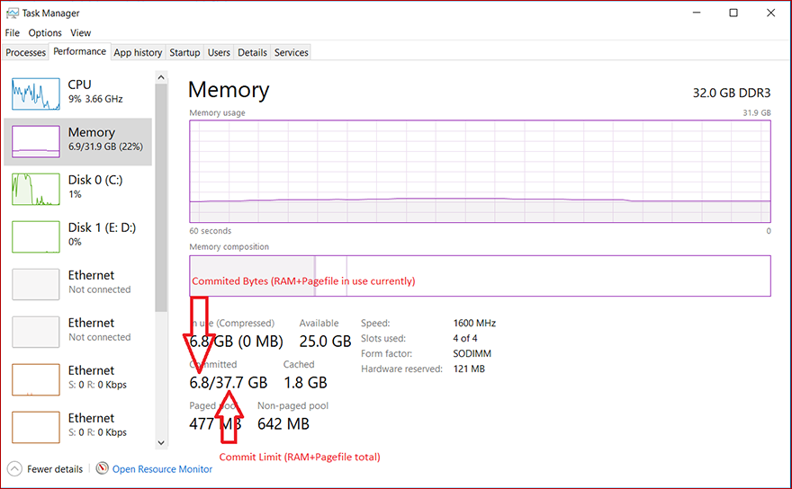
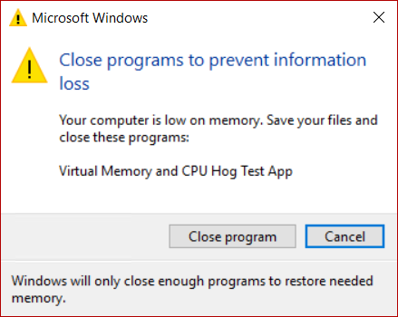
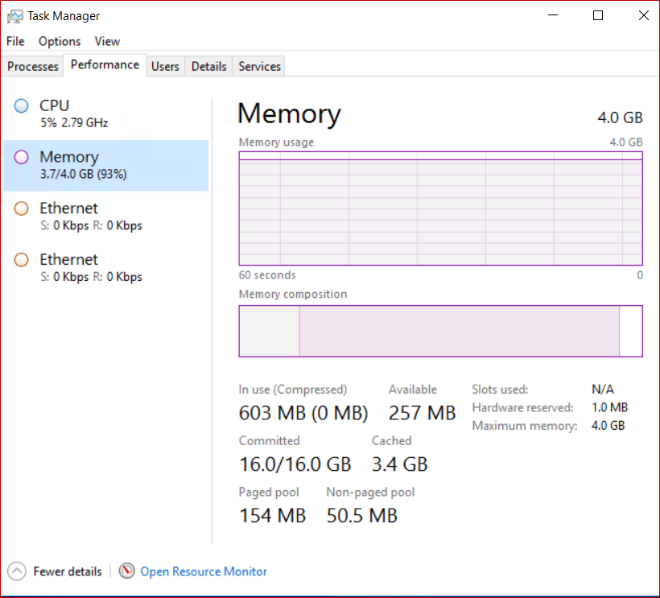

# Introduction to page files

A page file (also known as a "paging file") is an optional, hidden system file on a hard disk.

## Functionality

Page files have the following functionalities.

### Physical extension of RAM

Page files enable the system to remove infrequently accessed modified pages from physical memory to let the system use physical memory more efficiently for more frequently accessed pages.

### Application requirements

Some products or services require a page file for various reasons. For specific information, check the product documentation.

For example, the following Windows servers requires page files:

- Windows Server domain controllers (DCs)
- DFS Replication (DFS-R) servers
- Certificate servers
- ADAM/LDS servers

This is because the algorithm of the database cache for Extensible Storage Engine (ESENT, or ESE in Microsoft Exchange Server) depends on the "\Memory\Transition Pages RePurposed/sec" performance monitor counter. A page file is required to make sure that the database cache can release memory if other services or applications request memory.

For Windows Server 2012 Hyper-V and Windows Server 2012 R2 Hyper-V, the page file of the management OS (commonly called the host OS) should be left at the default of setting of "System Managed" .

### Support for system crash dumps

Page files can be used to "back" (or support) system crash dumps and extend how much system-committed memory (also known as “virtual memory”) a system can support. 

For more information about system crash dumps, see [system crash dump options](system-failure-recovery-options.md#under-write-debugging-information).

## Page files in Windows with large physical memory

When large physical memory is installed, a page file might not be required to support the system commit charge during peak usage. For example, 64-bit versions of Windows and Windows Server support more physical memory (RAM) than 32-bit versions support. The available physical memory alone might be large enough. 

However, the reason to configure the page file size has not changed. It has always been about supporting a system crash dump, if it is necessary, or extending the system commit limit, if it is necessary. For example, when a lot of physical memory is installed, a page file might not be required to back the system commit charge during peak usage. The available physical memory alone might be large enough to do this. However, a page file or a dedicated dump file might still be required to back a system crash dump.

## System committed memory

Page files extend how much "committed memory" (also known as "virtual memory") is used to store modified data.

The system commit memory limit is the sum of physical memory and all page files combined. It represents the maximum system-committed memory (also known as the "system commit charge") that the system can support.

 
The system commit charge is the total committed or "promised" memory of all committed virtual memory in the system. If the system commit charge reaches the system commit limit, the system and processes might not get committed memory. This condition can cause freezing, crashing, and other malfunctions. Therefore, make sure that you set the system commit limit high enough to support the system commit charge during peak usage.

The system committed charge and system committed limit can be measured on the **Performance** tab in Task Manager or by using the "\Memory\Committed Bytes" and "\Memory\Commit Limit" performance counters. The \Memory\% Committed Bytes In Use counter is a ratio of \Memory\Committed Bytes to \Memory\Commit Limit values.

>[!Note]
>System-managed page files automatically grow up to three times the physical memory or 4 GB (whichever is larger) when the system commit charge reaches 90 percent of the system commit limit. This assumes that enough free disk space is available to accommodate the growth.
