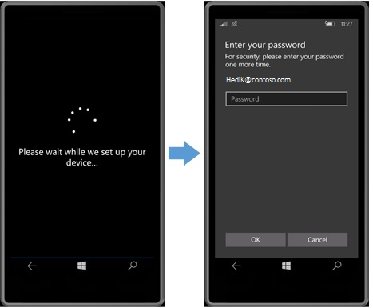
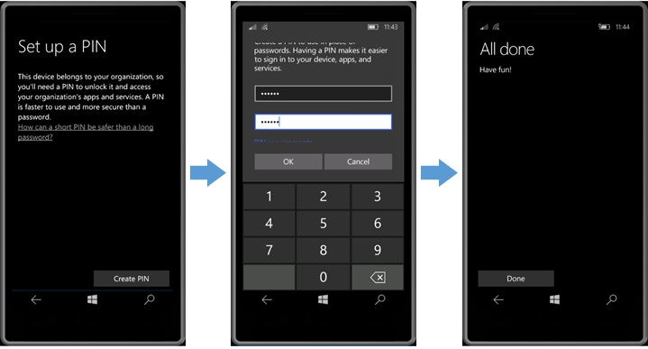
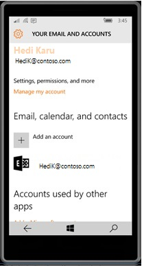
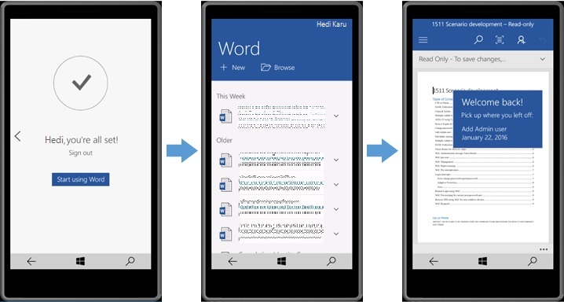
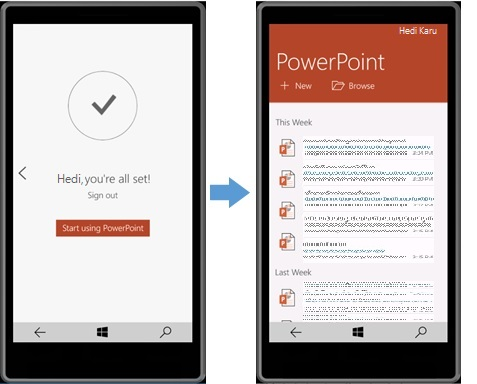
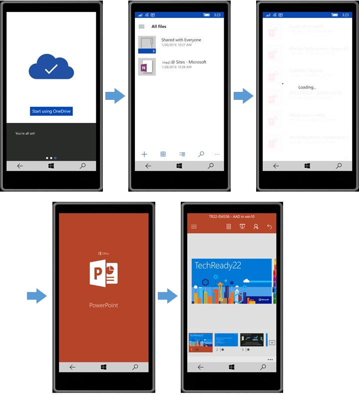
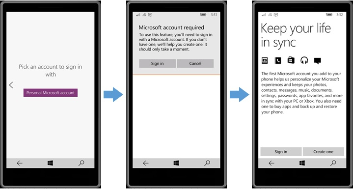
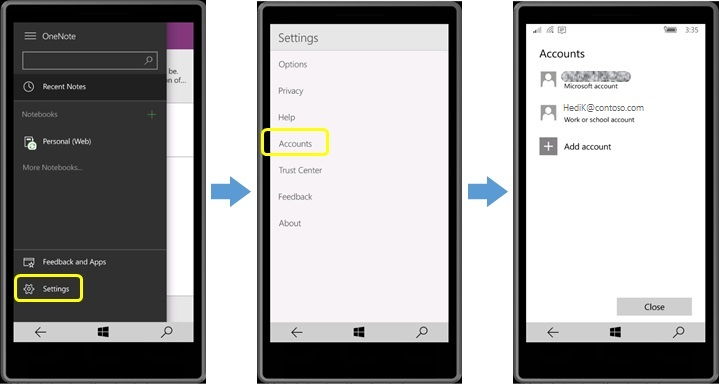

# Join Windows 10 Mobile to Azure Active Directory

**Applies to**

-   Windows 10 Mobile

Devices running Windows 10 Mobile can join Azure Active Directory (Azure AD) when the device is configured during the out-of-box experience (OOBE). This article describes the considerations and options for using Windows 10 Mobile with Azure AD in your organization.

## Why join Windows 10 Mobile to Azure AD

When a device running Windows 10 Mobile is joined to Azure AD, the device can exclusively use a credential owned by your organization, and you can ensure users sign in using the sign-in requirements of your organization. Joining a Windows 10 Mobile device to Azure AD provides many of the same benefits as joining desktop devices, such as:

-   Single sign-on (SSO) in applications like Mail, Word, and OneDrive using resources backed by Azure AD.

-   SSO in Microsoft Edge browser to Azure AD-connected web applications like Office 365 Portal, Visual Studio, and more than [2500 non-Microsoft apps](https://go.microsoft.com/fwlink/p/?LinkID=746211).

-   SSO to resources on-premises.

-   Automatically enroll in your mobile device management (MDM) service.

-   Enable enterprise roaming of settings. (Not currently supported but on roadmap)

-   Use Microsoft Store for Business to target applications to users.

## Are you upgrading current devices to Windows 10 Mobile?

Windows Phone 8.1 only supported the ability to connect the device to personal cloud services using a Microsoft account for authentication. This required creating Microsoft accounts to be used for work purposes. In Windows 10 Mobile, you have the ability to join devices directly to Azure AD without requiring a personal Microsoft account.

If you have existing Windows Phone 8.1 devices, the first thing to understand is whether the devices you have can be upgraded to Windows 10 Mobile. Microsoft will be releasing more information about upgrade availability soon. As more information becomes available, it will be posted at [How to get Windows 10 Mobile]( https://go.microsoft.com/fwlink/p/?LinkId=746312). Premier Enterprise customers that have a business need to postpone Windows 10 Mobile upgrade should contact their Technical Account Manager to understand what options may be available.

Before upgrading and joining devices to Azure AD, you will want to consider existing data usage. How users are using the existing devices and what data is stored locally will vary for every customer. Are text messages used for work purposes and need to be backed up and available after the upgrade? Are there photos stored locally or stored associated with an Microsoft account? Are there device and app settings that to be retained? Are there contacts stored in the SIM or associated with an Microsoft account? You will need to explore methods for capturing and storing the data that needs to be retained before you join the devices to Azure AD. Photos, music files, and documents stored locally on the device can be copied from the device using a USB connection to a PC.

To join upgraded mobile devices to Azure AD, [the devices must be reset](reset-a-windows-10-mobile-device.md) to start the out-of-box experience for device setup. Joining a device to Azure AD is not a change that can be done while maintaining existing user data. This is similar to changing a device from personally owned to organizationally owned. When a user joins an organization’s domain, the user is then required to log in as the domain user and start with a fresh user profile. A new user profile means there would not be any persisted settings, apps, or data from the previous personal profile.

If you want to avoid the device reset process, consider [adding work accounts](#add-work-account) rather than joining the devices to Azure AD.

## The difference between "Add work account" and "Azure AD Join"

Even though Azure AD Join on Windows 10 Mobile provides the best overall experience, there are two ways that you can use an added work account instead of joining the device to Azure AD due to organizational requirements.

-   You can complete OOBE using the **Sign in later** option. This lets you start using Windows 10 Mobile with any connected Azure AD account or Microsoft account.

-   You can add access to Azure AD-backed resources on the device without resetting the device.

However, neither of these methods provides SSO in the Microsoft Store or SSO to resources on-premises, and does not provide the ability to roam settings based on the Azure AD account using enterprise roaming. [Learn about enterprise state roaming in Azure AD.](https://go.microsoft.com/fwlink/p/?LinkId=734996)

Using **Settings** &gt; **Accounts** &gt; **Your email and accounts** &gt; **Add work or school account**, users can add their Azure AD account to the device. Alternatively, a work account can be added when the user signs in to an application like Mail, Word, etc. If you [enable auto-enrollment in your MDM settings](https://go.microsoft.com/fwlink/p/?LinkID=691615), the device will automatically be enrolled in MDM.

An added work account provides the same SSO experience in browser apps like Office 365 (Office portal, Outlook on the web, Calendar, People, OneDrive), Azure AD profile and change password app, and Visual Studio. You get SSO to built-in applications like Mail, Calendar, People, OneDrive and files hosted on OneDrive without prompts for a password. In Office apps like Microsoft Word, Microsoft Excel, etc., you simply select the Azure AD account and you are able to open files without entering a password.

## Preparing for Windows 10 Mobile

-   **Azure AD configuration**

    Currently, Azure AD Join only supports self-provisioning, meaning the credentials of the user of the device must be used during the initial setup of the device. If your mobile operator prepares devices on your behalf, this will impact your ability to join the device to Azure AD. Many IT administrators may start with a desire to set up devices for their employees, but the Azure AD Join experience is optimized for end-users, including the option for automatic MDM enrollment.

    By default, Azure AD is set up to allow devices to join and to allow users to use their corporate credentials on organizational-owned devices or personal devices. The blog post [Azure AD Join on Windows 10 devices](https://go.microsoft.com/fwlink/p/?LinkID=616791) has more information on where you can review your Azure AD settings. You can configure Azure AD to not allow anyone to join, to allow everyone in your organization to join, or you can select specific Azure AD groups which are allowed to join.

-   **Device setup**

    A device running Windows 10 Mobile can only join Azure AD during OOBE. New devices from mobile operators will be in this state when they are received. Windows Phone 8.1 devices that are [upgraded](#bkmk-upgrade) to Windows 10 Mobile will need to be reset to get back to OOBE for device setup.

-   **Mobile device management**

    An MDM service is required for managing Azure AD-joined devices. You can use MDM to push settings to devices, as well as application and certificates used by VPN, Wi-Fi, etc. Azure AD Premium or [Enterprise Mobility Suite (EMS)](https://go.microsoft.com/fwlink/p/?LinkID=723984) licenses are required to set up your Azure AD-joined devices to automatically enroll in MDM. [Learn more about setting up your Azure AD tenant for MDM auto-enrollment.](https://go.microsoft.com/fwlink/p/?LinkID=691615)

-   **Windows Hello**

    Creating a Windows Hello (PIN) is required on Windows 10 Mobile by default and cannot be disabled. You can control Windows Hello policies using controls in MDM, such as Intune. Because the device is joined using organizational credentials, the device must have a PIN to unlock the device. Biometrics such as fingerprint or iris can be used for authentication. Creating a Windows Hello requires the user to perform an multi-factor authentication since the PIN is a strong authentication credential. [Learn more about Windows Hello for Azure AD.](https://go.microsoft.com/fwlink/p/?LinkId=735004)

-   **Conditional access**

    Conditional access policies are also applicable to Windows 10 Mobile. Multifactor authentication and device compliance policies can be applied to users or resources and require that the user or device satisfies these requirements before access to resources is allowed. Policies like **Domain Join** which support traditional domain joining only apply to desktop PC. Policies dependent on IP range will be tough to enforce on a phone as the IP address of the operator is used unless the user has connected to corporate Wi-Fi or a VPN.

-   **Known issues**

    -   The apps for **Device backup and restore** and to sync photos to OneDrive only work with the Microsoft account as the primary account—these apps won’t work on devices joined to Azure AD.

    -   **Find my Phone** will work depending on how you add a Microsoft account to the device—for example, the Cortana application will sign in with your Microsoft account in a way that makes **Find my Phone** work. Cortana and OneNote both work with Azure AD accounts but must be set up with a Microsoft account first.

    -   OneNote requires the user to sign in with a Microsoft account but will also provide access to Notebooks using the Azure AD account.

    -   If your organization is configured to federate with Azure AD, your federation proxy will need to be Active Directory Federation Services (ADFS) or a 3rd party which supports WS-Trust endpoints just like ADFS does.

## How to join Windows 10 Mobile to Azure AD

1.  During OOBE, on the **Keep your life in sync** screen, choose the option **Sign in with a work account**, and then tap **Next**.

    

2.  Enter your Azure AD account. If your Azure AD account is federated, you will be redirected to your organization's sign-in page; if not, you enter your password here.

    

    If you are taken to your organization's sign-in page, you may be required to provide a second factor of authentication.

    

3.  After authentication completes, the device registration is complete. If your MDM service has a terms of use page, it would be seen here as well. Federated users are required to provide a password again to complete the authentication to Windows. Users with passwords managed in the cloud will not see this additional authentication prompt. This federated login requires your federation server to support a WS-Trust active endpoint.

    

4.  Next, you set up a PIN.

    

    **Note**  To learn more about the PIN requirement, see [Why a PIN is better than a password](/windows/access-protection/hello-for-business/hello-why-pin-is-better-than-password).

     

**To verify Azure AD join**

-   Go to **Settings** &gt; **Accounts** &gt; **Your email and accounts**. You will see your Azure AD account listed at the top and also listed as an account used by other apps. If auto-enrollment into MDM was configured, you will see in **Settings** &gt; **Accounts** &gt; **Work Access** that the device is correctly enrolled in MDM. If the MDM is pushing a certificate to be used by VPN, then **Settings** &gt; **Network & wireless** &gt; **VPN** will show the ability to connect to your VPN.

    

## Set up mail and calendar

Setting up email on your Azure AD joined device is simple. Launching the **Mail** app brings you to the **Accounts** page. Most users will have their email accounts hosted in Office 365 and will automatically start syncing. Just tap **Ready to go**.

When email is hosted in on-premises Exchange, the user must provide credentials to establish a basic authentication connection to the Exchange server. Tap **Add account** to see the types of mail accounts you can add, including your Azure AD account.

After you select an account type, you provide credentials to complete setup for that mailbox.

Setup for the **Calendar** app is similar. Open the app and you'll see your Azure AD account listed -- just tap **Ready to go**.

Return to **Settings** &gt; **Accounts** &gt; **Your email and accounts**, and you will see your Azure AD account listed for **Email, calendar, and contacts**.

## Use Office and OneDrive apps

Office applications like Microsoft Word and Microsoft PowerPoint will automatically sign you in with your Azure AD account. When you open an Office app, you see a screen that allows you to choose between a Microsoft account and Azure AD account. Office shows this screen while it is automatically signing you in, so just be patient for a couple seconds and Office will automatically sign you in using your Azure AD account.

Microsoft Word automatically shows the documents recently opened on other devices. Opening a document allows you to jump straight to the same section you were last editing on another device.

Microsoft PowerPoint shows your recently opened slide decks.

The OneDrive application also uses SSO, showing you all your documents and enabling you to open them without any authentication experience.

In addition to application SSO, Azure AD joined devices also get SSO for browser applications which trust Azure AD, such as web applications, Visual Studio, Office 365 portal, and OneDrive for Business.

OneNote requires a Microsoft account, but you can use it with your Azure AD account as well.

After you sign in to OneNote, go to Settings &gt; Accounts, and you will see that your Azure AD account is automatically added.

To see the Notebooks that your Azure AD account has access to, tap **More Notebooks** and select the Notebook you want to open.

## Use Microsoft Store for Business

[Microsoft Store for Business](/microsoft-store/index) allows you to specify applications to be available to your users in the Microsoft Store application. These applications show up on a tab titled for your company. Applications approved in the Microsoft Store for Business portal can be installed by users.

 

 

