# Manage Device Installation with Group Policy


**Applies to**

- Windows 10, Windows Server 2022


## Summary
By using Windows 10 operating systems, administrators can determine what devices can be installed on computers they manage. This guide summarizes the device installation process and demonstrates several techniques for controlling device installation by using Group Policy.

## Introduction

### General
This step-by-step guide describes how you can control device installation on the computers that you manage, including designating which devices users can and cannot install. This guide applies to all Windows 10 versions starting with RS5 (1809). The guide includes the following scenarios:

- Prevent users from installing devices that are on a "prohibited" list. If a device is not on the list, then the user can install it.
- Allow users to install only devices that are on an "approved" list. If a device is not on the list, then the user cannot install it.

This guide describes the device installation process and introduces the device identification strings that Windows uses to match a device with the device-driver packages available on a machine. The guide also illustrates two methods of controlling device installation. Each scenario shows, step by step, one method you can use to allow or prevent the installation of a specific device or a class of devices.

The example device used in the scenarios is a USB storage device. You can perform the steps in this guide using a different device. However, if you use a different device, then the instructions in the guide will not exactly match the user interface that appears on the computer.

It is important to understand that the Group Policies that are presented in this guide are only apply to machines/machine-groups, not to users/user-groups.

> [!IMPORTANT]
> The steps provided in this guide are intended for use in a test lab environment. This step-by-step guide is not meant to be used to deploy Windows Server features without accompanying documentation and should be used with discretion as a stand-alone document.

### Who Should Use This Guide?

This guide is targeted at the following audiences:

- Information technology planners and analysts who are evaluating Windows 10 and Windows Server 2022
- Enterprise information technology planners and designers
- Security architects who are responsible for implementing trustworthy computing in their organization
- Administrators who want to become familiar with the technology

### Benefits of Controlling Device Installation Using Group Policy

Restricting the devices that users can install reduces the risk of data theft and reduces the cost of support.

#### Reduce the risk of data theft

It is more difficult for users to make unauthorized copies of company data if users' computers cannot install unapproved devices that support removable media. For example, if users cannot install a USB thumb-drive device, they cannot download copies of company data onto a removable storage. This benefit cannot eliminate data theft, but it creates another barrier to unauthorized removal of data.

#### Reduce support costs

You can ensure that users install only those devices that your technical support team is trained and equipped to support. This benefit reduces support costs and user confusion.


## Scenario Overview

The scenarios presented in this guide illustrate how you can control device installation and usage on the computers that you manage. The scenarios use Group Policy on a local machine to simplify using the procedures in a lab environment. In an environment where you manage multiple client computers, you should apply these settings using Group Policy.. With Group Policy deployed by Active Directory, you can apply settings to all computers that are members of a domain or an organizational unit in a domain. For more information about how to use Group Policy to manage your client computers, see Group Policy at the Microsoft Web site.

Group Policy guides:

- [Create a Group Policy Object (Windows 10) - Windows security](../security/threat-protection/windows-firewall/create-a-group-policy-object.md)
- [Advanced Group Policy Management - Microsoft Desktop Optimization Pack](/microsoft-desktop-optimization-pack/agpm)

### Scenario #1: Prevent installation of all printers

In this scenario, the administrator wants to prevent users from installing any printers. Thus is a basic scenario to introduce you to the ‘prevent/allow’ functionality of Device Installation policies in Group Policy.

### Scenario #2: Prevent installation of a specific printer

In this scenario, the administrator allows standard users to install all printers while but preventing them from installing a specific one.

### Scenario #3: Prevent installation of all printers while allowing a specific printer to be installed

In this scenario, you will combine what you learned from both scenario #1 and scenario #2. The administrator wants to allow standard users to install only a specific printer while preventing the installation of all other printers. This is a more realistic scenario and brings you a step farther in understanding of the Device Installation Restrictions policies.

### Scenario #4: Prevent installation of a specific USB device

This scenario, although similar to scenario #2, brings another layer of complexity – how does device connectivity work in the PnP tree. The administrator wants to prevent standard users from installing a specific USB device. By the end of the scenario, you should understand the way devices are nested in layers under the PnP device connectivity tree.

### Scenario #5: Prevent installation of all USB devices while allowing an installation of only an authorized USB thumb drive

In this scenario, combining all previous 4 scenarios, you will learn how to protect a machine from all unauthorized USB devices. The administrator wants to allow users to install only a small set of authorized USB devices while preventing any other USB device from being installed. In addition, this scenario includes an explanation of how to apply the ‘prevent’ functionality to existing USB devices that have already been installed on the machine, and the administrator likes to prevent any farther interaction with them (blocking them all together). This scenario builds on the policies and structure we introduced in the first 4 scenarios and therefore it is preferred to go over them first before attempting this scenario.


## Technology Review

The following sections provide a brief overview of the core technologies discussed in this guide and give background information that is necessary to understand the scenarios.

### Device Installation in Windows

A device is a piece of hardware with which Windows interacts to perform some function, or in a more technical definition - it is a single instance of a hardware component with a unique representation in the Windows Plug and Play subsystem. Windows can communicate with a device only through a piece of software called a device-driver (also known as a _driver_). To install a driver, Windows detects the device, recognizes its type, and then finds the driver that matches that type.

When Windows detects a device that has never been installed on the computer, the operating system queries the device to retrieve its list of device identification strings. A device usually has multiple device identification strings, which the device manufacturer assigns. The same device identification strings are included in the .inf file (also known as an _INF_) that is part of the driver package. Windows chooses which driver package to install by matching the device identification strings retrieved from the device to those included with the driver packages.

Windows uses four types of identifiers to control device installation and configuration. You can use the Group Policy settings in Windows 10 to specify which of these identifiers to allow or block.

The four types of identifiers are:

- Device Instance ID
- Device ID
- Device setup classes
- ‘Removable Devices’ device type

#### Device Instance ID

A device instance ID is a system-supplied device identification string that uniquely identifies a device in the system. The Plug and Play (PnP) manager assigns a device instance ID to each device node (devnode) in a system's device tree.

#### Device ID

Windows can use each string to match a device to a driver package. The strings range from the specific, matching a single make and model of a device, to the general, possibly applying to an entire class of devices. There are two types of device identification strings: hardware IDs and compatible IDs.

##### Hardware IDs

Hardware IDs are the identifiers that provide the exact match between a device and a driver package. The first string in the list of hardware IDs is referred to as the device ID, because it matches the exact make, model, and revision of the device. The other hardware IDs in the list match the details of the device less exactly. For example, a hardware ID might identify the make and model of the device but not the specific revision. This scheme allows Windows to use a driver for a different revision of the device if the driver for the correct revision is not available.

##### Compatible IDs

Windows uses these identifiers to select a driver if the operating system cannot find a match with the device ID or any of the other hardware IDs. Compatible IDs are listed in the order of decreasing suitability. These strings are optional, and, when provided, they are very generic, such as Disk. When a match is made using a compatible ID, you can typically use only the most basic functions of the device.

When you install a device, such as a printer, a USB storage device, or a keyboard, Windows searches for driver packages that match the device you are attempting to install. During this search, Windows assigns a "rank" to each driver package it discovers with at least one match to a hardware or compatible ID. The rank indicates how well the driver matches the device. Lower rank numbers indicate better matches between the driver and the device. A rank of zero represents the best possible match. A match with the device ID to one in the driver package results in a lower (better) rank than a match to one of the other hardware IDs. Similarly, a match to a hardware ID results in a better rank than a match to any of the compatible IDs. After Windows ranks all of the driver packages, it installs the one with the lowest overall rank. For more information about the process of ranking and selecting driver packages, see How Setup Selects Drivers in the Microsoft Docs library.

> [!NOTE]
> For more information about the driver installation process, see the "Technology review" section of the Step-by-Step Guide to Driver Signing and Staging.

Some physical devices create one or more logical devices when they are installed. Each logical device might handle part of the functionality of the physical device. For example, a multi-function device, such as an all-in-one scanner/fax/printer, might have a different device identification string for each function.

When you use Device Installation policies to allow or prevent the installation of a device that uses logical devices, you must allow or prevent all of the device identification strings for that device. For example, if a user attempts to install a multifunction device and you did not allow or prevent all of the identification strings for both physical and logical devices, you could get unexpected results from the installation attempt. For more detailed information about hardware IDs, see Device Identification Strings in Microsoft Docs.

#### Device setup classes

Device setup classes (also known as _Class_) are another type of identification string. The manufacturer assigns the Class to a device in the driver package. The Class groups devices that are installed and configured in the same way. For example, all Biometric devices are belong to the Biometric Class (ClassGuid = {53D29EF7-377C-4D14-864B-EB3A85769359}), and they use the same co-installer when installed. A long number called a globally unique identifier (GUID) represents each device setup class. When Windows starts, it builds an in-memory tree structure with the GUIDs for all of the detected devices. Along with the GUID for the Class of the device itself, Windows may need to insert into the tree the GUID for the Class of the bus to which the device is attached.

When you use device Classes to allow or prevent users from installing drivers, you must specify the GUIDs for all of the device's device setup classes, or you might not achieve the results you want. The installation might fail (if you want it to succeed) or it might succeed (if you want it to fail).

For example, a multi-function device, such as an all-in-one scanner/fax/printer, has a GUID for a generic multi-function device, a GUID for the printer function, a GUID for the scanner function, and so on. The GUIDs for the individual functions are "child nodes" under the multi-function device GUID. To install a child node, Windows must also be able to install the parent node. You must allow installation of the device setup class of the parent GUID for the multi-function device in addition to any child GUIDs for the printer and scanner functions.

For more information, see [Device Setup Classes](/windows-hardware/drivers/install/overview-of-device-setup-classes) in Microsoft Docs.

This guide does not depict any scenarios that use device setup classes. However, the basic principles demonstrated with device identification strings in this guide also apply to device setup classes. After you discover the device setup class for a specific device, you can then use it in a policy to either allow or prevent installation of drivers for that class of devices.

The following two links provide the complete list of Device Setup Classes. ‘System Use’ classes are mostly refer to devices that come with a computer/machine from the factory, while ‘Vendor’ classes are mostly refer to devices that could be connected to an existing computer/machine:

- [System-Defined Device Setup Classes Available to Vendors - Windows drivers](/windows-hardware/drivers/install/system-defined-device-setup-classes-available-to-vendors)
- [System-Defined Device Setup Classes Reserved for System Use - Windows drivers](/windows-hardware/drivers/install/system-defined-device-setup-classes-reserved-for-system-use)

#### ‘Removable Device’ Device type

Some devices could be classified as _Removable Device_. A device is considered _removable_ when the driver for the device to which it is connected indicates that the device is removable. For example, a USB device is reported to be removable by the drivers for the USB hub to which the device is connected. 


### Group Policy Settings for Device Installation

Group Policy is an infrastructure that allows you to specify managed configurations for users and computers through Group Policy settings and Group Policy Preferences.

Device Installation section in Group Policy is a set of policies that control which device could or could not be installed on a machine. Whether you want to apply the settings to a stand-alone computer or to many computers in an Active Directory domain, you use the Group Policy Object Editor to configure and apply the policy settings. For more details, see Group Policy Object Editor Technical Reference.

The following passages are brief descriptions of the Device Installation policies that are used in this guide.

> [!NOTE]
> Device Installation control is applied only to machines (‘computer configuration’) and not users (‘user configuration’) by the nature of the Windows OS design. These policy settings affect all users who log on to the computer where the policy settings are applied. You cannot apply these policies to specific users or groups except for the policy Allow administrators to override device installation policy. This policy exempts members of the local Administrators group from any of the device installation restrictions that you apply to the computer by configuring other policy settings as described in this section.

#### Allow administrators to override Device Installation Restriction policies

This policy setting allows members of the local Administrators group to install and update the drivers for any device, regardless of other policy settings. If you enable this policy setting, administrators can use the Add Hardware Wizard or the Update Driver Wizard to install and update the drivers for any device. If you disable or do not configure this policy setting, administrators are subject to all policy settings that restrict device installation.

#### Allow installation of devices that match any of these device IDs

This policy setting specifies a list of Plug and Play hardware IDs and compatible IDs that describe devices that users can install. This setting is intended to be used only when the Prevent installation of devices not described by other policy settings policy setting is enabled and does not take precedence over any policy setting that would prevent users from installing a device. If you enable this policy setting, users can install and update any device with a hardware ID or compatible ID that matches an ID in this list if that installation has not been specifically prevented by the Prevent installation of devices that match these device IDs policy setting, the Prevent installation of devices for these device classes policy setting, or the Prevent installation of removable devices policy setting. If another policy setting prevents users from installing a device, users cannot install it even if the device is also described by a value in this policy setting. If you disable or do not configure this policy setting and no other policy describes the device, the Prevent installation of devices not described by other policy settings policy setting determines whether users can install the device.

#### Allow installation of devices that match any of these device instance IDs

This policy setting allows you to specify a list of Plug and Play device instance IDs for devices that Windows is allowed to install. Use this policy setting only when the "Prevent installation of devices not described by other policy settings" policy setting is enabled. Other policy settings that prevent device installation take precedence over this one. If you enable this policy setting, Windows is allowed to install or update any device whose Plug and Play device instance ID appears in the list you create, unless another policy setting specifically prevents that installation (for example, the "Prevent installation of devices that match any of these device IDs" policy setting, the "Prevent installation of devices for these device classes" policy setting, the "Prevent installation of devices that match any of these device instance IDs" policy setting, or the "Prevent installation of removable devices" policy setting). If you enable this policy setting on a remote desktop server, the policy setting affects redirection of the specified devices from a remote desktop client to the remote desktop server.

#### Allow installation of devices using drivers that match these device setup classes

This policy setting specifies a list of device setup class GUIDs that describe devices that users can install. This setting is intended to be used only when the Prevent installation of devices not described by other policy settings policy setting is enabled and does not take precedence over any policy setting that would prevent users from installing a device. If you enable this setting, users can install and update any device with a hardware ID or compatible ID that matches one of the IDs in this list if that installation has not been specifically prevented by the Prevent installation of devices that match these device IDs policy setting, the Prevent installation of devices for these device classes policy setting, or the Prevent installation of removable devices policy setting. If another policy setting prevents users from installing a device, users cannot install it even if the device is also described by a value in this policy setting. If you disable or do not configure this policy setting and no other policy setting describes the device, the Prevent installation of devices not described by other policy settings policy setting determines whether users can install the device.

#### Prevent installation of devices that match these device IDs

This policy setting specifies a list of Plug and Play hardware IDs and compatible IDs for devices that users cannot install. If you enable this policy setting, users cannot install or update the driver for a device if its hardware ID or compatible ID matches one in this list. If you disable or do not configure this policy setting, users can install devices and update their drivers, as permitted by other policy settings for device installation.
Note: This policy setting takes precedence over any other policy settings that allow users to install a device. This policy setting prevents users from installing a device even if it matches another policy setting that would allow installation of that device.

#### Prevent installation of devices that match any of these device instance IDs

This policy setting allows you to specify a list of Plug and Play device instance IDs for devices that Windows is prevented from installing. This policy setting takes precedence over any other policy setting that allows Windows to install a device. If you enable this policy setting, Windows is prevented from installing a device whose device instance ID appears in the list you create. If you enable this policy setting on a remote desktop server, the policy setting affects redirection of the specified devices from a remote desktop client to the remote desktop server. If you disable or do not configure this policy setting, devices can be installed and updated as allowed or prevented by other policy settings.

#### Prevent installation of devices using drivers that match these device setup classes

This policy setting specifies a list of Plug and Play device setup class GUIDs for devices that users cannot install. If you enable this policy setting, users cannot install or update devices that belong to any of the listed device setup classes. If you disable or do not configure this policy setting, users can install and update devices as permitted by other policy settings for device installation.
Note: This policy setting takes precedence over any other policy settings that allow users to install a device. This policy setting prevents users from installing a device from being installed even if it matches another policy setting that would allow installation of that device.

### Apply layered order of evaluation for Allow and Prevent device installation policies across all device match criteria

This policy setting will change the evaluation order in which Allow and Prevent policy settings are applied when more than one install policy setting is applicable for a given device. Enable this policy setting to ensure that overlapping device match criteria is applied based on an established hierarchy where more specific match criteria supersedes less specific match criteria. The hierarchical order of evaluation for policy settings that specify device match criteria is as follows:

> **Device instance IDs** > **Device IDs** > **Device setup class** > **Removable devices**

> [!NOTE]
> This policy setting provides more granular control than the "Prevent installation of devices not described by other policy settings" policy setting. If these conflicting policy settings are enabled at the same time, the "Apply layered order of evaluation for Allow and Prevent device installation policies across all device match criteria" policy setting will be enabled and the other policy setting will be ignored.
>
> If you disable or do not configure this policy setting, the default evaluation is used. By default, all "Prevent installation..." policy settings have precedence over any other policy setting that allows Windows to install a device.

Some of these policies take precedence over other policies. The flowchart shown below illustrates how Windows processes them to determine whether a user can install a device or not, as shown in Figure below.
 			
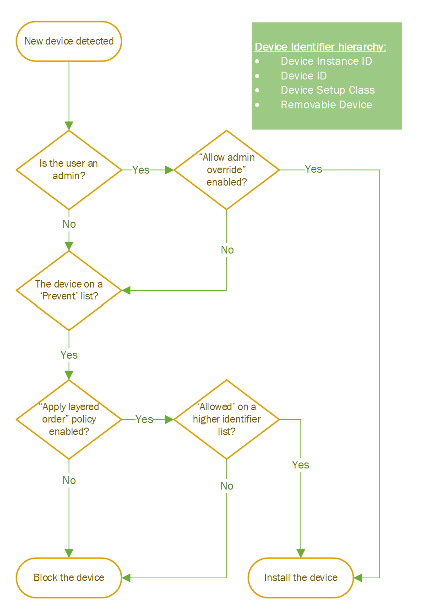<br/>_Device Installation policies flow chart_


## Requirements for completing the scenarios

### General

To complete each of the scenarios, please ensure your have:

- A client computer running Windows 10.

- A USB thumb drive. The scenarios described in this guide use a USB thumb drive as the example device (also known as a “removable disk drive”, "memory drive," a "flash drive," or a "keyring drive"). Most USB thumb drives do not require any manufacturer-provided drivers, and these devices work with the inbox drivers provided with the Windows build.

- A USB/network printer pre-installed on the machine.

- Access to the administrator account on the testing machine. The procedures in this guide require administrator privileges for most steps.

### Understanding implications of applying ‘Prevent’ policies retroactive

All ‘Prevent’ policies have an option to apply the block functionality to already installed devices—devices that have been installed on the machine before the policy took effect. Using this option is recommended when the administrator is not sure of the installation history of devices on the machine and would like to make sure the policy applies to all devices.

For example: A printer is already installed on the machine, preventing the installation of all printers will block any future printer from being installed while keeping only the installed printer usable. To apply the block retroactive, the administrator should check mark the “apply this policy to already installed devices” option. Marking this option will prevent access to already installed devices in addition to any future ones.

This is a powerful tool, but as such it has to be used carefully.

> [!IMPORTANT]
> Applying the ‘Prevent retroactive’ option to crucial devices could render the machine useless/unacceptable! For example: Preventing retroactive all ‘Disk Drives’ could block the access to the disk on which the OS boots with; Preventing retroactive all ‘Net’ could block this machine from accessing network and to fix the issue the admin will have to have a direct connection.

## Determine device identification strings

By following these steps, you can determine the device identification strings for your device. If the hardware IDs and compatible IDs for your device do not match those shown in this guide, use the IDs that are appropriate to your device (this applies to Instance IDs and Classes, but we are not going to give an example for them in this guide).

You can determine the hardware IDs and compatible IDs for your device in two ways. You can use Device Manager, a graphical tool included with the operating system, or PnPUtil, a command-line tool available for all Windows versions. Use the following procedure to view the device identification strings for your device.

> [!NOTE]
> These procedures are specific to a Canon printer. If you are using a different type of device, you must adjust the steps accordingly. The significant difference will be the location of the device in the Device Manager hierarchy. Instead of being located in the Printers node, you must locate your device in the appropriate node.

To find device identification strings using Device Manager

1. Make sure your printer is plugged in and installed.

2. To open Device Manager, click the Start button, type mmc devmgmt.msc in the Start Search box, and then press ENTER; or search for Device Manager as application.

3. Device Manager starts and displays a tree representing all of the devices detected on your computer. At the top of the tree is a node with your computers name next to it. Lower nodes represent the various categories of hardware into which your computers devices are grouped.

4. Find the “Printers” section and find the target printer
 
    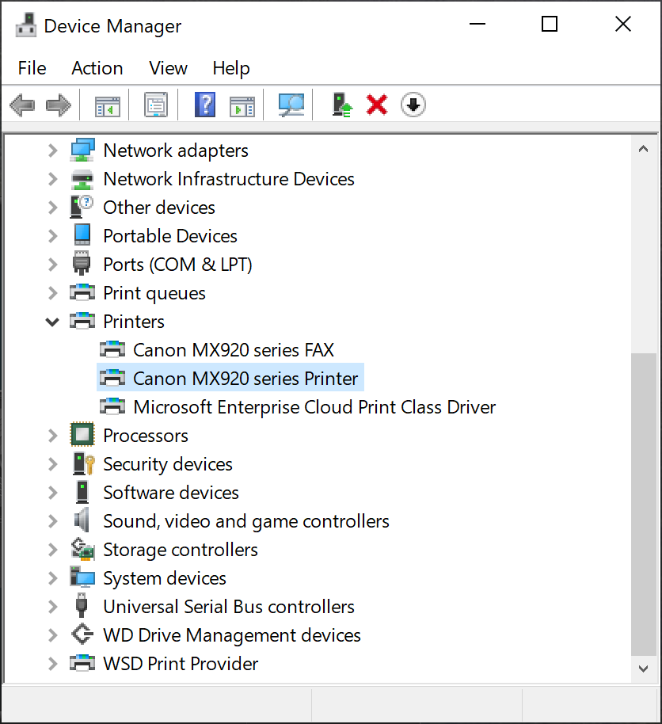<br/>_Selecting the printer in Device Manager_

5. Double-click the printer and move to the ‘Details’ tab.

    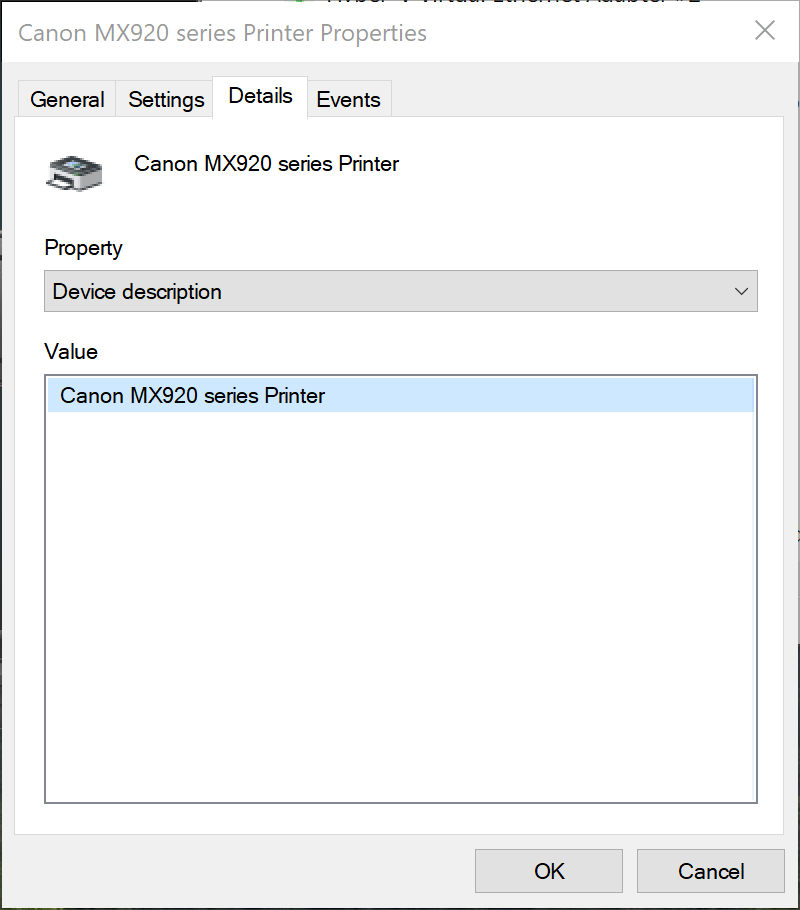<br/>_Open the ‘Details’ tab to look for the device identifiers_

6. From the ‘Value’ window, copy the most detailed Hardware ID – we will use this in the policies.

    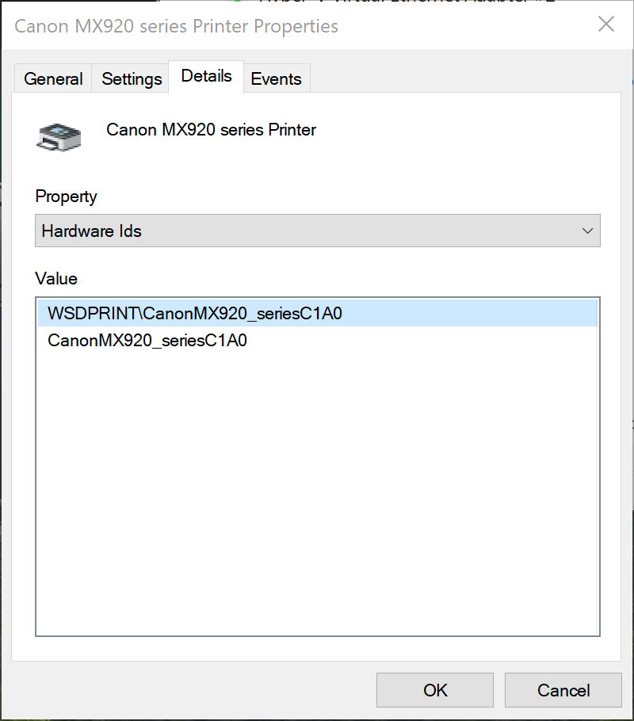

    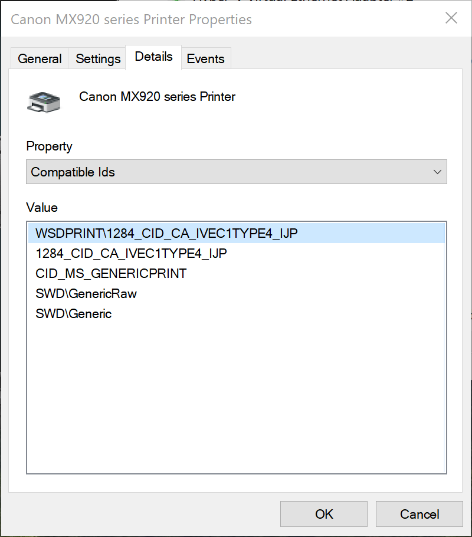<br/>_HWID and Compatible ID_

    > [!TIP]
    > You can also determine your device identification strings by using the PnPUtil command-line utility. For more information, see [PnPUtil - Windows drivers](/windows-hardware/drivers/devtest/pnputil) in Microsoft Docs.

### Getting device identifiers using PnPUtil

```console
pnputil /enum-devices /deviceids
```

Here is an example of an output for a single device on a machine:

```console
<snip>
Instance ID:                PCI\VEN_8086&DEV_2F34&SUBSYS_2F348086&REV_02\3&103a9d54&0&81
Device Description:         Intel(R) Xeon(R) E7 v3/Xeon(R) E5 v3/Core i7 PCIe Ring Interface - 2F34
Class Name:                 System
Class GUID:                 {4d36e97d-e325-11ce-bfc1-08002be10318}
Manufacturer Name:          INTEL
Status:                     Stopped
Driver Name:                oem6.inf
Hardware IDs:               PCI\VEN_8086&DEV_2F34&SUBSYS_2F348086&REV_02
                            PCI\VEN_8086&DEV_2F34&SUBSYS_2F348086
                            PCI\VEN_8086&DEV_2F34&CC_110100
                            PCI\VEN_8086&DEV_2F34&CC_1101
Compatible IDs:             PCI\VEN_8086&DEV_2F34&REV_02
                            PCI\VEN_8086&DEV_2F34
                            PCI\VEN_8086&CC_110100
                            PCI\VEN_8086&CC_1101
                            PCI\VEN_8086
                            PCI\CC_110100
                            PCI\CC_1101
<snip>
```

## Scenario #1: Prevent installation of all printers

In this simple scenario, you will learn how to prevent the installation of an entire Class of devices.

### Setting up the environment

Setting up the environment for the scenario with the following steps:

1. Open Group Policy Editor and navigate to the Device Installation Restriction section.

2. Disable all previous Device Installation policies, except ‘Apply layered order of evaluation’—although the policy is disabled in default, this policy is recommended to be enabled in most practical applications. 

3. If there are any enabled policies, changing their status to ‘disabled’, would clear them from all parameters

4. Have a USB/network printer available to test the policy with

### Scenario steps – preventing installation of prohibited devices

Getting the right device identifier to prevent it from being installed:

1. If you have on your system a device from the class you want to block, you could follow the steps in the previous section to find the Device Class identifier through Device Manager or PnPUtil (Class GUID).

2. If you don’t have such device installed on your system or know the name of the class, you can check the following two links:

    - [System-Defined Device Setup Classes Available to Vendors - Windows drivers](/windows-hardware/drivers/install/system-defined-device-setup-classes-available-to-vendors)
    - [System-Defined Device Setup Classes Reserved for System Use - Windows drivers](/windows-hardware/drivers/install/system-defined-device-setup-classes-reserved-for-system-use)

3. Our current scenario is focused on preventing all printers from being installed, as such here is the Class GUID for most of printers in the market: 

    > Printers\
    > Class = Printer\
    > ClassGuid = {4d36e979-e325-11ce-bfc1-08002be10318}\
    > This class includes printers.

> [!NOTE]
> As mentioned before, preventing an entire Class could block you from using your system completely. Please make sure you understand which devices are going to be blocked when specifying a Class. For our scenario, there are other classes that relate to printers but before you apply them, make sure they are not blocking any other existing device that is crucial to your system.

Creating the policy to prevent all printers from being installed:

1. Open Group Policy Object Editor—either click the Start button, type mmc gpedit.msc in the Start Search box, and then press ENTER; or type in the Windows search “Group Policy Editor” and open the UI.

2. Navigate to the Device Installation Restriction page: 

    > Computer Configuration > Administrative Templates > System > Device Installation > Device Installation Restrictions

3. Make sure all policies are disabled (recommended to keep ‘applied layered order of evaluation’ policy enabled).

4. Open **Prevent installation of devices using drivers that match these device setup classes** policy and select the ‘Enable’ radio button.

5. In the lower left side, in the ‘Options’ window, click the ‘Show…’ box. This will take you to a table where you can enter the class identifier to block.

6. Enter the printer class GUID you found above with the curly braces (this is important! Otherwise, it won’t work): {4d36e979-e325-11ce-bfc1-08002be10318}

    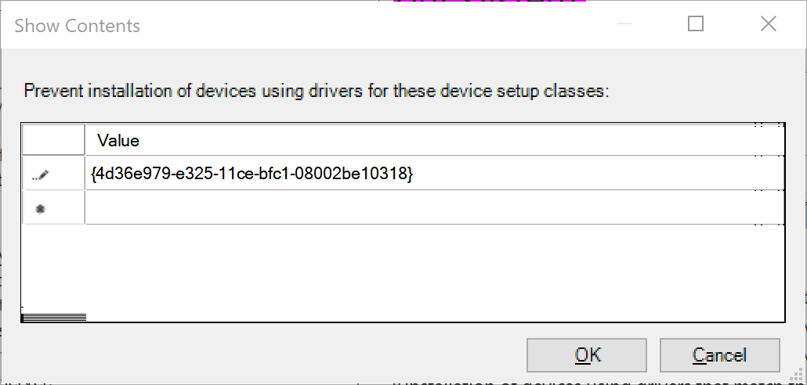<br/>_List of prevent Class GUIDs_

7. Click ‘OK’.

8. Click ‘Apply’ on the bottom right of the policy’s window – this pushes the policy and blocks all future printer installations, but doesn’t apply to existing installs.

9. Optional – if you would like to apply the policy to existing installs: Open the **Prevent installation of devices using drivers that match these device setup classes** policy again; in the ‘Options’ window mark the checkbox that says ‘also apply to matching devices that are already installed’

> [!IMPORTANT]
> Using a Prevent policy (like the one we used in scenario #1 above) and applying it to all previously installed devices (see step #9) could render crucial devices unusable; hence, use with caution. For example: If an IT admin wants to prevent all removable storage devices from being installed on the machine, using ‘Disk Drive’ class for blocking and applying it retroactive could render the internal hard-drive unusable and to break the machine.

### Testing the scenario

1. If you have not completed step #9 – follow these steps:

    - Uninstall your printer: Device Manager > Printers > right click the Canon Printer > click “Uninstall device”.
    - For USB printer – unplug and plug back the cable; for network device – make a search for the printer in the Windows Settings app.
    - You should not be able to reinstall the printer.

2. If you completed step #9 above and restarted the machine, simply look for your printer under Device Manager or the Windows Settings app and see that it is no-longer available for you to use.

## Scenario #2: Prevent installation of a specific printer

This scenario builds upon scenario #1, Prevent installation of all printers. In this scenario, you target a specific printer to prevent from being installed on the machine.

### Setting up the environment

Setting up the environment for the scenario with the following steps:

1. Open Group Policy Editor and navigate to the Device Installation Restriction section.

2. Make sure all previous Device Installation policies are disabled except ‘Apply layered order of evaluation’ (this is optional to be On/Off this scenario). Although the policy is disabled in default, it is recommended to be enabled in most practical applications. For scenario #2 it is optional.

### Scenario steps – preventing installation of a specific device

Getting the right device identifier to prevent it from being installed:

1. Get your printer’s Hardware ID – in this example we will use the identifier we found previously

    <br/>_Printer Hardware ID_

2. Write down the device ID (in this case Hardware ID) – WSDPRINT\CanonMX920_seriesC1A0; Take the more specific identifier to make sure you block a specific printer and not a family of printers

Creating the policy to prevent a single printer from being installed:

1. Open Group Policy Object Editor – either click the Start button, type mmc gpedit.msc in the Start Search box, and then press ENTER; or type in the Windows search “Group Policy Editor” and open the UI.

2. Navigate to the Device Installation Restriction page: 

    > Computer Configuration > Administrative Templates > System > Device Installation > Device Installation Restrictions

3. Open **Prevent installation of devices that match any of these device IDs** policy and select the ‘Enable’ radio button.

4. In the lower left side, in the ‘Options’ window, click the ‘Show…’ box. This will take you to a table where you can enter the device identifier to block.

5. Enter the printer device ID you found above – WSDPRINT\CanonMX920_seriesC1A0

    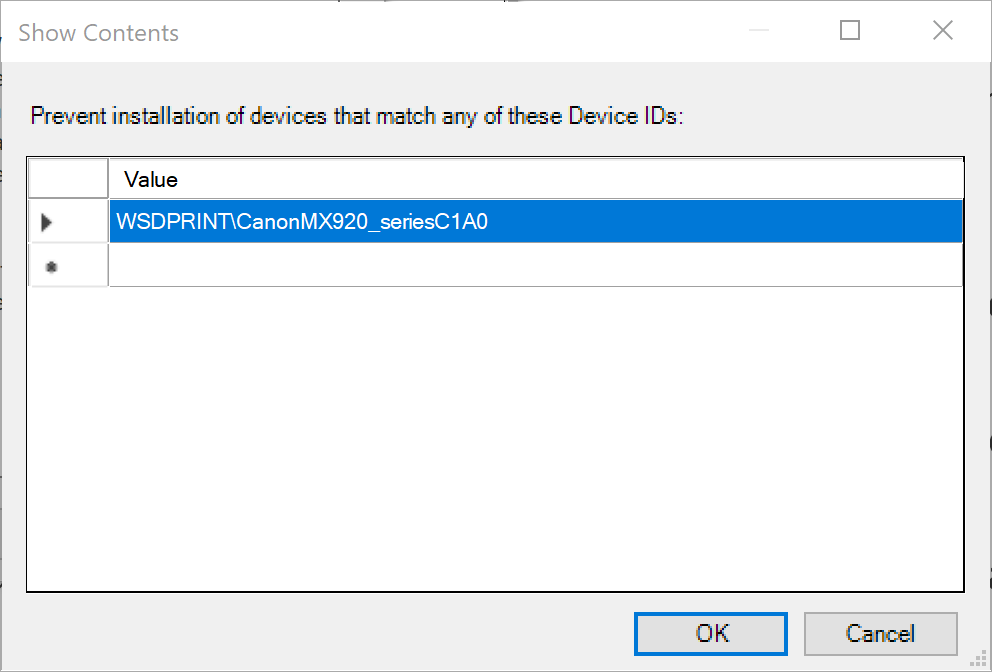<br/>_Prevent Device ID list_

6. Click ‘OK’.

7. Click ‘Apply’ on the bottom right of the policy’s window. This pushes the policy and blocks the target printer in future installations, but doesn’t apply to an existing install.

8. Optional – if you would like to apply the policy to an existing install: Open the **Prevent installation of devices that match any of these device IDs** policy again; in the ‘Options’ window mark the checkbox that says ‘also apply to matching devices that are already installed’.

###	Testing the scenario

If you completed step #8 above and restarted the machine, simply look for your printer under Device Manager or the Windows Settings app and see that it is no-longer available for you to use.

If you have not completed step #8, follow these steps:

1. Uninstall your printer: Device Manager > Printers > right click the Canon Printer > click “Uninstall device”.

2. For USB printer – unplug and plug back the cable; for network device – make a search for the printer in the Windows Settings app.

3. You should not be able to reinstall the printer.


## Scenario #3: Prevent installation of all printers while allowing a specific printer to be installed

Now, using the knowledge from both previous scenarios, you will learn how to prevent the installation of an entire Class of devices while allowing a single printer to be installed.

### Setting up the environment

Setting up the environment for the scenario with the following steps:

1. Open Group Policy Editor and navigate to the Device Installation Restriction section.

2. Disable all previous Device Installation policies, and enable ‘Apply layered order of evaluation’.

3. If there are any enabled policies, changing their status to ‘disabled’, would clear them from all parameters.

4. Have a USB/network printer available to test the policy with.

### Scenario steps – preventing installation of an entire class while allowing a specific printer

Getting the device identifier for both the Printer Class and a specific printer – following the steps in scenario #1 to find Class identifier and scenario #2 to find Device identifier you could get the identifiers you need for this scenario:

- ClassGuid = {4d36e979-e325-11ce-bfc1-08002be10318}
- Hardware ID = WSDPRINT\CanonMX920_seriesC1A0

First create a ‘Prevent Class’ policy and then create ‘Allow Device’ one:

1. Open Group Policy Object Editor – either click the Start button, type mmc gpedit.msc in the Start Search box, and then press ENTER; or type in the Windows search “Group Policy Editor” and open the UI.

2. Navigate to the Device Installation Restriction page: 

    > Computer Configuration > Administrative Templates > System > Device Installation > Device Installation Restrictions

3. Make sure all policies are disabled

4. Open **Prevent installation of devices using drivers that match these device setup classes** policy and select the ‘Enable’ radio button.

5. In the lower left side, in the ‘Options’ window, click the ‘Show…’ box. This will take you to a table where you can enter the class identifier to block.

6. Enter the printer class GUID you found above with the curly braces (this is important! Otherwise, it won’t work): {4d36e979-e325-11ce-bfc1-08002be10318}

    <br/>_List of prevent Class GUIDs_

7. Click ‘OK’.

8. Click ‘Apply’ on the bottom right of the policy’s window – this pushes the policy and blocks all future printer installations, but doesn’t apply to existing installs.

9. To complete the coverage of all future and existing printers – Open the **Prevent installation of devices using drivers that match these device setup classes** policy again; in the ‘Options’ window mark the checkbox that says ‘also apply to matching devices that are already installed’ and click ‘OK’

10. Open the **Apply layered order of evaluation for Allow and Prevent device installation policies across all device match criteria** policy and enable it – this policy will enable you to override the wide coverage of the ‘Prevent’ policy with a specific device.

    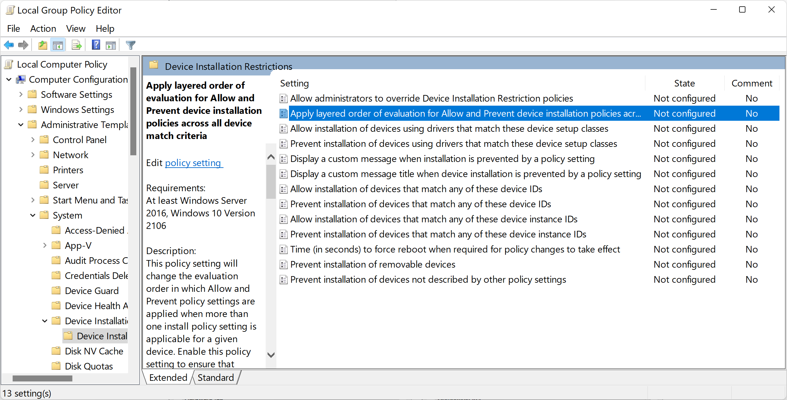

    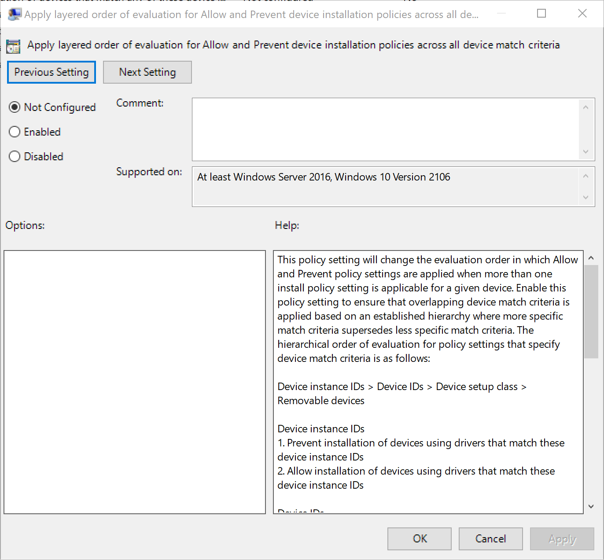<br/>_Apply layered order of evaluation policy_

9. Now Open **Allow installation of devices that match any of these device IDs** policy and select the ‘Enable’ radio button.

10. In the lower left side, in the ‘Options’ window, click the ‘Show…’ box. This will take you to a table where you can enter the device identifier to allow.

11. Enter the printer device ID you found above: WSDPRINT\CanonMX920_seriesC1A0.

    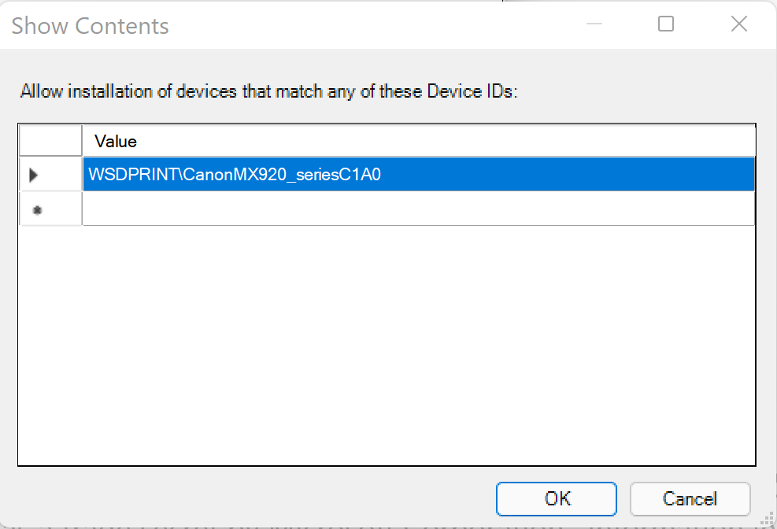<br/>_Allow Printer Hardware ID_

12. Click ‘OK’.

13. Click ‘Apply’ on the bottom right of the policy’s window – this pushes the policy and allows the target printer to be installed (or stayed installed).

## Testing the scenario

1. Simply look for your printer under Device Manager or the Windows Settings app and see that it is still there and accessible. Or just print a test document.

2. Go back to the Group Policy Editor, disable **Apply layered order of evaluation for Allow and Prevent device installation policies across all device match criteria** policy and test again your printer – you should not be bale to print anything or able to access the printer at all.


## Scenario #4: Prevent installation of a specific USB device

The scenario builds upon the knowledge from scenario #2, Prevent installation of a specific printer. In this scenario, you will gain an understanding of how some devices are built into the PnP (Plug and Play) device tree.

### Setting up the environment

Setting up the environment for the scenario with the following steps:

1. Open Group Policy Editor and navigate to the Device Installation Restriction section

2. Make sure all previous Device Installation policies are disabled except ‘Apply layered order of evaluation’ (this is optional to be On/Off this scenario) – although the policy is disabled in default, it is recommended to be enabled in most practical applications.

### Scenario steps – preventing installation of a specific device

Getting the right device identifier to prevent it from being installed and its location in the PnP tree:

1. Connect a USB thumb drive to the machine

2. Open Device Manager

3. Find the USB thumb-drive and select it.
 
    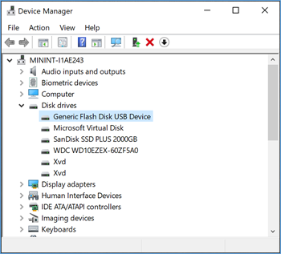<br/>_Selecting the usb thumb-drive in Device Manager_

4. Change View (in the top menu) to ‘Devices by connections’. This view represents the way devices are installed in the PnP tree.

    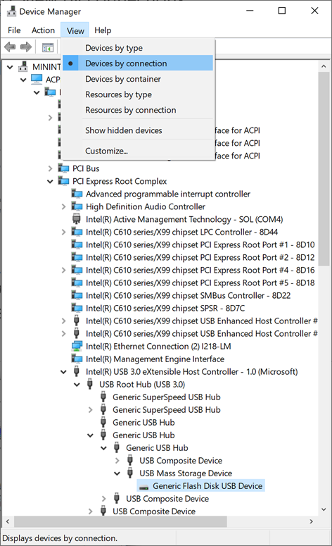<br/>_Changing view in Device Manager to see the PnP connection tree_

    > [!NOTE]
    > When blocking\Preventing a device that sits higher in the PnP tree, all the devices that sit under it will be blocked. For example: Preventing a “Generic USB Hub” from being installed, all the devices that lay below a “Generic USB Hub” will be blocked.
 
    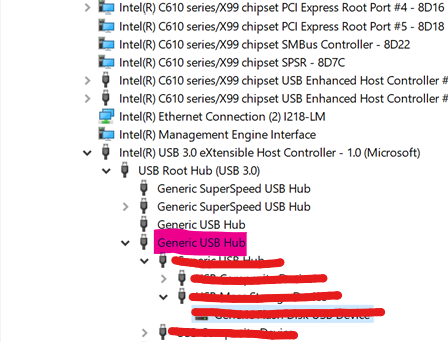<br/>_When blocking one device, all the devices that are nested below it will be blocked as well_

5. Double-click the USB thumb-drive and move to the ‘Details’ tab.

6. From the ‘Value’ window, copy the most detailed Hardware ID—we will use this in the policies. In this case Device ID = USBSTOR\DiskGeneric_Flash_Disk______8.07
 
    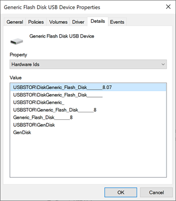<br/>_USB device hardware IDs_

Creating the policy to prevent a single USB thumb-drive from being installed:

1. Open Group Policy Object Editor – either click the Start button, type mmc gpedit.msc in the Start Search box, and then press ENTER; or type in the Windows search “Group Policy Editor” and open the UI.

2. Navigate to the Device Installation Restriction page: 

    > Computer Configuration > Administrative Templates > System > Device Installation > Device Installation Restrictions

3. Open **Prevent installation of devices that match any of these device IDs** policy and select the ‘Enable’ radio button.

4. In the lower left side, in the ‘Options’ window, click the ‘Show’ box. This will take you to a table where you can enter the device identifier to block.

5. Enter the USB thumb-drive device ID you found above – USBSTOR\DiskGeneric_Flash_Disk______8.07
 
    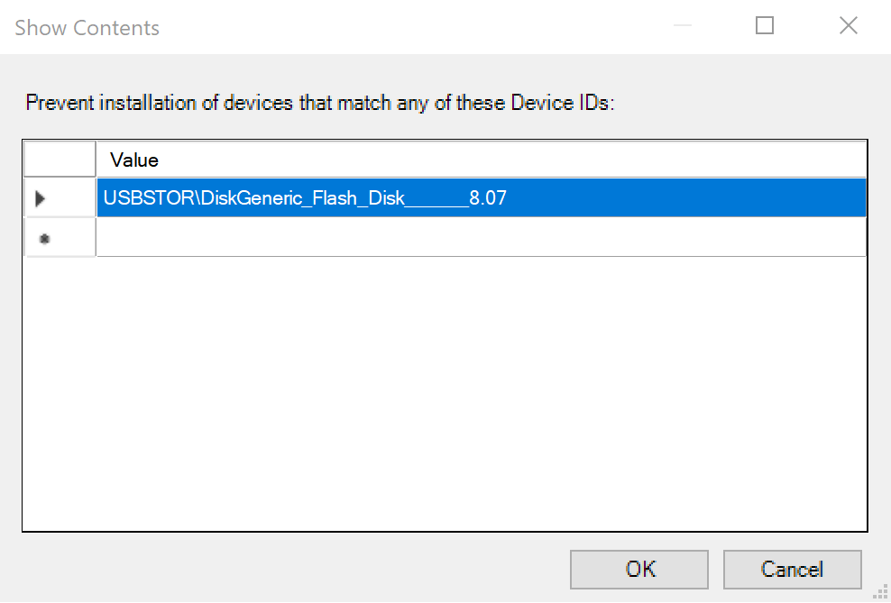<br/>_Prevent Device IDs list_

6. Click ‘OK’.

7. Click ‘Apply’ on the bottom right of the policy’s window – this pushes the policy and blocks the target USB thumb-drive in future installations, but doesn’t apply to an existing install.

8. Optional – if you would like to apply the policy to an existing install: Open the **Prevent installation of devices that match any of these device IDs** policy again; in the ‘Options’ window, mark the checkbox that says ‘also apply to matching devices that are already installed’


### Testing the scenario

1. If you have not completed step #8 – follow these steps:

    - Uninstall your USB thumb-drive: Device Manager > Disk drives > right click the target USB thumb-drive > click “Uninstall device”.
    - You should not be able to reinstall the device.

2. If you completed step #8 above and restarted the machine, simply look for your Disk drives under Device Manager and see that it is no-longer available for you to use.


## Scenario #5: Prevent installation of all USB devices while allowing an installation of only an authorized USB thumb-drive

Now, using the knowledge from all the previous 4 scenarios, you will learn how to prevent the installation of an entire Class of devices while allowing a single authorized USB thumb-drive to be installed.

### Setting up the environment

Setting up the environment for the scenario with the following steps:

1. Open Group Policy Editor and navigate to the Device Installation Restriction section.

2. Disable all previous Device Installation policies, and **enable** ‘Apply layered order of evaluation’.

3. If there are any enabled policies, changing their status to ‘disabled’, would clear them from all parameters.

4. Have a USB thumb-drive available to test the policy with.

### Scenario steps – preventing installation of all USB devices while allowing only an authorized USB thumb-drive

Getting the device identifier for both the USB Classes and a specific USB thumb-drive – following the steps in scenario #1 to find Class identifier and scenario #4 to find Device identifier you could get the identifiers you need for this scenario:

- USB Bus Devices (hubs and host controllers)
  - Class = USB
  - ClassGuid = {36fc9e60-c465-11cf-8056-444553540000}
  - This class includes USB host controllers and USB hubs, but not USB peripherals. Drivers for this class are system-supplied.

- USB Device
  - Class = USBDevice
  - ClassGuid = {88BAE032-5A81-49f0-BC3D-A4FF138216D6}
  - USBDevice includes all USB devices that do not belong to another class. This class is not used for USB host controllers and hubs.

- Hardware ID = USBSTOR\DiskGeneric_Flash_Disk______8.07

As mentioned in scenario #4, it is not enough to enable only a single hardware ID in order to enable a single USB thumb-drive. The IT admin has to ensure all the USB devices that preceding the target one are not blocked (allowed) as well. In Our case the following devices has to be allowed so the target USB thumb-drive could be allowed as well:

- “Intel(R) USB 3.0 eXtensible Host Controller – 1.0 (Microsoft)” -> PCI\CC_0C03
- “USB Root Hub (USB 3.0)” -> USB\ROOT_HUB30
- “Generic USB Hub” -> USB\USB20_HUB
 
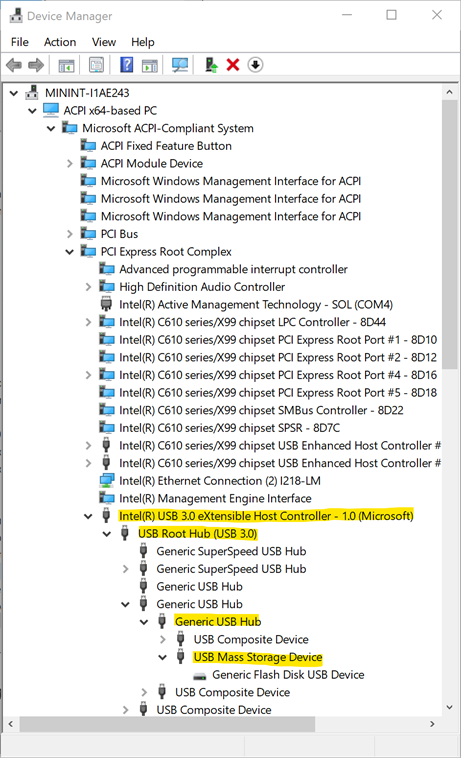<br/>_USB devices nested under each other in the PnP tree_

These devices are internal devices on the machine that define the USB port connection to the outside world. Enabling them should not enable any external/peripheral device from being installed on the machine.

> [!IMPORTANT]
> Some device in the system have several layers of connectivity to define their installation on the system. USB thumb-drives are such devices. Thus, when looking to either block or allow them on a system, it is important to understand the path of connectivity for each device. There are several generic Device IDs that are commonly used in systems and could provide a good start to build an ‘Allow list’ in such cases. See below for the list:
> 
> 	PCI\CC_0C03; PCI\CC_0C0330; PCI\VEN_8086; PNP0CA1; PNP0CA1&HOST (for Host Controllers)/
> USB\ROOT_HUB30; USB\ROOT_HUB20 (for USB Root Hubs)/
> USB\USB20_HUB (for Generic USB Hubs)/
> 
> Specifically for desktop machines, it is very important to list all the USB devices that your keyboards and mice are connected through in the above list. Failing to do so could block a user from accessing its machine through HID devices. 
>
> Different PC manufacturers sometimes have different ways to nest USB devices in the PnP tree, but in general this is how it is done.

First create a ‘Prevent Class’ policy and then create ‘Allow Device’ one:

1. Open Group Policy Object Editor – either click the Start button, type mmc gpedit.msc in the Start Search box, and then press ENTER; or type in the Windows search “Group Policy Editor” and open the UI.

2. Navigate to the Device Installation Restriction page: 

    > Computer Configuration > Administrative Templates > System > Device Installation > Device Installation Restrictions

3. Make sure all policies are disabled

4. Open **Prevent installation of devices using drivers that match these device setup classes** policy and select the ‘Enable’ radio button.

5. In the lower left side, in the ‘Options’ window, click the ‘Show…’ box. This will take you to a table where you can enter the class identifier to block.

6. Enter both USB classes GUID you found above with the curly braces:

    > {36fc9e60-c465-11cf-8056-444553540000}/
    > {88BAE032-5A81-49f0-BC3D-A4FF138216D6} 

7. Click ‘OK’.

8. Click ‘Apply’ on the bottom right of the policy’s window – this pushes the policy and blocks all future USB device installations, but doesn’t apply to existing installs.

    > [!IMPORTANT]
    > The previous step prevents all future USB devices from being installed. Before you move to the next step make sure you have as complete list as possible of all the USB Host Controllers, USB Root Hubs and Generic USB Hubs Device IDs available to prevent blocking you from interacting with your system through keyboards and mice.

9. Open the **Apply layered order of evaluation for Allow and Prevent device installation policies across all device match criteria** policy and enable it – this policy will enable you to override the wide coverage of the ‘Prevent’ policy with a specific device.

    <br/>_Apply layered order of evaluation policy_

10. Now Open **Allow installation of devices that match any of these device IDs** policy and select the ‘Enable’ radio button.

11. In the lower left side, in the ‘Options’ window, click the ‘Show…’ box. This will take you to a table where you can enter the device identifier to allow.

12. Enter the full list of USB device IDs you found above including the specific USB Thumb-drive you would like to authorize for installation – USBSTOR\DiskGeneric_Flash_Disk______8.07

    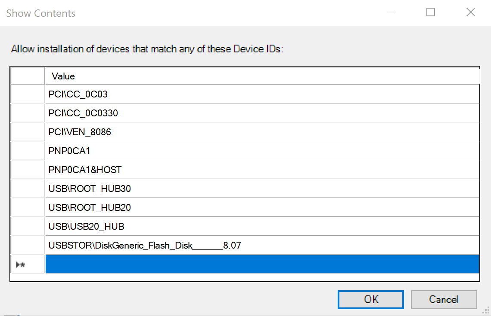<br/>_Allowed USB Device IDs list_

13. Click ‘OK’.

14. Click ‘Apply’ on the bottom right of the policy’s window.

15. To apply the ‘Prevent’ coverage of all currently installed USB devices – Open the **Prevent installation of devices using drivers that match these device setup classes** policy again; in the ‘Options’ window mark the checkbox that says ‘also apply to matching devices that are already installed’ and click ‘OK’.

### Testing the scenario

You should not be able to install any USB thumb-drive, except the one you authorized for usage
