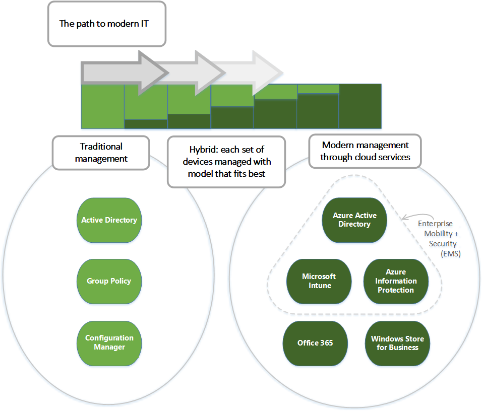
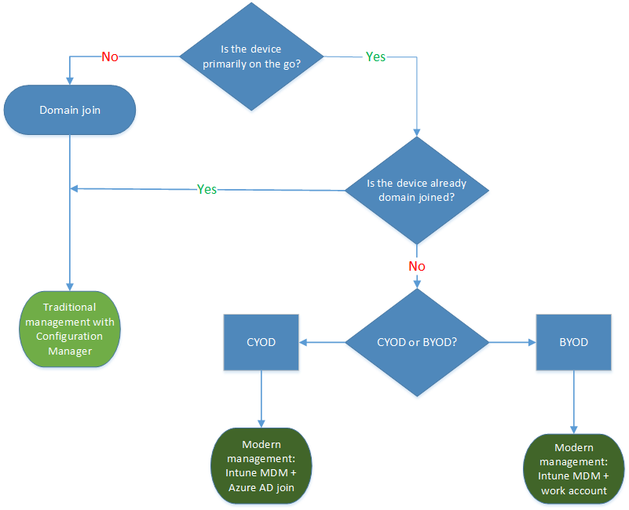

# Manage Windows 10 in your organization - transitioning to modern management

Use of personal devices for work, as well as employees working outside the office, may be changing how your organization manages devices. Certain parts of your organization might require deep, granular control over devices, while other parts might seek lighter, scenario-based management that empowers the modern workforce. Windows 10 offers the flexibility to respond to these changing requirements, and can easily be deployed in a mixed environment. You can shift the percentage of Windows 10 devices gradually, following the normal upgrade schedules used in your organization.

Your organization might have considered bringing in Windows 10 devices and downgrading them to Windows 7 until everything is in place for a formal upgrade process. While this may appear to save costs due to standardization, greater savings can come from avoiding the downgrade and immediately taking advantage of the cost reductions Windows 10 can provide. Because Windows 10 devices can be managed using the same processes and technology as other previous Windows versions, it’s easy for versions to coexist.

Your organization can support various operating systems across a wide range of device types, and manage them through a common set of tools such as System Center Configuration Manager, Microsoft Intune, or other third-party products. This “managed diversity” enables you to empower your users to benefit from the productivity enhancements available on their new Windows 10 devices (including rich touch and ink support), while still maintaining your standards for security and manageability. It can help you and your organization benefit from Windows 10 much faster.

This six-minute video demonstrates how users can bring in a new retail device and be up and working with their personalized settings and a managed experience in a few minutes, without being on the corporate network. It also demonstrates how IT can apply policies and configurations to ensure device compliance.

> [!VIDEO https://www.youtube.com/embed/g1rIcBhhxpA]

 >[!NOTE]
 >The video demonstrates the configuration process using the classic Azure portal, which is retired. Customers should use the new Azure portal. [Learn how use the new Azure portal to perform tasks that you used to do in the classic Azure portal.](https://docs.microsoft.com/information-protection/deploy-use/migrate-portal)

This topic offers guidance on strategies for deploying and managing Windows 10, including deploying Windows 10 in a mixed environment. The topic covers [management options](#reviewing-the-management-options-with-windows-10) plus the four stages of the device lifecycle:

-   [Deployment and Provisioning](#deployment-and-provisioning)

-   [Identity and Authentication](#identity-and-authentication)

-   [Configuration](#settings-and-configuration)

-   [Updating and Servicing](#updating-and-servicing)

## Reviewing the management options with Windows 10

Windows 10 offers a range of management options, as shown in the following diagram:

As indicated in the diagram, Microsoft continues to provide support for deep manageability and security through technologies like Group Policy, Active Directory, and System Center Configuration Manager. It also delivers a “mobile-first, cloud-first” approach of simplified, modern management using cloud-based device management solutions such as Microsoft Enterprise Mobility + Security (EMS). Future Windows innovations, delivered through Windows as a Service, are complemented by cloud services like Microsoft Intune, Azure Active Directory, Azure Information Protection, Office 365, and the Microsoft Store for Business.

## Deployment and Provisioning

With Windows 10, you can continue to use traditional OS deployment, but you can also “manage out of the box.” To transform new devices into fully-configured, fully-managed devices, you can:

-   Avoid reimaging by using dynamic provisioning, enabled by a cloud-based device management services such as [Microsoft Autopilot](https://docs.microsoft.com/windows/deployment/windows-10-auto-pilot) or [Microsoft Intune](https://docs.microsoft.com/intune/understand-explore/introduction-to-microsoft-intune).

-   Create self-contained provisioning packages built with the [Windows Configuration Designer](https://technet.microsoft.com/itpro/windows/deploy/provisioning-packages).

-   Use traditional imaging techniques such as deploying custom images using [System Center Configuration Manager](https://docs.microsoft.com/sccm/core/understand/introduction).

You have multiple options for [upgrading to Windows 10](https://technet.microsoft.com/itpro/windows/deploy/windows-10-deployment-scenarios). For existing devices running Windows 7 or Windows 8.1, you can use the robust in-place upgrade process for a fast, reliable move to Windows 10 while automatically preserving all the existing apps, data, and settings. This can mean significantly lower deployment costs, as well as improved productivity as end users can be immediately productive – everything is right where they left it. Of course, you can also use a traditional wipe-and-load approach if you prefer, using the same tools that you use today with Windows 7.

## Identity and Authentication

You can use Windows 10 and services like [Azure Active Directory](https://azure.microsoft.com/documentation/articles/active-directory-whatis/) in new ways for cloud-based identity, authentication, and management. You can offer your users the ability to **“bring your own device” (BYOD)** or to **“choose your own device” (CYOD)** from a selection you make available. At the same time, you might be managing PCs and tablets that must be domain-joined because of specific applications or resources that are used on them.

You can envision user and device management as falling into these two categories:

-   **Corporate (CYOD) or personal (BYOD) devices used by mobile users for SaaS apps such as Office 365.** With Windows 10, your employees can self-provision their devices:

    -   For corporate devices, they can set up corporate access with [Azure AD Join](https://azure.microsoft.com/documentation/articles/active-directory-azureadjoin-overview/). When you offer them Azure AD Join with automatic Intune MDM enrollment, they can bring devices into a corporate-managed state in [*one step*](https://blogs.technet.microsoft.com/ad/2015/08/14/windows-10-azure-ad-and-microsoft-intune-automatic-mdm-enrollment-powered-by-the-cloud/), all from the cloud. Azure AD Join is also a great solution for temporary staff, partners, or other part-time employees. These accounts can be kept separate from the on-premises AD domain but still access needed corporate resources.

    -   Likewise, for personal devices, employees can use a new, simplified [BYOD experience](https://azure.microsoft.com/documentation/articles/active-directory-azureadjoin-windows10-devices/) to add their work account to Windows, then access work resources on the device.

-   **Domain joined PCs and tablets used for traditional applications and access to important resources.** These may be traditional applications and resources that require authentication or accessing highly sensitive or classified resources on-premises.
    With Windows 10, if you have an on-premises [Active Directory](https://technet.microsoft.com/windows-server-docs/identity/whats-new-active-directory-domain-services) domain that’s [integrated with Azure AD](https://azure.microsoft.com/documentation/articles/active-directory-azureadjoin-devices-group-policy/), when employee devices are joined, they automatically register with Azure AD. This provides:

    -   Single sign-on to cloud and on-premises resources from everywhere

    -   [Enterprise roaming of settings](https://azure.microsoft.com/documentation/articles/active-directory-windows-enterprise-state-roaming-overview/)

    -   [Conditional access](https://azure.microsoft.com/documentation/articles/active-directory-conditional-access/) to corporate resources based on the health or configuration of the device

    -   [Windows Hello for Business](https://technet.microsoft.com/itpro/windows/keep-secure/manage-identity-verification-using-microsoft-passport)

    -   Windows Hello

    Domain joined PCs and tablets can continue to be managed with the [System Center Configuration Manager](https://docs.microsoft.com/sccm/core/understand/introduction) client or Group Policy.

For more information about how Windows 10 and Azure AD optimize access to work resources across a mix of devices and scenarios, see [Using Windows 10 devices in your workplace](https://azure.microsoft.com/documentation/articles/active-directory-azureadjoin-windows10-devices/).

As you review the roles in your organization, you can use the following generalized decision tree to begin to identify users or devices that require domain join. Consider switching the remaining users to Azure AD.

## Settings and Configuration

Your configuration requirements are defined by multiple factors, including the level of management needed, the devices and data managed, and your industry requirements. Meanwhile, employees are frequently concerned about IT applying strict policies to their personal devices, but they still want access to corporate email and documents. With Windows 10, you can create a consistent set of configurations across PCs, tablets, and phones through the common MDM layer. 

**MDM**: [MDM](https://www.microsoft.com/en-us/cloud-platform/mobile-device-management) gives you a way to configure settings that achieve your administrative intent without exposing every possible setting. (In contrast, Group Policy exposes fine-grained settings that you control individually.) One benefit of MDM is that it enables you to apply broader privacy, security, and application management settings through lighter and more efficient tools. MDM also allows you to target Internet-connected devices to manage policies without using GP that requires on-premises domain-joined devices. This makes MDM the best choice for devices that are constantly on the go.

**Group Policy** and **System Center Configuration Manager**: Your organization might still need to manage domain joined computers at a granular level such as Internet Explorer’s 1,500 configurable Group Policy settings. If so, Group Policy and System Center Configuration Manager continue to be excellent management choices:

-   Group Policy is the best way to granularly configure domain joined Windows PCs and tablets connected to the corporate network using Windows-based tools. Microsoft continues to add Group Policy settings with each new version of Windows.

-   Configuration Manager remains the recommended solution for granular configuration with robust software deployment, Windows updates, and OS deployment.

## Updating and Servicing

With Windows as a Service, your IT department no longer needs to perform complex imaging (wipe-and-load) processes with each new Windows release. Whether on current branch (CB) or current branch for business (CBB), devices receive the latest feature and quality updates through simple – often automatic – patching processes. For more information, see [Windows 10 deployment scenarios](https://technet.microsoft.com/itpro/windows/deploy/windows-10-deployment-scenarios).

MDM with Intune provide tools for applying Windows updates to client computers in your organization. Configuration Manager allows rich management and tracking capabilities of these updates, including maintenance windows and automatic deployment rules.

## Next steps

There are a variety of steps you can take to begin the process of modernizing device management in your organization:

**Assess current management practices, and look for investments you might make today.** Which of your current practices need to stay the same, and which can you change? Specifically, what elements of traditional management do you need to retain and where can you modernize? Whether you take steps to minimize custom imaging, re-evaluate settings management, or reassesses authentication and compliance, the benefits can be immediate. You can use the [MDM Migration Analysis Tool (MMAT)](https://aka.ms/mmat) to help determine which Group Policies are set for a target user/computer and cross-reference them against the list of available MDM policies.

**Assess the different use cases and management needs in your environment.** Are there groups of devices that could benefit from lighter, simplified management? BYOD devices, for example, are natural candidates for cloud-based management. Users or devices handling more highly regulated data might require an on-premises Active Directory domain for authentication. Configuration Manager and EMS provide you the flexibility to stage implementation of modern management scenarios while targeting different devices the way that best suits your business needs.

**Review the decision trees in this article.** With the different options in Windows 10, plus Configuration Manager and Enterprise Mobility + Security, you have the flexibility to handle imaging, authentication, settings, and management tools for any scenario.

**Take incremental steps.** Moving towards modern device management doesn’t have to be an overnight transformation. New operating systems and devices can be brought in while older ones remain. With this “managed diversity,” users can benefit from productivity enhancements on new Windows 10 devices, while you continue to maintain older devices according to your standards for security and manageability. Starting with Windows 10, version 1803, the new policy [MDMWinsOverGP](https://docs.microsoft.com/windows/client-management/mdm/policy-csp-controlpolicyconflict#controlpolicyconflict-mdmwinsovergp) was added to allow MDM policies to take precedence over GP when both GP and its equivalent MDM policies are set on the device. You can start implementing MDM policies while keeping your GP environment. Here is the list of MDM policies with equivalent GP - [Policies supported by GP](https://docs.microsoft.com/windows/client-management/mdm/policy-configuration-service-provider#policies-supported-by-gp)

**Optimize your existing investments**. On the road from traditional on-premises management to modern cloud-based management, take advantage of the flexible, hybrid architecture of Configuration Manager and Intune. Starting with Configuration Manager 1710, co-management enables you to concurrently manage Windows 10 devices by using both Configuration Manager and Intune. See these topics for details:

-   [Co-management for Windows 10 devices](https://docs.microsoft.com/sccm/core/clients/manage/co-management-overview)
-   [Prepare Windows 10 devices for co-management](https://docs.microsoft.com/sccm/core/clients/manage/co-management-prepare)
-   [Switch Configuration Manager workloads to Intune](https://docs.microsoft.com/sccm/core/clients/manage/co-management-switch-workloads)
-   [Co-management dashboard in System Center Configuration Manager](https://docs.microsoft.com/sccm/core/clients/manage/co-management-dashboard)

## Related topics

-   [What is Intune?](https://docs.microsoft.com/intune/introduction-intune)
-   [Windows 10 Policy CSP](https://docs.microsoft.com/windows/client-management/mdm/policy-configuration-service-provider)
-   [Windows 10 Configuration service Providers](https://docs.microsoft.com/windows/client-management/mdm/configuration-service-provider-reference)
