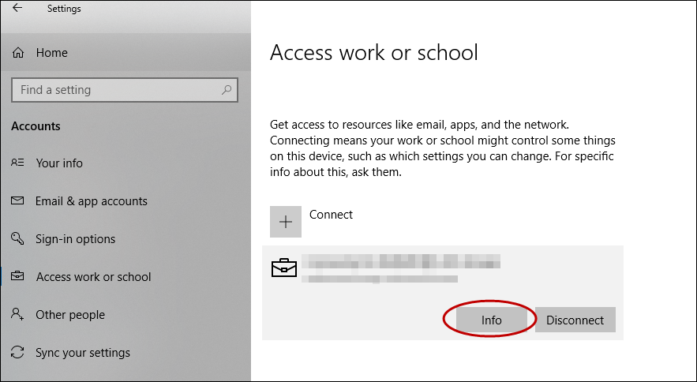
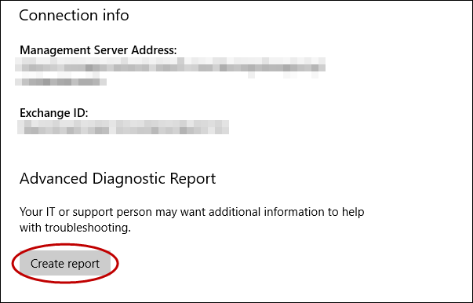
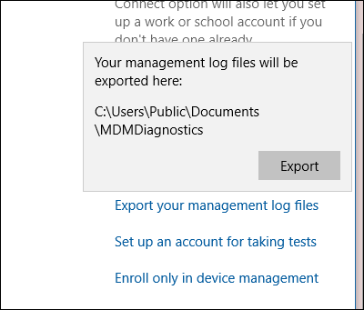
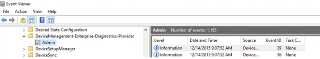
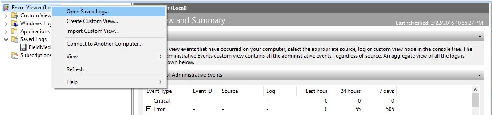
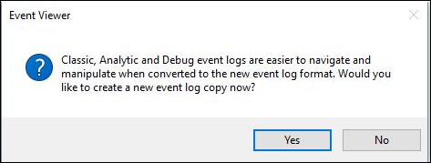
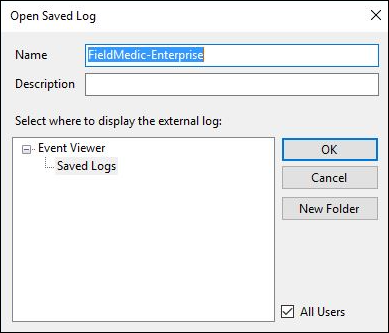
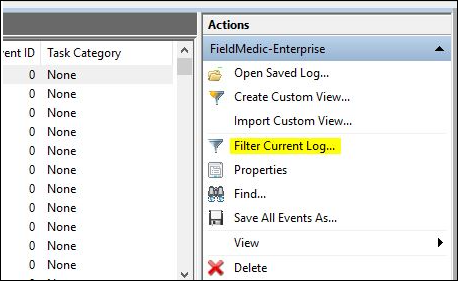
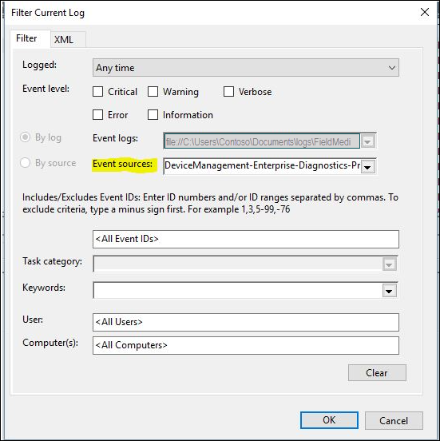
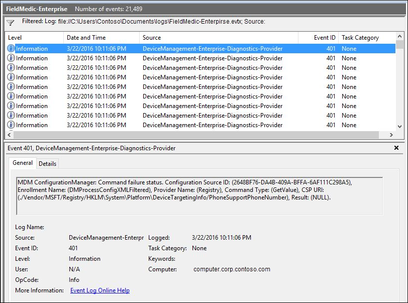

# Collect MDM logs

To help diagnose enrollment or device management issues in Windows devices managed by an MDM server, you can examine the MDM logs collected from the desktop. The following sections describe the procedures for collecting MDM logs.

## Download the MDM Diagnostic Information log from Windows devices

1. On your managed device, go to **Settings** > **Accounts** > **Access work or school**.
1. Select your work or school account, then select **Info**.

   

1. At the bottom of the **Settings** page, select **Create report**.

   
1. A window opens that shows the path to the log files. Select **Export**.

   

1. In File Explorer, navigate to `C:\Users\Public\Documents\MDMDiagnostics` to see the report.

## Use command to collect logs directly from Windows devices

You can also collect the MDM Diagnostic Information logs using the following command:

```xml
mdmdiagnosticstool.exe -area "DeviceEnrollment;DeviceProvisioning;Autopilot" -zip "c:\users\public\documents\MDMDiagReport.zip"
```

- In File Explorer, navigate to c:\Users\Public\Documents\MDMDiagnostics to see the report.

### Understanding zip structure

The zip file has logs according to the areas that were used in the command. This explanation is based on DeviceEnrollment, DeviceProvisioning, and Autopilot areas. It applies to the zip files collected via command line or Feedback Hub

- DiagnosticLogCSP_Collector_Autopilot_*: Autopilot etls
- DiagnosticLogCSP_Collector_DeviceProvisioning_*: Provisioning etls (Microsoft-Windows-Provisioning-Diagnostics-Provider)
- MDMDiagHtmlReport.html: Summary snapshot of MDM configurations and policies. Includes, management url, MDM server device ID, certificates, policies.
- MdmDiagLogMetadata.json: mdmdiagnosticstool metadata file that contains command-line arguments used to run the tool.
- MDMDiagReport.xml: contains a more detailed view into the MDM configurations, such as enrollment variables, provisioning packages, multivariant conditions, and others. For more information about diagnosing provisioning packages, see [Diagnose provisioning packages](/windows/configuration/provisioning-packages/diagnose-provisioning-packages).
- MdmDiagReport_RegistryDump.reg: contains dumps from common MDM registry locations
- MdmLogCollectorFootPrint.txt: mdmdiagnosticslog tool logs from running the command
- *.evtx: Common event viewer logs microsoft-windows-devicemanagement-enterprise-diagnostics-provider-admin.evtx main one that contains MDM events.

## Collect logs directly from Windows devices

MDM logs are captured in the Event Viewer in the following location:

- Applications and Services Logs > Microsoft > Windows > DeviceManagement-Enterprise-Diagnostic-Provider

Here's a screenshot:



In this location, the **Admin** channel logs events by default. However, if you need more details logs you can enable **Debug** logs by choosing **Show Analytic and Debug** logs option in **View** menu in Event Viewer.

### Collect admin logs

1. Right-click the **Admin** node.
1. Select **Save all events as**.
1. Choose a location and enter a filename.
1. Select **Save**.
1. Choose **Display information for these languages** and then select **English**.
1. Select **Ok**.

For more detailed logging, you can enable **Debug** logs. Right-click on the **Debug** node and then select **Enable Log**.

### Collect debug logs

1. Right-click on the **Debug** node.
1. Select **Save all events as**.
1. Choose a location and enter a filename.
1. Select **Save**.
1. Choose **Display information for these languages** and then select **English**.
1. Select **Ok**.

You can open the log files (.evtx files) in the Event Viewer on a Windows device.

## Collect logs remotely from Windows devices

When the PC is already enrolled in MDM, you can remotely collect logs from the PC through the MDM channel if your MDM server supports this facility. The [DiagnosticLog CSP](mdm/diagnosticlog-csp.md) can be used to enable an event viewer channel by full name. Here are the Event Viewer names for the Admin and Debug channels:

- Microsoft-Windows-DeviceManagement-Enterprise-Diagnostics-Provider%2FAdmin
- Microsoft-Windows-DeviceManagement-Enterprise-Diagnostics-Provider%2FDebug

Example: Enable the Debug channel logging

```xml
<SyncML xmlns="SYNCML:SYNCML1.2">
    <SyncBody>
        <Replace>
            <CmdID>2</CmdID>
            <Item>
                <Target>
                    <LocURI>./Vendor/MSFT/DiagnosticLog/EtwLog/Channels/Microsoft-Windows-DeviceManagement-Enterprise-Diagnostics-Provider%2FDebug/State</LocURI>
                </Target>
                <Meta>
                    <Format xmlns="syncml:metinf">bool</Format>
                </Meta>
                <Data>true</Data>
            </Item>
        </Replace>
        <Final/>
    </SyncBody>
</SyncML>
```

Example: Export the Debug logs

```xml
<?xml version="1.0"?>
<SyncML xmlns="SYNCML:SYNCML1.2">
    <SyncBody>
        <Exec>
            <CmdID>2</CmdID>
            <Item>
                <Target>
                    <LocURI>./Vendor/MSFT/DiagnosticLog/EtwLog/Channels/Microsoft-Windows-DeviceManagement-Enterprise-Diagnostics-Provider%2FDebug/Export</LocURI>
                </Target>
            </Item>
        </Exec>
        <Final/>
    </SyncBody>
</SyncML>
```

## Collect logs remotely from Windows Holographic

For holographic already enrolled in MDM, you can remotely collect MDM logs through the MDM channel using the [DiagnosticLog CSP](mdm/diagnosticlog-csp.md).

You can use the DiagnosticLog CSP to enable the ETW provider. The provider ID is 3DA494E4-0FE2-415C-B895-FB5265C5C83B. The following examples show how to enable the ETW provider:

Add a collector node

```xml
<?xml version="1.0"?>
<SyncML xmlns="SYNCML:SYNCML1.2">
    <SyncBody>
        <Add>
            <CmdID>1</CmdID>
            <Item>
                <Target>
                   <LocURI>./Vendor/MSFT/DiagnosticLog/EtwLog/Collectors/MDM</LocURI>
                </Target>
                <Meta>
                    <Format xmlns="syncml:metinf">node</Format>
                </Meta>
            </Item>
        </Add>
        <Final/>
    </SyncBody>
</SyncML>
```

Add the ETW provider to the trace

```xml
<?xml version="1.0"?>
<SyncML xmlns="SYNCML:SYNCML1.2">
    <SyncBody>
        <Add>
            <CmdID>1</CmdID>
            <Item>
                <Target>
                    <LocURI>./Vendor/MSFT/DiagnosticLog/EtwLog/Collectors/MDM/Providers/3DA494E4-0FE2-415C-B895-FB5265C5C83B</LocURI>
                </Target>
                <Meta>
                    <Format xmlns="syncml:metinf">node</Format>
                </Meta>
            </Item>
        </Add>
        <Final/>
    </SyncBody>
</SyncML>
```

Start collector trace logging

```xml
<?xml version="1.0"?>
<SyncML xmlns="SYNCML:SYNCML1.2">
    <SyncBody>
        <Exec>
            <CmdID>2</CmdID>
            <Item>
                <Target>
                    <LocURI>./Vendor/MSFT/DiagnosticLog/EtwLog/Collectors/MDM/TraceControl</LocURI>
                </Target>
                <Meta>
                    <Format xmlns="syncml:metinf">chr</Format>
                </Meta>
                <Data>START</Data>
            </Item>
        </Exec>
        <Final/>
    </SyncBody>
</SyncML>
```

Stop collector trace logging

```xml
<?xml version="1.0"?>
<SyncML xmlns="SYNCML:SYNCML1.2">
    <SyncBody>
        <Exec>
            <CmdID>2</CmdID>
            <Item>
                <Target>
                    <LocURI>./Vendor/MSFT/DiagnosticLog/EtwLog/Collectors/MDM/TraceControl</LocURI>
                </Target>
                <Meta>
                    <Format xmlns="syncml:metinf">chr</Format>
                </Meta>
                <Data>STOP</Data>
            </Item>
        </Exec>
        <Final/>
    </SyncBody>
</SyncML>
```

After the logs are collected on the device, you can retrieve the files through the MDM channel using the FileDownload portion of the DiagnosticLog CSP. For details, see [DiagnosticLog CSP](mdm/diagnosticlog-csp.md).

## View logs

For best results, ensure that the PC or VM on which you're viewing logs matches the build of the OS from which the logs were collected.

1. Open eventvwr.msc.
1. Right-click on **Event Viewer(Local)** and select **Open Saved Log**.

    

1. Navigate to the etl file that you got from the device and then open the file.
1. Select **Yes** when prompted to save it to the new log format.

    

    

1. The new view contains traces from the channel. Select **Filter Current Log** from the **Actions** menu.

    

1. Add a filter to Event sources by selecting **DeviceManagement-EnterpriseDiagnostics-Provider** and select **OK**.

    

1. Now you're ready to start reviewing the logs.

    

## Collect device state data

Here's an example of how to collect current MDM device state data using the [DiagnosticLog CSP](mdm/diagnosticlog-csp.md). You can collect the file from the device using the same FileDownload node in the CSP as you do for the etl files.

```xml
<?xml version="1.0"?>
<SyncML xmlns="SYNCML:SYNCML1.2">
  <SyncBody>
    <Exec>
      <CmdID>2</CmdID>
      <Item>
        <Target>
          <LocURI>./Vendor/MSFT/DiagnosticLog/DeviceStateData/MdmConfiguration</LocURI>
        </Target>
        <Meta>
           <Format xmlns="syncml:metinf">chr</Format>
        </Meta>
        <Data>SNAP</Data>
      </Item>
    </Exec>
    <Final/>
  </SyncBody>
</SyncML>
```
