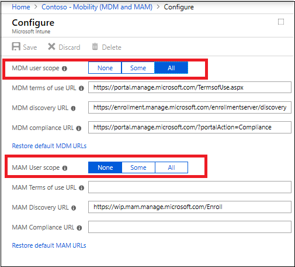
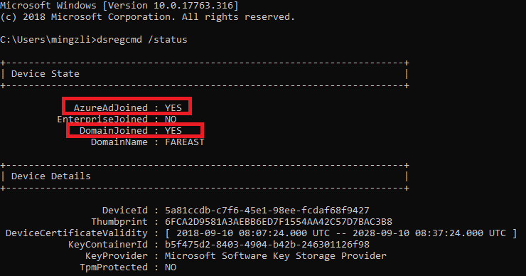
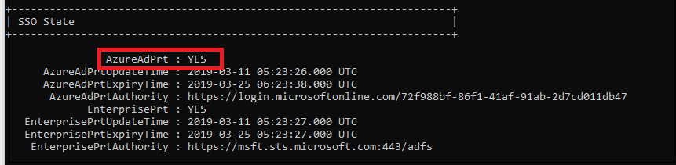
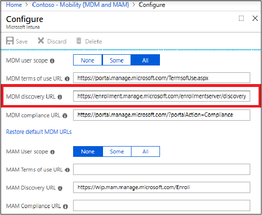

# Diagnose MDM enrollment

This article provides suggestions for troubleshooting device enrollment issues for MDM.

## Verify autoenrollment requirements and settings

To ensure that the autoenrollment feature is working as expected, you must verify that various requirements and settings are configured correctly. The following steps demonstrate required settings using the Intune service:

1. Verify that the user who is going to enroll the device has a valid [Intune license](/mem/intune/fundamentals/licenses).

   :::image type="content" alt-text="Screenshot of Intune license verification." source="images/auto-enrollment-intune-license-verification.png" lightbox="images/auto-enrollment-intune-license-verification.png":::

1. Verify that autoenrollment is activated for those users who are going to enroll the devices into Mobile Device Management (MDM) with Intune. For more information, see [Microsoft Entra ID and Microsoft Intune: Automatic MDM enrollment in the new Portal](./azure-ad-and-microsoft-intune-automatic-mdm-enrollment-in-the-new-portal.md).

    

    > [!IMPORTANT]
    > For bring-your-own devices (BYOD devices), the Mobile Application Management (MAM) user scope takes precedence if both MAM user scope and MDM user scope (automatic MDM enrollment) are enabled for all users (or the same groups of users). The device will use Windows Information Protection (WIP) Policies (if you configured them) rather than being MDM enrolled.
    >
    > For corporate-owned devices, the MDM user scope takes precedence if both scopes are enabled. The devices get MDM enrolled.

1. Verify that the device is running a [supported version of Windows](/windows/release-health/supported-versions-windows-client).

1. Autoenrollment into Intune via Group Policy is valid only for devices that are Microsoft Entra hybrid joined. This condition means that the device must be joined into both local Active Directory and Microsoft Entra ID. To verify that the device is Microsoft Entra hybrid joined, run `dsregcmd /status` from the command line.

    You can confirm that the device is properly hybrid-joined if both **AzureAdJoined** and **DomainJoined** are set to **YES**.

    

    Additionally, verify that the SSO State section displays **AzureAdPrt** as **YES**.

    

    This information can also be found on the Microsoft Entra device list.

1. Verify that the MDM discovery URL during autoenrollment is `https://enrollment.manage.microsoft.com/enrollmentserver/discovery.svc`.

    

1. Some tenants might have both **Microsoft Intune** and **Microsoft Intune Enrollment** under **Mobility**. Make sure that your autoenrollment settings are configured under **Microsoft Intune** instead of **Microsoft Intune Enrollment**.

   :::image type="content" alt-text="Screenshot of Mobility setting MDM Intune." source="images/auto-enrollment-microsoft-intune-setting.png" lightbox="images/auto-enrollment-microsoft-intune-setting.png":::

1. When using group policy for enrollment, verify that the *Enable Automatic MDM enrollment using default Microsoft Entra credentials* group policy (**Local Group Policy Editor > Computer Configuration > Policies > Administrative Templates > Windows Components > MDM**) is properly deployed to all devices that should be enrolled into Intune. You may contact your domain administrators to verify if the group policy has been deployed successfully.

1. Verify that Microsoft Intune allows enrollment of Windows devices.

   :::image type="content" alt-text="Screenshot of Enrollment of Windows devices." source="images/auto-enrollment-enrollment-of-windows-devices.png" lightbox="images/auto-enrollment-enrollment-of-windows-devices.png":::

## Troubleshoot group policy enrollment

Investigate the logs if you have issues even after performing all the verification steps. The first log file to investigate is the event log, on the target Windows device. To collect Event Viewer logs:

1. Open Event Viewer.

1. Navigate to **Applications and Services Logs** > **Microsoft** > **Windows** > **DeviceManagement-Enterprise-Diagnostic-Provider** > **Admin**.

    > [!TIP]
    > For guidance on how to collect event logs for Intune, see [Collect MDM Event Viewer Log YouTube video](https://www.youtube.com/watch?v=U_oCe2RmQEc).

1. Search for event ID 75, which represents a successful autoenrollment. Here's an example screenshot that shows the autoenrollment completed successfully:

   :::image type="content" alt-text="Screenshot of Event ID 75." source="images/auto-enrollment-troubleshooting-event-id-75.png"  lightbox="images/auto-enrollment-troubleshooting-event-id-75.png":::

If you can't find event ID 75 in the logs, it indicates that the autoenrollment failed. This failure can happen because of the following reasons:

- The enrollment failed with error. In this case, search for event ID 76, which represents failed autoenrollment. Here's an example screenshot that shows that the autoenrollment failed:

   :::image type="content" alt-text="Screenshot of Event ID 76." source="images/auto-enrollment-troubleshooting-event-id-76.png" lightbox="images/auto-enrollment-troubleshooting-event-id-76.png":::

   To troubleshoot, check the error code that appears in the event. For more information, see [Troubleshooting Windows device enrollment problems in Microsoft Intune](/troubleshoot/mem/intune/troubleshoot-windows-enrollment-errors).

- The autoenrollment didn't trigger at all. In this case, you won't find either event ID 75 or event ID 76. To know the reason, you must understand the internal mechanisms happening on the device as described here:

   The autoenrollment process is triggered by a task (**Microsoft** > **Windows** > **EnterpriseMgmt**) within the task-scheduler. This task appears if the *Enable automatic MDM enrollment using default Microsoft Entra credentials* group policy (**Computer Configuration** > **Policies** > **Administrative Templates** > **Windows Components** > **MDM**) is successfully deployed to the target machine as shown in the following screenshot:

   :::image type="content" alt-text="Screenshot of Task scheduler." source="images/auto-enrollment-task-scheduler.png" lightbox="images/auto-enrollment-task-scheduler.png":::

   > [!NOTE]
   > This task isn't visible to standard users, run Scheduled Tasks with administrative credentials to find the task.

   This task runs every 5 minutes for the duration of one day. To confirm if the task succeeded, check the task scheduler event logs: **Applications and Services Logs > Microsoft > Windows > Task Scheduler > Operational**. Look for an entry where the task scheduler created by enrollment client for automatically enrolling in MDM from Microsoft Entra ID is triggered by event ID 107.

   :::image type="content" alt-text="Screenshot of Event ID 107." source="images/auto-enrollment-event-id-107.png" lightbox="images/auto-enrollment-event-id-107.png":::

   When the task is completed, a new event ID 102 is logged.

   :::image type="content" alt-text="Screenshot of Event ID 102." source="images/auto-enrollment-event-id-102.png" lightbox="images/auto-enrollment-event-id-102.png":::

   The task scheduler log displays event ID 102 (task completed) regardless of the autoenrollment success or failure. This status-display means that the task scheduler log is only useful to confirm if the autoenrollment task is triggered or not. It doesn't indicate the success or failure of autoenrollment.

   If you can't see from the log that task Schedule created by enrollment client for automatically enrolling in MDM from Microsoft Entra ID is initiated, there's possibly an issue with the group policy. Immediately run the command `gpupdate /force` in a command prompt to get the group policy object applied. If this step still doesn't help, further troubleshooting on Active Directory is required.
   One frequently seen error is related to some outdated enrollment entries in the registry on the target client device (**HKLM > Software > Microsoft > Enrollments**). If a device has been enrolled (can be any MDM solution and not only Intune), some enrollment information added into the registry is seen:

   :::image type="content" alt-text="Screenshot of Outdated enrollment entries." source="images/auto-enrollment-outdated-enrollment-entries.png" lightbox="images/auto-enrollment-outdated-enrollment-entries.png":::

   By default, these entries are removed when the device is unenrolled, but occasionally the registry key remains even after unenrollment. In this case, `gpupdate /force` fails to initiate the autoenrollment task and error code 2149056522 is displayed in the **Applications and Services Logs** > **Microsoft** > **Windows** > **Task Scheduler** > **Operational** event log file under event ID 7016.

   A resolution to this issue is to remove the registry key manually. If you don't know which registry key to remove, go for the key that displays most entries as the previous screenshot shows. All other keys display fewer entries as shown in the following screenshot:

   :::image type="content" alt-text="Screenshot showing manually deleted entries." source="images/auto-enrollment-activation-verification-less-entries.png" lightbox="images/auto-enrollment-activation-verification-less-entries.png":::

## Error codes

[!INCLUDE [Enrollment error codes](includes/mdm-enrollment-error-codes.md)]
