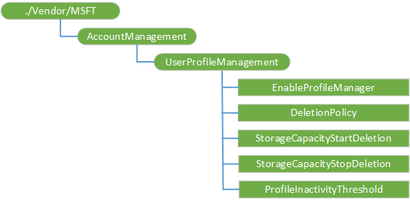

# AccountManagement CSP 

AccountManagement CSP is used to configure setting in the Account Manager service in Windows Holographic for Business edition. Added in Windows 10, version 1803.

> [!Note]  
> The AccountManagement CSP is only supported in Windows Holographic for Business edition.

The following diagram shows the AccountManagement configuration service provider in tree format.

**./Vendor/MSFT/AccountManagement**  
Root node for the AccountManagement configuration service provider.

**UserProfileManagement**  
Interior node. 

**UserProfileManagement/EnableProfileManager**  
Enable profile lifetime mangement for shared or communal device scenarios. Default value is false.

Supported operations are Add, Get,Replace, and Delete. Value type is bool.

**UserProfileManagement/DeletionPolicy**  
Configures when profiles will be deleted. Default value is 1.

Valid values:  

-  0 - delete immediately when the device returns to a state with no currently active users
-  1 - delete at storage capacity threshold
-  2 - delete at both storage capacity threshold and profile inactivity threshold

Supported operations are Add, Get,Replace, and Delete. Value type is integer.

**UserProfileManagement/StorageCapacityStartDeletion**  
Start deleting profiles when available storage capacity falls below this threshold, given as percent of total storage available for profiles. Profiles that have been inactive the longest will be deleted first. Default value is 25.

Supported operations are Add, Get,Replace, and Delete. Value type is integer.

**UserProfileManagement/StorageCapacityStopDeletion**  
Stop deleting profiles when available storage capacity is brought up to this threshold, given as percent of total storage available for profiles. Default value is 50.

Supported operations are Add, Get,Replace, and Delete. Value type is integer.

**UserProfileManagement/ProfileInactivityThreshold**  
Start deleting profiles when they have not been logged on during the specified period, given as number of days. Default value is 30.

Supported operations are Add, Get,Replace, and Delete. Value type is integer.
