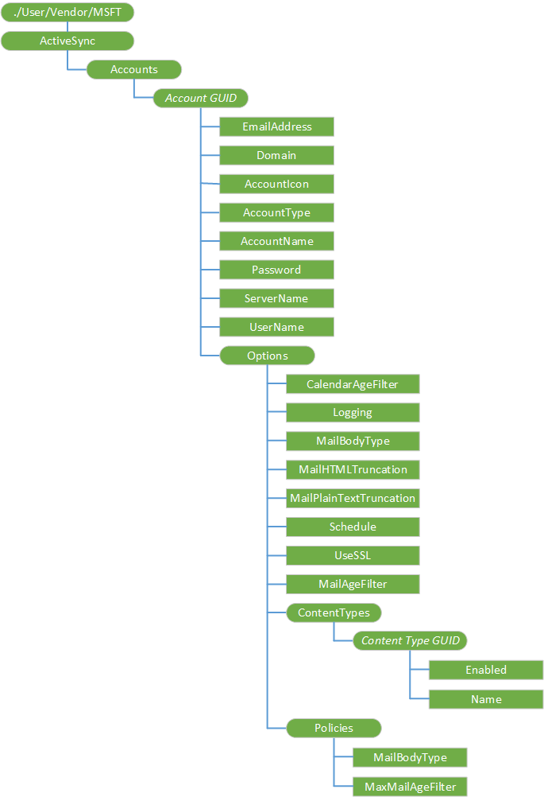

# ActiveSync CSP


The ActiveSync configuration service provider is used to set up and change settings for Exchange ActiveSync. After an Exchange account has been updated over-the-air by the ActiveSync configuration service provider, the device must be powered off and then powered back on to see sync status.

Configuring Windows Live ActiveSync accounts through this configuration service provider is not supported.

> **Note**  
The target user must be logged in for the CSP to succeed. The correct way to configure an account is to use the ./User/Vendor/MSFT/ActiveSync path.

On the desktop, only per user configuration (./User/Vendor/MSFT/ActiveSync) is supported. However, the ./Vendor/MSFT/ActiveSync path will work if the user is logged in. The CSP fails when no user is logged in.

The ./Vendor/MSFT/ActiveSync path is deprecated, but will continue to work in the short term.

 

The following diagram shows the ActiveSync configuration service provider management objects in tree format as used by Open Mobile Alliance Device Management (OMA DM), OMA Client Provisioning, and Enterprise DM.



<a href="" id="--user-vendor-msft-activesync"></a>**./User/Vendor/MSFT/ActiveSync**  
The root node for the ActiveSync configuration service provider.

> **Note**  
The target user must be logged in for the CSP to succeed. The correct way to configure an account is to use the ./User/Vendor/MSFT/ActiveSync path.

On the desktop, only per user configuration (./User/Vendor/MSFT/ActiveSync) is supported. However, the ./Vendor/MSFT/ActiveSync will work if the user is logged in. The CSP fails when no user is logged in.

The ./Vendor/MSFT/ActiveSync path is deprecated, but will continue to work in the short term.

 

The supported operation is Get.

<a href="" id="accounts"></a>**Accounts**  
The root node for all ActiveSync accounts.

The supported operation is Get.

<a href="" id="account-guid"></a>***Account GUID***  
Defines a specific ActiveSync account. A globally unique identifier (GUID) must be generated for each ActiveSync account on the device.

Supported operations are Get, Add, and Delete.

When managing over OMA DM, make sure to always use a unique GUID. Provisioning with an account that has the same GUID as an existing one deletes the existing account and does not create the new account.

Braces { } are required around the GUID. In OMA Client Provisioning, you can type the braces. For example:

``` syntax
<characteristic type="{C556E16F-56C4-4EDB-9C64-D9469EE1FBE0}"/>
```

For OMA DM, you must use the ASCII values of %7B and %7D for the opening and closing braces, respectively. For example, if the GUID is "C556E16F-56C4-4EDB-9C64-D9469EE1FBE0", type:

``` syntax
<Target>
   <LocURI>
      ./Vendor/MSFT/ActiveSync/Accounts/%7BC556E16F-56C4-4EDB-9C64-D9469EE1FBE0%7D
   </LocURI>
</Target>
```

<a href="" id="account-guid-emailaddress"></a>***Account GUID*/EmailAddress**  
Required. A character string that specifies the email address associated with the Exchange ActiveSync account.

Supported operations are Get, Replace, and Add (cannot Add after the account is created).

This email address is entered by the user during setup and must be in the fully qualified email address format, for example, "someone@example.com".

<a href="" id="account-guid-domain"></a>***Account GUID*/Domain**  
Optional for Exchange. Specifies the domain name of the Exchange server.

Supported operations are Get, Replace, Add, and Delete.

<a href="" id="account-guid-accounticon"></a>***Account GUID*/AccountIcon**  
Required. A character string that specifies the location of the icon associated with the account.

Supported operations are Get, Replace, and Add (cannot Add after the account is created).

The account icon can be used as a tile in the **Start** list or an icon in the applications list under **Settings > email & accounts**. Some icons are already provided on the device. The suggested icon for POP/IMAP or generic ActiveSync accounts is at res://AccountSettingsSharedRes{*ScreenResolution*}!%s.genericmail.png. The suggested icon for Exchange Accounts is at res://AccountSettingsSharedRes{*ScreenResolution*}!%s.office.outlook.png. Custom icons can be added if desired.

<a href="" id="account-guid-accounttype"></a>***Account GUID*/AccountType**  
Required. A character string that specifies the account type.

Supported operations are Get and Add (cannot Add after the account is created).

This value is entered during setup and cannot be modified once entered. An Exchange account is indicated by the string value "Exchange".

<a href="" id="account-guid-accountname"></a>***Account GUID*/AccountName**  
Required. A character string that specifies the name that refers to the account on the device.

Supported operations are Get, Replace, and Add (cannot Add after the account is created).

<a href="" id="account-guid-password"></a>***Account GUID*/Password**  
Required. A character string that specifies the password for the account.

Supported operations are Get, Replace, Add, and Delete.

For the Get command, only asterisks are returned.

<a href="" id="account-guid-servername"></a>***Account GUID*/ServerName**  
Required. A character string that specifies the server name used by the account.

Supported operations are Get, Replace, and Add (cannot Add after the account is created).

<a href="" id="account-guid-username"></a>***Account GUID*/UserName**  
Required. A character string that specifies the user name for the account.

Supported operations are Get, and Add (cannot Add after the account is created).

The user name cannot be changed after a sync has been successfully performed. The user name can be in the fully qualified format "someone@example.com", or just "username", depending on the type of account created. For most Exchange accounts, the user name format is just "username", whereas for Microsoft, Google, Yahoo, and most POP/IMAP accounts, the user name format is "someone@example.com".

<a href="" id="options"></a>**Options**  
Node for other parameters.

<a href="" id="options-calendaragefilter"></a>**Options/CalendarAgeFilter**  
Specifies the time window used for syncing calendar items to the device. Value type is chr.

<a href="" id="options-logging"></a>**Options/Logging**  
Required. A character string that specifies whether diagnostic logging is enabled and at what level. The default is 0 (disabled).

Supported operations are Get, Replace, and Add (cannot Add after the account is created).

Valid values are one of the following:

-   0 (default) - Logging is off.

-   1 - Basic logging is enabled.

-   2 - Advanced logging is enabled.

Logging is set to off by default. The user might be asked to set this to Basic or Advanced when having a sync issue that customer support is investigating. Setting the logging level to Advanced has more of a performance impact than Basic.

<a href="" id="options-mailbodytype"></a>**Options/MailBodyType**  
Indicates the email format. Valid values:

-   0 - none
-   1 - text
-   2 - HTML
-   3 - RTF
-   4 - MIME

<a href="" id="options-mailhtmltruncation"></a>**Options/MailHTMLTruncation**  
Specifies the size beyond which HTML-formatted email messages are truncated when they are synchronized to the mobile device. The value is specified in KB. A value of -1 disables truncation.

<a href="" id="options-mailplaintexttruncation"></a>**Options/MailPlainTextTruncation**  
This setting specifies the size beyond which text-formatted e-mail messages are truncated when they are synchronized to the mobile phone. The value is specified in KB. A value of -1 disables truncation.

<a href="" id="options-usessl"></a>**Options/UseSSL**  
Optional. A character string that specifies whether SSL is used.

Supported operations are Get, Replace, and Add (cannot Add after the account is created).

Valid values are:

-   0 - SSL is not used.

-   1 (default) - SSL is used.

<a href="" id="options-schedule"></a>**Options/Schedule**  
Required. A character string that specifies the time until the next sync is performed, in minutes. The default value is -1.

Supported operations are Get and Replace.

Valid values are one of the following:

-   -1 (default) - A sync will occur as items are received

-   0 - All syncs must be performed manually

-   15 - Sync every 15 minutes

-   30 - Sync every 30 minutes

-   60 - Sync every 60 minutes

<a href="" id="options-mailagefilter"></a>**Options/MailAgeFilter**  
Required. A character string that specifies the time window used for syncing email items to the device. The default value is 3.

Supported operations are Get and Replace.

Valid values are one of the following:

-   0 – No age filter is used, and all email items are synced to the device.

-   2 – Only email up to three days old is synced to the device.

-   3 (default) – Email up to a week old is synced to the device.

-   4 – Email up to two weeks old is synced to the device.

-   5 – Email up to a month old is synced to the device.

<a href="" id="options-contenttypes-content-type-guid"></a>**Options/ContentTypes/**<strong>*Content Type GUID*</strong>  
Defines the type of content to be individually enabled/disabled for sync.

The *GUID* values allowed are one of the following:

-   Email: "{c6d47067-6e92-480e-b0fc-4ba82182fac7}"

-   Contacts: "{0dd8685c-e272-4fcb-9ecf-2ead7ea2497b}"

-   Calendar: "{4a5d9fe0-f139-4a63-a5a4-4f31ceea02ad}"

-   Tasks: "{783ae4f6-4c12-4423-8270-66361260d4f1}"

<a href="" id="options-contenttypes-content-type-guid-enabled"></a>**Options/ContentTypes/*Content Type GUID*/Enabled**  
Required. A character string that specifies whether sync is enabled or disabled for the selected content type. The default is "1" (enabled).

Supported operations are Get, Replace, and Add (cannot Add after the account is created).

Valid values are one of the following:

-   0 - Sync for email, contacts, calendar, or tasks is disabled.
-   1 (default) - Sync is enabled.

<a href="" id="options-contenttypes-content-type-guid-name"></a>**Options/ContentTypes/*Content Type GUID*/Name**  
Required. A character string that specifies the name of the content type.

> **Note**  In Windows 10, this node is currently not working.

 

Supported operations are Get, Replace, and Add (cannot Add after the account is created).

When you use Add or Replace inside an atomic block in the SyncML, the CSP returns an error and provisioning fails. When you use Add or Replace outside of the atomic block, the error is ignored and the account is provisioned as expected.

<a href="" id="policies"></a>**Policies**  
Node for mail body type and email age filter.

<a href="" id="policies-mailbodytype"></a>**Policies/MailBodyType**  
Required. Specifies the email body type: HTML or plain.

Value type is string. Supported operations are Add, Get, Replace, and Delete.

<a href="" id="policies-maxmailagefilter"></a>**Policies/MaxMailAgeFilter**  
Required. Specifies the time window used for syncing mail items to the device.

Value type is string. Supported operations are Add, Get, Replace, and Delete.

## Related topics


[Configuration service provider reference](configuration-service-provider-reference.md)

 

 


