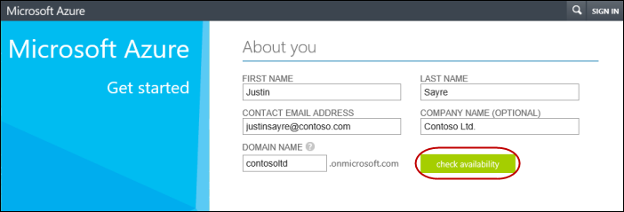
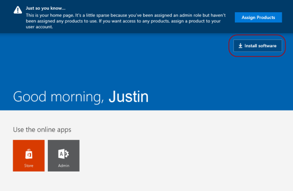
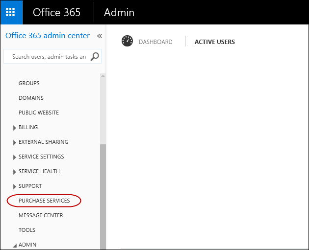
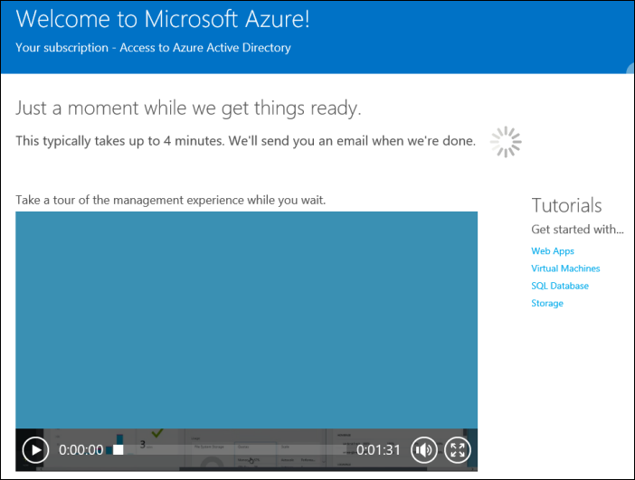

# Add an Azure AD tenant and Azure AD subscription

Here's a step-by-step guide to adding an Azure Active Directory tenant, adding an Azure AD subscription, and registering your subscription.

> **Note**  If you have paid subscriptions to Office 365, Microsoft Dynamics CRM Online, Enterprise Mobility Suite, or other Microsoft services, you have a free subscription to Azure AD. For step-by-step guide to register this free subscription, see [Register your free Azure Active Directory subscription.](#register-your-free-azure-active-directory-subscription)

1.  Sign-up for Azure AD tenant from [this website](https://account.windowsazure.com/organization) by creating an administrator account for your organization.

    

2.  Enter the information for your organization. Click **check availability** to verify that domain name that you selected is available.

    

3.  Complete the login and country information. You must provide a valid phone number, then click **Send text message** or **Call me**.

    

4.  Enter the code that you receive and then click **Verify code**. After the code is verified and the continue button turns green, click **continue**.

    

5.  After you finish creating your Azure account, you are ready to add an Azure AD subscription.

    If you don't have a paid subscription to any Microsoft service, you can purchase an Azure AD premium subscription. Go to Office 356 portal, <https://portal.office.com/> and then sign in using the admin account that you just created in Step 4 (for example, user1@contosoltd.onmicrosoftcom).

    

6.  Click **Install software**.

    

7.  In the Office 365 portal, select **Purchase Services** from the left nagivation.

    

8.  On the **Purchase services** page, scroll down until you see **Azure Active Directory Premium**, then click to purchase.

    

9.  Continue with your purchase.

    

10. After the purchase is completed, you can login to your Office 365 Admin Portal and you will see the **Azure AD** option from the Admin drop-down menu along with other services (SharePoint, Exchange, etc...).

    

    When you choose Azure AD, it will take you to the Azure AD portal where you can manage your Azure AD applications.

## Register your free Azure Active Directory subscription

If you have paid subscriptions to Office 365, Microsoft Dynamics CRM Online, Enterprise Mobility Suite, or other Microsoft services, you have a free subscription to Azure AD. Here's a step-by-step guide to register your free Azure AD subscription using an Office 365 Premium Business subscription.

1.  Sign in to the Office 365 portal at <https://portal.office.com> using your organization's account.

    

2.  On the **Home** page, click on the Admin tools icon.

    

3.  On the **Admin center** page, hover your mouse over the Admin tools icon on the left and then click **Azure AD**. This will take you to the Azure Active Directory sign-up page and brings up your existing Office 365 organization account information.

    

4.  On the **Sign up** page, make sure to enter a valid phone number and then click **Sign up**.

    

5.  It may take a few minutes to process the request.

    

6.  You will see a welcome page when the process completes.

    

 

