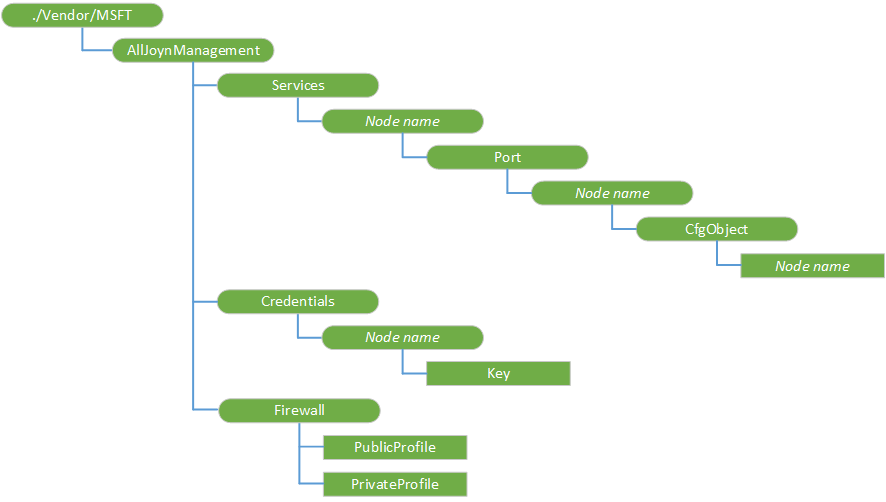

# AllJoynManagement CSP


The AllJoynManagement configuration service provider (CSP) allows an IT administrator to enumerate the AllJoyn devices that are connected to the AllJoyn bus. The devices must support the Microsoft AllJoyn configuration interface (com.microsoft.alljoynmanagement.config). You can also push configuration files to the same devices. To populate the various nodes when setting new configuration, we recommend that you do a query first, to get the actual values for all the nodes in all the attached devices. You can then use the information from the query to set the node values when pushing the new configuration.

> **Note**  
The AllJoynManagement configuration service provider (CSP) is only supported in Windows 10 IoT Core (IoT Core).

This CSP was added in Windows 10, version 1511.

 

For the firewall settings, note that PublicProfile and PrivateProfile are mutually exclusive. The Private Profile must be set on the directly on the device itself, and the only supported operation is Get. For PublicProfile, both Add and Get are supported. This CSP is intended to be used in conjunction with the AllJoyn Device System Bridge, and an understanding of the bridge will help when determining when and how to use this CSP. For more information, see [Device System Bridge (DSB) Project](https://go.microsoft.com/fwlink/p/?LinkId=615876) and [AllJoyn Device System Bridge](https://go.microsoft.com/fwlink/p/?LinkId=615877).

The following diagram shows the AllJoynManagement configuration service provider in tree format



The following list describes the characteristics and parameters.

<a href="" id="--vendor-msft-alljoynmanagement"></a>**./Vendor/MSFT/AllJoynManagement**
The root node for the AllJoynManagement configuration service provider.

<a href="" id="services"></a>**Services**
List of all AllJoyn objects that are discovered on the AllJoyn bus. All AllJoyn objects that expose the "com.microsoft.alljoynmanagement.config" are included.

<a href="" id="services-node-name"></a>**Services/****_Node name_**
The unique AllJoyn device ID (a GUID) that hosts one or more configurable objects.

<a href="" id="services-node-name-port"></a>**Services/*Node name*/Port**
The set of ports that the AllJoyn object uses to communicate configuration settings. Typically only one port is used for communication, but it is possible to specify additional ports.

<a href="" id="services-node-name-port-node-name"></a>**Services/*Node name*/Port/****_Node name_**
Port number used for communication. This is specified by the configurable AllJoyn object and reflected here.

<a href="" id="services-node-name-port-node-name-cfgobject"></a>**Services/*Node name*/Port/*Node name*/CfgObject**
The set of configurable interfaces that are available on the port of the AllJoyn object.

<a href="" id="services-node-name-port-node-name-cfgobject-node-name"></a>**Services/*Node name*/Port/*Node name*/CfgObject/****_Node name_**
The remainder of this URI is an escaped path to the configurable AllJoyn object hosted by the parent ServiceID and accessible by the parent PortNum.

For example an AllJoyn Bridge with the Microsoft specific AllJoyn configuration interface "\\FabrikamService\\BridgeConfig" would be specified in the URI as: %2FFabrikamService%2FBridgeConfig.

<a href="" id="credentials"></a>**Credentials**
This is the credential store. An administrator can set credentials for each AllJoyn device that requires authentication at this node.

When a SyncML request arrives in the CSP to replace or query a configuration item on an AllJoyn object that requires authentication, then the CSP uses the credentials stored here during the authentication phase.

<a href="" id="credentials-node-name"></a>**Credentials/****_Node name_**
This is the same service ID specified in \\AllJoynManagement\\Services\\ServiceID URI. It is typically implemented as a GUID.

<a href="" id="credentials-node-name-key"></a>**Credentials/*Node name*/Key**
An alphanumeric key value that conforms to the AllJoyn SRP KEYX authentication standard.

<a href="" id="firewall"></a>**Firewall**
Firewall setting for the AllJoyn service.

<a href="" id="firewall-publicprofile"></a>**Firewall/PublicProfile**
Boolean value to enable or disable the AllJoyn router service (AJRouter.dll) for public network profile.

<a href="" id="firewall-privateprofile"></a>**Firewall/PrivateProfile**
Boolean value indicating whether AllJoyn router service (AJRouter.dll) is enabled for private network profile.

## Examples


Set adapter configuration

``` syntax
<?xml version="1.0" encoding="utf-8"?>
SyncML xmlns="SYNCML:SYNCML1.2">
  <SyncBody>
    <Replace>
      <CmdID>2</CmdID>
      <Item>
        <Target>
          <LocURI>./Vendor/MSFT/AllJoynManagement/Services/_ALLJOYN_DEVICE_ID_/Port/27/Configuration/%2FDSBService%2FAdapterConfig</LocURI>
        </Target>
       <Meta>
          <Format xmlns="syncml:metinf">b64</Format>
        </Meta>       <Data>PAA/AHgAbQBsACAAdgBlAHIAcwBpAG8AbgA9ACIAMQAuADAAIgA/AD4ADQAKADwAQgBhAGMATgBlAHQAQwBmAGcAPgANAAoACQA8AEIAQgBNAEQAUwBlAHIAdgBlAHIAPgANAAoACQAJADwASQBQAEEAZABkAHIAZQBzAHMAPgAxADIANwAuADAALgAwAC4AMQA8AC8ASQBQAEEAZABkAHIAZQBzAHMAPgANAAoACQAJADwAUABvAHIAdAA+ADQANwA4ADAAOAA8AC8AUABvAHIAdAA+AA0ACgAJADwALwBCAEIATQBEAFMAZQByAHYAZQByAD4ADQAKADwALwBCAGEAYwBOAGUAdABDAGYAZwA+AA0ACgAAAA==</Data>
       </Item>
    </Replace>
    <Final/>
  </SyncBody>
</SyncML>
```

You should replace \_ALLJOYN\_DEVICE\_ID\_ with an actual device ID. Note that the data is base-64 encoded representation of the configuration file that you are setting.

Get PIN data

``` syntax
<?xml version="1.0" encoding="utf-8"?>
<SyncML xmlns="SYNCML:SYNCML1.2">
  <SyncBody>
    <Get>
      <CmdID>2</CmdID>
      <Item>
        <Target>
          <LocURI>./Vendor/MSFT/AllJoynManagement/Credentials?list=StructData</LocURI>
        </Target>
      </Item>
    </Get>
    <Final/>
  </SyncBody>
</SyncML>
```

Get the firewall PrivateProfile

``` syntax
<SyncML xmlns="SYNCML:SYNCML1.2">
  <SyncBody>
              <Get>
                <CmdID>1</CmdID>
                <Item>
                     <Target>
                       <LocURI>./Vendor/MSFT/AllJoynManagement/Firewall/PrivateProfile</LocURI>
                     </Target>
                </Item>
              </Get>
     <Final/>
  </SyncBody>
</SyncML>
```

 

 


