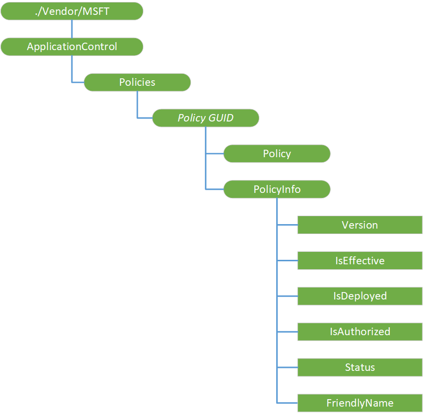

# ApplicationControl CSP

Windows Defender Application Control (WDAC) policies can be managed from an MDM server through ApplicationControl configuration service provider (CSP). This CSP provides expanded diagnostic capabilities and support for [multiple policies](https://docs.microsoft.com/en-us/windows/security/threat-protection/windows-defender-application-control/deploy-multiple-windows-defender-application-control-policies) (introduced in Windows 10, version 1903). It also provides support for rebootless policy deployment (introduced in Windows 10, version 1709). Unlike the AppLocker CSP, the ApplicationControl CSP correctly detects the presence of the no-reboot option and consequently does not schedule a reboot.
Existing WDAC policies which were deployed using the AppLocker CSP’s CodeIntegrity node can be deployed via the ApplicationControl CSP URI. Although WDAC policy deployment via the AppLocker CSP will continue to be supported, all new feature work will occur in the ApplicationControl CSP only.

The ApplicationControl CSP was added in Windows 10, version 1903.

The following diagram shows the ApplicationControl CSP in tree format.

**./Vendor/MSFT/ApplicationControl**  
Defines the root node for the ApplicationControl CSP.

Scope is permanent. Supported operation is Get.

**ApplicationControl/Policies**  
This subtree contains all the policies, which are each identified by their GUID.

Scope is permanent. Supported operation is Get.

**ApplicationControl/Policies/_Policy GUID_**  
The ApplicationControl CSP enforces that the “ID” segment of a given policy URI is the same GUID as the policy ID in the policy blob. Each Policy GUID node contains a Policy node and a corresponding PolicyInfo node.

Scope is dynamic. Supported operation is Get.

**ApplicationControl/Policies/_Policy GUID_/Policy**  
This node is the policy binary itself, which is encoded as base64.

Scope is dynamic. Supported operations are Get, Add, Delete, and Replace.

Value type is b64. Supported value is any well-formed WDAC policy, i.e. the base64-encoded content output by the ConvertFrom-CIPolicy cmdlet.

Default value is empty.

**ApplicationControl/Policies/_Policy GUID_/PolicyInfo**  
This subtree has nodes containing information which describes the policy indicated by the GUID.

Scope is dynamic. Supported operation is Get.

**EApplicationControl/Policies/_Policy GUID_/PolicyInfo/Version**  
This node provides the version of the policy indicated by the GUID. Stored as a string, but when parsing use a uint64 as the containing data type.

Scope is dynamic. Supported operation is Get.

Value type is char.

**EApplicationControl/Policies/_Policy GUID_/PolicyInfo/IsEffective**  
This node specifies whether a policy is actually loaded by the enforcement engine and is in effect on a system.

Scope is dynamic. Supported operation is Get.

Value type is bool. Supported values are as follows:  
- True — Indicates that the policy is actually loaded by the enforcement engine and is in effect on a system.
- False — Indicates that the policy is not loaded by the enforcement engine and is not in effect on a system. This is the default.
<Verify>

**EApplicationControl/Policies/_Policy GUID_/PolicyInfo/IsDeployed**  
This node specifies whether a policy is on the system and is present on the physical machine.

Scope is dynamic. Supported operation is Get.

Value type is bool. Supported values are as follows:  
- True — Indicates that the policy is on the system and is present on the physical machine.
- False — Indicates that the policy is not on the system and is not present on the physical machine. This is the default.
<Verify>

**EApplicationControl/Policies/_Policy GUID_/PolicyInfo/IsAuthorized**  
This node specifies whether the policy is authorized to be loaded by the enforcement engine on the system. If not authorized, a policy cannot take effect on the system.

Scope is dynamic. Supported operation is Get.

Value type is bool. Supported values are as follows:  
- True — Indicates that the policy is authorized to be loaded by the enforcement engine on the system.
- False — Indicates that the policy is not authorized to be loaded by the enforcement engine on the system. This is the default.
<Verify>

The following table provides the policy output based on different combinations of PolicyInfo nodes values:

**EnrollmentStatusTracking/DevicePreparation/PolicyProviders/*ProviderName*/TrackedResourceTypes**  
Required. This node is supported only in device context.  
This node's children register which resource types the policy provider supports for provisioning. Only registered providers for a particular resource type will have their policies incorporated with ESP tracking message.

Scope is dynamic. Supported operations are Get, Add, Delete, and Replace.

**EnrollmentStatusTracking/DevicePreparation/PolicyProviders/*ProviderName*/TrackedResourceTypes/Apps**  
Required. This node is supported only in device context.  
This node specifies if the policy provider is registered for app provisioning.

Scope is dynamic. Supported operations are Get, Add, Delete, and Replace.

Value type is boolean. Expected values are as follows:
- false — Indicates that the policy provider is not registered for app provisioning. This is the default.
- true — Indicates that the policy provider is registered for app provisioning.

**EnrollmentStatusTracking/Setup**  
Required. This node is supported in both user context and device context.  
Provides the settings that ESP reads during the account setup phase in the user context and device setup phase in the device context. Policy providers use this node to communicate progress status back to the ESP, which is then displayed to the user through progress messages.

Scope is permanent. Supported operation is Get.

**EnrollmentStatusTracking/Setup/Apps**  
Required. This node is supported in both user context and device context.  
Provides the settings to communicate to the ESP which app installations it should block on and provide progress in the status message to the user.

Scope is permanent. Supported operation is Get.

**EnrollmentStatusTracking/Setup/Apps/PolicyProviders**  
Required. This node is supported in both user context and device context.  
Specifies the app policy providers for this CSP. These are the policy providers the ESP should wait on before showing the tracking message with the status to the user.

Scope is permanent. Supported operation is Get.

**EnrollmentStatusTracking/Setup/Apps/PolicyProviders**/***ProviderName***  
Optional. This node is supported in both user context and device context.  
Represents an app policy provider for the ESP. Existence of this node indicates to the ESP that it should not show the tracking status message until the TrackingPoliciesCreated node has been set to true.

Scope is dynamic. Supported operations are Get, Add, Delete, and Replace.

**EnrollmentStatusTracking/Setup/Apps/PolicyProviders/*ProviderName*/TrackingPoliciesCreated**  
Required. This node is supported in both user context and device context.  
Indicates if the provider has created the required policies for the ESP to use for tracking app installation progress. The policy provider itself is expected to set the value of this node, not the MDM server.

Scope is dynamic. Supported operations are Get, Add, Delete, and Replace.

Value type is boolean. The expected values are as follows:
- true — Indicates that the provider has created the required policies.
- false — Indicates that the provider has not created the required policies. This is the default.

**EnrollmentStatusTracking/Setup/Apps/Tracking**  
Required. This node is supported in both user context and device context.  
Root node for the app installations being tracked by the ESP.

Scope is permanent. Supported operation is Get.

**EnrollmentStatusTracking/Setup/Apps/Tracking/_ProviderName_**  
Optional. This node is supported in both user context and device context.  
Indicates the provider name responsible for installing the apps and providing status back to ESP.

Scope is dynamic. Supported operations are Get, Add, Delete, and Replace.

**EnrollmentStatusTracking/Setup/Apps/Tracking/*ProviderName*/_AppName_**  
Optional. This node is supported in both user context and device context.  
Represents a unique name for the app whose progress should be tracked by the ESP. The policy provider can define any arbitrary app name as ESP does not use the app name directly.

Scope is dynamic. Supported operations are Get, Add, Delete, and Replace.

**EnrollmentStatusTracking/Setup/Apps/Tracking/*ProviderName*/*AppName*/InstallationState**  
Optional. This node is supported in both user context and device context.  
Represents the installation state for the app. The policy providers (not the MDM server) must update this node for the ESP to track the installation progress and update the status message.

Scope is dynamic. Supported operations are Get, Add, Delete, and Replace.

Value type is integer. Expected values are as follows:
- 1 — NotInstalled
- 2 — InProgress
- 3 — Completed
- 4 — Error

**EnrollmentStatusTracking/Setup/Apps/Tracking/*ProviderName*/*AppName*/RebootRequired**  
Optional. This node is supported in both user context and device context.  
Indicates if the app installation requires ESP to issue a reboot. The policy providers installing the app (not the MDM server) must set this node. If the policy providers do not set this node, the ESP will not reboot the device for the app installation.

Scope is dynamic. Supported operations are Get, Add, Delete, and Replace.

Value type is integer. Expected values are as follows:
- 1 — NotRequired
- 2 — SoftReboot
- 3 — HardReboot

**EnrollmentStatusTracking/Setup/HasProvisioningCompleted**  
Required. This node is supported in both user context and device context.  
ESP sets this node when it completes. Providers can query this node to determine if the ESP is showing, which allows them to determine if they still need to provide status updates for the ESP through this CSP.

Scope is permanent. Supported operation is Get.

Value type is boolean. Expected values are as follows:
- true — Indicates that ESP has completed. This is the default.
- false — Indicates that ESP is displayed, and provisioning is still going.