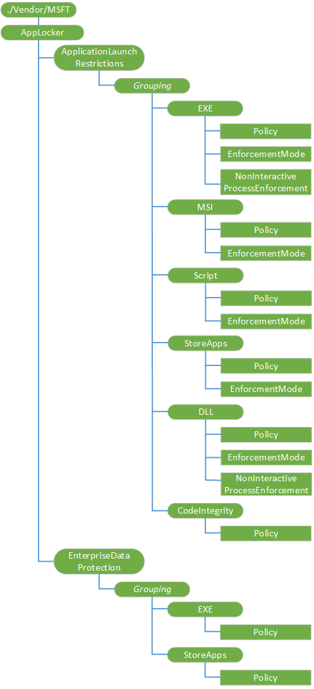
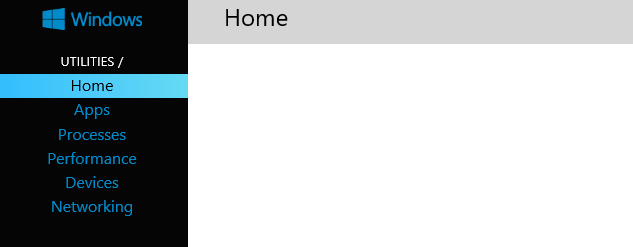
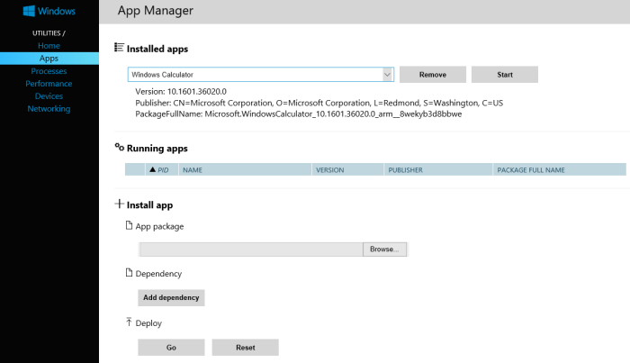
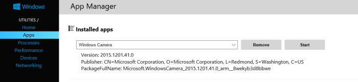

# AppLocker CSP


The AppLocker configuration service provider is used to specify which applications are allowed or disallowed. There is no user interface shown for apps that are blocked.

> **Note**  
> When you create a list of allowed apps, all [inbox apps](#inboxappsandcomponents) are also blocked, and you must include them in your list of allowed apps. Don't forget to add the inbox apps for Phone, Messaging, Settings, Start, Email and accounts, Work and school, and other apps that you need.
>
> In Windows 10 Mobile, when you create a list of allowed apps, the [settings app that rely on splash apps](#settingssplashapps) are blocked. To unblock these apps, you must include them in your list of allowed apps.
>
> Delete/unenrollment is not properly supported unless Grouping values are unique across enrollments. If multiple enrollments use the same Grouping value, then unenrollment will not work as expected since there are duplicate URIs that get deleted by the resource manager. To prevent this problem, the Grouping value should include some randomness. The best practice is to use a randomly generated GUID. However, there is no requirement on the exact value of the node.


The following diagram shows the AppLocker configuration service provider in tree format.



<a href="" id="--vendor-msft-applocker"></a>**./Vendor/MSFT/AppLocker**
Defines the root node for the AppLocker configuration service provider.

<a href="" id="applicationlaunchrestrictions"></a>**ApplicationLaunchRestrictions**
Defines restrictions for applications.

> [!NOTE]
> When you create a list of allowed apps, all [inbox apps](#inboxappsandcomponents) are also blocked, and you must include them in your list of allowed apps. Don't forget to add the inbox apps for Phone, Messaging, Settings, Start, Email and accounts, Work and school, and other apps that you need.
>
> In Windows 10 Mobile, when you create a list of allowed apps, the [settings app that rely on splash apps](#settingssplashapps) are blocked. To unblock these apps, you must include them in your list of allowed apps.

Additional information:

- [Find publisher and product name of apps](#productname) - step-by-step guide for getting the publisher and product names for various Windows apps.
- [Whitelist example](#whitelist-examples) - example for Windows 10 Mobile that denies all apps except the ones listed.

<a href="" id="enterprisedataprotection"></a>**EnterpriseDataProtection**
Captures the list of apps that are allowed to handle enterprise data. Should be used in conjunction with the settings in **./Device/Vendor/MSFT/EnterpriseDataProtection** in [EnterpriseDataProtection CSP](enterprisedataprotection-csp.md).

In Windows 10, version 1607 the Windows Information Protection has a concept for allowed and exempt applications. Allowed applications can access enterprise data and the data handled by those applications are protected with encryption. Exempt applications can also access enterprise data, but the data handled by those applications are not protected. This is because some critical enterprise applications may have compatibility problems with encrypted data.

You can set the allowed list using the following URI:
- ./Vendor/MSFT/AppLocker/EnterpriseDataProtection/_Grouping_/EXE/Policy
- ./Vendor/MSFT/AppLocker/EnterpriseDataProtection/_Grouping_/StoreApps/Policy

You can set the exempt list using the following URI. The _Grouping_ string must contain the keyword "EdpExempt" anywhere to help distinguish the exempt list from the allowed list. The "EdpExempt" keyword is also evaluated in a case-insensitive manner:
- ./Vendor/MSFT/AppLocker/EnterpriseDataProtection/_Grouping includes "EdpExempt"_/EXE/Policy
- ./Vendor/MSFT/AppLocker/EnterpriseDataProtection/_Grouping includes "EdpExempt"_/StoreApps/Policy

Exempt examples:
- ./Vendor/MSFT/AppLocker/EnterpriseDataProtection/ContosoEdpExempt/EXE/Policy
- ./Vendor/MSFT/AppLocker/EnterpriseDataProtection/xxxxxEdpExemptxxxxx/EXE/Policy

Additional information:

- [Recommended deny list for Windows Information Protection](#recommended-deny-list-for-windows-information-protection) - example for Windows 10, version 1607 that denies known unenlightened Microsoft apps from accessing enterprise data as an allowed app. This ensures an administrator does not accidentally make these apps Windows Information Protection allowed, and avoid known compatibility issues related to automatic file encryption with these applications.

Each of the previously listed nodes contains a **Grouping** node.

<table>
<colgroup>
<col width="20%" />
<col width="80%" />
</colgroup>
<thead>
<tr class="header">
<th>Term</th>
<th>Description</th>
</tr>
</thead>
<tbody>
<tr class="odd">
<td><p><strong>Grouping</strong></p></td>
<td><p>Grouping nodes are dynamic nodes, and there may be any number of them for a given enrollment (or a given context). The actual identifiers are selected by the management endpoint, whose job it is to determine what their purpose is, and to not conflict with other identifiers that they define.</p>
<p>Different enrollments and contexts may use the same Authority identifier, even if many such identifiers are active at the same time.</p>
<p>Supported operations are Get, Add, Delete, and Replace.</p></td>
</tr>
</tbody>
</table>


In addition, each **Grouping** node contains one or more of the following nodes:

<table>
<colgroup>
<col width="20%" />
<col width="80%" />
</colgroup>
<thead>
<tr class="header">
<th>Term</th>
<th>Description</th>
</tr>
</thead>
<tbody>
<tr class="odd">
<td><p><strong>EXE</strong></p></td>
<td><p>Defines restrictions for launching executable applications.</p>
<p>Supported operations are Get, Add, Delete, and Replace.</p></td>
</tr>
<tr class="even">
<td><p><strong>MSI</strong></p></td>
<td><p>Defines restrictions for executing Windows Installer files.</p>
<p>Supported operations are Get, Add, Delete, and Replace.</p></td>
</tr>
<tr class="odd">
<td><p><strong>Script</strong></p></td>
<td><p>Defines restrictions for running scripts.</p>
<p>Supported operations are Get, Add, Delete, and Replace.</p></td>
</tr>
<tr class="even">
<td><p><strong>StoreApps</strong></p></td>
<td><p>Defines restrictions for running apps from the Microsoft Store.</p>
<p>Supported operations are Get, Add, Delete, and Replace.</p></td>
</tr>
<tr class="odd">
<td><p><strong>DLL</strong></p></td>
<td><p>Defines restrictions for processing DLL files.</p>
<p>Supported operations are Get, Add, Delete, and Replace.</p></td>
</tr>
<tr class="even">
<td><p><strong>CodeIntegrity</strong></p></td>
<td><p>This node is only supported on the desktop. Supported operations are Get, Add, Delete, and Replace.</p></td>
</tr>
</tbody>
</table>


Each of the previous nodes contains one or more of the following leaf nodes:

<table>
<colgroup>
<col width="20%" />
<col width="80%" />
</colgroup>
<thead>
<tr class="header">
<th>Term</th>
<th>Description</th>
</tr>
</thead>
<tbody>
<tr class="odd">
<td><p><strong>Policy</strong></p></td>
<td><p>Policy nodes define the policy for launching executables, Windows Installer files, scripts, store apps, and DLL files. The contents of a given Policy node is precisely the XML format for a RuleCollection node in the corresponding AppLocker XML policy.</p>
<p>Policy nodes are a Base64-encoded blob of the binary policy representation. The binary policy may be signed or unsigned.</p>
<p>For CodeIntegrity/Policy, you can use the <a href="https://go.microsoft.com/fwlink/p/?LinkId=724364" data-raw-source="[certutil -encode](https://go.microsoft.com/fwlink/p/?LinkId=724364)">certutil -encode</a> command line tool to encode the data to base-64.</p>
<p>Here is a sample certutil invocation:</p>

```
certutil -encode WinSiPolicy.p7b WinSiPolicy.cer
```

<p>An alternative to using certutil would be to use the following PowerShell invocation:</p>

```
[Convert]::ToBase64String($(Get-Content -Encoding Byte -ReadCount 0 -Path <bin file>))
```

<p>If you are using hybrid MDM management with System Center Configuration Manager or using Intune, ensure that you are using Base64 as the Data type when using Custom OMA-URI functionality to apply the Code Integrity policy.</p>
<p>Data type is string. Supported operations are Get, Add, Delete, and Replace.</p></td>
</tr>
<tr class="even">
<td><p><strong>EnforcementMode</strong></p></td>
<td><p>The EnforcementMode node for Windows Information Protection (formerly known as Enterprise Data Protection) does not affect the behavior of EnterpriseDataProtection. The EDPEnforcementLevel from Policy CSP should be used to enable and disable Windows Information Protection (formerly known as Enterprise Data Protection).</p>
<p>The data type is a string. Supported operations are Get, Add, Delete, and Replace.</p></td>
</tr>
<tr class="odd">
<td><p><strong>NonInteractiveProcessEnforcement</strong></p></td>
<td><p>The data type is a string.</p>
<p>Supported operations are Add, Delete, Get, and Replace.</p></td>
</tr>
</tbody>
</table>


## <a href="" id="productname"></a>Find publisher and product name of apps


You can pair a Windows Phone (Windows 10 Mobile, version 1511) to your desktop using the Device Portal on the phone to get the various types of information, including publisher name and product name of apps installed on the phone. This procedure describes pairing your phone to your desktop using WiFi.

If this procedure does not work for you, try the other methods for pairing described in [Device Portal for Mobile](https://msdn.microsoft.com/windows/uwp/debug-test-perf/device-portal-mobile).

**To find Publisher and PackageFullName for apps installed on Windows 10 Mobile**

1.  On your Windows Phone, go to **Settings**. Choose **Update & security**. Then choose **For developers**.
2.  Choose **Developer mode**.
3.  Turn on **Device discovery**.
4.  Turn on **Device Portal** and keep **AuthenticationOn**.
5.  Under the **Device Portal**, under **Connect using: WiFi**, copy the URL to your desktop browser to connect using WiFi.

    If you get a certificate error, continue to the web page.

    If you get an error about not reaching the web page, then you should try the other methods for pairing described in [Device Portal for Mobile](https://msdn.microsoft.com/windows/uwp/debug-test-perf/device-portal-mobile).

6.  On your phone under **Device discovery**, tap **Pair**. You will get a code (case sensitive).
7.  On the browser on the **Set up access page**, enter the code (case sensitive) into the text box and click **Submit**.

    The **Device Portal** page opens on your browser.

    

8.  On the desktop **Device Portal** page, click **Apps** to open the **App Manager**.
9.  On the **App Manager** page under **Running apps**, you will see the **Publisher** and **PackageFullName** of apps.

    

10. If you do not see the app that you want, look under **Installed apps**. Using the drop down menu, click on the application and you get the Version, Publisher, and PackageFullName displayed.

    

The following table show the mapping of information to the AppLocker publisher rule field.

<table>
<colgroup>
<col width="20%" />
<col width="80%" />
</colgroup>
<thead>
<tr class="header">
<th>Device portal data</th>
<th>AppLocker publisher rule field</th>
</tr>
</thead>
<tbody>
<tr class="odd">
<td><p>PackageFullName</p></td>
<td><p>ProductName</p>
<p>The product name is first part of the PackageFullName followed by the version number. In the Windows Camera example, the ProductName is Microsoft.WindowsCamera.</p></td>
</tr>
<tr class="even">
<td><p>Publisher</p></td>
<td><p>Publisher</p></td>
</tr>
<tr class="odd">
<td><p>Version</p></td>
<td><p>Version</p>
<p>This can be used either in the HighSection or LowSection of the BinaryVersionRange.</p>
<p>HighSection defines the highest version number and LowSection defines the lowest version number that should be trusted. You can use a wildcard for both versions to make a version independent rule. Using a wildcard for one of the values will provide higher than or lower than a specific version semantics.</p></td>
</tr>
</tbody>
</table>


Here is an example AppLocker publisher rule:

``` syntax
FilePublisherCondition PublisherName="CN=Microsoft Corporation, O=Microsoft Corporation, L=Redmond, S=Washington, C=US" ProductName="Microsoft.Reader" BinaryName="*">
  <BinaryVersionRange LowSection="*" HighSection="*" />
  </FilePublisherCondition>
```

You can get the publisher name and product name of apps using a web API.

**To find publisher and product name for Microsoft apps in Microsoft Store for Business**

1.  Go to the Microsoft Store for Business website, and find your app. For example, Microsoft OneNote.
2.  Copy the ID value from the app URL. For example, Microsoft OneNote's ID URL is https:<span><\span>//www.microsoft.com/store/apps/onenote/9wzdncrfhvjl, and you'd copy the ID value, **9wzdncrfhvjl**.
3.  In your browser, run the Store for Business portal web API, to return a JavaScript Object Notation (JSON) file that includes the publisher and product name values.

    <table>
    <colgroup>
    <col width="100%" />
    </colgroup>
    <thead>
    <tr class="header">
    <th>Request URI</th>
    </tr>
    </thead>
    <tbody>
    <tr class="odd">
    <td><p>https://bspmts.mp.microsoft.com/v1/public/catalog/Retail/Products/{app ID}/applockerdata</p></td>
    </tr>
    </tbody>
    </table>


~~~
Here is the example for Microsoft OneNote:

Request

``` syntax
https://bspmts.mp.microsoft.com/v1/public/catalog/Retail/Products/9wzdncrfhvjl/applockerdata
```

Result

``` syntax
{
  "packageFamilyName": "Microsoft.Office.OneNote_8wekyb3d8bbwe",
  "packageIdentityName": "Microsoft.Office.OneNote",
  "windowsPhoneLegacyId": "ca05b3ab-f157-450c-8c49-a1f127f5e71d",
  "publisherCertificateName": "CN=Microsoft Corporation, O=Microsoft Corporation, L=Redmond, S=Washington, C=US"
}
```
~~~

<table>
<colgroup>
<col width="20%" />
<col width="80%" />
</colgroup>
<thead>
<tr class="header">
<th>Result data</th>
<th>AppLocker publisher rule field</th>
</tr>
</thead>
<tbody>
<tr class="odd">
<td><p>packageIdentityName</p></td>
<td><p>ProductName</p></td>
</tr>
<tr class="even">
<td><p>publisherCertificateName</p></td>
<td><p>Publisher</p></td>
</tr>
<tr class="odd">
<td><p>windowsPhoneLegacyId</p></td>
<td><p>Same value maps to the ProductName and Publisher name</p>
<p>This value will only be present if there is a XAP package associated with the app in the Store.</p>
<p>If this value is populated then the simple thing to do to cover both the AppX and XAP package would be to create two rules for the app. One rule for AppX using the packageIdentityName and publisherCertificateName value and anothe one using the windowsPhoneLegacyId value.</p></td>
</tr>
</tbody>
</table>


## <a href="" id="settingssplashapps"></a>Settings apps that rely on splash apps


When you create a list of allowed apps in Windows 10 Mobile, you must also include the subset of Settings apps that rely on splash apps in your list of allowed apps. These apps are blocked unless they are explicitly added to the list of allowed apps. The following table shows the subset of Settings apps that rely on splash apps .

The product name is first part of the PackageFullName followed by the version number.

| Settings app name                  | PackageFullName or Product name                                         | ProductID                            |
|------------------------------------|-------------------------------------------------------------------------|--------------------------------------|
| Work or school account             | Microsoft.AAD.BrokerPlugin                                              | e5f8b2c4-75ae-45ee-9be8-212e34f77747 |
| Email and accounts                 | Microsoft.AccountsControl                                               | 39cf127b-8c67-c149-539a-c02271d07060 |
| SettingsPageKeyboard               | 5b04b775-356b-4aa0-aaf8-6491ffea5608\_1.1.0.0\_neutral\_\_cw8ffb7c56vgc | 5b04b775-356b-4aa0-aaf8-6491ffea5608 |
| SettingsPageTimeRegion             | 5b04b775-356b-4aa0-aaf8-6491ffea560c\_1.0.0.0\_neutral\_\_gqhq4qhgje4fw | 5b04b775-356b-4aa0-aaf8-6491ffea560c |
| SettingsPagePCSystemBluetooth      | 5b04b775-356b-4aa0-aaf8-6491ffea5620\_1.0.0.0\_neutral\_\_nvaj48k0z8te8 | 5b04b775-356b-4aa0-aaf8-6491ffea5620 |
| SettingsPageNetworkAirplaneMode    | 5b04b775-356b-4aa0-aaf8-6491ffea5621\_1.0.0.0\_neutral\_\_f73kmnfsk0aj2 | 5b04b775-356b-4aa0-aaf8-6491ffea5621 |
| SettingsPageNetworkWiFi            | 5b04b775-356b-4aa0-aaf8-6491ffea5623\_1.0.0.0\_neutral\_\_a3jhh70a240gm | 5b04b775-356b-4aa0-aaf8-6491ffea5623 |
| SettingsPageNetworkInternetSharing | 5b04b775-356b-4aa0-aaf8-6491ffea5629\_1.0.0.0\_neutral\_\_yqcw9dmx6t3pe | 5b04b775-356b-4aa0-aaf8-6491ffea5629 |
| SettingsPageAccountsWorkplace      | 5b04b775-356b-4aa0-aaf8-6491ffea562a\_1.0.0.0\_neutral\_\_q1wjbr14bc3d0 | 5b04b775-356b-4aa0-aaf8-6491ffea562a |
| SettingsPageRestoreUpdate          | 5b04b775-356b-4aa0-aaf8-6491ffea5640\_1.0.0.0\_neutral\_\_j77gbj5kz730y | 5b04b775-356b-4aa0-aaf8-6491ffea5640 |
| SettingsPageKidsCorner             | 5b04b775-356b-4aa0-aaf8-6491ffea5802\_1.0.0.0\_neutral\_\_1wmss2z3sft8c | 5b04b775-356b-4aa0-aaf8-6491ffea5802 |
| SettingsPageDrivingMode            | 5b04b775-356b-4aa0-aaf8-6491ffea5804\_1.0.0.0\_neutral\_\_t553967svy34g | 5b04b775-356b-4aa0-aaf8-6491ffea5804 |
| SettingsPageTimeLanguage           | 5b04b775-356b-4aa0-aaf8-6491ffea5808\_1.0.0.0\_neutral\_\_ecxasj38g8ynw | 5b04b775-356b-4aa0-aaf8-6491ffea5808 |
| SettingsPageAppsCorner             | 5b04b775-356b-4aa0-aaf8-6491ffea580a\_1.0.0.0\_neutral\_\_4vefaa8deck74 | 5b04b775-356b-4aa0-aaf8-6491ffea580a |
| SettingsPagePhoneNfc               | b0894dfd-4671-4bb9-bc17-a8b39947ffb6\_1.0.0.0\_neutral\_\_1prqnbg33c1tj | b0894dfd-4671-4bb9-bc17-a8b39947ffb6 |


## <a href="" id="inboxappsandcomponents"></a>Inbox apps and components


The following list shows the apps that may be included in the inbox.

> **Note**  This list identifies system apps that ship as part of Windows that you can add to your AppLocker policy to ensure proper functioning of the operating system. If you decide to block some of these apps, we recommend a thorough testing before deploying to your production environment. Failure to do so may result in unexpected failures and can significantly degrade the user experience.


<table>
<colgroup>
<col width="33%" />
<col width="33%" />
<col width="33%" />
</colgroup>
<thead>
<tr class="header">
<th>App</th>
<th>Product ID</th>
<th>Product name</th>
</tr>
</thead>
<tbody>
<tr class="even">
<td>3D Viewer</td>
<td>f41647c9-d567-4378-b2ab-7924e5a152f3</td>
<td>Microsoft.Microsoft3DViewer <p>(Added in Windows 10, version 1703)</p></td>
</tr>
<tr class="odd">
<td>Advanced info</td>
<td>b6e3e590-9fa5-40c0-86ac-ef475de98e88</td>
<td>b6e3e590-9fa5-40c0-86ac-ef475de98e88</td>
</tr>
<tr class="even">
<td>Age out worker</td>
<td>09296e27-c9f3-4ab9-aa76-ecc4497d94bb</td>
<td></td>
</tr>
<tr class="odd">
<td>Alarms and clock</td>
<td>44f7d2b4-553d-4bec-a8b7-634ce897ed5f</td>
<td>Microsoft.WindowsAlarms</td>
</tr>
<tr class="even">
<td>App downloads</td>
<td>20bf77a0-19c7-4daa-8db5-bc3dfdfa44ac</td>
<td></td>
</tr>
<tr class="odd">
<td>Assigned access lock app</td>
<td>b84f4722-313e-4f85-8f41-cf5417c9c5cb</td>
<td></td>
</tr>
<tr class="even">
<td>Bing lock images</td>
<td>5f28c179-2780-41df-b966-27807b8de02c</td>
<td></td>
</tr>
<tr class="odd">
<td>Block and filter</td>
<td>59553c14-5701-49a2-9909-264d034deb3d</td>
<td></td>
</tr>
<tr class="odd">
<td>Broker plug-in (same as Work or school account)</td>
<td></td>
<td>Microsoft.AAD.BrokerPlugin</td>
</tr>
<tr class="even">
<td>Calculator</td>
<td>b58171c6-c70c-4266-a2e8-8f9c994f4456</td>
<td>Microsoft.WindowsCalculator</td>
</tr>
<tr class="odd">
<td>Camera</td>
<td>f0d8fefd-31cd-43a1-a45a-d0276db069f1</td>
<td>Microsoft.WindowsCamera</td>
</tr>
<tr class="even">
<td>CertInstaller</td>
<td>4c4ad968-7100-49de-8cd1-402e198d869e</td>
<td></td>
</tr>
<tr class="odd">
<td>Colour profile</td>
<td>b08997ca-60ab-4dce-b088-f92e9c7994f3</td>
<td></td>
</tr>
<tr class="even">
<td>Connect</td>
<td>af7d2801-56c0-4eb1-824b-dd91cdf7ece5</td>
<td>Microsoft.DevicesFlow</td>
</tr>
<tr class="odd">
<td>Contact Support</td>
<td>0db5fcff-4544-458a-b320-e352dfd9ca2b</td>
<td>Windows.ContactSupport</td>
</tr>
<tr class="even">
<td>Cortana</td>
<td>fd68dcf4-166f-4c55-a4ca-348020f71b94</td>
<td>Microsoft.Windows.Cortana</td>
</tr>
<tr class="odd">
<td>Cortana Listen UI</td>
<td></td>
<td>CortanaListenUI</td>
</tr>
<tr class="odd">
<td>Credentials Dialog Host</td>
<td></td>
<td>Microsoft.CredDialogHost</td>
</tr>
<tr class="odd">
<td>Device Portal PIN UX</td>
<td></td>
<td>holopairingapp</td>
</tr>
<tr class="odd">
<td>Email and accounts</td>
<td>39cf127b-8c67-c149-539a-c02271d07060</td>
<td>Microsoft.AccountsControl</td>
</tr>
<tr class="even">
<td>Enterprise install app</td>
<td>da52fa01-ac0f-479d-957f-bfe4595941cb</td>
<td></td>
</tr>
<tr class="odd">
<td>Equalizer</td>
<td>373cb76e-7f6c-45aa-8633-b00e85c73261</td>
<td></td>
</tr>
<tr class="even">
<td>Excel</td>
<td>ead3e7c0-fae6-4603-8699-6a448138f4dc</td>
<td>Microsoft.Office.Excel</td>
</tr>
<tr class="odd">
<td>Facebook</td>
<td>82a23635-5bd9-df11-a844-00237de2db9e</td>
<td>Microsoft.MSFacebook</td>
</tr>
<tr class="even">
<td>Field Medic</td>
<td>73c58570-d5a7-46f8-b1b2-2a90024fc29c</td>
<td></td>
</tr>
<tr class="odd">
<td>File Explorer</td>
<td>c5e2524a-ea46-4f67-841f-6a9465d9d515</td>
<td>c5e2524a-ea46-4f67-841f-6a9465d9d515</td>
</tr>
<tr class="even">
<td>FM Radio</td>
<td>f725010e-455d-4c09-ac48-bcdef0d4b626</td>
<td>f725010e-455d-4c09-ac48-bcdef0d4b626</td>
</tr>
<tr class="odd">
<td>Get Started</td>
<td>b3726308-3d74-4a14-a84c-867c8c735c3c</td>
<td>Microsoft.Getstarted</td>
</tr>
<tr class="even">
<td>Glance</td>
<td>106e0a97-8b19-42cf-8879-a8ed2598fcbb</td>
<td></td>
</tr>
<tr class="odd">
<td>Groove Music</td>
<td>d2b6a184-da39-4c9a-9e0a-8b589b03dec0</td>
<td>Microsoft.ZuneMusic</td>
</tr>
<tr class="even">
<td>Hands-Free Activation</td>
<td>df6c9621-e873-4e86-bb56-93e9f21b1d6f</td>
<td></td>
</tr>
<tr class="odd">
<td>Hands-Free Activation</td>
<td>72803bd5-4f36-41a4-a349-e83e027c4722</td>
<td></td>
</tr>
<tr class="even">
<td>HAP update background worker</td>
<td>73c73cdd-4dea-462c-bd83-fa983056a4ef</td>
<td></td>
</tr>
<tr class="odd">
<td>Holographic Shell</td>
<td></td>
<td>HoloShell</td>
</tr>
<tr class="odd">
<td>Lumia motion data</td>
<td>8fc25fd2-4e2e-4873-be44-20e57f6ec52b</td>
<td></td>
</tr>
<tr class="even">
<td>Maps</td>
<td>ed27a07e-af57-416b-bc0c-2596b622ef7d</td>
<td>Microsoft.WindowsMaps</td>
</tr>
<tr class="odd">
<td>Messaging</td>
<td>27e26f40-e031-48a6-b130-d1f20388991a</td>
<td>Microsoft.Messaging</td>
</tr>
<tr class="even">
<td>Microsoft account</td>
<td>3a4fae89-7b7e-44b4-867b-f7e2772b8253</td>
<td>Microsoft.CloudExperienceHost</td>
</tr>
<tr class="odd">
<td>Microsoft Edge</td>
<td>395589fb-5884-4709-b9df-f7d558663ffd</td>
<td>Microsoft.MicrosoftEdge</td>
</tr>
<tr class="even">
<td>Microsoft Frameworks</td>
<td>ProductID = 00000000-0000-0000-0000-000000000000
<p>PublisherName=&quot;CN=Microsoft Corporation, O=Microsoft Corporation, L=Redmond, S=Washington, C=US&quot;</p></td>
<td></td>
</tr>
<tr class="odd">
<td>Migration UI</td>
<td></td>
<td>MigrationUIApp</td>
</tr>
<tr class="odd">
<td>MiracastView</td>
<td>906beeda-b7e6-4ddc-ba8d-ad5031223ef9</td>
<td>906beeda-b7e6-4ddc-ba8d-ad5031223ef9</td>
</tr>
<tr>
<td>Mixed Reality Portal</td>
<td></td>
<td>Microsoft.Windows.HolographicFirstRun</td>
<tr class="even">
<td>Money</td>
<td>1e0440f1-7abf-4b9a-863d-177970eefb5e</td>
<td>Microsoft.BingFinance</td>
</tr>
<tr class="odd">
<td>Movies and TV</td>
<td>6affe59e-0467-4701-851f-7ac026e21665</td>
<td>Microsoft.ZuneVideo</td>
</tr>
<tr class="even">
<td>Music downloads</td>
<td>3da8a0c1-f7e5-47c0-a680-be8fd013f747</td>
<td></td>
</tr>
<tr class="odd">
<td>Navigation bar</td>
<td>2cd23676-8f68-4d07-8dd2-e693d4b01279</td>
<td></td>
</tr>
<tr class="even">
<td>Network services</td>
<td>62f172d1-f552-4749-871c-2afd1c95c245</td>
<td></td>
</tr>
<tr class="odd">
<td>News</td>
<td>9c3e8cad-6702-4842-8f61-b8b33cc9caf1</td>
<td>Microsoft.BingNews</td>
</tr>
<tr class="even">
<td>OneDrive</td>
<td>ad543082-80ec-45bb-aa02-ffe7f4182ba8</td>
<td>Microsoft.MicrosoftSkydrive</td>
</tr>
<tr class="odd">
<td>OneNote</td>
<td>ca05b3ab-f157-450c-8c49-a1f127f5e71d</td>
<td>Microsoft.Office.OneNote</td>
</tr>
<tr class="even">
<td>Outlook Calendar and Mail</td>
<td>a558feba-85d7-4665-b5d8-a2ff9c19799b</td>
<td>Microsoft.WindowsCommunicationsApps</td>
</tr>
<tr class="odd">
<td>People</td>
<td>60be1fb8-3291-4b21-bd39-2221ab166481</td>
<td>Microsoft.People</td>
</tr>
<tr class="even">
<td>Phone</td>
<td>5b04b775-356b-4aa0-aaf8-6491ffea5611</td>
<td>5b04b775-356b-4aa0-aaf8-6491ffea5611</td>
</tr>
<tr class="odd">
<td>Phone (dialer)</td>
<td>f41b5d0e-ee94-4f47-9cfe-3d3934c5a2c7</td>
<td>Microsoft.CommsPhone</td>
</tr>
<tr class="even">
<td>Phone reset dialog</td>
<td>2864278d-09b5-46f7-b502-1c24139ecbdd</td>
<td></td>
</tr>
<tr class="odd">
<td>Photos</td>
<td>fca55e1b-b9a4-4289-882f-084ef4145005</td>
<td>Microsoft.Windows.Photos</td>
</tr>
<tr class="even">
<td>Podcasts</td>
<td>c3215724-b279-4206-8c3e-61d1a9d63ed3</td>
<td>Microsoft.MSPodcast</td>
</tr>
<tr class="odd">
<td>Posdcast downloads</td>
<td>063773e7-f26f-4a92-81f0-aa71a1161e30</td>
<td></td>
</tr>
<tr class="even">
<td>Powerpoint</td>
<td>b50483c4-8046-4e1b-81ba-590b24935798</td>
<td>Microsoft.Office.PowerPoint</td>
</tr>
<tr class="odd">
<td>PrintDialog</td>
<td>0d32eeb1-32f0-40da-8558-cea6fcbec4a4</td>
<td>Microsoft.PrintDialog</td>
</tr>
<tr class="even">
<td>Purchase dialog</td>
<td>c60e79ca-063b-4e5d-9177-1309357b2c3f</td>
<td></td>
</tr>
<tr class="odd">
<td>Rate your device</td>
<td>aec3bfad-e38c-4994-9c32-50bd030730ec</td>
<td></td>
</tr>
<tr class="even">
<td>RingtoneApp.WindowsPhone</td>
<td>3e962450-486b-406b-abb5-d38b4ee7e6fe</td>
<td>Microsoft.Tonepicker</td>
</tr>
<tr class="odd">
<td>Save ringtone</td>
<td>d8cf8ec7-ec6d-4892-aab9-1e3a4b5fa24b</td>
<td></td>
</tr>
<tr class="even">
<td>Settings</td>
<td>2a4e62d8-8809-4787-89f8-69d0f01654fb</td>
<td>2a4e62d8-8809-4787-89f8-69d0f01654fb</td>
</tr>
<tr class="odd">
<td>Settings</td>
<td></td>
<td>SystemSettings</td>
</tr>
<tr class="odd">
<td>Setup wizard</td>
<td>07d87655-e4f0-474b-895a-773790ad4a32</td>
<td></td>
</tr>
<tr class="even">
<td>Sharing</td>
<td>b0894dfd-4671-4bb9-bc17-a8b39947ffb6</td>
<td></td>
</tr>
<tr class="odd">
<td>Sign-in for Windows 10 Holographic</td>
<td></td>
<td>WebAuthBridgeInternetSso, WebAuthBridgeInternet, WebAuthBridgeIntranetSso, WebAuthBrokerInternetSso, WebAuthBrokerInternetSso, WebAuthBrokerInternetSso, WebAuthBrokerInternet, WebAuthBrokerIntranetSso, SignIn</td>
</tr>
<tr class="odd">
<td>Skype</td>
<td>c3f8e570-68b3-4d6a-bdbb-c0a3f4360a51</td>
<td>Microsoft.SkypeApp</td>
</tr>
<tr class="even">
<td>Skype Video</td>
<td>27e26f40-e031-48a6-b130-d1f20388991a</td>
<td>Microsoft.Messaging</td>
</tr>
<tr class="odd">
<td>Sports</td>
<td>0f4c8c7e-7114-4e1e-a84c-50664db13b17</td>
<td>Microsoft.BingSports</td>
</tr>
<tr class="even">
<td>SSMHost</td>
<td>e232aa77-2b6d-442c-b0c3-f3bb9788af2a</td>
<td></td>
</tr>
<tr class="odd">
<td>Start</td>
<td>5b04b775-356b-4aa0-aaf8-6491ffea5602</td>
<td>5b04b775-356b-4aa0-aaf8-6491ffea5602</td>
</tr>
<tr class="even">
<td>Storage</td>
<td>5b04b775-356b-4aa0-aaf8-6491ffea564d</td>
<td>5b04b775-356b-4aa0-aaf8-6491ffea564d</td>
</tr>
<tr class="odd">
<td>Store</td>
<td>7d47d89a-7900-47c5-93f2-46eb6d94c159</td>
<td>Microsoft.WindowsStore</td>
</tr>
<tr class="even">
<td>Touch (gestures and touch)</td>
<td>bbc57c87-46af-4c2c-824e-ac8104cceb38</td>
<td></td>
</tr>
<tr class="odd">
<td>Voice recorder</td>
<td>7311b9c5-a4e9-4c74-bc3c-55b06ba95ad0</td>
<td>Microsoft.WindowsSoundRecorder</td>
</tr>
<tr class="even">
<td>Wallet</td>
<td>587a4577-7868-4745-a29e-f996203f1462</td>
<td>Microsoft.MicrosoftWallet</td>
</tr>
<tr class="even">
<td>Wallet</td>
<td>12ae577e-f8d1-4197-a207-4d24c309ff8f</td>
<td>Microsoft.Wallet</td>
</tr>
<tr class="odd">
<td>Weather</td>
<td>63c2a117-8604-44e7-8cef-df10be3a57c8</td>
<td>Microsoft.BingWeather</td>
</tr>
<tr class="even">
<td>Windows default lock screen</td>
<td>cdd63e31-9307-4ccb-ab62-1ffa5721b503</td>
<td></td>
</tr>
<tr class="odd">
<td>Windows Feedback</td>
<td>7604089d-d13f-4a2d-9998-33fc02b63ce3</td>
<td>Microsoft.WindowsFeedback</td>
</tr>
<tr class="even">
<td>Word</td>
<td>258f115c-48f4-4adb-9a68-1387e634459b</td>
<td>Microsoft.Office.Word</td>
</tr>
<tr class="odd">
<td>Work or school account</td>
<td>e5f8b2c4-75ae-45ee-9be8-212e34f77747</td>
<td>Microsoft.AAD.BrokerPlugin</td>
</tr>
<tr class="even">
<td>Xbox</td>
<td>b806836f-eebe-41c9-8669-19e243b81b83</td>
<td>Microsoft.XboxApp</td>
</tr>
<tr class="odd">
<td>Xbox identity provider</td>
<td>ba88225b-059a-45a2-a8eb-d3580283e49d</td>
<td>Microsoft.XboxIdentityProvider</td>
</tr>
</tbody>
</table>


## Whitelist examples

The following example disables the calendar application.

``` syntax
<SyncML xmlns="SYNCML:SYNCML1.2">
    <SyncBody>
        <Add>
            <CmdID>$CmdID$</CmdID>
            <Item>
                <Target>
                    <LocURI>./Vendor/MSFT/PolicyManager/My/ApplicationManagement/ApplicationRestrictions</LocURI>
                </Target>
                <Meta>
                    <Format xmlns="syncml:metinf">chr</Format>
                    <Type xmlns="syncml:metinf">text/plain</Type>
                </Meta>
                <Data><AppPolicy Version="1" xmlns="http://schemas.microsoft.com/phone/2013/policy"><Deny><App ProductId="{a558feba-85d7-4665-b5d8-a2ff9c19799b}"/></Deny></AppPolicy>
                </Data>
            </Item>
        </Add>
        <Final/>
    </SyncBody>
</SyncML>
```

The following example blocks the usage of the map application.

``` syntax
<SyncML xmlns="SYNCML:SYNCML1.2">
  <SyncBody>
    <Add>
      <CmdID>$CmdID$</CmdID>
      <Item>
        <Target>
          <LocURI>./Vendor/MSFT/AppLocker/ApplicationLaunchRestrictions/AppLockerPhoneGroup0/StoreApps/Policy</LocURI>
        </Target>
        <Meta>
          <Format xmlns="syncml:metinf">chr</Format>
        </Meta>
        <Data>
            <RuleCollection Type="Appx" EnforcementMode="Enabled">
                <FilePublisherRule Id="a9e18c21-ff8f-43cf-b9fc-db40eed693ba" Name="(Default Rule) All signed Appx packages" Description="Allows members of the Everyone group to run Appx packages that are signed." UserOrGroupSid="S-1-1-0" Action="Allow">
                    <Conditions>
                    <FilePublisherCondition PublisherName="*" ProductName="*" BinaryName="*">
                    <BinaryVersionRange LowSection="0.0.0.0" HighSection="*" />
                    </FilePublisherCondition>
                    </Conditions>
                </FilePublisherRule>

                <FilePublisherRule Id="fd686d83-a829-4351-8ff4-27c7de5755d2" Name="Deny Splash appmaps" Description="Deny members of the local Administrators group to run maps." UserOrGroupSid="S-1-1-0" Action="Deny">
                  <Conditions>
                    <FilePublisherCondition PublisherName="CN=Microsoft Corporation, O=Microsoft Corporation, L=Redmond, S=Washington, C=US" ProductName="Microsoft.WindowsMaps" BinaryName="*" />
                  </Conditions>
                </FilePublisherRule>

            </RuleCollection>
        </Data>
      </Item>
    </Add>
   <Final/>
  </SyncBody>
</SyncML>
```

The following example disables the Mixed Reality Portal. In the example, the **Id** can be any generated GUID and the **Name** can be any name you choose. Note that `BinaryName="*"` allows you to block any app executable in the Mixed Reality Portal package. **Binary/VersionRange**, as shown in the example, will block all versions of the Mixed Reality Portal app.

```xml
<SyncML xmlns="SYNCML:SYNCML1.2">
    <SyncBody>
        <Add>
            <CmdID>$CmdID$</CmdID>
            <Item>
                <Target>
                    <LocURI>./Vendor/MSFT/PolicyManager/My/ApplicationManagement/ApplicationRestrictions</LocURI>
                </Target>
                <Meta>
                    <Format xmlns="syncml:metinf">chr</Format>
                    <Type xmlns="syncml:metinf">text/plain</Type>
                </Meta>
                <Data>
                  <RuleCollection Type="Appx" EnforcementMode="Enabled">
                   <FilePublisherRule Id="a9e18c21-ff8f-43cf-b9fc-db40eed693ba" Name="(Default Rule) All signed packaged apps" Description="Allows members of the Everyone group to run packaged apps that are signed." UserOrGroupSid="S-1-1-0" Action="Allow">
                    <Conditions>
                      <FilePublisherCondition PublisherName="*" ProductName="*" BinaryName="*">
                        <BinaryVersionRange LowSection="0.0.0.0" HighSection="*" />
                      </FilePublisherCondition>
                    </Conditions>
                  </FilePublisherRule>
                  <FilePublisherRule Id="d26da4e7-0b01-484d-a8d3-d5b5341b2d55" Name="Block Mixed Reality Portal" Description="" UserOrGroupSid="S-1-1-0" Action="Deny">
                   <Conditions>
                     <FilePublisherCondition PublisherName="CN=Microsoft Windows, O=Microsoft Corporation, L=Redmond, S=Washington, C=US" ProductName="Microsoft.Windows.HolographicFirstRun" BinaryName="*">
                      <BinaryVersionRange LowSection="*" HighSection="*" />
                      </FilePublisherCondition>
                    </Conditions>
                  </FilePublisherRule>
                 </RuleCollection>>
                </Data>
            </Item>
        </Add>
        <Final/>
    </SyncBody>
</SyncML>
```

The following example for Windows 10 Mobile denies all apps and allows the following apps:

-   [settings app that rely on splash apps](#settingssplashapps)
-   most of the [inbox apps](#inboxappsandcomponents), but not all.

In this example, **MobileGroup0** is the node name. We recommend using a GUID for this node.

``` syntax
<?xml version="1.0" encoding="utf-8"?>
<SyncML>
  <SyncBody>
    <Add>
      <CmdID>1</CmdID>
      <Item>
        <Target>
          <LocURI>./Vendor/MSFT/AppLocker/ApplicationLaunchRestrictions/MobileGroup0</LocURI>
        </Target>
      </Item>
    </Add>
    <Add>
      <CmdID>2</CmdID>
      <Item>
        <Target>
          <LocURI>./Vendor/MSFT/AppLocker/ApplicationLaunchRestrictions/MobileGroup0/StoreApps</LocURI>
        </Target>
      </Item>
    </Add>
    <Replace>
      <CmdID>3</CmdID>
      <Item>
        <Target>
          <LocURI>./Vendor/MSFT/AppLocker/ApplicationLaunchRestrictions/MobileGroup0/StoreApps/Policy</LocURI>
        </Target>
        <Meta>
          <Format xmlns="syncml:metinf">chr</Format>
        </Meta>
        <Data>
<RuleCollection Type="Appx" EnforcementMode="Enabled">

    <FilePublisherRule Id="172B8ACE-AAF5-41FA-941A-93AEE126B4A9" Name="Default Rule to Deny ALL" Description="Deny all publisher" UserOrGroupSid="S-1-1-0" Action="Deny">
        <Conditions>
            <FilePublisherCondition PublisherName="CN=*" ProductName="*" BinaryName="*">
                <BinaryVersionRange LowSection="*" HighSection="*"/>
            </FilePublisherCondition>
        </Conditions>
    </FilePublisherRule>

    <FilePublisherRule Id="DDCD112F-E003-4874-8B3E-14CB23851D54" Name="Whitelist Settings splash app" Description="Allow Admins to run Settings." UserOrGroupSid="S-1-1-0" Action="Allow">
        <Conditions>
            <FilePublisherCondition PublisherName="*" ProductName="2A4E62D8-8809-4787-89F8-69D0F01654FB" BinaryName="*">
                <BinaryVersionRange LowSection="*" HighSection="*"/>
            </FilePublisherCondition>
        </Conditions>
    </FilePublisherRule>

    <FilePublisherRule Id="757D94A8-C752-4013-9896-D46EF10925E9" Name="Whitelist Settings WorkOrSchool" Description="Allow Admins to run WorkOrSchool" UserOrGroupSid="S-1-1-0" Action="Allow">
        <Conditions>
            <FilePublisherCondition PublisherName="*" ProductName="5B04B775-356B-4AA0-AAF8-6491FFEA562A" BinaryName="*">
                <BinaryVersionRange LowSection="*" HighSection="*"/>
            </FilePublisherCondition>
        </Conditions>
    </FilePublisherRule>

    <FilePublisherRule Id="473BCE1A-94D2-4AE1-8CB1-064B0677CACB" Name="Whitelist WorkPlace AAD BrokerPlugin" Description="Allow Admins" UserOrGroupSid="S-1-1-0" Action="Allow">
        <Conditions>
            <FilePublisherCondition PublisherName="CN=Microsoft Corporation, O=Microsoft Corporation, L=Redmond, S=Washington, C=US" ProductName="Microsoft.AAD.BrokerPlugin" BinaryName="*" >
                <BinaryVersionRange LowSection="*" HighSection="*"/>
            </FilePublisherCondition>
        </Conditions>
    </FilePublisherRule>

    <FilePublisherRule Id="E13EA64B-B0D3-4257-87F4-1B522D06EA03" Name="Whitelist Start" Description="Allow Admins to run Start." UserOrGroupSid="S-1-1-0" Action="Allow">
        <Conditions>
            <FilePublisherCondition PublisherName="*" ProductName="5B04B775-356B-4AA0-AAF8-6491FFEA5602" BinaryName="*" >
                <BinaryVersionRange LowSection="*" HighSection="*"/>
            </FilePublisherCondition>
        </Conditions>
    </FilePublisherRule>

    <FilePublisherRule Id="2898C4B2-4B37-4BFF-8F7B-16B377EDEA88" Name="Whitelist SettingsPageKeyboard" Description="Allow Admins" UserOrGroupSid="S-1-1-0" Action="Allow">
        <Conditions>
            <FilePublisherCondition PublisherName="*" ProductName="5b04b775-356b-4aa0-aaf8-6491ffea5608" BinaryName="*">
                <BinaryVersionRange LowSection="*" HighSection="*"/>
            </FilePublisherCondition>
        </Conditions>
    </FilePublisherRule>

    <FilePublisherRule Id="15BBA04F-3989-4FF7-9FEF-83C4DFDABA27" Name="Whitelist SettingsPageTimeRegion" Description="Allow Admins" UserOrGroupSid="S-1-1-0" Action="Allow">
        <Conditions>
            <FilePublisherCondition PublisherName="*" ProductName="5b04b775-356b-4aa0-aaf8-6491ffea560c" BinaryName="*">
                <BinaryVersionRange LowSection="*" HighSection="*"/>
            </FilePublisherCondition>
        </Conditions>
    </FilePublisherRule>

    <FilePublisherRule Id="C3735CB1-060D-4D40-9708-6D33B98A7A2D" Name="Whitelist SettingsPagePCSystemBluetooth" Description="Allow Admins" UserOrGroupSid="S-1-1-0" Action="Allow">
        <Conditions>
            <FilePublisherCondition PublisherName="*" ProductName="5b04b775-356b-4aa0-aaf8-6491ffea5620" BinaryName="*">
                <BinaryVersionRange LowSection="*" HighSection="*"/>
            </FilePublisherCondition>
        </Conditions>
    </FilePublisherRule>

    <FilePublisherRule Id="AFACF5A3-2974-41EE-A31A-1486F593C145" Name="Whitelist SettingsPageNetworkAirplaneMode" Description="Allow Admins" UserOrGroupSid="S-1-1-0" Action="Allow">
        <Conditions>
            <FilePublisherCondition PublisherName="*" ProductName="5b04b775-356b-4aa0-aaf8-6491ffea5621" BinaryName="*">
                <BinaryVersionRange LowSection="*" HighSection="*"/>
            </FilePublisherCondition>
        </Conditions>
    </FilePublisherRule>

    <FilePublisherRule Id="7B02A339-9E77-4694-AF86-119265138129" Name="Whitelist SettingsPageNetworkWiFi" Description="Allow Admins" UserOrGroupSid="S-1-1-0" Action="Allow">
        <Conditions>
            <FilePublisherCondition PublisherName="*" ProductName="5B04B775-356B-4AA0-AAF8-6491FFEA5623" BinaryName="*">
                <BinaryVersionRange LowSection="*" HighSection="*"/>
            </FilePublisherCondition>
        </Conditions>
    </FilePublisherRule>

    <FilePublisherRule Id="F912172F-9D83-46F5-8D6C-BA7AB17063BE" Name="Whitelist SettingsPageNetworkInternetSharing" Description="Allow Admins" UserOrGroupSid="S-1-1-0" Action="Allow">
        <Conditions>
            <FilePublisherCondition PublisherName="*" ProductName="5B04B775-356B-4AA0-AAF8-6491FFEA5629" BinaryName="*">
                <BinaryVersionRange LowSection="*" HighSection="*"/>
            </FilePublisherCondition>
        </Conditions>
    </FilePublisherRule>

    <FilePublisherRule Id="67AE8001-4E49-442A-AD72-F837129ABF63" Name="Whitelist SettingsPageRestoreUpdate" Description="Allow Admins" UserOrGroupSid="S-1-1-0" Action="Allow">
        <Conditions>
            <FilePublisherCondition PublisherName="*" ProductName="5b04b775-356b-4aa0-aaf8-6491ffea5640" BinaryName="*">
                <BinaryVersionRange LowSection="*" HighSection="*"/>
            </FilePublisherCondition>
        </Conditions>
    </FilePublisherRule>

    <FilePublisherRule Id="7B65BCB2-4B1D-42B6-921B-B87F1474BDC5" Name="Whitelist SettingsPageKidsCorner" Description="Allow Admins" UserOrGroupSid="S-1-1-0" Action="Allow">
        <Conditions>
            <FilePublisherCondition PublisherName="*" ProductName="5b04b775-356b-4aa0-aaf8-6491ffea5802" BinaryName="*">
                <BinaryVersionRange LowSection="*" HighSection="*"/>
            </FilePublisherCondition>
        </Conditions>
    </FilePublisherRule>

    <FilePublisherRule Id="3964A53B-E131-4ED6-88DA-71FBDBE4E232" Name="Whitelist SettingsPageDrivingMode" Description="Allow Admins" UserOrGroupSid="S-1-1-0" Action="Allow">
        <Conditions>
            <FilePublisherCondition PublisherName="*" ProductName="5b04b775-356b-4aa0-aaf8-6491ffea5804" BinaryName="*">
                <BinaryVersionRange LowSection="*" HighSection="*"/>
            </FilePublisherCondition>
        </Conditions>
    </FilePublisherRule>

    <FilePublisherRule Id="99C4CD58-51A2-429A-B479-976ADB4EA757" Name="Whitelist SettingsPageTimeLanguage" Description="Allow Admins" UserOrGroupSid="S-1-1-0" Action="Allow">
        <Conditions>
            <FilePublisherCondition PublisherName="*" ProductName="5b04b775-356b-4aa0-aaf8-6491ffea5808" BinaryName="*">
                <BinaryVersionRange LowSection="*" HighSection="*"/>
            </FilePublisherCondition>
        </Conditions>
    </FilePublisherRule>

    <FilePublisherRule Id="EBA3BCBE-4651-48CE-8F94-C5AC5D8F72FB" Name="Whitelist SettingsPageAppsCorner" Description="Allow Admins" UserOrGroupSid="S-1-1-0" Action="Allow">
        <Conditions>
            <FilePublisherCondition PublisherName="*" ProductName="5b04b775-356b-4aa0-aaf8-6491ffea580a" BinaryName="*">
                <BinaryVersionRange LowSection="*" HighSection="*"/>
            </FilePublisherCondition>
        </Conditions>
    </FilePublisherRule>

    <FilePublisherRule Id="E16EABCC-46E7-4AB3-9F48-67FFF941BBDC" Name="Whitelist SettingsPagePhoneNfc" Description="Allow Admins" UserOrGroupSid="S-1-1-0" Action="Allow">
        <Conditions>
            <FilePublisherCondition PublisherName="*" ProductName="b0894dfd-4671-4bb9-bc17-a8b39947ffb6" BinaryName="*">
                <BinaryVersionRange LowSection="*" HighSection="*"/>
            </FilePublisherCondition>
        </Conditions>
    </FilePublisherRule>

    <FilePublisherRule Id="1F4C3904-9976-4FEE-A492-5708F14EABA5" Name="Whitelist MSA Cloud Experience Host" Description="Allow Admins" UserOrGroupSid="S-1-1-0" Action="Allow">
      <Conditions>
        <FilePublisherCondition PublisherName="CN=Microsoft Corporation, O=Microsoft Corporation, L=Redmond, S=Washington, C=US" ProductName="Microsoft.CloudExperienceHost" BinaryName="*" />
      </Conditions>
    </FilePublisherRule>

    <FilePublisherRule Id="AA741A28-7C02-49A5-AA5C-35D53FB8A9DC" Name="Whitelist Email and Accounts" Description="Allow Admins" UserOrGroupSid="S-1-1-0" Action="Allow">
      <Conditions>
        <FilePublisherCondition PublisherName="CN=Microsoft Windows, O=Microsoft Corporation, L=Redmond, S=Washington, C=US" ProductName="Microsoft.AccountsControl" BinaryName="*" />
      </Conditions>
    </FilePublisherRule>

    <FilePublisherRule Id="863BE063-D134-4C5C-9825-9DF9A86B6B56" Name="Whitelist Calculator" Description="Allow Admins" UserOrGroupSid="S-1-1-0" Action="Allow">
      <Conditions>
        <FilePublisherCondition PublisherName="CN=Microsoft Corporation, O=Microsoft Corporation, L=Redmond, S=Washington, C=US" ProductName="Microsoft.WindowsCalculator" BinaryName="*" />
      </Conditions>
    </FilePublisherRule>

    <FilePublisherRule Id="1DA2F479-3D1D-4425-9FFA-D4E6908F945A" Name="Whitelist Alarms and  Clock" Description="Allow Admins" UserOrGroupSid="S-1-1-0" Action="Allow">
      <Conditions>
        <FilePublisherCondition PublisherName="CN=Microsoft Corporation, O=Microsoft Corporation, L=Redmond, S=Washington, C=US" ProductName="Microsoft.WindowsAlarms" BinaryName="*" />
      </Conditions>
    </FilePublisherRule>

    <FilePublisherRule Id="18E12372-21C6-4DA5-970E-0A58739D7151" Name="Whitelist People" Description="Allow Admins" UserOrGroupSid="S-1-1-0" Action="Allow">
      <Conditions>
        <FilePublisherCondition PublisherName="CN=Microsoft Corporation, O=Microsoft Corporation, L=Redmond, S=Washington, C=US" ProductName="Microsoft.People" BinaryName="*" />
      </Conditions>
    </FilePublisherRule>

    <FilePublisherRule Id="FD686D83-A829-4351-8FF4-27C7DE5755D2" Name="Whitelist Camera" Description="Allow Admins to run camera." UserOrGroupSid="S-1-1-0" Action="Allow">
      <Conditions>
        <FilePublisherCondition PublisherName="CN=Microsoft Corporation, O=Microsoft Corporation, L=Redmond, S=Washington, C=US" ProductName="Microsoft.WindowsCamera" BinaryName="*" />
      </Conditions>
    </FilePublisherRule>

    <FilePublisherRule Id="16875F70-1778-43CC-96BB-783C9A8E53D5" Name="Whitelist WindowsMaps" Description="Allow Admins" UserOrGroupSid="S-1-1-0" Action="Allow">
      <Conditions>
        <FilePublisherCondition PublisherName="CN=Microsoft Corporation, O=Microsoft Corporation, L=Redmond, S=Washington, C=US" ProductName="Microsoft.WindowsMaps" BinaryName="*" />
      </Conditions>
    </FilePublisherRule>

    <FilePublisherRule Id="D21D6F9D-CFF6-4AD1-867A-2411CE6A388D" Name="Whitelist FileExplorer" Description="Allow Admins" UserOrGroupSid="S-1-1-0" Action="Allow">
      <Conditions>
        <FilePublisherCondition PublisherName="CN=Microsoft Windows, O=Microsoft Corporation, L=Redmond, S=Washington, C=US" ProductName="c5e2524a-ea46-4f67-841f-6a9465d9d515" BinaryName="*" />
      </Conditions>
    </FilePublisherRule>

    <FilePublisherRule Id="450B6D7E-1738-41C9-9241-466C3FA4AB0C" Name="Whitelist FM Radio" Description="Allow Admins" UserOrGroupSid="S-1-1-0" Action="Allow">
      <Conditions>
        <FilePublisherCondition PublisherName="*" ProductName="F725010E-455D-4C09-AC48-BCDEF0D4B626" BinaryName="*" />
      </Conditions>
    </FilePublisherRule>

    <FilePublisherRule Id="37F4272C-F4A0-4AB8-9B5F-C9194A0EC6F3" Name="Whitelist Microsoft Edge" Description="Allow Admins" UserOrGroupSid="S-1-1-0" Action="Allow">
      <Conditions>
        <FilePublisherCondition PublisherName="CN=Microsoft Corporation, O=Microsoft Corporation, L=Redmond, S=Washington, C=US" ProductName="Microsoft.MicrosoftEdge" BinaryName="*" />
      </Conditions>
    </FilePublisherRule>

    <FilePublisherRule Id="253D3AEA-36C0-4877-B932-9E9C9493F3F3" Name="Whitelist Movies" Description="Allow Admins" UserOrGroupSid="S-1-1-0" Action="Allow">
      <Conditions>
        <FilePublisherCondition PublisherName="CN=Microsoft Corporation, O=Microsoft Corporation, L=Redmond, S=Washington, C=US" ProductName="Microsoft.ZuneVideo" BinaryName="*" />
      </Conditions>
    </FilePublisherRule>

    <FilePublisherRule Id="9A73E081-01D1-4BFD-ADF4-5C29AD4031F7" Name="Whitelist Money" Description="Allow Admins" UserOrGroupSid="S-1-1-0" Action="Allow">
      <Conditions>
        <FilePublisherCondition PublisherName="CN=Microsoft Corporation, O=Microsoft Corporation, L=Redmond, S=Washington, C=US" ProductName="Microsoft.BingFinance" BinaryName="*" />
      </Conditions>
    </FilePublisherRule>

    <FilePublisherRule Id="EE4BF66C-EBF0-4565-982C-922FFDCB2E6D" Name="Whitelist News" Description="Allow Admins" UserOrGroupSid="S-1-1-0" Action="Allow">
      <Conditions>
        <FilePublisherCondition PublisherName="CN=Microsoft Corporation, O=Microsoft Corporation, L=Redmond, S=Washington, C=US" ProductName="Microsoft.BingNews" BinaryName="*" />
      </Conditions>
    </FilePublisherRule>

    <FilePublisherRule Id="D78E6A9D-10F8-4C23-B620-40B01B60E5EA" Name="Whitelist Onedrive" Description="Allow Admins" UserOrGroupSid="S-1-1-0" Action="Allow">
      <Conditions>
        <FilePublisherCondition PublisherName="*" ProductName="AD543082-80EC-45BB-AA02-FFE7F4182BA8" BinaryName="*" />
      </Conditions>
    </FilePublisherRule>

    <FilePublisherRule Id="0012F35E-C242-47FF-A573-3DA06AF7E43C" Name="Whitelist Onedrive APP" Description="Allow Admins" UserOrGroupSid="S-1-1-0" Action="Allow">
      <Conditions>
        <FilePublisherCondition PublisherName="CN=Microsoft Corporation, O=Microsoft Corporation, L=Redmond, S=Washington, C=US" ProductName="Microsoft.MicrosoftSkydrive" BinaryName="*" />
      </Conditions>
    </FilePublisherRule>

    <FilePublisherRule Id="178B0D68-3498-40CE-A0C3-295C6B3DA169" Name="Whitelist OneNote" Description="Allow Admins to run onenote." UserOrGroupSid="S-1-1-0" Action="Allow">
      <Conditions>
        <FilePublisherCondition PublisherName="CN=Microsoft Corporation, O=Microsoft Corporation, L=Redmond, S=Washington, C=US" ProductName="Microsoft.Office.OneNote" BinaryName="*" />
      </Conditions>
    </FilePublisherRule>

    <FilePublisherRule Id="673914E4-D73A-405D-8DCF-173E36EA6722" Name="Whitelist GetStarted" Description="Allow Admins to run onenote." UserOrGroupSid="S-1-1-0" Action="Allow">
      <Conditions>
        <FilePublisherCondition PublisherName="CN=Microsoft Corporation, O=Microsoft Corporation, L=Redmond, S=Washington, C=US" ProductName="Microsoft.Getstarted" BinaryName="*" />
      </Conditions>
    </FilePublisherRule>

    <FilePublisherRule Id="4546BD28-69B6-4175-A44C-33197D48F658" Name="Whitelist Outlook Calendar" Description="Allow Admins" UserOrGroupSid="S-1-1-0" Action="Allow">
      <Conditions>
        <FilePublisherCondition PublisherName="CN=Microsoft Corporation, O=Microsoft Corporation, L=Redmond, S=Washington, C=US" ProductName="microsoft.windowscommunicationsapps" BinaryName="*" />
      </Conditions>
    </FilePublisherRule>

    <FilePublisherRule Id="7B843572-E1AD-45E6-A1F2-C551C70E4A34" Name="Whitelist Outlook Mail" Description="Allow Admins" UserOrGroupSid="S-1-1-0" Action="Allow">
      <Conditions>
        <FilePublisherCondition PublisherName="CN=Microsoft Corporation, O=Microsoft Corporation, L=Redmond, S=Washington, C=US" ProductName="microsoft.windowscommunicationsapps" BinaryName="*" />
      </Conditions>
    </FilePublisherRule>

    <FilePublisherRule Id="E5A1CD1A-8C23-41E4-AACF-BF82FCE775A5" Name="Whitelist Photos" Description="Allow Admins" UserOrGroupSid="S-1-1-0" Action="Allow">
      <Conditions>
        <FilePublisherCondition PublisherName="CN=Microsoft Corporation, O=Microsoft Corporation, L=Redmond, S=Washington, C=US" ProductName="Microsoft.Windows.Photos" BinaryName="*" />
      </Conditions>
    </FilePublisherRule>

    <FilePublisherRule Id="0A194DD1-B25B-4512-8AFC-6F560D0EC205" Name="Whitelist PodCasts" Description="Allow Admins" UserOrGroupSid="S-1-1-0" Action="Allow">
      <Conditions>
        <FilePublisherCondition PublisherName="CN=Microsoft Corporation, O=Microsoft Corporation, L=Redmond, S=Washington, C=US" ProductName="Microsoft.MSPodcast" BinaryName="*" />
      </Conditions>
    </FilePublisherRule>

    <FilePublisherRule Id="F5D27860-0238-4D1A-8011-9B8B263C3A33" Name="Whitelist SkypeApp" Description="Allow Admins" UserOrGroupSid="S-1-1-0" Action="Allow">
      <Conditions>
        <FilePublisherCondition PublisherName="*" ProductName="Microsoft.SkypeApp" BinaryName="*" />
      </Conditions>
    </FilePublisherRule>

    <FilePublisherRule Id="B8BBC965-EC6D-4C16-AC68-C5F0090CB703" Name="Whitelist Store" Description="Allow Admins" UserOrGroupSid="S-1-1-0" Action="Allow">
      <Conditions>
        <FilePublisherCondition PublisherName="CN=Microsoft Corporation, O=Microsoft Corporation, L=Redmond, S=Washington, C=US" ProductName="Microsoft.WindowsStore" BinaryName="*" />
      </Conditions>
    </FilePublisherRule>

    <FilePublisherRule Id="6031E1E7-A659-4B3D-87FB-3CB4C900F9D2" Name="Whitelist Sports" Description="Allow Admins" UserOrGroupSid="S-1-1-0" Action="Allow">
      <Conditions>
        <FilePublisherCondition PublisherName="CN=Microsoft Corporation, O=Microsoft Corporation, L=Redmond, S=Washington, C=US" ProductName="Microsoft.BingSports" BinaryName="*" />
      </Conditions>
    </FilePublisherRule>

    <FilePublisherRule Id="A6D61B56-7CF7-4E95-953C-3A5913309B4E" Name="Whitelist Wallet" Description="Allow Admins" UserOrGroupSid="S-1-1-0" Action="Allow">
      <Conditions>
        <FilePublisherCondition PublisherName="CN=Microsoft Corporation, O=Microsoft Corporation, L=Redmond, S=Washington, C=US" ProductName="Microsoft.MicrosoftWallet" BinaryName="*" />
      </Conditions>
    </FilePublisherRule>

    <FilePublisherRule Id="A2C44744-0627-4A52-937E-E3EC1ED476E0" Name="Whitelist Weather" Description="Allow Admins" UserOrGroupSid="S-1-1-0" Action="Allow">
      <Conditions>
        <FilePublisherCondition PublisherName="CN=Microsoft Corporation, O=Microsoft Corporation, L=Redmond, S=Washington, C=US" ProductName="Microsoft.BingWeather" BinaryName="*" />
      </Conditions>
    </FilePublisherRule>

    <FilePublisherRule Id="D79978B4-EFAE-4458-8FE1-0F13B5CE6764" Name="Whitelist Xbox" Description="Allow Admins" UserOrGroupSid="S-1-1-0" Action="Allow">
      <Conditions>
        <FilePublisherCondition PublisherName="CN=Microsoft Corporation, O=Microsoft Corporation, L=Redmond, S=Washington, C=US" ProductName="Microsoft.XboxApp" BinaryName="*" />
      </Conditions>
    </FilePublisherRule>

    <FilePublisherRule Id="395713B9-DD39-4741-8AB3-63D0A0DCA2B0" Name="Whitelist Xbox Identity Provider" Description="Allow Admins" UserOrGroupSid="S-1-1-0" Action="Allow">
      <Conditions>
        <FilePublisherCondition PublisherName="CN=Microsoft Windows, O=Microsoft Corporation, L=Redmond, S=Washington, C=US" ProductName="Microsoft.XboxIdentityProvider" BinaryName="*" />
      </Conditions>
    </FilePublisherRule>

    <FilePublisherRule Id="7565A8BB-D50B-4237-A9E9-B0997B36BDF9" Name="Whitelist Voice recorder" Description="Allow Admins" UserOrGroupSid="S-1-1-0" Action="Allow">
      <Conditions>
        <FilePublisherCondition PublisherName="CN=Microsoft Corporation, O=Microsoft Corporation, L=Redmond, S=Washington, C=US" ProductName="Microsoft.WindowsSoundRecorder" BinaryName="*" />
      </Conditions>
    </FilePublisherRule>

    <FilePublisherRule Id="409A286E-8C3D-48AB-9D7C-3225A48B30C9" Name="Whitelist Word" Description="Allow Admins" UserOrGroupSid="S-1-1-0" Action="Allow">
        <Conditions>
            <FilePublisherCondition PublisherName="CN=Microsoft Corporation, O=Microsoft Corporation, L=Redmond, S=Washington, C=US" ProductName="Microsoft.Office.Word" BinaryName="*" />
        </Conditions>
    </FilePublisherRule>

    <FilePublisherRule Id="F72A5DA6-CA6A-4E7F-A350-AC9FACAB47DB" Name="Whitelist Excel" Description="Allow Admins" UserOrGroupSid="S-1-1-0" Action="Allow">
        <Conditions>
            <FilePublisherCondition PublisherName="CN=Microsoft Corporation, O=Microsoft Corporation, L=Redmond, S=Washington, C=US" ProductName="Microsoft.Office.Excel" BinaryName="*" />
        </Conditions>
    </FilePublisherRule>

    <FilePublisherRule Id="169B3498-2A73-4D5C-8AFB-A0DE2908A07D" Name="Whitelist PowerPoint" Description="Allow Admins" UserOrGroupSid="S-1-1-0" Action="Allow">
        <Conditions>
            <FilePublisherCondition PublisherName="CN=Microsoft Corporation, O=Microsoft Corporation, L=Redmond, S=Washington, C=US" ProductName="Microsoft.Office.PowerPoint" BinaryName="*" />
        </Conditions>
    </FilePublisherRule>

    <FilePublisherRule Id="A483B662-3538-4D70-98A7-1312D51A0DB9" Name="Whitelist Contact Support" Description="Allow Admins" UserOrGroupSid="S-1-1-0" Action="Allow">
      <Conditions>
        <FilePublisherCondition PublisherName="CN=Microsoft Windows, O=Microsoft Corporation, L=Redmond, S=Washington, C=US" ProductName="Windows.ContactSupport" BinaryName="*" />
      </Conditions>
    </FilePublisherRule>

    <FilePublisherRule Id="EAB1CEDC-DD8A-4311-9146-27A3C689DEAF" Name="Whitelist Cortana" Description="Allow Admins" UserOrGroupSid="S-1-1-0" Action="Allow">
      <Conditions>
        <FilePublisherCondition PublisherName="CN=Microsoft Windows, O=Microsoft Corporation, L=Redmond, S=Washington, C=US" ProductName="Microsoft.Windows.Cortana" BinaryName="*" />
      </Conditions>
    </FilePublisherRule>

    <FilePublisherRule Id="01CD8E68-666B-4DE6-8849-7CE4F0C37CA8" Name="Whitelist Storage" Description="Allow Admins" UserOrGroupSid="S-1-1-0" Action="Allow">
      <Conditions>
        <FilePublisherCondition PublisherName="*" ProductName="5B04B775-356B-4AA0-AAF8-6491FFEA564D" BinaryName="*" />
      </Conditions>
    </FilePublisherRule>

    <FilePublisherRule Id="15D9AD89-58BC-458E-9B96-3A18DA63AC3E" Name="Whitelist Groove Music" Description="Allow Admins" UserOrGroupSid="S-1-1-0" Action="Allow">
      <Conditions>
        <FilePublisherCondition PublisherName="CN=Microsoft Corporation, O=Microsoft Corporation, L=Redmond, S=Washington, C=US" ProductName="Microsoft.ZuneMusic" BinaryName="*" />
      </Conditions>
    </FilePublisherRule>

    <FilePublisherRule Id="E2B71B03-D759-4AE2-8526-E1A0CE2801DE" Name="Whitelist Windows Feedback" Description="Allow Admins" UserOrGroupSid="S-1-1-0" Action="Allow">
      <Conditions>
        <FilePublisherCondition PublisherName="CN=Microsoft Corporation, O=Microsoft Corporation, L=Redmond, S=Washington, C=US" ProductName="Microsoft.WindowsFeedback" BinaryName="*" />
      </Conditions>
    </FilePublisherRule>

    <FilePublisherRule Id="E7A30489-A20B-44C3-91A8-19D9F61A8B5B" Name="Whitelist Messaging and Messaging Video" Description="Allow Admins" UserOrGroupSid="S-1-1-0" Action="Allow">
      <Conditions>
        <FilePublisherCondition PublisherName="CN=Microsoft Corporation, O=Microsoft Corporation, L=Redmond, S=Washington, C=US" ProductName="Microsoft.Messaging" BinaryName="*" />
      </Conditions>
    </FilePublisherRule>

    <FilePublisherRule Id="D2A16D0C-8CC0-4C3A-9FB5-C1DB1B380CED" Name="Whitelist Phone splash" Description="Allow Admins" UserOrGroupSid="S-1-1-0" Action="Allow">
      <Conditions>
    <FilePublisherCondition PublisherName="*" ProductName="5B04B775-356B-4AA0-AAF8-6491FFEA5611" BinaryName="*" />
      </Conditions>
    </FilePublisherRule>

    <FilePublisherRule Id="2A355478-7449-43CB-908A-A378AA59FBB9" Name="Whitelist Phone APP" Description="Allow Admins" UserOrGroupSid="S-1-1-0" Action="Allow">
      <Conditions>
        <FilePublisherCondition PublisherName="CN=Microsoft Corporation, O=Microsoft Corporation, L=Redmond, S=Washington, C=US" ProductName="Microsoft.CommsPhone" BinaryName="*" />
      </Conditions>
    </FilePublisherRule>

    <FilePublisherRule Id="89441630-7F1C-439B-8FFD-0BEEFF400C9B" Name="Whitelist Connect APP" Description="Allow Admins" UserOrGroupSid="S-1-1-0" Action="Allow">
      <Conditions>
        <FilePublisherCondition PublisherName="CN=Microsoft Corporation, O=Microsoft Corporation, L=Redmond, S=Washington, C=US" ProductName="Microsoft.DevicesFlow" BinaryName="*" />
      </Conditions>
    </FilePublisherRule>

    <FilePublisherRule Id="E8AF01B5-7039-44F4-8072-6A6CC71EDF2E" Name="Whitelist Miracast APP" Description="Allow Admins" UserOrGroupSid="S-1-1-0" Action="Allow">
      <Conditions>
        <FilePublisherCondition PublisherName="CN=Microsoft Corporation, O=Microsoft Corporation, L=Redmond, S=Washington, C=US" ProductName="906BEEDA-B7E6-4DDC-BA8D-AD5031223EF9" BinaryName="*" />
      </Conditions>
    </FilePublisherRule>

    <FilePublisherRule Id="DA02425B-0291-4A10-BE7E-B9C7922F4EDF" Name="Whitelist Print Dialog APP" Description="Allow Admins" UserOrGroupSid="S-1-1-0" Action="Allow">
      <Conditions>
        <FilePublisherCondition PublisherName="CN=Microsoft Corporation, O=Microsoft Corporation, L=Redmond, S=Washington, C=US" ProductName="Microsoft.PrintDialog" BinaryName="*" />
      </Conditions>
    </FilePublisherRule>

    <FilePublisherRule Id="42919A05-347B-4A5F-ACB2-73710A2E6203" Name="Whitelist Block and Filter APP" Description="Allow Admins" UserOrGroupSid="S-1-1-0" Action="Allow">
      <Conditions>
        <FilePublisherCondition PublisherName="CN=Microsoft Corporation, O=Microsoft Corporation, L=Redmond, S=Washington, C=US" ProductName="Microsoft.BlockandFilterglobal" BinaryName="*" />
      </Conditions>
    </FilePublisherRule>

    <FilePublisherRule Id="6F3D8885-C15E-4D7E-8E1F-F2A560C08F9E" Name="Whitelist MSFacebook" Description="Allow Admins" UserOrGroupSid="S-1-1-0" Action="Allow">
      <Conditions>
        <FilePublisherCondition PublisherName="CN=Microsoft Corporation, O=Microsoft Corporation, L=Redmond, S=Washington, C=US" ProductName="Microsoft.MSFacebook" BinaryName="*" />
      </Conditions>
    </FilePublisherRule>

    <FilePublisherRule Id="5168A5C3-5DC9-46C1-87C0-65A9DE1B4D18" Name="Whitelist Advanced Info" Description="Allow Admins" UserOrGroupSid="S-1-1-0" Action="Allow">
      <Conditions>
        <FilePublisherCondition PublisherName="*" ProductName="B6E3E590-9FA5-40C0-86AC-EF475DE98E88" BinaryName="*" />
      </Conditions>
    </FilePublisherRule>

</RuleCollection>
        </Data>
      </Item>
    </Replace>
    <Final/>
  </SyncBody>
</SyncML>
```

## Example for Windows 10 Holographic for Business
The following example for Windows 10 Holographic for Business denies all apps and allows the minimum set of [inbox apps](#inboxappsandcomponents) to enable to enable a working device, as well as Settings.

``` syntax
<RuleCollection Type="Appx" EnforcementMode="Enabled">
    <FilePublisherRule Id="96B82A15-F841-499a-B674-963DC647762F"
                     Name="Whitelist BackgroundTaskHost"
                     Description=""
                     UserOrGroupSid="S-1-1-0"
                     Action="Allow">
    <Conditions>
      <FilePublisherCondition PublisherName="CN=Microsoft Windows, O=Microsoft Corporation, L=Redmond, S=Washington, C=US"
          ProductName="*"
          BinaryName="BackgroundTaskHost*">
        <BinaryVersionRange LowSection="*" HighSection="*" />
      </FilePublisherCondition>
    </Conditions>
  </FilePublisherRule>
  <FilePublisherRule Id="8D345CB2-AC5B-4b6b-8F0B-DCE3F6FB9259"
                     Name="Whitelist CertInstaller"
                     Description=""
                     UserOrGroupSid="S-1-1-0"
                     Action="Allow">
    <Conditions>
      <FilePublisherCondition PublisherName="*"
          ProductName="4c4ad968-7100-49de-8cd1-402e198d869e"
          BinaryName="*">
        <BinaryVersionRange LowSection="*" HighSection="*" />
      </FilePublisherCondition>
    </Conditions>
  </FilePublisherRule>
  <FilePublisherRule Id="9F07FB38-B952-4f3c-A17A-CE7EC8132987"
                     Name="Whitelist MigrationUI"
                     Description=""
                     UserOrGroupSid="S-1-1-0"
                     Action="Allow">
    <Conditions>
      <FilePublisherCondition PublisherName="CN=Microsoft Windows, O=Microsoft Corporation, L=Redmond, S=Washington, C=US"
          ProductName="MigrationUIApp"
          BinaryName="*">
        <BinaryVersionRange LowSection="*" HighSection="*" />
      </FilePublisherCondition>
    </Conditions>
  </FilePublisherRule>
  <FilePublisherRule Id="1C32E96F-2F44-4317-9D98-2F624147D7AE"
                     Name="Whitelist CredDiagHost"
                     Description=""
                     UserOrGroupSid="S-1-1-0"
                     Action="Allow">
    <Conditions>
      <FilePublisherCondition PublisherName="CN=Microsoft Windows, O=Microsoft Corporation, L=Redmond, S=Washington, C=US"
          ProductName="Microsoft.CredDialogHost"
          BinaryName="*">
        <BinaryVersionRange LowSection="*" HighSection="*" />
      </FilePublisherCondition>
    </Conditions>
  </FilePublisherRule>
  <FilePublisherRule Id="53DCC751-E92A-4d0a-84DF-E6EAC2A7C7CE"
                     Name="Whitelist Settings"
                     Description=""
                     UserOrGroupSid="S-1-1-0"
                     Action="Allow">
    <Conditions>
      <FilePublisherCondition PublisherName="CN=Microsoft Windows, O=Microsoft Corporation, L=Redmond, S=Washington, C=US"
          ProductName="SystemSettings"
          BinaryName="*">
        <BinaryVersionRange LowSection="*" HighSection="*" />
      </FilePublisherCondition>
    </Conditions>
  </FilePublisherRule>
  <FilePublisherRule Id="70D9E233-81F4-4707-B79D-58F9C3A6BFB1"
                     Name="Whitelist HoloShell"
                     Description=""
                     UserOrGroupSid="S-1-1-0"
                     Action="Allow">
    <Conditions>
      <FilePublisherCondition PublisherName="CN=Microsoft Windows, O=Microsoft Corporation, L=Redmond, S=Washington, C=US"
          ProductName="HoloShell"
          BinaryName="*">
        <BinaryVersionRange LowSection="*" HighSection="*" />
      </FilePublisherCondition>
    </Conditions>
  </FilePublisherRule>
  <FilePublisherRule Id="6557A9BC-BA1F-4b7d-90FD-8C620CA81906"
                     Name="Whitelist MSA"
                     Description=""
                     UserOrGroupSid="S-1-1-0"
                     Action="Allow">
    <Conditions>
      <FilePublisherCondition PublisherName="CN=Microsoft Windows, O=Microsoft Corporation, L=Redmond, S=Washington, C=US"
          ProductName="Microsoft.Windows.CloudExperienceHost"
          BinaryName="*">
        <BinaryVersionRange LowSection="*" HighSection="*" />
      </FilePublisherCondition>
    </Conditions>
  </FilePublisherRule>
  <FilePublisherRule Id="81CD98A6-82EC-443f-87F8-039B00DFBE78"
                     Name="Whitelist BrokerPlugin"
                     Description=""
                     UserOrGroupSid="S-1-1-0"
                     Action="Allow">
    <Conditions>
      <FilePublisherCondition PublisherName="CN=Microsoft Windows, O=Microsoft Corporation, L=Redmond, S=Washington, C=US"
          ProductName="Microsoft.AAD.BrokerPlugin"
          BinaryName="*">
        <BinaryVersionRange LowSection="*" HighSection="*" />
      </FilePublisherCondition>
    </Conditions>
  </FilePublisherRule>
  <FilePublisherRule Id="1330E03E-7D43-4e01-9853-40ED8CF62D10"
                     Name="Whitelist SignIn1"
                     Description=""
                     UserOrGroupSid="S-1-1-0"
                     Action="Allow">
    <Conditions>
      <FilePublisherCondition PublisherName="CN=Microsoft Windows, O=Microsoft Corporation, L=Redmond, S=Washington, C=US"
          ProductName="WebAuthBridgeInternetSso"
          BinaryName="*">
        <BinaryVersionRange LowSection="*" HighSection="*" />
      </FilePublisherCondition>
    </Conditions>
  </FilePublisherRule>
  <FilePublisherRule Id="107EC30A-2CEF-4ec1-B556-F7DAA7DF7998"
                     Name="Whitelist SignIn2"
                     Description=""
                     UserOrGroupSid="S-1-1-0"
                     Action="Allow">
    <Conditions>
      <FilePublisherCondition PublisherName="CN=Microsoft Windows, O=Microsoft Corporation, L=Redmond, S=Washington, C=US"
          ProductName="WebAuthBridgeInternet"
          BinaryName="*">
        <BinaryVersionRange LowSection="*" HighSection="*" />
      </FilePublisherCondition>
    </Conditions>
  </FilePublisherRule>
  <FilePublisherRule Id="F806AC17-3E31-4a83-92EB-6A34696478D1"
                     Name="Whitelist SignIn3"
                     Description=""
                     UserOrGroupSid="S-1-1-0"
                     Action="Allow">
    <Conditions>
      <FilePublisherCondition PublisherName="CN=Microsoft Windows, O=Microsoft Corporation, L=Redmond, S=Washington, C=US"
          ProductName="WebAuthBridgeIntranetSso"
          BinaryName="*">
        <BinaryVersionRange LowSection="*" HighSection="*" />
      </FilePublisherCondition>
    </Conditions>
  </FilePublisherRule>
  <FilePublisherRule Id="E8CAF694-2256-4516-BDCC-CDABF218573C"
                     Name="Whitelist SignIn4"
                     Description=""
                     UserOrGroupSid="S-1-1-0"
                     Action="Allow">
    <Conditions>
      <FilePublisherCondition PublisherName="CN=Microsoft Windows, O=Microsoft Corporation, L=Redmond, S=Washington, C=US"
          ProductName="WebAuthBrokerInternetSso"
          BinaryName="*">
        <BinaryVersionRange LowSection="*" HighSection="*" />
      </FilePublisherCondition>
    </Conditions>
  </FilePublisherRule>
  <FilePublisherRule Id="5918428D-B9A8-4810-8FB4-25AE5A25D5A7"
                     Name="Whitelist SignIn5"
                     Description=""
                     UserOrGroupSid="S-1-1-0"
                     Action="Allow">
    <Conditions>
      <FilePublisherCondition PublisherName="CN=Microsoft Windows, O=Microsoft Corporation, L=Redmond, S=Washington, C=US"
          ProductName="WebAuthBrokerInternet"
          BinaryName="*">
        <BinaryVersionRange LowSection="*" HighSection="*" />
      </FilePublisherCondition>
    </Conditions>
  </FilePublisherRule>
  <FilePublisherRule Id="C90D99E3-C3EE-47c5-B181-7E8C54FA66B3"
                     Name="Whitelist SignIn6"
                     Description=""
                     UserOrGroupSid="S-1-1-0"
                     Action="Allow">
    <Conditions>
      <FilePublisherCondition PublisherName="CN=Microsoft Windows, O=Microsoft Corporation, L=Redmond, S=Washington, C=US"
          ProductName="WebAuthBrokerIntranetSso"
          BinaryName="*">
        <BinaryVersionRange LowSection="*" HighSection="*" />
      </FilePublisherCondition>
    </Conditions>
  </FilePublisherRule>
  <FilePublisherRule Id="9CD87A91-FB48-480d-B788-3770A950CD03"
                     Name="Whitelist SignIn7"
                     Description=""
                     UserOrGroupSid="S-1-1-0"
                     Action="Allow">
    <Conditions>
      <FilePublisherCondition PublisherName="CN=Microsoft Windows, O=Microsoft Corporation, L=Redmond, S=Washington, C=US"
          ProductName="SignIn"
          BinaryName="*">
        <BinaryVersionRange LowSection="*" HighSection="*" />
      </FilePublisherCondition>
    </Conditions>
  </FilePublisherRule>
  <FilePublisherRule Id="DCF74448-C287-4195-9072-8F3649AB9305"
                     Name="Whitelist Cortana"
                     Description=""
                     UserOrGroupSid="S-1-1-0"
                     Action="Allow">
    <Conditions>
      <FilePublisherCondition PublisherName="CN=Microsoft Windows, O=Microsoft Corporation, L=Redmond, S=Washington, C=US"
          ProductName="Microsoft.Windows.Cortana"
          BinaryName="*">
        <BinaryVersionRange LowSection="*" HighSection="*" />
      </FilePublisherCondition>
    </Conditions>
  </FilePublisherRule>
  <FilePublisherRule Id="BE4FD0C4-527B-45a3-A5B8-F4EA00584779"
                      Name="Whitelist Cortana ListenUI"
                      Description=""
                      UserOrGroupSid="S-1-1-0"
                      Action="Allow">
    <Conditions>
      <FilePublisherCondition PublisherName="CN=Microsoft Windows, O=Microsoft Corporation, L=Redmond, S=Washington, C=US"
          ProductName="CortanaListenUI"
          BinaryName="*">
        <BinaryVersionRange LowSection="*" HighSection="*" />
      </FilePublisherCondition>
    </Conditions>
  </FilePublisherRule>
  <FilePublisherRule Id="336509A7-FFBA-48cb-81BD-8DF9060B3CF8"
                     Name="Whitelist Email and accounts"
                     Description=""
                     UserOrGroupSid="S-1-1-0"
                     Action="Allow">
    <Conditions>
      <FilePublisherCondition PublisherName="CN=Microsoft Windows, O=Microsoft Corporation, L=Redmond, S=Washington, C=US"
          ProductName="Microsoft.AccountsControl"
          BinaryName="*">
        <BinaryVersionRange LowSection="*" HighSection="*" />
      </FilePublisherCondition>
    </Conditions>
  </FilePublisherRule>
  <FilePublisherRule Id="55912F15-0B94-445b-80E1-83BC8F0E8999"
                     Name="Whitelist Device Portal PIN UX"
                     Description=""
                     UserOrGroupSid="S-1-1-0"
                     Action="Allow">
    <Conditions>
      <FilePublisherCondition PublisherName="CN=Microsoft Windows, O=Microsoft Corporation, L=Redmond, S=Washington, C=US"
          ProductName="holopairingapp"
          BinaryName="*">
        <BinaryVersionRange LowSection="*" HighSection="*" />
      </FilePublisherCondition>
    </Conditions>
  </FilePublisherRule>
</RuleCollection>
```

## Recommended deny list for Windows Information Protection
The following example for Windows 10, version 1607 denies known unenlightened Microsoft apps from accessing enterprise data as an allowed app. (An administrator might still use an exempt rule, instead.) This ensures an administrator does not accidentally make these apps Windows Information Protection allowed, and avoid known compatibility issues related to automatic file encryption with these applications.

In this example, Contoso is the node name. We recommend using a GUID for this node.

``` syntax
<?xml version="1.0" encoding="utf-8"?>
<SyncML>
  <SyncBody>
    <Add>
      <CmdID>1</CmdID>
      <Item>
        <Target>
          <LocURI>./Vendor/MSFT/AppLocker/EnterpriseDataProtection/Contoso</LocURI>
        </Target>
      </Item>
    </Add>
    <Add>
      <CmdID>2</CmdID>
      <Item>
        <Target>
          <LocURI>./Vendor/MSFT/AppLocker/EnterpriseDataProtection/Contoso/EXE</LocURI>
        </Target>
      </Item>
    </Add>
    <Replace>
      <CmdID>3</CmdID>
      <Item>
        <Target>
          <LocURI>./Vendor/MSFT/AppLocker/EnterpriseDataProtection/Contoso/EXE/Policy</LocURI>
        </Target>
        <Meta>
          <Format xmlns="syncml:metinf">chr</Format>
        </Meta>
        <Data>
  <RuleCollection Type="Exe" EnforcementMode="Enabled">
    <FilePublisherRule Id="b005eade-a5ee-4f5a-be45-d08fa557a4b2" Name="MICROSOFT OFFICE, from O=MICROSOFT CORPORATION, L=REDMOND, S=WASHINGTON, C=US" Description="" UserOrGroupSid="S-1-1-0" Action="Deny">
      <Conditions>
        <FilePublisherCondition PublisherName="O=MICROSOFT CORPORATION, L=REDMOND, S=WASHINGTON, C=US" ProductName="MICROSOFT OFFICE" BinaryName="*">
          <BinaryVersionRange LowSection="*" HighSection="*" />
        </FilePublisherCondition>
      </Conditions>
    </FilePublisherRule>
    <FilePublisherRule Id="de9f3461-6856-405d-9624-a80ca701f6cb" Name="MICROSOFT OFFICE 2003, from O=MICROSOFT CORPORATION, L=REDMOND, S=WASHINGTON, C=US" Description="" UserOrGroupSid="S-1-1-0" Action="Deny">
      <Conditions>
        <FilePublisherCondition PublisherName="O=MICROSOFT CORPORATION, L=REDMOND, S=WASHINGTON, C=US" ProductName="MICROSOFT OFFICE 2003" BinaryName="*">
          <BinaryVersionRange LowSection="*" HighSection="*" />
        </FilePublisherCondition>
      </Conditions>
    </FilePublisherRule>
    <FilePublisherRule Id="ade1b828-7055-47fc-99bc-432cf7d1209e" Name="2007 MICROSOFT OFFICE SYSTEM, from O=MICROSOFT CORPORATION, L=REDMOND, S=WASHINGTON, C=US" Description="" UserOrGroupSid="S-1-1-0" Action="Deny">
      <Conditions>
        <FilePublisherCondition PublisherName="O=MICROSOFT CORPORATION, L=REDMOND, S=WASHINGTON, C=US" ProductName="2007 MICROSOFT OFFICE SYSTEM" BinaryName="*">
          <BinaryVersionRange LowSection="*" HighSection="*" />
        </FilePublisherCondition>
      </Conditions>
    </FilePublisherRule>
    <FilePublisherRule Id="f6a075b5-a5b5-4654-abd6-731dacb40d95" Name="MICROSOFT OFFICE ONENOTE, from O=MICROSOFT CORPORATION, L=REDMOND, S=WASHINGTON, C=US" Description="" UserOrGroupSid="S-1-1-0" Action="Deny">
      <Conditions>
        <FilePublisherCondition PublisherName="O=MICROSOFT CORPORATION, L=REDMOND, S=WASHINGTON, C=US" ProductName="MICROSOFT OFFICE ONENOTE" BinaryName="*">
          <BinaryVersionRange LowSection="*" HighSection="12.0.9999.9999" />
        </FilePublisherCondition>
      </Conditions>
    </FilePublisherRule>
    <FilePublisherRule Id="0ec03b2f-e9a4-4743-ae60-6d29886cf6ae" Name="MICROSOFT OFFICE OUTLOOK, from O=MICROSOFT CORPORATION, L=REDMOND, S=WASHINGTON, C=US" Description="" UserOrGroupSid="S-1-1-0" Action="Deny">
      <Conditions>
        <FilePublisherCondition PublisherName="O=MICROSOFT CORPORATION, L=REDMOND, S=WASHINGTON, C=US" ProductName="MICROSOFT OFFICE OUTLOOK" BinaryName="*">
          <BinaryVersionRange LowSection="*" HighSection="12.0.9999.9999" />
        </FilePublisherCondition>
      </Conditions>
    </FilePublisherRule>
    <FilePublisherRule Id="7b272efd-4105-4fb7-9d40-bfa597c6792a" Name="MICROSOFT OFFICE 2013, from O=MICROSOFT CORPORATION, L=REDMOND, S=WASHINGTON, C=US" Description="" UserOrGroupSid="S-1-1-0" Action="Deny">
      <Conditions>
        <FilePublisherCondition PublisherName="O=MICROSOFT CORPORATION, L=REDMOND, S=WASHINGTON, C=US" ProductName="MICROSOFT OFFICE 2013" BinaryName="*">
          <BinaryVersionRange LowSection="*" HighSection="*" />
        </FilePublisherCondition>
      </Conditions>
    </FilePublisherRule>
    <FilePublisherRule Id="89d8a4d3-f9e3-423a-92ae-86e7333e2662" Name="MICROSOFT ONENOTE, from O=MICROSOFT CORPORATION, L=REDMOND, S=WASHINGTON, C=US" Description="" UserOrGroupSid="S-1-1-0" Action="Deny">
      <Conditions>
        <FilePublisherCondition PublisherName="O=MICROSOFT CORPORATION, L=REDMOND, S=WASHINGTON, C=US" ProductName="MICROSOFT ONENOTE" BinaryName="*">
          <BinaryVersionRange LowSection="*" HighSection="*" />
        </FilePublisherCondition>
      </Conditions>
      <Exceptions>
        <FilePublisherCondition PublisherName="O=MICROSOFT CORPORATION, L=REDMOND, S=WASHINGTON, C=US" ProductName="MICROSOFT ONENOTE" BinaryName="ONENOTE.EXE">
          <BinaryVersionRange LowSection="16.0.7500.0000" HighSection="*" />
        </FilePublisherCondition>
      </Exceptions>
    </FilePublisherRule>
    <FilePublisherRule Id="5a2138bd-8042-4ec5-95b4-f990666fbf61" Name="MICROSOFT OUTLOOK, from O=MICROSOFT CORPORATION, L=REDMOND, S=WASHINGTON, C=US" Description="" UserOrGroupSid="S-1-1-0" Action="Deny">
      <Conditions>
        <FilePublisherCondition PublisherName="O=MICROSOFT CORPORATION, L=REDMOND, S=WASHINGTON, C=US" ProductName="MICROSOFT OUTLOOK" BinaryName="*">
          <BinaryVersionRange LowSection="*" HighSection="*" />
        </FilePublisherCondition>
      </Conditions>
      <Exceptions>
        <FilePublisherCondition PublisherName="O=MICROSOFT CORPORATION, L=REDMOND, S=WASHINGTON, C=US" ProductName="MICROSOFT OUTLOOK" BinaryName="OUTLOOK.EXE">
          <BinaryVersionRange LowSection="16.0.7500.0000" HighSection="*" />
        </FilePublisherCondition>
      </Exceptions>
    </FilePublisherRule>
    <FilePublisherRule Id="3fc5f9c5-f180-435b-838f-2960106a3860" Name="MICROSOFT ONEDRIVE, from O=MICROSOFT CORPORATION, L=REDMOND, S=WASHINGTON, C=US" Description="" UserOrGroupSid="S-1-1-0" Action="Deny">
      <Conditions>
        <FilePublisherCondition PublisherName="O=MICROSOFT CORPORATION, L=REDMOND, S=WASHINGTON, C=US" ProductName="MICROSOFT ONEDRIVE" BinaryName="*">
          <BinaryVersionRange LowSection="*" HighSection="*" />
        </FilePublisherCondition>
      </Conditions>
      <Exceptions>
        <FilePublisherCondition PublisherName="O=MICROSOFT CORPORATION, L=REDMOND, S=WASHINGTON, C=US" ProductName="MICROSOFT ONEDRIVE" BinaryName="ONEDRIVE.EXE">
          <BinaryVersionRange LowSection="17.3.6386.0412" HighSection="*" />
        </FilePublisherCondition>
      </Exceptions>
    </FilePublisherRule>
    <FilePublisherRule Id="17d988ef-073e-4d92-b4bf-f477b2ecccb5" Name="MICROSOFT OFFICE 2016, from O=MICROSOFT CORPORATION, L=REDMOND, S=WASHINGTON, C=US" Description="" UserOrGroupSid="S-1-1-0" Action="Deny">
      <Conditions>
        <FilePublisherCondition PublisherName="O=MICROSOFT CORPORATION, L=REDMOND, S=WASHINGTON, C=US" ProductName="MICROSOFT OFFICE 2016" BinaryName="*">
          <BinaryVersionRange LowSection="*" HighSection="*" />
        </FilePublisherCondition>
      </Conditions>
      <Exceptions>
        <FilePublisherCondition PublisherName="O=MICROSOFT CORPORATION, L=REDMOND, S=WASHINGTON, C=US" ProductName="MICROSOFT OFFICE 2016" BinaryName="LYNC.EXE">
          <BinaryVersionRange LowSection="16.0.7500.0000" HighSection="*" />
        </FilePublisherCondition>
        <FilePublisherCondition PublisherName="O=MICROSOFT CORPORATION, L=REDMOND, S=WASHINGTON, C=US" ProductName="MICROSOFT OFFICE 2016" BinaryName="LYNC99.EXE">
          <BinaryVersionRange LowSection="16.0.7500.0000" HighSection="*" />
        </FilePublisherCondition>
        <FilePublisherCondition PublisherName="O=MICROSOFT CORPORATION, L=REDMOND, S=WASHINGTON, C=US" ProductName="MICROSOFT OFFICE 2016" BinaryName="UCMAPI.EXE">
          <BinaryVersionRange LowSection="16.0.7500.0000" HighSection="*" />
        </FilePublisherCondition>
        <FilePublisherCondition PublisherName="O=MICROSOFT CORPORATION, L=REDMOND, S=WASHINGTON, C=US" ProductName="MICROSOFT OFFICE 2016" BinaryName="OCPUBMGR.EXE">
          <BinaryVersionRange LowSection="16.0.7500.0000" HighSection="*" />
        </FilePublisherCondition>
        <FilePublisherCondition PublisherName="O=MICROSOFT CORPORATION, L=REDMOND, S=WASHINGTON, C=US" ProductName="MICROSOFT OFFICE 2016" BinaryName="WINWORD.EXE">
          <BinaryVersionRange LowSection="16.0.7500.0000" HighSection="*" />
        </FilePublisherCondition>
        <FilePublisherCondition PublisherName="O=MICROSOFT CORPORATION, L=REDMOND, S=WASHINGTON, C=US" ProductName="MICROSOFT OFFICE 2016" BinaryName="EXCEL.EXE">
          <BinaryVersionRange LowSection="16.0.7500.0000" HighSection="*" />
        </FilePublisherCondition>
        <FilePublisherCondition PublisherName="O=MICROSOFT CORPORATION, L=REDMOND, S=WASHINGTON, C=US" ProductName="MICROSOFT OFFICE 2016" BinaryName="POWERPNT.EXE">
          <BinaryVersionRange LowSection="16.0.7500.0000" HighSection="*" />
        </FilePublisherCondition>
        <FilePublisherCondition PublisherName="O=MICROSOFT CORPORATION, L=REDMOND, S=WASHINGTON, C=US" ProductName="MICROSOFT OFFICE 2016" BinaryName="MSOSYNC.EXE">
          <BinaryVersionRange LowSection="16.0.7500.0000" HighSection="*" />
        </FilePublisherCondition>
      </Exceptions>
    </FilePublisherRule>
  </RuleCollection>
        </Data>
      </Item>
    </Replace>
    <Final/>
  </SyncBody>
</SyncML>
```

## Related topics


[Configuration service provider reference](configuration-service-provider-reference.md)


