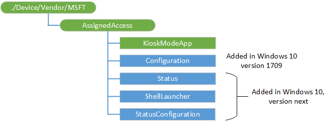

# AssignedAccess CSP

**Some information relates to prereleased product which may be substantially modified before it's commercially released. Microsoft makes no warranties, express or implied, with respect to the information provided here.**

The AssignedAccess configuration service provider (CSP) is used to set the device to run in kiosk mode. Once the CSP has been executed, then the next user login that is associated with the kiosk mode puts the device into the kiosk mode running the application specified in the CSP configuration.

For a step-by-step guide for setting up devices to run in kiosk mode, see [Set up a kiosk on Windows 10 Pro, Enterprise, or Education.](https://go.microsoft.com/fwlink/p/?LinkID=722211)

 In Windows 10, version 1709, the AssignedAccess configuration service provider (CSP) has been expanded to make it easy for administrators to create kiosks that run more than one app. You can configure multi-app kiosks using a provisioning package. For a step-by-step guide, see [Create a Windows 10 kiosk that runs multiple apps](https://docs.microsoft.com/windows/configuration/lock-down-windows-10-to-specific-apps).

> [!Warning]
> You can only assign one single app kiosk profile to an individual user account on a device. The single app profile does not support domain groups.

> [!Note]
> If the application calls KeyCredentialManager.IsSupportedAsync when it is running in assigned access mode and it returns false on the first run, invoke the settings screen and select a convenience PIN to use with Windows Hello. This is the settings screen that is hidden by the application running in assigned access mode. You can only use Windows Hello if you first leave assigned access mode, select your convenience pin, and then go back into assigned access mode again. 

> [!Note]
> The AssignedAccess CSP is supported in Windows 10 Enterprise and Windows 10 Education. Starting from Windows 10, version 1709 it is also supported in Windows 10 Pro and Windows 10 S. Starting in Windows 10, version 1803, it is also supported in Windows Holographic for Business edition.

The following diagram shows the AssignedAccess configuration service provider in tree format



<a href="" id="--vendor-msft-assignedaccess"></a>**./Device/Vendor/MSFT/AssignedAccess**
Root node for the CSP.

<a href="" id="assignedaccess-kioskmodeapp"></a>**./Device/Vendor/MSFT/AssignedAccess/KioskModeApp**
A JSON string that contains the user account name and Application User Model ID (AUMID) of the Kiosk mode app. For more information about how to get the AUMID, see [Find the Application User Model ID of an installed app](https://docs.microsoft.com/windows-hardware/customize/enterprise/find-the-application-user-model-id-of-an-installed-app).

For a step-by-step guide for setting up devices to run in kiosk mode, see [Set up a kiosk on Windows 10 Pro, Enterprise, or Education.](https://go.microsoft.com/fwlink/p/?LinkID=722211)

> [!Note]
> In Windows 10, version 1803 the Configuration node introduces single app kiosk profile to replace KioskModeApp CSP node. KioskModeApp node will be deprecated soon, so you should use the single app kiosk profile in config xml for Configuration node to configure public-facing single app Kiosk.
>
> Starting in Windows 10, version 1803 the KioskModeApp node becomes No-Op if Configuration node is configured on the device. That Add/Replace/Delete command on KioskModeApp node always returns SUCCESS to the MDM server if Configuration node is set, but the data of KioskModeApp will not take any effect on the device. Get command on KioskModeApp will return the configured JSON string even it’s not effective.

> [!Note]
> You cannot set both KioskModeApp and ShellLauncher at the same time on the device.

Starting in Windows 10, version 1607, you can use a provisioned app to configure the kiosk mode. For more information about how to remotely provision an app, see [Enterprise app management](enterprise-app-management.md).

Here's an example:

``` syntax
{"Account":"contoso\\kioskuser","AUMID":"Microsoft.Windows.Contoso_cw5n1h2txyewy!Microsoft.ContosoApp.ContosoApp"}
```

> [!Tip]
> In this example the double \\\ is required because it's in JSON and JSON escapes \ into \\\\. If an MDM server uses JSON parser\composer, they should ask customers to type only one \\, which will be \\\ in the JSON. If user types \\\\, it'll become \\\\\\\ in JSON, which will cause erroneous results. For the same reason, domain\account used in Configuration xml does not need \\\ but only one \\, because xml does not (need to) escape \\.
> 
> This applies to both domain\account, AzureAD\someone@contoso.onmicrosoft.com, i.e. as long as a \ used in JSON string. 

When configuring the kiosk mode app, the account name will be used to find the target user. The account name includes domain name and user name.

> [!Note]
> The domain name can be optional if the user name is unique across the system.

For a local account, the domain name should be the device name. When Get is executed on this node, the domain name is always returned in the output.


The supported operations are Add, Delete, Get and Replace. When there's no configuration, the Get and Delete methods fail. When there's already a configuration for kiosk mode app, the Add method fails. The data pattern for Add and Replace is the same.

<a href="" id="assignedaccess-configuration"></a>**./Device/Vendor/MSFT/AssignedAccess/Configuration**
Added in Windows 10, version 1709. Specifies the settings that you can configure in the kiosk or device. This node accepts an AssignedAccessConfiguration xml as input to configure the device experience. For details about the configuration settings in the XML, see [Create a Windows 10 kiosk that runs multiple apps](https://docs.microsoft.com/windows/configuration/lock-down-windows-10-to-specific-apps). Here is the schema for the [AssignedAccessConfiguration](#assignedaccessconfiguration-xsd).

> [!Note]
> In Windows 10, version 1803 the Configuration node introduces single app kiosk profile to replace KioskModeApp CSP node. KioskModeApp node will be deprecated soon, so you should use the single app kiosk profile in config xml for Configuration node to configure public-facing single app Kiosk.
>
> Starting in Windows 10, version 1803 the KioskModeApp node becomes No-Op if Configuration node is configured on the device. That Add/Replace/Delete command on KioskModeApp node always returns SUCCESS to the MDM server if Configuration node is set, but the data of KioskModeApp will not take any effect on the device. Get command on KioskModeApp will return the configured JSON string even it’s not effective.

Enterprises can use this to easily configure and manage the curated lockdown experience.

Supported operations are Add, Get, Delete, and Replace.

Deleting the multi-app configuration will remove the assigned access lockdown profiles associated with the users, but it cannot revert all the enforced policies back (e.g. Start Layout).

<a href="" id="assignedaccess-status"></a>**./Device/Vendor/MSFT/AssignedAccess/Status**
Added in Windows 10, version 1803. This read only polling node allows MDM server to query the current KioskModeAppRuntimeStatus as long as the StatusConfiguration node is set to “On” or “OnWithAlerts”. If the StatusConfiguration is “Off”, a node not found error will be reported to the MDM server. Click [link](#status-example) to see an example SyncML. [Here](#assignedaccessalert-xsd) is the schema for the Status payload.

In Windows 10, version 1803, Assigned Access runtime status only supports monitoring single app kiosk mode. Here are the possible status available for single app kiosk mode.

|Status  |Description  |
|---------|---------|---------|
| KioskModeAppRunning | This means the kiosk app is running normally. |
| KioskModeAppNotFound | This occurs when the kiosk app is not deployed to the machine. |
| KioskModeAppActivationFailure | This happens when the assigned access controller detects the process terminated unexpectedly after exceeding the max retry. |

Note that status codes available in the Status payload correspond to a specific KioskModeAppRuntimeStatus.

|Status code  | KioskModeAppRuntimeStatus |
|---------|---------|
| 1     | KioskModeAppRunning         |
| 2     | KioskModeAppNotFound          |
| 3     | KioskModeAppActivationFailure         |

Additionally, the status payload includes a profileId that can be used by the MDM server to correlate which kiosk app caused the error.

In Windows 10, version 1809, Assigned Access runtime status supports monitoring single-app kiosk and multi-app modes. Here are the possible status codes.

|Status|Description|
|---|---|
|Running|The AssignedAccess account (kiosk or multi-app) is running normally.|
|AppNotFound|The kiosk app isn't deployed to the machine.|
|ActivationFailed|The AssignedAccess account (kiosk or multi-app) failed to sign in.|
|AppNoResponse|The kiosk app launched successfully but is now unresponsive.|

Note that status codes available in the Status payload correspond to a specific AssignedAccessRuntimeStatus.

|Status code|AssignedAccessRuntimeStatus|
|---|---|
|1|Running|
|2|AppNotFound|
|3|ActivationFailed|
|4|AppNoResponse|

Additionally, the Status payload includes the following fields:

- profileId: can be used by the MDM server to correlate which account caused the error.
- OperationList: list of failed operations that occurred while applying the assigned access CSP, if any exist.

Supported operation is Get.

<a href="" id="assignedaccess-shelllauncher"></a>**./Device/Vendor/MSFT/AssignedAccess/ShellLauncher**
Added in Windows 10,version 1803. This node accepts a ShellLauncherConfiguration xml as input. Click [link](#shelllauncherconfiguration-xsd) to see the schema. Shell Launcher V2 is introduced in Windows 10, version 1903 to support both UWP and Win32 apps as the custom shell. For more information, see [Shell Launcher](https://docs.microsoft.com/windows/configuration/kiosk-shelllauncher).

> [!Note]
> You cannot set both ShellLauncher and KioskModeApp at the same time on the device.
>
> Configuring Shell Launcher using the ShellLauncher node automatically enables the Shell Launcher feature if it is available within the SKU. I. Shell Launcher as a feature and the ShellLauncher node both require Windows Enterprise or Windows Education to function.
>
>The ShellLauncher node is not supported in Windows 10 Pro.

<a href="" id="assignedaccess-statusconfiguration"></a>**./Device/Vendor/MSFT/AssignedAccess/StatusConfiguration**
Added in Windows 10, version 1803. This node accepts a StatusConfiguration xml as input to configure the Kiosk App Health monitoring. There are three possible values for StatusEnabled node inside StatusConfiguration xml: On, OnWithAlerts, and Off. Click [link](#statusconfiguration-xsd) to see the StatusConfiguration schema.

By default the StatusConfiguration node does not exist, and it implies this feature is off. Once enabled via CSP, Assigned Access will check kiosk app status and wait for MDM server to query the latest status from the Status node.

Optionally, the MDM server can opt-in to the MDM alert so a MDM alert will be generated and sent immediately to the MDM server when the assigned access runtime status is changed. This MDM alert will contain the status payload that is available via the Status node.

This MDM alert header is defined as follows:

-  MDMAlertMark: Critical
-  MDMAlertType: "com.microsoft.mdm.assignedaccess.status"
-  MDMAlertDataType: String
-  Source: "./Vendor/MSFT/AssignedAccess"
-  Target: N/A

> [!Note]
> MDM alert will only be sent for errors.


## KioskModeApp examples

KioskModeApp Add

```xml
<SyncML xmlns='SYNCML:SYNCML1.2'>
   <SyncBody>
       <Add>
           <CmdID>2</CmdID>
           <Item>
               <Target>
                   <LocURI>./Device/Vendor/MSFT/AssignedAccess/KioskModeApp</LocURI>
               </Target>
               <Meta>
                   <Format xmlns="syncml:metinf">chr</Format>
               </Meta>
               <Data>{"Account":"Domain\\AccountName","AUMID":"Microsoft.WindowsCalculator_8wekyb3d8bbwe!App"}</Data>
           </Item>
       </Add>
       <Final />
   </SyncBody>
</SyncML>
```

KioskModeApp Delete

```xml
<SyncML xmlns='SYNCML:SYNCML1.2'>
   <SyncBody>
       <Delete>
           <CmdID>2</CmdID>
           <Item>
               <Target>
                   <LocURI>./Device/Vendor/MSFT/AssignedAccess/KioskModeApp</LocURI>
               </Target>
           </Item>
       </Delete>
       <Final />
   </SyncBody>
</SyncML>
```

KioskModeApp Get

```xml
<SyncML xmlns='SYNCML:SYNCML1.2'>
   <SyncBody>
       <Get>
           <CmdID>2</CmdID>
           <Item>
               <Target>
                   <LocURI>./Device/Vendor/MSFT/AssignedAccess/KioskModeApp</LocURI>
               </Target>
           </Item>
       </Get>
       <Final />
   </SyncBody>
</SyncML>
```

KioskModeApp Replace

```xml
<SyncML xmlns='SYNCML:SYNCML1.2'>
   <SyncBody>
       <Replace>
           <CmdID>2</CmdID>
           <Item>
               <Target>
                   <LocURI>./Device/Vendor/MSFT/AssignedAccess/KioskModeApp</LocURI>
               </Target>
               <Meta>
                   <Format xmlns="syncml:metinf">chr</Format>
               </Meta>
               <Data>{"Account":"Domain\\AccountName","AUMID":"Microsoft.WindowsAlarms_8wekyb3d8bbwe!App"}</Data>
           </Item>
       </Replace>
       <Final />
   </SyncBody>
</SyncML>
```

## AssignedAccessConfiguration XSD

Below schema is for AssignedAccess Configuration up to Windows 10 1803 release.

```xml
<?xml version="1.0" encoding="utf-8"?>
<xs:schema
    elementFormDefault="qualified"
    xmlns:xs="http://www.w3.org/2001/XMLSchema"
    xmlns="http://schemas.microsoft.com/AssignedAccess/2017/config"
    xmlns:default="http://schemas.microsoft.com/AssignedAccess/2017/config"
    xmlns:rs5="http://schemas.microsoft.com/AssignedAccess/201810/config"
    xmlns:v3="http://schemas.microsoft.com/AssignedAccess/2020/config"
    targetNamespace="http://schemas.microsoft.com/AssignedAccess/2017/config"
    >

    <xs:import namespace="http://schemas.microsoft.com/AssignedAccess/201810/config"/>
    <xs:import namespace="http://schemas.microsoft.com/AssignedAccess/2020/config"/>

    <xs:complexType name="profile_list_t">
        <xs:sequence minOccurs="1" >
            <xs:element name="Profile" type="profile_t" minOccurs="1" maxOccurs="unbounded"/>
        </xs:sequence>
    </xs:complexType>

    <xs:complexType name="kioskmodeapp_t">
        <xs:attribute name="AppUserModelId" type="xs:string"/>
    </xs:complexType>

    <xs:complexType name="profile_t">
        <xs:choice>
            <xs:sequence minOccurs="1" maxOccurs="1">
                <xs:element name="AllAppsList" type="allappslist_t" minOccurs="1" maxOccurs="1"/>
                <xs:element ref="rs5:FileExplorerNamespaceRestrictions" minOccurs="0" maxOccurs="1"/>
                <xs:element name="StartLayout" type="xs:string" minOccurs="1" maxOccurs="1"/>
                <xs:element name="Taskbar" type="taskbar_t" minOccurs="1" maxOccurs="1"/>
            </xs:sequence>
            <xs:element name="KioskModeApp" type="kioskmodeapp_t" minOccurs="1" maxOccurs="1"/>
        </xs:choice>
        <xs:attribute name="Id" type="guid_t" use="required"/>
        <xs:attribute name="Name" type="xs:string" use="optional"/>
    </xs:complexType>

    <xs:complexType name="allappslist_t">
        <xs:sequence minOccurs="1" >
            <xs:element name="AllowedApps" type="allowedapps_t" minOccurs="1" maxOccurs="1">
                <xs:unique name="ForbidDupApps">
                    <xs:selector xpath="default:App"/>
                    <xs:field xpath="@AppUserModelId|@DesktopAppPath"/>
                </xs:unique>
                <xs:unique name="OnlyOneAppCanHaveAutoLaunch">
                    <xs:selector xpath="default:App"/>
                    <xs:field xpath="@rs5:AutoLaunch"/>
                </xs:unique>
            </xs:element>
        </xs:sequence>
    </xs:complexType>

    <xs:complexType name="allowedapps_t">
        <xs:sequence minOccurs="1" maxOccurs="1">
            <xs:element name="App" type="app_t" minOccurs="1" maxOccurs="unbounded">
                <xs:key name="mutexAumidOrDesktopApp">
                    <xs:selector xpath="."/>
                    <xs:field xpath="@AppUserModelId|@DesktopAppPath"/>
                </xs:key>
            </xs:element>
        </xs:sequence>
    </xs:complexType>

    <xs:complexType name="app_t">
        <xs:attribute name="AppUserModelId" type="xs:string"/>
        <xs:attribute name="DesktopAppPath" type="xs:string"/>
        <xs:attributeGroup ref="autoLaunch_attributeGroup"/>
    </xs:complexType>
    
    <xs:attributeGroup name="autoLaunch_attributeGroup">
        <xs:attribute ref="rs5:AutoLaunch"/>
        <xs:attribute ref="rs5:AutoLaunchArguments" use="optional"/>
    </xs:attributeGroup>

    <xs:complexType name="taskbar_t">
        <xs:attribute name="ShowTaskbar" type="xs:boolean" use="required"/>
    </xs:complexType>

    <xs:complexType name="profileId_t">
        <xs:attribute name="Id" type="guid_t" use="required"/>
    </xs:complexType>

    <xs:simpleType name="guid_t">
        <xs:restriction base="xs:string">
            <xs:pattern value="\{[0-9a-fA-F]{8}\-([0-9a-fA-F]{4}\-){3}[0-9a-fA-F]{12}\}"/>
        </xs:restriction>
    </xs:simpleType>

    <xs:complexType name="config_list_t">
        <xs:sequence minOccurs="1" >
            <xs:element ref="v3:GlobalProfile" minOccurs="0" maxOccurs="1"/>
            <xs:element name="Config" type="config_t" minOccurs="0" maxOccurs="unbounded"/>
        </xs:sequence>
    </xs:complexType>

    <xs:complexType name="config_t">
        <xs:sequence minOccurs="1" maxOccurs="1">
            <xs:choice>
                <xs:element name="Account" type="xs:string" minOccurs="1" maxOccurs="1"/>
                <xs:element name="AutoLogonAccount" type="autologon_account_t" minOccurs="1" maxOccurs="1"/>
                <xs:element name="UserGroup" type="group_t" minOccurs="1" maxOccurs="1"/>
                <xs:element name="SpecialGroup" type="specialGroup_t" minOccurs="1" maxOccurs="1" />
            </xs:choice>
            <xs:element name="DefaultProfile" type="profileId_t" minOccurs="1" maxOccurs="1"/>
        </xs:sequence>
    </xs:complexType>

    <xs:complexType name="autologon_account_t">
        <xs:attribute name="HiddenId" type="guid_t" fixed="{74331115-F68A-4DF9-8D2C-52BA2CE2ADB1}"/>
        <xs:attribute ref="rs5:DisplayName" use="optional" />
    </xs:complexType>

    <xs:complexType name="group_t">
        <xs:attribute name="Name" type="xs:string" use="required"/>
        <xs:attribute name="Type" type="groupType_t" use="required"/>
    </xs:complexType>

    <xs:complexType name="specialGroup_t">
        <xs:attribute name="Name" type="specialGroupType_t" use="required"/>
    </xs:complexType>

    <xs:simpleType name="groupType_t">
        <xs:restriction base="xs:string">
            <xs:enumeration value="LocalGroup"/>
            <xs:enumeration value="ActiveDirectoryGroup"/>
            <xs:enumeration value="AzureActiveDirectoryGroup"/>
        </xs:restriction>
    </xs:simpleType>

    <xs:simpleType name="specialGroupType_t">
        <xs:restriction base="xs:string">
            <xs:enumeration value="Visitor"/>
        </xs:restriction>
    </xs:simpleType>

    <xs:complexType name="fileExplorerNamespaceRestrictions_t">
        <xs:sequence minOccurs="1">
            <xs:element name="AllowedNamespace" type="allowedFileExplorerNamespace_t"/>
        </xs:sequence>
    </xs:complexType>

    <xs:complexType name="allowedFileExplorerNamespace_t">
        <xs:attribute name="Name" type="allowedFileExplorerNamespaceValues_t"/>
    </xs:complexType>

    <xs:simpleType name="allowedFileExplorerNamespaceValues_t">
        <xs:restriction base="xs:string">
            <xs:enumeration value="Downloads"/>
        </xs:restriction>
    </xs:simpleType>

    <!--below is the definition of the config xml content-->
    <xs:element name="AssignedAccessConfiguration">
        <xs:complexType>
            <xs:all minOccurs="1">
                <xs:element name="Profiles" type="profile_list_t">
                    <xs:unique name="duplicateRolesForbidden">
                        <xs:selector xpath="default:Profile"/>
                        <xs:field xpath="@Id"/>
                    </xs:unique>
                </xs:element>
                <xs:element name="Configs" type="config_list_t">
                    <xs:unique name="duplicateAutoLogonAccountForbidden">
                        <xs:selector xpath=".//default:AutoLogonAccount"/>
                        <xs:field xpath="@HiddenId"/>
                    </xs:unique>
                </xs:element>
            </xs:all>
        </xs:complexType>
    </xs:element>
</xs:schema>
```

Here is the schema for new features introduced in Windows 10 1809 release
```xml
<?xml version="1.0" encoding="utf-8"?>
<xs:schema
    elementFormDefault="qualified"
    xmlns:xs="http://www.w3.org/2001/XMLSchema"
    xmlns="http://schemas.microsoft.com/AssignedAccess/201810/config"
    xmlns:default="http://schemas.microsoft.com/AssignedAccess/201810/config"
    xmlns:v3="http://schemas.microsoft.com/AssignedAccess/2020/config"
    targetNamespace="http://schemas.microsoft.com/AssignedAccess/201810/config"
    >

    <xs:import namespace="http://schemas.microsoft.com/AssignedAccess/2020/config"/>

    <xs:complexType name="fileExplorerNamespaceRestrictions_t">
        <xs:choice>
            <xs:sequence minOccurs="0">
                <xs:element name="AllowedNamespace" type="allowedFileExplorerNamespace_t" minOccurs="0"/>
                <xs:element ref="v3:AllowRemovableDrives" minOccurs="0" maxOccurs="1"/>
            </xs:sequence>
            <xs:element ref="v3:NoRestriction" minOccurs="0" maxOccurs="1" />
        </xs:choice>
    </xs:complexType>

    <xs:complexType name="allowedFileExplorerNamespace_t">
        <xs:attribute name="Name" type="allowedFileExplorerNamespaceValues_t" use="required"/>
    </xs:complexType>

    <xs:simpleType name="allowedFileExplorerNamespaceValues_t">
        <xs:restriction base="xs:string">
            <xs:enumeration value="Downloads"/>
        </xs:restriction>
    </xs:simpleType>

    <xs:element name="FileExplorerNamespaceRestrictions" type="fileExplorerNamespaceRestrictions_t" />

    <xs:attribute name="AutoLaunch" type="xs:boolean"/>

    <xs:attribute name="AutoLaunchArguments" type="xs:string"/>

    <xs:attribute name="DisplayName" type="xs:string"/>

</xs:schema>
```

Schema for Windows 10 prerelease
```xml
<?xml version="1.0" encoding="utf-8"?>
<xs:schema
    elementFormDefault="qualified"
    xmlns:xs="http://www.w3.org/2001/XMLSchema"
    xmlns="http://schemas.microsoft.com/AssignedAccess/2020/config"
    xmlns:default="http://schemas.microsoft.com/AssignedAccess/2020/config"
    xmlns:vc="http://www.w3.org/2007/XMLSchema-versioning"
    vc:minVersion="1.1"
    targetNamespace="http://schemas.microsoft.com/AssignedAccess/2020/config"
    >

    <xs:simpleType name="guid_t">
        <xs:restriction base="xs:string">
            <xs:pattern value="\{[0-9a-fA-F]{8}\-([0-9a-fA-F]{4}\-){3}[0-9a-fA-F]{12}\}"/>
        </xs:restriction>
    </xs:simpleType>

    <xs:complexType name="globalProfile_t">
        <xs:attribute name="Id" type="guid_t" />
    </xs:complexType>
  
    <xs:element name="AllowRemovableDrives"/>
    <xs:element name="NoRestriction" />
    <xs:element name="GlobalProfile" type="globalProfile_t" />

</xs:schema>
```

To authorize a compatible configuration XML that includes 1809 or prerelease elements and attributes, always include the namespace of these add-on schemas, and decorate the attributes and elements accordingly with the namespace alias. e.g. to configure auto-launch feature which is added in 1809 release, use below sample, notice an alias r1809 is given to the 201810 namespace for 1809 release, and the alias is tagged on AutoLaunch and AutoLaunchArguments inline.
```xml
<AssignedAccessConfiguration
    xmlns="http://schemas.microsoft.com/AssignedAccess/2017/config"
    xmlns:r1809="http://schemas.microsoft.com/AssignedAccess/201810/config"
>
    <Profiles>
        <Profile Id="{9A2A490F-10F6-4764-974A-43B19E722C23}">
            <AllAppsList>
                <AllowedApps>
                  <App DesktopAppPath="%SystemRoot%\system32\notepad.exe" r1809:AutoLaunch="true" r1809:AutoLaunchArguments="1.txt"/>
```

## Example AssignedAccessConfiguration XML

```xml
<?xml version="1.0" encoding="utf-8" ?>
<AssignedAccessConfiguration xmlns="http://schemas.microsoft.com/AssignedAccess/2017/config">
  <Profiles>
    <Profile Id="{9A2A490F-10F6-4764-974A-43B19E722C23}">
      <AllAppsList>
        <AllowedApps>
          <App AppUserModelId="Microsoft.ZuneMusic_8wekyb3d8bbwe!Microsoft.ZuneMusic" />
          <App AppUserModelId="Microsoft.ZuneVideo_8wekyb3d8bbwe!Microsoft.ZuneVideo" />
          <App AppUserModelId="Microsoft.Windows.Photos_8wekyb3d8bbwe!App" />
          <App AppUserModelId="Microsoft.BingWeather_8wekyb3d8bbwe!App" />
          <App AppUserModelId="Microsoft.WindowsCalculator_8wekyb3d8bbwe!App" />
          <App DesktopAppPath="%windir%\system32\mspaint.exe" />
          <App DesktopAppPath="C:\Windows\System32\notepad.exe" />
        </AllowedApps>
      </AllAppsList>
      <StartLayout>
        <![CDATA[<LayoutModificationTemplate xmlns:defaultlayout="http://schemas.microsoft.com/Start/2014/FullDefaultLayout" xmlns:start="http://schemas.microsoft.com/Start/2014/StartLayout" Version="1" xmlns="http://schemas.microsoft.com/Start/2014/LayoutModification">
                      <LayoutOptions StartTileGroupCellWidth="6" />
                      <DefaultLayoutOverride>
                        <StartLayoutCollection>
                          <defaultlayout:StartLayout GroupCellWidth="6">
                            <start:Group Name="Group1">
                              <start:Tile Size="4x4" Column="0" Row="0" AppUserModelID="Microsoft.ZuneMusic_8wekyb3d8bbwe!Microsoft.ZuneMusic" />
                              <start:Tile Size="2x2" Column="4" Row="2" AppUserModelID="Microsoft.ZuneVideo_8wekyb3d8bbwe!Microsoft.ZuneVideo" />
                              <start:Tile Size="2x2" Column="4" Row="0" AppUserModelID="Microsoft.Windows.Photos_8wekyb3d8bbwe!App" />
                              <start:Tile Size="2x2" Column="4" Row="4" AppUserModelID="Microsoft.BingWeather_8wekyb3d8bbwe!App" />
                              <start:Tile Size="4x2" Column="0" Row="4" AppUserModelID="Microsoft.WindowsCalculator_8wekyb3d8bbwe!App" />
                            </start:Group>
                            <start:Group Name="Group2">
                              <start:DesktopApplicationTile Size="2x2" Column="2" Row="0" DesktopApplicationID="{1AC14E77-02E7-4E5D-B744-2EB1AE5198B7}\mspaint.exe" />
                              <start:DesktopApplicationTile Size="2x2" Column="0" Row="0" DesktopApplicationID="{1AC14E77-02E7-4E5D-B744-2EB1AE5198B7}\notepad.exe" />
                            </start:Group>
                          </defaultlayout:StartLayout>
                        </StartLayoutCollection>
                      </DefaultLayoutOverride>
                    </LayoutModificationTemplate>
                ]]>
      </StartLayout>
      <Taskbar ShowTaskbar="true"/>
    </Profile>
  </Profiles>
  <Configs>
    <Config>
      <Account>MultiAppKioskUser</Account>
      <DefaultProfile Id="{9A2A490F-10F6-4764-974A-43B19E722C23}"/>
    </Config>
  </Configs>
</AssignedAccessConfiguration>
```

## Configuration examples

XML encoding (escaped) and CDATA of the XML in the Data node both ensure that DM client can properly interpret the SyncML and send the configuration xml as string (in original format, unescaped) to AssignedAccess CSP to handle.

Similarly, the StartLayout xml inside the configuration xml is using the same format, xml inside xml as string. In the sample Configuration xml provided above, CDATA is used to embed the StartLayout xml. If you use CDATA to embed configuration xml in SyncML as well, you’ll have nested CDATA so pay attention to how CDATA is used in the provided CDATA sample. With that being said, when the Configuration xml is being constructed, MDM server can either escape start layout xml or put startlayout xml inside CDATA, when MDM server puts configuration xml inside SyncML, MDM server can also either escape it or wrap with CDATA.

Escape and CDATA are mechanisms when handling xml in xml. Consider it’s a transportation channel to send the configuration xml as payload from server to client. It’s transparent to both end user who configures the CSP and transparent to our CSP. Both the customer on the server side and our CSP must only see the original configuration XML.

This example shows escaped XML of the Data node.

```
<SyncML xmlns='SYNCML:SYNCML1.2'>
    <SyncBody>
        <Add>
            <CmdID>2</CmdID>
            <Item>
                <Target>
                    <LocURI>./Device/Vendor/MSFT/AssignedAccess/Configuration</LocURI>
                </Target>
                <Meta>
                    <Format xmlns="syncml:metinf">chr</Format>
                </Meta>
                <Data>
                    &lt;?xml version=&quot;1.0&quot; encoding=&quot;utf-8&quot; ?&gt;
&lt;AssignedAccessConfiguration xmlns=&quot;http://schemas.microsoft.com/AssignedAccess/2017/config&quot;&gt;
    &lt;Profiles&gt;
        &lt;Profile Id=&quot;{9A2A490F-10F6-4764-974A-43B19E722C23}&quot;&gt;
            &lt;AllAppsList&gt;
                &lt;AllowedApps&gt;
                    &lt;App AppUserModelId=&quot;Microsoft.ZuneMusic_8wekyb3d8bbwe!Microsoft.ZuneMusic&quot; /&gt;
                    &lt;App AppUserModelId=&quot;Microsoft.ZuneVideo_8wekyb3d8bbwe!Microsoft.ZuneVideo&quot; /&gt;
                    &lt;App AppUserModelId=&quot;Microsoft.Windows.Photos_8wekyb3d8bbwe!App&quot; /&gt;
                    &lt;App AppUserModelId=&quot;Microsoft.BingWeather_8wekyb3d8bbwe!App&quot; /&gt;
                    &lt;App AppUserModelId=&quot;Microsoft.WindowsCalculator_8wekyb3d8bbwe!App&quot; /&gt;
                    &lt;App DesktopAppPath=&quot;%windir%\system32\mspaint.exe&quot; /&gt;
                    &lt;App DesktopAppPath=&quot;C:\Windows\System32\notepad.exe&quot; /&gt;
                &lt;/AllowedApps&gt;
            &lt;/AllAppsList&gt;
            &lt;StartLayout&gt;
                &lt;![CDATA[&lt;LayoutModificationTemplate xmlns:defaultlayout=&quot;http://schemas.microsoft.com/Start/2014/FullDefaultLayout&quot; xmlns:start=&quot;http://schemas.microsoft.com/Start/2014/StartLayout&quot; Version=&quot;1&quot; xmlns=&quot;http://schemas.microsoft.com/Start/2014/LayoutModification&quot;&gt;
                      &lt;LayoutOptions StartTileGroupCellWidth=&quot;6&quot; /&gt;
                      &lt;DefaultLayoutOverride&gt;
                        &lt;StartLayoutCollection&gt;
                          &lt;defaultlayout:StartLayout GroupCellWidth=&quot;6&quot;&gt;
                            &lt;start:Group Name=&quot;Group1&quot;&gt;
                              &lt;start:Tile Size=&quot;4x4&quot; Column=&quot;0&quot; Row=&quot;0&quot; AppUserModelID=&quot;Microsoft.ZuneMusic_8wekyb3d8bbwe!Microsoft.ZuneMusic&quot; /&gt;
                              &lt;start:Tile Size=&quot;2x2&quot; Column=&quot;4&quot; Row=&quot;2&quot; AppUserModelID=&quot;Microsoft.ZuneVideo_8wekyb3d8bbwe!Microsoft.ZuneVideo&quot; /&gt;
                              &lt;start:Tile Size=&quot;2x2&quot; Column=&quot;4&quot; Row=&quot;0&quot; AppUserModelID=&quot;Microsoft.Windows.Photos_8wekyb3d8bbwe!App&quot; /&gt;
                              &lt;start:Tile Size=&quot;2x2&quot; Column=&quot;4&quot; Row=&quot;4&quot; AppUserModelID=&quot;Microsoft.BingWeather_8wekyb3d8bbwe!App&quot; /&gt;
                              &lt;start:Tile Size=&quot;4x2&quot; Column=&quot;0&quot; Row=&quot;4&quot; AppUserModelID=&quot;Microsoft.WindowsCalculator_8wekyb3d8bbwe!App&quot; /&gt;
                            &lt;/start:Group&gt;
                            &lt;start:Group Name=&quot;Group2&quot;&gt;
                              &lt;start:DesktopApplicationTile Size=&quot;2x2&quot; Column=&quot;2&quot; Row=&quot;0&quot; DesktopApplicationID=&quot;{1AC14E77-02E7-4E5D-B744-2EB1AE5198B7}\mspaint.exe&quot; /&gt;
                              &lt;start:DesktopApplicationTile Size=&quot;2x2&quot; Column=&quot;0&quot; Row=&quot;0&quot; DesktopApplicationID=&quot;{1AC14E77-02E7-4E5D-B744-2EB1AE5198B7}\notepad.exe&quot; /&gt;
                            &lt;/start:Group&gt;
                          &lt;/defaultlayout:StartLayout&gt;
                        &lt;/StartLayoutCollection&gt;
                      &lt;/DefaultLayoutOverride&gt;
                    &lt;/LayoutModificationTemplate&gt;
                ]]&gt;
            &lt;/StartLayout&gt;
            &lt;Taskbar ShowTaskbar=&quot;true&quot;/&gt;
        &lt;/Profile&gt;
    &lt;/Profiles&gt;
    &lt;Configs&gt;
        &lt;Config&gt;
            &lt;Account&gt;MultiAppKioskUser&lt;/Account&gt;
            &lt;DefaultProfile Id=&quot;{9A2A490F-10F6-4764-974A-43B19E722C23}&quot;/&gt;
        &lt;/Config&gt;
    &lt;/Configs&gt;
&lt;/AssignedAccessConfiguration&gt;

                </Data>
            </Item>
        </Add>
        <Final />
    </SyncBody>
</SyncML>
```
This example shows escaped XML of the Data node.
```
<SyncML xmlns='SYNCML:SYNCML1.2'>
    <SyncBody>
        <Replace>
            <CmdID>2</CmdID>
            <Item>
                <Target>
                    <LocURI>./Device/Vendor/MSFT/AssignedAccess/Configuration</LocURI>
                </Target>
                <Meta>
                    <Format xmlns="syncml:metinf">chr</Format>
                </Meta>
                <Data>
                    &lt;?xml version=&quot;1.0&quot; encoding=&quot;utf-8&quot; ?&gt;
&lt;AssignedAccessConfiguration xmlns=&quot;http://schemas.microsoft.com/AssignedAccess/2017/config&quot;&gt;
    &lt;Profiles&gt;
        &lt;Profile Id=&quot;{9A2A490F-10F6-4764-974A-43B19E722C23}&quot;&gt;
            &lt;AllAppsList&gt;
                &lt;AllowedApps&gt;
                    &lt;App AppUserModelId=&quot;Microsoft.ZuneMusic_8wekyb3d8bbwe!Microsoft.ZuneMusic&quot; /&gt;
                    &lt;App AppUserModelId=&quot;Microsoft.ZuneVideo_8wekyb3d8bbwe!Microsoft.ZuneVideo&quot; /&gt;
                    &lt;App AppUserModelId=&quot;Microsoft.Windows.Photos_8wekyb3d8bbwe!App&quot; /&gt;
                    &lt;App AppUserModelId=&quot;Microsoft.BingWeather_8wekyb3d8bbwe!App&quot; /&gt;
                    &lt;App AppUserModelId=&quot;Microsoft.WindowsCalculator_8wekyb3d8bbwe!App&quot; /&gt;
                    &lt;App DesktopAppPath=&quot;%windir%\system32\mspaint.exe&quot; /&gt;
                    &lt;App DesktopAppPath=&quot;C:\Windows\System32\notepad.exe&quot; /&gt;
                &lt;/AllowedApps&gt;
            &lt;/AllAppsList&gt;
            &lt;StartLayout&gt;
                &lt;![CDATA[&lt;LayoutModificationTemplate xmlns:defaultlayout=&quot;http://schemas.microsoft.com/Start/2014/FullDefaultLayout&quot; xmlns:start=&quot;http://schemas.microsoft.com/Start/2014/StartLayout&quot; Version=&quot;1&quot; xmlns=&quot;http://schemas.microsoft.com/Start/2014/LayoutModification&quot;&gt;
                      &lt;LayoutOptions StartTileGroupCellWidth=&quot;6&quot; /&gt;
                      &lt;DefaultLayoutOverride&gt;
                        &lt;StartLayoutCollection&gt;
                          &lt;defaultlayout:StartLayout GroupCellWidth=&quot;6&quot;&gt;
                            &lt;start:Group Name=&quot;Group1&quot;&gt;
                              &lt;start:Tile Size=&quot;4x4&quot; Column=&quot;0&quot; Row=&quot;0&quot; AppUserModelID=&quot;Microsoft.ZuneMusic_8wekyb3d8bbwe!Microsoft.ZuneMusic&quot; /&gt;
                              &lt;start:Tile Size=&quot;2x2&quot; Column=&quot;4&quot; Row=&quot;2&quot; AppUserModelID=&quot;Microsoft.ZuneVideo_8wekyb3d8bbwe!Microsoft.ZuneVideo&quot; /&gt;
                              &lt;start:Tile Size=&quot;2x2&quot; Column=&quot;4&quot; Row=&quot;0&quot; AppUserModelID=&quot;Microsoft.Windows.Photos_8wekyb3d8bbwe!App&quot; /&gt;
                              &lt;start:Tile Size=&quot;2x2&quot; Column=&quot;4&quot; Row=&quot;4&quot; AppUserModelID=&quot;Microsoft.BingWeather_8wekyb3d8bbwe!App&quot; /&gt;
                              &lt;start:Tile Size=&quot;4x2&quot; Column=&quot;0&quot; Row=&quot;4&quot; AppUserModelID=&quot;Microsoft.WindowsCalculator_8wekyb3d8bbwe!App&quot; /&gt;
                            &lt;/start:Group&gt;
                            &lt;start:Group Name=&quot;Group2&quot;&gt;
                              &lt;start:DesktopApplicationTile Size=&quot;2x2&quot; Column=&quot;2&quot; Row=&quot;0&quot; DesktopApplicationID=&quot;{1AC14E77-02E7-4E5D-B744-2EB1AE5198B7}\mspaint.exe&quot; /&gt;
                              &lt;start:DesktopApplicationTile Size=&quot;2x2&quot; Column=&quot;0&quot; Row=&quot;0&quot; DesktopApplicationID=&quot;{1AC14E77-02E7-4E5D-B744-2EB1AE5198B7}\notepad.exe&quot; /&gt;
                            &lt;/start:Group&gt;
                          &lt;/defaultlayout:StartLayout&gt;
                        &lt;/StartLayoutCollection&gt;
                      &lt;/DefaultLayoutOverride&gt;
                    &lt;/LayoutModificationTemplate&gt;
                ]]&gt;
            &lt;/StartLayout&gt;
            &lt;Taskbar ShowTaskbar=&quot;true&quot;/&gt;
        &lt;/Profile&gt;
    &lt;/Profiles&gt;
    &lt;Configs&gt;
        &lt;Config&gt;
            &lt;Account&gt;MultiAppKioskUser&lt;/Account&gt;
            &lt;DefaultProfile Id=&quot;{9A2A490F-10F6-4764-974A-43B19E722C23}&quot;/&gt;
        &lt;/Config&gt;
    &lt;/Configs&gt;
&lt;/AssignedAccessConfiguration&gt;

                </Data>
            </Item>
        </Replace>
        <Final />
    </SyncBody>
</SyncML>
```

This example uses CData for the XML.
```
<SyncML xmlns='SYNCML:SYNCML1.2'>
    <SyncBody>
        <Add>
            <CmdID>2</CmdID>
            <Item>
                <Target>
                    <LocURI>./Device/Vendor/MSFT/AssignedAccess/Configuration</LocURI>
                </Target>
                <Meta>
                    <Format xmlns="syncml:metinf">chr</Format>
                </Meta>
                <Data>
                    <![CDATA[<?xml version="1.0" encoding="utf-8" ?>
<AssignedAccessConfiguration xmlns="http://schemas.microsoft.com/AssignedAccess/2017/config">
  <Profiles>
    <Profile Id="{9A2A490F-10F6-4764-974A-43B19E722C23}">
      <AllAppsList>
        <AllowedApps>
          <App AppUserModelId="Microsoft.ZuneMusic_8wekyb3d8bbwe!Microsoft.ZuneMusic" />
          <App AppUserModelId="Microsoft.ZuneVideo_8wekyb3d8bbwe!Microsoft.ZuneVideo" />
          <App AppUserModelId="Microsoft.Windows.Photos_8wekyb3d8bbwe!App" />
          <App AppUserModelId="Microsoft.BingWeather_8wekyb3d8bbwe!App" />
          <App AppUserModelId="Microsoft.WindowsCalculator_8wekyb3d8bbwe!App" />
          <App DesktopAppPath="%windir%\system32\mspaint.exe" />
          <App DesktopAppPath="C:\Windows\System32\notepad.exe" />
        </AllowedApps>
      </AllAppsList>
      <StartLayout>
        <![CDATA[<LayoutModificationTemplate xmlns:defaultlayout="http://schemas.microsoft.com/Start/2014/FullDefaultLayout" xmlns:start="http://schemas.microsoft.com/Start/2014/StartLayout" Version="1" xmlns="http://schemas.microsoft.com/Start/2014/LayoutModification">
                      <LayoutOptions StartTileGroupCellWidth="6" />
                      <DefaultLayoutOverride>
                        <StartLayoutCollection>
                          <defaultlayout:StartLayout GroupCellWidth="6">
                            <start:Group Name="Group1">
                              <start:Tile Size="4x4" Column="0" Row="0" AppUserModelID="Microsoft.ZuneMusic_8wekyb3d8bbwe!Microsoft.ZuneMusic" />
                              <start:Tile Size="2x2" Column="4" Row="2" AppUserModelID="Microsoft.ZuneVideo_8wekyb3d8bbwe!Microsoft.ZuneVideo" />
                              <start:Tile Size="2x2" Column="4" Row="0" AppUserModelID="Microsoft.Windows.Photos_8wekyb3d8bbwe!App" />
                              <start:Tile Size="2x2" Column="4" Row="4" AppUserModelID="Microsoft.BingWeather_8wekyb3d8bbwe!App" />
                              <start:Tile Size="4x2" Column="0" Row="4" AppUserModelID="Microsoft.WindowsCalculator_8wekyb3d8bbwe!App" />
                            </start:Group>
                            <start:Group Name="Group2">
                              <start:DesktopApplicationTile Size="2x2" Column="2" Row="0" DesktopApplicationID="{1AC14E77-02E7-4E5D-B744-2EB1AE5198B7}\mspaint.exe" />
                              <start:DesktopApplicationTile Size="2x2" Column="0" Row="0" DesktopApplicationID="{1AC14E77-02E7-4E5D-B744-2EB1AE5198B7}\notepad.exe" />
                            </start:Group>
                          </defaultlayout:StartLayout>
                        </StartLayoutCollection>
                      </DefaultLayoutOverride>
                    </LayoutModificationTemplate>
                  ]]]]><![CDATA[>
      </StartLayout>
      <Taskbar ShowTaskbar="true"/>
    </Profile>
  </Profiles>
  <Configs>
    <Config>
      <Account>MultiAppKioskUser</Account>
      <DefaultProfile Id="{9A2A490F-10F6-4764-974A-43B19E722C23}"/>
    </Config>
  </Configs>
</AssignedAccessConfiguration>
]]>
                </Data>
            </Item>
        </Add>
        <Final />
    </SyncBody>
</SyncML>
```

Example of Get command that returns the configuration in the device.
```
<SyncML xmlns='SYNCML:SYNCML1.2'>
   <SyncBody>
       <Get>
           <CmdID>2</CmdID>
           <Item>
               <Target>
                   <LocURI>./Device/Vendor/MSFT/AssignedAccess/Configuration</LocURI>
               </Target>
           </Item>
       </Get>
       <Final />
   </SyncBody>
</SyncML>
```

Example of the Delete command.
```
<SyncML xmlns='SYNCML:SYNCML1.2'>
   <SyncBody>
       <Delete>
           <CmdID>2</CmdID>
           <Item>
               <Target>
                   <LocURI>./Device/Vendor/MSFT/AssignedAccess/Configuration</LocURI>
               </Target>
           </Item>
       </Delete>
       <Final />
   </SyncBody>
</SyncML>
```

## StatusConfiguration XSD

```xml
<?xml version="1.0" encoding="utf-8"?>
<xs:schema
    elementFormDefault="qualified"
    xmlns:xs="http://www.w3.org/2001/XMLSchema"
    xmlns="http://schemas.microsoft.com/AssignedAccess/2018/StatusConfiguration"
    xmlns:default="http://schemas.microsoft.com/AssignedAccess/2018/StatusConfiguration"
    targetNamespace="http://schemas.microsoft.com/AssignedAccess/2018/StatusConfiguration"
    >

    <xs:simpleType name="status_enabled_t">
        <xs:restriction base="xs:string">
            <xs:enumeration value="Off"/>
            <xs:enumeration value="On"/>
            <xs:enumeration value="OnWithAlerts"/>
        </xs:restriction>
    </xs:simpleType>

    <!--below is the definition of the config xml content-->
    <xs:element name="StatusConfiguration">
        <xs:complexType>
            <xs:sequence minOccurs="1" maxOccurs="1">
                <xs:element name="StatusEnabled" type="status_enabled_t" minOccurs="1" maxOccurs="1"/>
            </xs:sequence>
        </xs:complexType>
    </xs:element>
</xs:schema>
```

## StatusConfiguration example

StatusConfiguration Add OnWithAlerts

```xml
<SyncML xmlns='SYNCML:SYNCML1.2'>
  <SyncBody>
    <Add>
      <CmdID>2</CmdID>
      <Item>
        <Target>
          <LocURI>./Device/Vendor/MSFT/AssignedAccess/StatusConfiguration</LocURI>
        </Target>
        <Meta>
          <Format xmlns="syncml:metinf">chr</Format>
        </Meta>
        <Data>
          <![CDATA[
          <?xml version="1.0" encoding="utf-8" ?>
          <StatusConfiguration xmlns="http://schemas.microsoft.com/AssignedAccess/2018/StatusConfiguration">
            <StatusEnabled>OnWithAlerts</StatusEnabled>
          </StatusConfiguration>
          ]]>
        </Data>
      </Item>
    </Add>
    <Final />
  </SyncBody>
</SyncML>
```


StatusConfiguration Delete
```xml
<SyncML xmlns='SYNCML:SYNCML1.2'>
   <SyncBody>
       <Delete>
           <CmdID>2</CmdID>
           <Item>
               <Target>
                 <LocURI>./Device/Vendor/MSFT/AssignedAccess/StatusConfiguration</LocURI>
               </Target>
           </Item>
       </Delete>
       <Final />
   </SyncBody>
</SyncML>
```

StatusConfiguration Get

```xml
<SyncML xmlns='SYNCML:SYNCML1.2'>
   <SyncBody>
       <Get>
           <CmdID>2</CmdID>
           <Item>
               <Target>
                 <LocURI>./Device/Vendor/MSFT/AssignedAccess/StatusConfiguration</LocURI>
               </Target>
           </Item>
       </Get>
       <Final />
   </SyncBody>
</SyncML>
```

StatusConfiguration Replace On

```xml
<SyncML xmlns='SYNCML:SYNCML1.2'>
  <SyncBody>
    <Replace>
      <CmdID>2</CmdID>
      <Item>
        <Target>
          <LocURI>./Device/Vendor/MSFT/AssignedAccess/StatusConfiguration</LocURI>
        </Target>
        <Meta>
          <Format xmlns="syncml:metinf">chr</Format>
        </Meta>
        <Data>
          <![CDATA[
          <?xml version="1.0" encoding="utf-8" ?>
          <StatusConfiguration xmlns="http://schemas.microsoft.com/AssignedAccess/2018/StatusConfiguration">
            <StatusEnabled>On</StatusEnabled>
          </StatusConfiguration>
          ]]>
        </Data>
      </Item>
    </Replace>
    <Final />
  </SyncBody>
</SyncML>
```

## Status example

Status Get
```xml
<SyncML xmlns='SYNCML:SYNCML1.2'>
   <SyncBody>
       <Get>
           <CmdID>2</CmdID>
           <Item>
               <Target>
                 <LocURI>./Device/Vendor/MSFT/AssignedAccess/Status</LocURI>
               </Target>
           </Item>
       </Get>
       <Final />
   </SyncBody>
</SyncML>
```

## ShellLauncherConfiguration XSD

Shell Launcher V2 uses a separate XSD and namespace for backward compatibility. The original V1 XSD has a reference to the V2 XSD. 

```xml
<?xml version="1.0" encoding="utf-8"?>
<xs:schema
    elementFormDefault="qualified"
    xmlns:xs="http://www.w3.org/2001/XMLSchema"
    xmlns="http://schemas.microsoft.com/ShellLauncher/2018/Configuration"
    xmlns:default="http://schemas.microsoft.com/ShellLauncher/2018/Configuration"
    xmlns:V2="http://schemas.microsoft.com/ShellLauncher/2019/Configuration"
    targetNamespace="http://schemas.microsoft.com/ShellLauncher/2018/Configuration"
    >

    <xs:import namespace="http://schemas.microsoft.com/ShellLauncher/2019/Configuration"/>

    <xs:complexType name="profile_list_t">
        <xs:sequence minOccurs="1" maxOccurs="1">
            <xs:choice minOccurs="1" maxOccurs="1">
                <xs:element name="DefaultProfile" type="default_profile_t"/>
                <xs:element name="Profile" type="profile_t"/>
            </xs:choice>
            <xs:element name="Profile" type="profile_t" minOccurs="0" maxOccurs="unbounded"/>
        </xs:sequence>
    </xs:complexType>

    <xs:complexType name="default_profile_t">
        <xs:sequence minOccurs="1" maxOccurs="1">
            <xs:element name="Shell" type="default_shell_t" minOccurs="1" maxOccurs="1"/>
        </xs:sequence>
    </xs:complexType>

    <xs:complexType name="default_shell_t">
        <xs:sequence minOccurs="1" maxOccurs="1">
            <xs:element name="DefaultAction" type="default_action_t" minOccurs="0" maxOccurs="1"/>
        </xs:sequence>
        <xs:attribute name="Shell" type="xs:string" use="required"/>
        <xs:attribute ref="V2:AppType"/>
        <xs:attribute ref="V2:AllAppsFullScreen"/>
    </xs:complexType>

    <xs:complexType name="custom_shell_t">
        <xs:all minOccurs="1" maxOccurs="1">
            <xs:element name="ReturnCodeActions" type="return_code_action_list_t" minOccurs="0" maxOccurs="1">
                <xs:unique name="ForbidDuplicatedReturnCodes">
                    <xs:selector xpath="default:ReturnCodeAction"/>
                    <xs:field xpath="@ReturnCode"/>
                </xs:unique>
            </xs:element>
            <xs:element name="DefaultAction" type="default_action_t" minOccurs="0" maxOccurs="1"/>
        </xs:all>
        <xs:attribute name="Shell" type="xs:string" />
        <xs:attribute ref="V2:AppType"/>
        <xs:attribute ref="V2:AllAppsFullScreen"/>
    </xs:complexType>

    <xs:complexType name="default_action_t">
        <xs:attribute name="Action" type="system_action_t" use="required"/>
    </xs:complexType>

    <xs:simpleType name="system_action_t">
        <xs:restriction base="xs:string">
            <xs:enumeration value="RestartShell" />
            <xs:enumeration value="RestartDevice" />
            <xs:enumeration value="ShutdownDevice" />
            <xs:enumeration value="DoNothing" />
        </xs:restriction>
    </xs:simpleType>

    <xs:complexType name="profile_t">
        <xs:sequence minOccurs="1" maxOccurs="1">
            <xs:element name="Shell" type="custom_shell_t" minOccurs="1" maxOccurs="1"/>
        </xs:sequence>
        <xs:attribute name="Id" type="guid_t" use="required"/>
        <xs:attribute name="Name" type="xs:string" use="optional"/>
    </xs:complexType>

    <xs:simpleType name="guid_t">
        <xs:restriction base="xs:string">
            <xs:pattern value="\{[0-9a-fA-F]{8}\-([0-9a-fA-F]{4}\-){3}[0-9a-fA-F]{12}\}"/>
        </xs:restriction>
    </xs:simpleType>

    <xs:complexType name="return_code_action_list_t">
        <xs:sequence minOccurs="1" maxOccurs="1">
            <xs:element name="ReturnCodeAction" type="return_code_action_t" minOccurs="1" maxOccurs="unbounded"/>
        </xs:sequence>
    </xs:complexType>

    <xs:complexType name="return_code_action_t">
        <xs:attribute name="ReturnCode" type="xs:integer" use="required"/>
        <xs:attribute name="Action" type="system_action_t" use="required"/>
    </xs:complexType>

    <xs:complexType name="config_list_t">
        <xs:sequence minOccurs="1" maxOccurs="1">
            <xs:element name="Config" type="config_t" minOccurs="0" maxOccurs="unbounded"/>
        </xs:sequence>
    </xs:complexType>

    <xs:complexType name="config_t">
        <xs:sequence minOccurs="1" maxOccurs="1">
            <xs:choice minOccurs="1" maxOccurs="1">
                <xs:element name="Account" type="account_t" minOccurs="1" maxOccurs="1">
                    <xs:key name="mutexNameOrSID">
                        <xs:selector xpath="."/>
                        <xs:field xpath="@Name|@Sid"/>
                    </xs:key>
                </xs:element>
                <xs:element name="AutoLogonAccount" type="autologon_account_t" minOccurs="1" maxOccurs="1"/>
            </xs:choice>
            <xs:element name="Profile" type="profile_id_t" minOccurs="1" maxOccurs="1"/>
        </xs:sequence>
    </xs:complexType>

    <xs:complexType name="account_t">
        <xs:attribute name="Name" type="xs:string" use="optional"/>
        <xs:attribute name="Sid" type="xs:string" use="optional"/>
    </xs:complexType>

    <xs:complexType name="autologon_account_t">
        <xs:attribute name="HiddenId" type="guid_t" fixed="{50021E57-1CE4-49DF-99A9-8DB659E2C2DD}"/>
    </xs:complexType>

    <xs:complexType name="profile_id_t">
        <xs:attribute name="Id" type="guid_t" use="required"/>
    </xs:complexType>

    <!--below is the definition of the config xml content-->
    <xs:element name="ShellLauncherConfiguration">
        <xs:complexType>
            <xs:sequence minOccurs="1" maxOccurs="1">
                <xs:element name="Profiles" type="profile_list_t" minOccurs="1" maxOccurs="1">
                    <xs:unique name="ForbidDuplicatedProfiles">
                        <xs:selector xpath="default:Profile"/>
                        <xs:field xpath="@Id"/>
                    </xs:unique>
                </xs:element>
                <xs:element name="Configs" type="config_list_t" minOccurs="0" maxOccurs="1">
                    <xs:unique name="ForbidDuplicatedConfigs_Name">
                        <xs:selector xpath="default:Config/default:Account"/>
                        <xs:field xpath="@Name"/>
                    </xs:unique>
                    <xs:unique name="ForbidDuplicatedConfigs_Sid">
                        <xs:selector xpath="default:Config/default:Account"/>
                        <xs:field xpath="@Sid"/>
                    </xs:unique>
                    <xs:unique name="ForbidDuplicatedAutoLogonAccount">
                        <xs:selector xpath="default:Config/default:AutoLogonAccount"/>
                        <xs:field xpath="@HiddenId"/>
                    </xs:unique>
                </xs:element>
            </xs:sequence>
        </xs:complexType>
    </xs:element>
</xs:schema>
```
### Shell Launcher V2 XSD

```xml
<?xml version="1.0" encoding="utf-8"?>
<xs:schema
    elementFormDefault="qualified"
    xmlns:xs="http://www.w3.org/2001/XMLSchema"
    xmlns="http://schemas.microsoft.com/ShellLauncher/2019/Configuration"
    xmlns:default="http://schemas.microsoft.com/ShellLauncher/2019/Configuration"
    targetNamespace="http://schemas.microsoft.com/ShellLauncher/2019/Configuration"
    >

    <xs:attribute name="AppType">
      <xs:simpleType>
        <xs:restriction base="xs:string">
          <xs:enumeration value="UWP"/>
          <xs:enumeration value="Desktop"/>
        </xs:restriction>
      </xs:simpleType>
    </xs:attribute>

    <xs:attribute name="AllAppsFullScreen" type="xs:boolean"/>

</xs:schema>
```

## ShellLauncherConfiguration examples

ShellLauncherConfiguration Add
```
<SyncML xmlns='SYNCML:SYNCML1.2'>
  <SyncBody>
    <Add>
      <CmdID>2</CmdID>
      <Item>
        <Target>
          <LocURI>./Device/Vendor/MSFT/AssignedAccess/ShellLauncher</LocURI>
        </Target>
        <Meta>
          <Format xmlns="syncml:metinf">chr</Format>
        </Meta>
        <Data>
        <![CDATA[
        <?xml version="1.0" encoding="utf-8"?>
        <ShellLauncherConfiguration xmlns="http://schemas.microsoft.com/ShellLauncher/2018/Configuration">
            <Profiles>
                <!--default profile defines default shell and action for general purposes, should NOT be bound to any account-->
                <DefaultProfile>
                    <Shell Shell="%SystemRoot%\explorer.exe">
                        <!--DefaultAction is optional; if not defined, the pre-defined default action is "restart shell"-->
                        <DefaultAction Action="RestartShell"/>
                    </Shell>
                </DefaultProfile>
                <Profile Id="{814B6409-8C51-4EE2-95F8-DB39B70F5F68}">
                    <Shell Shell="%ProgramFiles%\Internet Explorer\iexplore.exe -k www.bing.com">
                        <!--ReturnCodeActions is optional, when none is provided, will always execute default action-->
                        <ReturnCodeActions>
                            <ReturnCodeAction ReturnCode="0" Action="RestartShell"/>
                            <ReturnCodeAction ReturnCode="-1" Action="RestartDevice"/>
                            <ReturnCodeAction ReturnCode="255" Action="ShutdownDevice"/>
                        </ReturnCodeActions>
                        <!--restart device after shell exits, if its return code does not match any of the above-->
                        <DefaultAction Action="RestartDevice"/>
                    </Shell>
                </Profile>
                <Profile Id="{24A73092-4F3F-44CC-8375-53F13FE213F7}">
                    <Shell Shell="%SystemRoot%\System32\cmd.exe"/>
                    <!--DefaultAction is optional, if none is supplied, will use DefaultAction defined in DefaultProfile-->
                </Profile>
            </Profiles>
            <Configs>
                <Config>
                    <!--AutoLogon account-->
                    <AutoLogonAccount/>
                    <Profile Id="{814B6409-8C51-4EE2-95F8-DB39B70F5F68}"/>
                </Config>
                <Config>
                    <!--BUILTIN\Administrators SID-->
                    <Account Sid="S-1-5-32-544"/>
                    <Profile Id="{24A73092-4F3F-44CC-8375-53F13FE213F7}"/>
                </Config>
                <Config>
                    <!--local account-->
                    <Account Name="sluser1"/>
                    <Profile Id="{814B6409-8C51-4EE2-95F8-DB39B70F5F68}"/>
                </Config>
            </Configs>
        </ShellLauncherConfiguration>
        ]]>
        </Data>
      </Item>
    </Add>
    <Final />
  </SyncBody>
</SyncML>
```

ShellLauncherConfiguration Add AutoLogon
```
<SyncML xmlns='SYNCML:SYNCML1.2'>
  <SyncBody>
    <Add>
      <CmdID>2</CmdID>
      <Item>
        <Target>
          <LocURI>./Device/Vendor/MSFT/AssignedAccess/ShellLauncher</LocURI>
        </Target>
        <Meta>
          <Format xmlns="syncml:metinf">chr</Format>
        </Meta>
        <Data>
        <![CDATA[
        <?xml version="1.0" encoding="utf-8"?>
        <ShellLauncherConfiguration xmlns="http://schemas.microsoft.com/ShellLauncher/2018/Configuration">
            <Profiles>
                <DefaultProfile>
                    <Shell Shell="%SystemRoot%\explorer.exe"/>
                </DefaultProfile>
                <Profile Id="{814B6409-8C51-4EE2-95F8-DB39B70F5F68}">
                    <Shell Shell="%ProgramFiles%\Internet Explorer\iexplore.exe -k www.bing.com">
                        <ReturnCodeActions>
                            <ReturnCodeAction ReturnCode="0" Action="RestartShell"/>
                            <ReturnCodeAction ReturnCode="-1" Action="RestartDevice"/>
                            <ReturnCodeAction ReturnCode="255" Action="ShutdownDevice"/>
                        </ReturnCodeActions>
                        <DefaultAction Action="RestartDevice"/>
                    </Shell>
                </Profile>
            </Profiles>
            <Configs>
                <Config>
                    <AutoLogonAccount/>
                    <Profile Id="{814B6409-8C51-4EE2-95F8-DB39B70F5F68}"/>
                </Config>
            </Configs>
        </ShellLauncherConfiguration>
        ]]>
        </Data>
      </Item>
    </Add>
    <Final />
  </SyncBody>
</SyncML>
```

ShellLauncher V2 Add
```
<SyncML xmlns='SYNCML:SYNCML1.2'>
  <SyncBody>
    <Add>
      <CmdID>2</CmdID>
      <Item>
        <Target>
          <LocURI>./Device/Vendor/MSFT/AssignedAccess/ShellLauncher</LocURI>
        </Target>
        <Meta>
          <Format xmlns="syncml:metinf">chr</Format>
        </Meta>
        <Data>
        <![CDATA[
        <?xml version="1.0" encoding="utf-8"?>
        <!--Using the http://schemas.microsoft.com/ShellLauncher/2019/Configuration namespace will opt-in to customshellhost.exe experience which can run win32 and UWP apps-->
        <ShellLauncherConfiguration xmlns="http://schemas.microsoft.com/ShellLauncher/2018/Configuration"
xmlns:V2="http://schemas.microsoft.com/ShellLauncher/2019/Configuration">
            <Profiles>
                <DefaultProfile> 
                    <Shell Shell="Microsoft.WindowsCalculator_8wekyb3d8bbwe!App" V2:AppType="UWP" V2:AllAppsFullScreen="true"> 
                        <!--DefaultAction is optional; if not defined, the pre-defined default action is "restart shell"--> 
                        <DefaultAction Action="RestartShell"/> 
                    </Shell> 
                </DefaultProfile> 
                <Profile Id="{814B6409-8C51-4EE2-95F8-DB39B70F5F68}">
                    <Shell Shell="%SystemRoot%\System32\notepad.exe" V2:AllAppsFullScreen="true">
                        <ReturnCodeActions>
                            <ReturnCodeAction ReturnCode="0" Action="RestartShell"/>
                            <ReturnCodeAction ReturnCode="-1" Action="RestartDevice"/>
                            <ReturnCodeAction ReturnCode="255" Action="ShutdownDevice"/>
                            <ReturnCodeAction ReturnCode="1" Action="DoNothing"/>
                        </ReturnCodeActions>
                        <DefaultAction Action="RestartShell"/>
                    </Shell>
                </Profile>
            </Profiles>
            <Configs>
                <Config>
                    <Account Name="sluser1"/>
                    <Profile Id="{814B6409-8C51-4EE2-95F8-DB39B70F5F68}"/>
                </Config>
            </Configs>
        </ShellLauncherConfiguration>
        ]]>
        </Data>
      </Item>
    </Add>
    <Final />
  </SyncBody>
</SyncML>

```

ShellLauncherConfiguration Get
```
<SyncML xmlns='SYNCML:SYNCML1.2'>
  <SyncBody>
    <Get>
      <CmdID>2</CmdID>
      <Item>
        <Target>
          <LocURI>./Device/Vendor/MSFT/AssignedAccess/ShellLauncher</LocURI>
        </Target>
      </Item>
    </Get>
    <Final />
  </SyncBody>
</SyncML>
```

## AssignedAccessAlert XSD

```xml
<?xml version="1.0" encoding="utf-8"?>
<xs:schema
    elementFormDefault="qualified"
    xmlns:xs="http://www.w3.org/2001/XMLSchema"
    xmlns="http://schemas.microsoft.com/AssignedAccess/2018/AssignedAccessAlert"
    xmlns:default="http://schemas.microsoft.com/AssignedAccess/2018/AssignedAccessAlert"
    targetNamespace="http://schemas.microsoft.com/AssignedAccess/2018/AssignedAccessAlert"
    >

    <xs:simpleType name="status_t">
        <xs:restriction base="xs:int">
            <xs:enumeration value="0"/> <!-- Unknown -->
            <xs:enumeration value="1"/> <!-- Running -->
            <xs:enumeration value="2"/> <!-- AppNotFound -->
            <xs:enumeration value="3"/> <!-- ActivationFailed -->
            <xs:enumeration value="4"/> <!-- AppNoResponse -->
        </xs:restriction>
    </xs:simpleType>

    <xs:simpleType name="guid_t">
        <xs:restriction base="xs:string">
            <xs:pattern value="\{[0-9a-fA-F]{8}\-([0-9a-fA-F]{4}\-){3}[0-9a-fA-F]{12}\}"/>
        </xs:restriction>
    </xs:simpleType>

    <xs:complexType name="operation_t">
        <xs:sequence minOccurs="1" maxOccurs="1">
            <xs:element name="name" type="xs:string" minOccurs="1" maxOccurs="1"/>
            <xs:element name="errorCode" type="xs:int" minOccurs="1" maxOccurs="1"/>
            <xs:element name="data" type="xs:string" minOccurs="0" maxOccurs="1"/>
        </xs:sequence>
    </xs:complexType>

    <xs:complexType name="operationlist_t">
        <xs:sequence minOccurs="1" maxOccurs="1">
            <xs:element name="Operation" type="operation_t" minOccurs="1" maxOccurs="unbounded"/>
        </xs:sequence>
    </xs:complexType>

    <xs:complexType name="event_t">
        <xs:sequence minOccurs="1" maxOccurs="1">
            <xs:element name="status" type="status_t" minOccurs="1" maxOccurs="1"/>
            <xs:element name="profileId" type="guid_t" minOccurs="1" maxOccurs="1"/>
            <xs:element name="errorCode" type="xs:int" minOccurs="0" maxOccurs="1"/>
            <xs:element name="OperationList" type="operationlist_t" minOccurs="0" maxOccurs="1"/>
        </xs:sequence>
        <xs:attribute name="Name" type="xs:string" use="required"/>
    </xs:complexType>

    <xs:element name="Events">
        <xs:complexType>
            <xs:choice minOccurs="1" maxOccurs="1">
                <xs:element name="Event" type="event_t" minOccurs="1" maxOccurs="1"/>
            </xs:choice>
        </xs:complexType>
    </xs:element>
</xs:schema>
```

## Windows Holographic for Business edition example

This example configures the following apps: Skype, Learning, Feedback Hub, and Calibration, for first line workers. Use this XML in a provisioning package using Windows Configuration Designer. For instructions, see [Configure HoloLens using a provisioning package](https://docs.microsoft.com/hololens/hololens-provisioning).

```xml
<?xml version="1.0" encoding="utf-8" ?>
<!--
  This is a sample Assigned Access XML file. The Profile specifies which apps are allowed
  and their app IDs. An Assigned Access Config specifies the accounts or groups to which
  a Profile is applicable.

  !!! NOTE: Change the Account below to a user in the tenant being tested !!!
-->
<AssignedAccessConfiguration xmlns="http://schemas.microsoft.com/AssignedAccess/2017/config">
    <Profiles>
        <Profile Id="{9A2A490F-10F6-4764-974A-43B19E722C23}">
            <AllAppsList>
                <AllowedApps>
                    <!-- Learning app -->
                    <App AppUserModelId="GGVLearning_cw5n1h2txyewy!GGVLearning" />
                    <!-- Calibration app -->
                    <App AppUserModelId="ViewCalibrationApp_cw5n1h2txyewy!ViewCalibrationApp" />
                    <!-- Feedback Hub -->
                    <App AppUserModelId="Microsoft.WindowsFeedbackHub_8wekyb3d8bbwe!App" />
                    <!-- HoloSkype -->
                    <App AppUserModelId="Microsoft.SkypeApp_kzf8qxf38zg5c!App" />
                </AllowedApps>
            </AllAppsList>
            <!-- This section is required for parity with Desktop Assigned Access. It is not currently used on HoloLens -->
            <StartLayout>
                <![CDATA[<LayoutModificationTemplate xmlns:defaultlayout="http://schemas.microsoft.com/Start/2014/FullDefaultLayout" xmlns:start="http://schemas.microsoft.com/Start/2014/StartLayout" Version="1" xmlns="http://schemas.microsoft.com/Start/2014/LayoutModification">
                      <LayoutOptions StartTileGroupCellWidth="6" />
                      <DefaultLayoutOverride>
                        <StartLayoutCollection>
                          <defaultlayout:StartLayout GroupCellWidth="6">
                            <start:Group Name="Life at a glance">
                              <start:Tile Size="2x2" Column="0" Row="0" AppUserModelID="Microsoft.SkypeApp_kzf8qxf38zg5c!App" />
                            </start:Group>
                          </defaultlayout:StartLayout>
                        </StartLayoutCollection>
                      </DefaultLayoutOverride>
                    </LayoutModificationTemplate>
                ]]>
            </StartLayout>
            <!-- This section is required for parity with Desktop Assigned Access. It is not currently used on HoloLens -->
            <Taskbar ShowTaskbar="true"/>
        </Profile>
    </Profiles>
    <Configs>
        <!-- IMPORTANT: Replace the account name here with an email address of the user you want to
        be enabled for assigned access. The value in the Account node must begin with
        AzureAD\ for AAD accounts. -->
        <Config>
            <Account>AzureAD\multiusertest@analogfre.onmicrosoft.com</Account>
            <DefaultProfile Id="{9A2A490F-10F6-4764-974A-43B19E722C23}"/>
        </Config>
    </Configs>
</AssignedAccessConfiguration>
```
