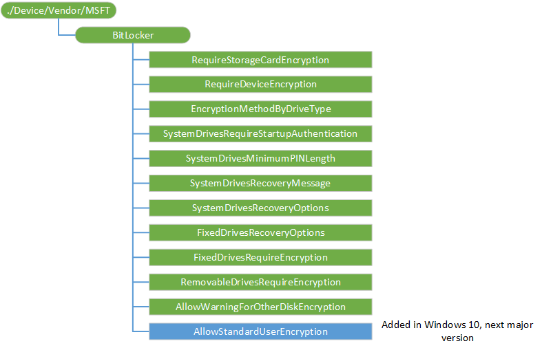

# BitLocker CSP

> [!WARNING]
> Some information relates to prereleased product which may be substantially modified before it's commercially released. Microsoft makes no warranties, express or implied, with respect to the information provided here.

The BitLocker configuration service provider (CSP) is used by the enterprise to manage encryption of PCs and devices. This CSP was added in Windows 10, version 1703. Starting in Windows 10, version 1809, it is also supported in Windows 10 Pro.

> [!Note]  
> Settings are enforced only at the time encryption is started. Encryption is not restarted with settings changes.  
> You must send all the settings together in a single SyncML to be effective.

A Get operation on any of the settings, except for RequireDeviceEncryption and RequireStorageCardEncryption, returns
the setting configured by the admin.

For RequireDeviceEncryption and RequireStorageCardEncryption, the Get operation returns the actual status of enforcement to the admin, such as if TPM protection is required and if encryption is required. And if the device has BitLocker enabled but with password protector, the status reported is 0. A Get operation on RequireDeviceEncryption does not verify that the a minimum PIN length is enforced (SystemDrivesMinimumPINLength).

The following diagram shows the BitLocker configuration service provider in tree format.



<a href="" id="--device-vendor-msft-bitlocker"></a>**./Device/Vendor/MSFT/BitLocker**  
<p style="margin-left: 20px">Defines the root node for the BitLocker configuration service provider.</p>

<a href="" id="requirestoragecardencryption"></a>**RequireStorageCardEncryption**  
<p style="margin-left: 20px">Allows the administrator to require storage card encryption on the device. This policy is valid only for a mobile SKU.</p>

<table>
<tr>
	<th>Home</th>
	<th>Pro</th>
	<th>Business</th>
	<th>Enterprise</th>
	<th>Education</th>
	<th>Mobile</th>
	<th>Mobile Enterprise</th>
</tr>
<tr>
	<td></td>
	<td></td>
	<td></td>
	<td></td>
	<td></td>
	<td></td>
	<td></td>
</tr>
</table> 

<p style="margin-left: 20px">Data type is integer. Sample value for this node to enable this policy: 1. Disabling this policy will not turn off the encryption on the storage card, but the user will no longer be prompted to turn it on.</p>

- 0 (default) – Storage cards do not need to be encrypted.
- 1 – Require Storage cards to be encrypted.  

<p style="margin-left: 20px">Disabling this policy will not turn off the encryption on the system card, but the user will no longer be prompted to turn it on.</p>
 
<p style="margin-left: 20px">If you want to disable this policy use the following SyncML:</p>

``` syntax
<SyncML>
    <SyncBody>
        <Replace>
            <CmdID>$CmdID$</CmdID>
            <Item>
                <Target>
                    <LocURI>./Device/Vendor/MSFT/BitLocker/RequireStorageCardEncryption</LocURI>
                </Target>
                <Meta>
                    <Format xmlns="syncml:metinf">int</Format>
                </Meta>
                <Data>0</Data>
                </Item>
        </Replace>
    </SyncBody>
</SyncML>
```

<p style="margin-left: 20px">Data type is integer. Supported operations are Add, Get, Replace, and Delete.</p>

<a href="" id="requiredeviceencryption"></a>**RequireDeviceEncryption**  

<p style="margin-left: 20px">Allows the administrator to require encryption to be turned on by using BitLocker\Device Encryption.</p>

<table>
<tr>
	<th>Home</th>
	<th>Pro</th>
	<th>Business</th>
	<th>Enterprise</th>
	<th>Education</th>
	<th>Mobile</th>
	<th>Mobile Enterprise</th>
</tr>
<tr>
	<td></td>
	<td></td>
	<td></td>
	<td></td>
	<td></td>
	<td></td>
	<td></td>
</tr>
</table> 

<p style="margin-left: 20px">Data type is integer. Sample value for this node to enable this policy: 1. Disabling this policy will not turn off the encryption on the system card, but the user will no longer be prompted to turn it on.</p>

<p style="margin-left: 20px">If you want to disable this policy use the following SyncML:</p>

``` syntax
<SyncML>
    <SyncBody>
        <Replace>
            <CmdID>$CmdID$</CmdID>
            <Item>
                <Target>
                    <LocURI>./Device/Vendor/MSFT/BitLocker/RequireDeviceEncryption</LocURI>
                </Target>
                <Meta>
                    <Format xmlns="syncml:metinf">int</Format>
                </Meta>
                <Data>0</Data>
            </Item>
        </Replace>
    </SyncBody>
</SyncML>        
```

<p style="margin-left: 20px">Data type is integer. Supported operations are Add, Get, Replace, and Delete.</p>

<a href="" id="encryptionmethodbydrivetype"></a>**EncryptionMethodByDriveType** 
<p style="margin-left: 20px">Allows you to set the default encrytion method for each of the different drive types: operating system drives, fixed data drives, and removable data drives. Hidden, system and recovery partitions are skipped from encryption. This setting is a direct mapping to the Bitlocker Group Policy "Choose drive encryption method and cipher strength (Windows 10 [Version 1511] and later)". </p>
<table>
<tr>
	<th>Home</th>
	<th>Pro</th>
	<th>Business</th>
	<th>Enterprise</th>
	<th>Education</th>
	<th>Mobile</th>
	<th>Mobile Enterprise</th>
</tr>
<tr>
	<td></td>
	<td></td>
	<td></td>
	<td></td>
	<td></td>
	<td></td>
	<td></td>
</tr>
</table> 
<p style="margin-left: 20px">ADMX Info:</p>
<ul>
<li>GP English name: *Choose drive encryption method and cipher strength (Windows 10 [Version 1511] and later)*</li>
<li>GP name: *EncryptionMethodWithXts_Name*</li>
<li>GP path: *Windows Components/Bitlocker Drive Encryption*</li>
<li>GP ADMX file name: *VolumeEncryption.admx*</li>
</ul>

> [!Tip]  
> For a step-by-step guide to enable ADMX-backed policies, see [Enable ADMX-backed policies in MDM](enable-admx-backed-policies-in-mdm.md). For additional information, see [Understanding ADMX-backed policies](understanding-admx-backed-policies.md).

<p style="margin-left: 20px">This setting allows you to configure the algorithm and cipher strength used by BitLocker Drive Encryption. This setting is applied when you turn on BitLocker. Changing the encryption method has no effect if the drive is already encrypted, or if encryption is in progress.</p>

<p style="margin-left: 20px">If you enable this setting you will be able to configure an encryption algorithm and key cipher strength for fixed data drives, operating system drives, and removable data drives individually. For fixed and operating system drives, we recommend that you use the XTS-AES algorithm. For removable drives, you should use AES-CBC 128-bit or AES-CBC 256-bit if the drive will be used in other devices that are not running Windows 10, version 1511.</p>

<p style="margin-left: 20px">If you disable or do not configure this policy setting, BitLocker will use the default encryption method of XTS-AES 128-bit or the encryption method specified by any setup script.</p>

<p style="margin-left: 20px"> Sample value for this node to enable this policy and set the encryption methods is:</p>

``` syntax
 <enabled/><data id="EncryptionMethodWithXtsOsDropDown_Name" value="xx"/><data id="EncryptionMethodWithXtsFdvDropDown_Name" value="xx"/><data id="EncryptionMethodWithXtsRdvDropDown_Name" value="xx"/>
```

<p style="margin-left: 20px">EncryptionMethodWithXtsOsDropDown_Name = Select the encryption method for operating system drives</p>
<p style="margin-left: 20px">EncryptionMethodWithXtsFdvDropDown_Name = Select the encryption method for fixed data drives.</p>
<p style="margin-left: 20px">EncryptionMethodWithXtsRdvDropDown_Name = Select the encryption method for removable data drives.</p>

<p style="margin-left: 20px"> The possible values for 'xx' are:</p>

- 3 = AES-CBC 128
- 4 = AES-CBC 256
- 6 = XTS-AES 128
- 7 = XTS-AES 256

> [!Note]  
> When you enable EncryptionMethodByDriveType, you must specify values for all three drives (operating system, fixed data, and removable data), otherwise it will fail (500 return status). For example, if you only set the encrytion method for the OS and removable drives, you will get a 500 return status.  

<p style="margin-left: 20px">  If you want to disable this policy use the following SyncML:</p> 

``` syntax
                          <Replace>
                         <CmdID>$CmdID$</CmdID>
                           <Item>
                             <Target>
                                 <LocURI>./Device/Vendor/MSFT/BitLocker/EncryptionMethodByDriveType</LocURI>
                             </Target>
                             <Meta>
                                 <Format xmlns="syncml:metinf">chr</Format>
                             </Meta>
                             <Data>&lt;disabled/&gt;</Data>
                           </Item>
                         </Replace>
```

<p style="margin-left: 20px">Data type is string. Supported operations are Add, Get, Replace, and Delete.</p>

<a href="" id="systemdrivesrequirestartupauthentication"></a>**SystemDrivesRequireStartupAuthentication**  
<p style="margin-left: 20px">This setting is a direct mapping to the Bitlocker Group Policy "Require additional authentication at startup".</p>
<table>
<tr>
	<th>Home</th>
	<th>Pro</th>
	<th>Business</th>
	<th>Enterprise</th>
	<th>Education</th>
	<th>Mobile</th>
	<th>Mobile Enterprise</th>
</tr>
<tr>
	<td></td>
	<td></td>
	<td></td>
	<td></td>
	<td></td>
	<td></td>
	<td></td>
</tr>
</table> 
<p style="margin-left: 20px">ADMX Info:</p>
<ul>
<li>GP English name: *Require additional authentication at startup*</li>
<li>GP name: *ConfigureAdvancedStartup_Name*</li>
<li>GP path: *Windows Components/Bitlocker Drive Encryption/Operating System Drives*</li>
<li>GP ADMX file name: *VolumeEncryption.admx*</li>
</ul>

> [!Tip]  
> For a step-by-step guide to enable ADMX-backed policies, see [Enable ADMX-backed policies in MDM](enable-admx-backed-policies-in-mdm.md). For additional information, see [Understanding ADMX-backed policies](understanding-admx-backed-policies.md).

<p style="margin-left: 20px">This setting allows you to configure whether BitLocker requires additional authentication each time the computer starts and whether you are using BitLocker with or without a Trusted Platform Module (TPM). This setting is applied when you turn on BitLocker.</p>

> [!Note]  
> Only one of the additional authentication options can be required at startup, otherwise an error occurs.

<p style="margin-left: 20px">If you want to use BitLocker on a computer without a TPM, set the "ConfigureNonTPMStartupKeyUsage_Name" data. In this mode either a password or a USB drive is required for start-up. When using a startup key, the key information used to encrypt the drive is stored on the USB drive, creating a USB key. When the USB key is inserted the access to the drive is authenticated and the drive is accessible. If the USB key is lost or unavailable or if you have forgotten the password then you will need to use one of the BitLocker recovery options to access the drive.</p>

<p style="margin-left: 20px">On a computer with a compatible TPM, four types of authentication methods can be used at startup to provide added protection for encrypted data. When the computer starts, it can use only the TPM for authentication, or it can also require insertion of a USB flash drive containing a startup key, the entry of a 6-digit to 20-digit personal identification number (PIN), or both.</p>

> [!Note]  
> In Windows 10, version 1703 release B, you can use a minimum PIN of 4 digits. SystemDrivesMinimumPINLength policy must be set to allow PINs shorter than 6 digits.

<p style="margin-left: 20px">If you enable this policy setting, users can configure advanced startup options in the BitLocker setup wizard.</p>

<p style="margin-left: 20px">If you disable or do not configure this setting, users can configure only basic options on computers with a TPM.</p>

> [!Note]  
> If you want to require the use of a startup PIN and a USB flash drive, you must configure BitLocker settings using the command-line tool manage-bde instead of the BitLocker Drive Encryption setup wizard.

<p style="margin-left: 20px">Sample value for this node to enable this policy is:</p>

``` syntax
<enabled/><data id="ConfigureNonTPMStartupKeyUsage_Name" value="xx"/><data id="ConfigureTPMStartupKeyUsageDropDown_Name" value="yy"/><data id="ConfigurePINUsageDropDown_Name" value="yy"/><data id="ConfigureTPMPINKeyUsageDropDown_Name" value="yy"/><data id="ConfigureTPMUsageDropDown_Name" value="yy"/>
```
<p style="margin-left: 20px">Data id:</p>
<ul>
<li>ConfigureNonTPMStartupKeyUsage_Name = Allow BitLocker without a compatible TPM (requires a password or a startup key on a USB flash drive).</li>
<li>ConfigureTPMStartupKeyUsageDropDown_Name = (for computer with TPM) Configure TPM startup key.</li>
<li>ConfigurePINUsageDropDown_Name = (for computer with TPM) Configure TPM startup PIN.</li>
<li>ConfigureTPMPINKeyUsageDropDown_Name = (for computer with TPM) Configure TPM startup key and PIN.</li>
<li>ConfigureTPMUsageDropDown_Name = (for computer with TPM) Configure TPM startup.</li>
</ul>

<p style="margin-left: 20px">The possible values for 'xx' are:</p>
<ul>
<li>true = Explicitly allow</li>
<li>false = Policy not set</li>
</ul>

<p style="margin-left: 20px">The possible values for 'yy' are:</p>
<ul>
<li>2 = Optional</li>
<li>1 = Required</li>
<li>0 = Disallowed</li>
</ul>

<p style="margin-left: 20px">Disabling the policy will let the system choose the default behaviors. If you want to disable this policy use the following SyncML:</p>

``` syntax
                         <Replace>
                         <CmdID>$CmdID$</CmdID>
                           <Item>
                             <Target>
                                 <LocURI>./Device/Vendor/MSFT/BitLocker/SystemDrivesRequireStartupAuthentication</LocURI>
                             </Target>
                             <Meta>
                                 <Format xmlns="syncml:metinf">chr</Format>
                             </Meta>
                             <Data>&lt;disabled/&gt;</Data>
                           </Item>
                         </Replace>
```
<p style="margin-left: 20px">Data type is string. Supported operations are Add, Get, Replace, and Delete.</p>

<a href="" id="systemdrivesminimumpinlength"></a>**SystemDrivesMinimumPINLength**  
<p style="margin-left: 20px">This setting is a direct mapping to the Bitlocker Group Policy "Configure minimum PIN length for startup".</p>
<table>
<tr>
	<th>Home</th>
	<th>Pro</th>
	<th>Business</th>
	<th>Enterprise</th>
	<th>Education</th>
	<th>Mobile</th>
	<th>Mobile Enterprise</th>
</tr>
<tr>
	<td></td>
	<td></td>
	<td></td>
	<td></td>
	<td></td>
	<td></td>
	<td></td>
</tr>
</table>
<p style="margin-left: 20px">ADMX Info:</p>
<ul>
<li>GP English name:*Configure minimum PIN length for startup*</li>
<li>GP name: *MinimumPINLength_Name*</li>
<li>GP path: *Windows Components/Bitlocker Drive Encryption/Operating System Drives*</li>
<li>GP ADMX file name: *VolumeEncryption.admx*</li>
</ul>

> [!Tip]  
> For a step-by-step guide to enable ADMX-backed policies, see [Enable ADMX-backed policies in MDM](enable-admx-backed-policies-in-mdm.md). For additional information, see [Understanding ADMX-backed policies](understanding-admx-backed-policies.md).

<p style="margin-left: 20px">This setting allows you to configure a minimum length for a Trusted Platform Module (TPM) startup PIN. This setting is applied when you turn on BitLocker. The startup PIN must have a minimum length of 6 digits and can have a maximum length of 20 digits.</p>

> [!Note]  
> In Windows 10, version 1703 release B, you can use a minimum PIN length of 4 digits. 
>
>In TPM 2.0 if minimum PIN length is set below 6 digits, Windows will attempt to update the TPM lockout period to be greater than the default when a PIN is changed. If successful, Windows will only reset the TPM lockout period back to default if the TPM is reset. This does not apply to TPM 1.2.

<p style="margin-left: 20px">If you enable this setting, you can require a minimum number of digits to be used when setting the startup PIN.</p>

<p style="margin-left: 20px">If you disable or do not configure this setting, users can configure a startup PIN of any length between 6 and 20 digits.</p>

<p style="margin-left: 20px">Sample value for this node to enable this policy is:</p>

``` syntax
<enabled/><data id="MinPINLength" value="xx"/>
```

<p style="margin-left: 20px">Disabling the policy will let the system choose the default behaviors. If you want to disable this policy use the following SyncML:</p>

``` syntax
                         <Replace>
                         <CmdID>$CmdID$</CmdID>
                           <Item>
                             <Target>
                                 <LocURI>./Device/Vendor/MSFT/BitLocker/SystemDrivesMinimumPINLength</LocURI>
                             </Target>
                             <Meta>
                                 <Format xmlns="syncml:metinf">chr</Format>
                             </Meta>
                             <Data>&lt;disabled/&gt;</Data>
                           </Item>
                         </Replace>
```

<p style="margin-left: 20px">Data type is string. Supported operations are Add, Get, Replace, and Delete.</p>

<a href="" id="systemdrivesrecoverymessage"></a>**SystemDrivesRecoveryMessage**  
<p style="margin-left: 20px">This setting is a direct mapping to the Bitlocker Group Policy "Configure pre-boot recovery message and URL" (PrebootRecoveryInfo_Name).</p>
<table>
<tr>
	<th>Home</th>
	<th>Pro</th>
	<th>Business</th>
	<th>Enterprise</th>
	<th>Education</th>
	<th>Mobile</th>
	<th>Mobile Enterprise</th>
</tr>
<tr>
	<td></td>
	<td></td>
	<td></td>
	<td></td>
	<td></td>
	<td></td>
	<td></td>
</tr>
</table>
<p style="margin-left: 20px">ADMX Info:</p>
<ul>
<li>GP English name: *Configure pre-boot recovery message and URL*</li>
<li>GP name: *PrebootRecoveryInfo_Name*</li>
<li>GP path: *Windows Components/Bitlocker Drive Encryption/Operating System Drives*</li>
<li>GP ADMX file name: *VolumeEncryption.admx*</li>
</ul>

> [!Tip]  
> For a step-by-step guide to enable ADMX-backed policies, see [Enable ADMX-backed policies in MDM](enable-admx-backed-policies-in-mdm.md). For additional information, see [Understanding ADMX-backed policies](understanding-admx-backed-policies.md).

<p style="margin-left: 20px">This setting lets you configure the entire recovery message or replace the existing URL that are displayed on the pre-boot key recovery screen when the OS drive is locked.
</p>

<p style="margin-left: 20px">If you set the value to "1" (Use default recovery message and URL), the default BitLocker recovery message and URL will be displayed in the pre-boot key recovery screen. If you have previously configured a custom recovery message or URL and want to revert to the default message, you must keep the policy enabled and set the value "1" (Use default recovery message and URL).</o>
        
<p style="margin-left: 20px">If you set the value to "2" (Use custom recovery message), the message you set in the "RecoveryMessage_Input" data field will be displayed in the pre-boot key recovery screen. If a recovery URL is available, include it in the message.</p>
                        
<p style="margin-left: 20px">If you set the value to "3" (Use custom recovery URL), the URL you type in the "RecoveryUrl_Input" data field will replace the default URL in the default recovery message, which will be displayed in the pre-boot key recovery screen.</p>
                         
<p style="margin-left: 20px">Sample value for this node to enable this policy is:</p>

``` syntax
<enabled/><data id="PrebootRecoveryInfoDropDown_Name" value="xx"/><data id="RecoveryMessage_Input" value="yy"/><data id="RecoveryUrl_Input" value="zz"/>
```
<p style="margin-left: 20px">The possible values for 'xx' are:</p>

-  0 = Empty
-  1 = Use default recovery message and URL (in this case you don't need to specify a value for "RecoveryMessage_Input" or "RecoveryUrl_Input").
-  2 = Custom recovery message is set.
-  3 = Custom recovery URL is set.
-  'yy' = string of max length 900.
-  'zz' = string of max length 500.

> [!Note]  
> When you enable SystemDrivesRecoveryMessage, you must specify values for all three settings (pre-boot recovery screen, recovery message, and recovery URL), otherwise it will fail (500 return status). For example, if you only specify values for message and URL, you will get a 500 return status.

<p style="margin-left: 20px">Disabling the policy will let the system choose the default behaviors.  If you want to disable this policy use the following SyncML:</p>

``` syntax
                        <Replace>
                         <CmdID>$CmdID$</CmdID>
                           <Item>
                             <Target>
                                 <LocURI>./Device/Vendor/MSFT/BitLocker/SystemDrivesRecoveryMessage</LocURI>
                             </Target>
                             <Meta>
                                 <Format xmlns="syncml:metinf">chr</Format>
                             </Meta>
                             <Data>&lt;disabled/&gt;</Data>
                           </Item>
                         </Replace>
```

> [!Note]  
> Not all characters and languages are supported in pre-boot. It is strongly recommended that you test that the characters you use for the custom message or URL appear correctly on the pre-boot recovery screen.

<p style="margin-left: 20px">Data type is string. Supported operations are Add, Get, Replace, and Delete.</p>

<a href="" id="systemdrivesrecoveryoptions"></a>**SystemDrivesRecoveryOptions**  
<p style="margin-left: 20px">This setting is a direct mapping to the Bitlocker Group Policy "Choose how BitLocker-protected operating system drives can be recovered" (OSRecoveryUsage_Name).</p>
<table>
<tr>
	<th>Home</th>
	<th>Pro</th>
	<th>Business</th>
	<th>Enterprise</th>
	<th>Education</th>
	<th>Mobile</th>
	<th>Mobile Enterprise</th>
</tr>
<tr>
	<td></td>
	<td></td>
	<td></td>
	<td></td>
	<td></td>
	<td></td>
	<td></td>
</tr>
</table>
<p style="margin-left: 20px">ADMX Info:</p>
<ul>
<li>GP English name: *Choose how BitLocker-protected operating system drives can be recovered*</li>
<li>GP name: *OSRecoveryUsage_Name*</li>
<li>GP path: *Windows Components/Bitlocker Drive Encryption/Operating System Drives*</li>
<li>GP ADMX file name: *VolumeEncryption.admx*</li>
</ul>

> [!Tip]  
> For a step-by-step guide to enable ADMX-backed policies, see [Enable ADMX-backed policies in MDM](enable-admx-backed-policies-in-mdm.md). For additional information, see [Understanding ADMX-backed policies](understanding-admx-backed-policies.md).

<p style="margin-left: 20px">This setting allows you to control how BitLocker-protected operating system drives are recovered in the absence of the required startup key information. This setting is applied when you turn on BitLocker.</p>

<p style="margin-left: 20px">The "OSAllowDRA_Name" (Allow certificate-based data recovery agent) data field is used to specify whether a data recovery agent can be used with BitLocker-protected operating system drives. Before a data recovery agent can be used it must be added from the Public Key Policies item in either the Group Policy Management Console or the Local Group Policy Editor. Consult the BitLocker Drive Encryption Deployment Guide on Microsoft TechNet for more information about adding data recovery agents.</p>
                         
<p style="margin-left: 20px">In "OSRecoveryPasswordUsageDropDown_Name" and "OSRecoveryKeyUsageDropDown_Name" (Configure user storage of BitLocker recovery information) set whether users are allowed, required, or not allowed to generate a 48-digit recovery password or a 256-bit recovery key.</p>
                         
<p style="margin-left: 20px">Set "OSHideRecoveryPage_Name" (Omit recovery options from the BitLocker setup wizard) to prevent users from specifying recovery options when they turn on BitLocker on a drive. This means that you will not be able to specify which recovery option to use when you turn on BitLocker, instead BitLocker recovery options for the drive are determined by the policy setting.</p>
                         
<p style="margin-left: 20px">Set "OSActiveDirectoryBackup_Name" (Save BitLocker recovery information to Active Directory Domain Services), to choose which BitLocker recovery information to store in AD DS for operating system drives (OSActiveDirectoryBackupDropDown_Name). If you set "1" (Backup recovery password and key package), both the BitLocker recovery password and key package are stored in AD DS. Storing the key package supports recovering data from a drive that has been physically corrupted. If you set "2" (Backup recovery password only), only the recovery password is stored in AD DS.</p>
                         
<p style="margin-left: 20px">Set the "OSRequireActiveDirectoryBackup_Name" (Do not enable BitLocker until recovery information is stored in AD DS for operating system drives) data field if you want to prevent users from enabling BitLocker unless the computer is connected to the domain and the backup of BitLocker recovery information to AD DS succeeds.</p>
                         
> [!Note]  
> If the "OSRequireActiveDirectoryBackup_Name" (Do not enable BitLocker until recovery information is stored in AD DS for operating system drives) data field is set, a recovery password is automatically generated.

<p style="margin-left: 20px">If you enable this setting, you can control the methods available to users to recover data from BitLocker-protected operating system drives.</p>

<p style="margin-left: 20px">If this setting is disabled or not configured, the default recovery options are supported for BitLocker recovery. By default a DRA is allowed, the recovery options can be specified by the user including the recovery password and recovery key, and recovery information is not backed up to AD DS.</p>

<p style="margin-left: 20px">Sample value for this node to enable this policy is:</p>

``` syntax
<enabled/><data id="OSAllowDRA_Name" value="xx"/><data id="OSRecoveryPasswordUsageDropDown_Name" value="yy"/><data id="OSRecoveryKeyUsageDropDown_Name" value="yy"/><data id="OSHideRecoveryPage_Name" value="xx"/><data id="OSActiveDirectoryBackup_Name" value="xx"/><data id="OSActiveDirectoryBackupDropDown_Name" value="zz"/><data id="OSRequireActiveDirectoryBackup_Name" value="xx"/>
```

<p style="margin-left: 20px">The possible values for 'xx' are:</p>
<ul>
<li>true = Explicitly allow</li>
<li>false = Policy not set</li>
<li></li>
</ul>

<p style="margin-left: 20px">The possible values for 'yy' are:</p>
<ul>
<li>2 = Allowed</li>
<li>1 = Required</li>
<li>0 = Disallowed</li>
</ul>

<p style="margin-left: 20px">The possible values for 'zz' are:</p>
<ul>
<li>2 = Store recovery passwords only</li>
<li>1 = Store recovery passwords and key packages</li>
<li></li>
</ul>

<p style="margin-left: 20px">Disabling the policy will let the system choose the default behaviors. If you want to disable this policy use the following SyncML:</p>

``` syntax
                         <Replace>
                         <CmdID>$CmdID$</CmdID>
                           <Item>
                             <Target>
                                 <LocURI>./Device/Vendor/MSFT/BitLocker/SystemDrivesRecoveryOptions</LocURI>
                             </Target>
                             <Meta>
                                 <Format xmlns="syncml:metinf">chr</Format>
                             </Meta>
                             <Data>&lt;disabled/&gt;</Data>
                           </Item>
                         </Replace>
```

<p style="margin-left: 20px">Data type is string. Supported operations are Add, Get, Replace, and Delete.</p>

<a href="" id="fixeddrivesrecoveryoptions"></a>**FixedDrivesRecoveryOptions**  
<p style="margin-left: 20px">This setting is a direct mapping to the Bitlocker Group Policy "Choose how BitLocker-protected fixed drives can be recovered" ().</p>
<table>
<tr>
	<th>Home</th>
	<th>Pro</th>
	<th>Business</th>
	<th>Enterprise</th>
	<th>Education</th>
	<th>Mobile</th>
	<th>Mobile Enterprise</th>
</tr>
<tr>
	<td></td>
	<td></td>
	<td></td>
	<td></td>
	<td></td>
	<td></td>
	<td></td>
</tr>
</table>
<p style="margin-left: 20px">ADMX Info:</p>
<ul>
<li>GP English name: *Choose how BitLocker-protected fixed drives can be recovered*</li>
<li>GP name: *FDVRecoveryUsage_Name*</li>
<li>GP path: *Windows Components/Bitlocker Drive Encryption/Fixed Drives*</li>
<li>GP ADMX file name: *VolumeEncryption.admx*</li>
</ul>

> [!Tip]  
> For a step-by-step guide to enable ADMX-backed policies, see [Enable ADMX-backed policies in MDM](enable-admx-backed-policies-in-mdm.md). For additional information, see [Understanding ADMX-backed policies](understanding-admx-backed-policies.md).

<p style="margin-left: 20px">This setting allows you to control how BitLocker-protected fixed data drives are recovered in the absence of the required credentials. This setting is applied when you turn on BitLocker.</p>

<p style="margin-left: 20px">The "FDVAllowDRA_Name" (Allow data recovery agent) data field is used to specify whether a data recovery agent can be used with BitLocker-protected fixed data drives. Before a data recovery agent can be used it must be added from the Public Key Policies item in either the Group Policy Management Console or the Local Group Policy Editor. Consult the BitLocker Drive Encryption Deployment Guide on Microsoft TechNet for more information about adding data recovery agents.</p>
                         
<p style="margin-left: 20px">In "FDVRecoveryPasswordUsageDropDown_Name" (Configure user storage of BitLocker recovery information) set whether users are allowed, required, or not allowed to generate a 48-digit recovery password or a 256-bit recovery key.</p>
                         
<p style="margin-left: 20px">Set "FDVHideRecoveryPage_Name" (Omit recovery options from the BitLocker setup wizard) to prevent users from specifying recovery options when they turn on BitLocker on a drive. This means that you will not be able to specify which recovery option to use when you turn on BitLocker, instead BitLocker recovery options for the drive are determined by the policy setting.</p>
                         
<p style="margin-left: 20px">Set "FDVActiveDirectoryBackup_Name" (Save BitLocker recovery information to Active Directory Domain Services) to enable saving the recovery key to AD.</p>
                         
<p style="margin-left: 20px">Set the "FDVRequireActiveDirectoryBackup_Name" (Do not enable BitLocker until recovery information is stored in AD DS for fixed data drives) data field if you want to prevent users from enabling BitLocker unless the computer is connected to the domain and the backup of BitLocker recovery information to AD DS succeeds.</p>

<p style="margin-left: 20px">Set the "FDVActiveDirectoryBackupDropDown_Name" (Configure storage of BitLocker recovery information to AD DS) to choose which BitLocker recovery information to store in AD DS for fixed data drives. If you select "1" (Backup recovery password and key package), both the BitLocker recovery password and key package are stored in AD DS. Storing the key package supports recovering data from a drive that has been physically corrupted. If you select "2" (Backup recovery password only) only the recovery password is stored in AD DS.</p>
                         
> [!Note]  
> If the "FDVRequireActiveDirectoryBackup_Name" (Do not enable BitLocker until recovery information is stored in AD DS for fixed data drives) data field is set, a recovery password is automatically generated.

<p style="margin-left: 20px">If you enable this setting, you can control the methods available to users to recover data from BitLocker-protected fixed data drives.</p>

<p style="margin-left: 20px">If this setting is not configured or disabled, the default recovery options are supported for BitLocker recovery. By default a DRA is allowed, the recovery options can be specified by the user including the recovery password and recovery key, and recovery information is not backed up to AD DS.</p>

<p style="margin-left: 20px">Sample value for this node to enable this policy is:</p>

``` syntax
<enabled/><data id="FDVAllowDRA_Name" value="xx"/><data id="FDVRecoveryPasswordUsageDropDown_Name" value="yy"/><data id="FDVRecoveryKeyUsageDropDown_Name" value="yy"/><data id="FDVHideRecoveryPage_Name" value="xx"/><data id="FDVActiveDirectoryBackup_Name" value="xx"/><data id="FDVActiveDirectoryBackupDropDown_Name" value="zz"/><data id="FDVRequireActiveDirectoryBackup_Name" value="xx"/>
```

<p style="margin-left: 20px">The possible values for 'xx' are:</p>
<ul>
<li>true = Explicitly allow</li>
<li>false = Policy not set</li>
</ul>

<p style="margin-left: 20px">The possible values for 'yy' are:</p>
<ul>
<li>2 = Allowed</li>
<li>1 = Required</li>
<li>0 = Disallowed</li>

</ul>

<p style="margin-left: 20px">The possible values for 'zz' are:</p>
<ul>
<li>2 = Store recovery passwords only</li>
<li>1 = Store recovery passwords and key packages</li>
</ul>

<p style="margin-left: 20px">Disabling the policy will let the system choose the default behaviors. If you want to disable this policy use the following SyncML:</p>

``` syntax
                         <Replace>
                         <CmdID>$CmdID$</CmdID>
                           <Item>
                             <Target>
                                 <LocURI>./Device/Vendor/MSFT/BitLocker/FixedDrivesRecoveryOptions</LocURI>
                             </Target>
                             <Meta>
                                 <Format xmlns="syncml:metinf">chr</Format>
                             </Meta>
                             <Data>&lt;disabled/&gt;</Data>
                           </Item>
                         </Replace>
```

<p style="margin-left: 20px">Data type is string. Supported operations are Add, Get, Replace, and Delete.</p>

<a href="" id="fixeddrivesrequireencryption"></a>**FixedDrivesRequireEncryption**  
<p style="margin-left: 20px">This setting is a direct mapping to the Bitlocker Group Policy "Deny write access to fixed drives not protected by BitLocker" (FDVDenyWriteAccess_Name).</p>
<table>
<tr>
	<th>Home</th>
	<th>Pro</th>
	<th>Business</th>
	<th>Enterprise</th>
	<th>Education</th>
	<th>Mobile</th>
	<th>Mobile Enterprise</th>
</tr>
<tr>
	<td></td>
	<td></td>
	<td></td>
	<td></td>
	<td></td>
	<td></td>
	<td></td>
</tr>
</table>
<p style="margin-left: 20px">ADMX Info:</p>
<ul>
<li>GP English name: *Deny write access to fixed drives not protected by BitLocker*</li>
<li>GP name: *FDVDenyWriteAccess_Name*</li>
<li>GP path: *Windows Components/Bitlocker Drive Encryption/Fixed Drives*</li>
<li>GP ADMX file name: *VolumeEncryption.admx*</li>
</ul>

> [!Tip]  
> For a step-by-step guide to enable ADMX-backed policies, see [Enable ADMX-backed policies in MDM](enable-admx-backed-policies-in-mdm.md). For additional information, see [Understanding ADMX-backed policies](understanding-admx-backed-policies.md).

<p style="margin-left: 20px">This setting determines whether BitLocker protection is required for fixed data drives to be writable on a computer.</p>

<p style="margin-left: 20px">If you enable this setting, all fixed data drives that are not BitLocker-protected will be mounted as read-only. If the drive is protected by BitLocker, it will be mounted with read and write access.</p>

<p style="margin-left: 20px">Sample value for this node to enable this policy is:</p>

``` syntax
<enabled/>
```

<p style="margin-left: 20px">If you disable or do not configure this setting, all fixed data drives on the computer will be mounted with read and write access. If you want to disable this policy use the following SyncML:</p>

``` syntax
                         <Replace>
                         <CmdID>$CmdID$</CmdID>
                           <Item>
                             <Target>
                                 <LocURI>./Device/Vendor/MSFT/BitLocker/FixedDrivesRequireEncryption</LocURI>
                             </Target>
                             <Meta>
                                 <Format xmlns="syncml:metinf">chr</Format>
                             </Meta>
                             <Data>&lt;disabled/&gt;</Data>
                           </Item>
                         </Replace>
```

<p style="margin-left: 20px">Data type is string. Supported operations are Add, Get, Replace, and Delete.</p>

<a href="" id="removabledrivesrequireencryption"></a>**RemovableDrivesRequireEncryption**  
<p style="margin-left: 20px">This setting is a direct mapping to the Bitlocker Group Policy "Deny write access to removable drives not protected by BitLocker" (RDVDenyWriteAccess_Name).</p>
<table>
<tr>
	<th>Home</th>
	<th>Pro</th>
	<th>Business</th>
	<th>Enterprise</th>
	<th>Education</th>
	<th>Mobile</th>
	<th>Mobile Enterprise</th>
</tr>
<tr>
	<td></td>
	<td></td>
	<td></td>
	<td></td>
	<td></td>
	<td></td>
	<td></td>
</tr>
</table>
<p style="margin-left: 20px">ADMX Info:</p>
<ul>
<li>GP English name: *Deny write access to removable drives not protected by BitLocker*</li>
<li>GP name: *RDVDenyWriteAccess_Name*</li>
<li>GP path: *Windows Components/Bitlocker Drive Encryption/Removeable Drives*</li>
<li>GP ADMX file name: *VolumeEncryption.admx*</li>
</ul>

> [!Tip]  
> For a step-by-step guide to enable ADMX-backed policies, see [Enable ADMX-backed policies in MDM](enable-admx-backed-policies-in-mdm.md). For additional information, see [Understanding ADMX-backed policies](understanding-admx-backed-policies.md).

<p style="margin-left: 20px">This setting configures whether BitLocker protection is required for a computer to be able to write data to a removable data drive.</p>

<p style="margin-left: 20px">If you enable this setting, all removable data drives that are not BitLocker-protected will be mounted as read-only. If the drive is protected by BitLocker, it will be mounted with read and write access.</p>

<p style="margin-left: 20px">If the "RDVCrossOrg" (Deny write access to devices configured in another organization) option is set, only drives with identification fields matching the computer's identification fields will be given write access. When a removable data drive is accessed it will be checked for valid identification field and allowed identification fields. These fields are defined by the "Provide the unique identifiers for your organization" group policy setting.</p>
                         
<p style="margin-left: 20px">If you disable or do not configure this policy setting, all removable data drives on the computer will be mounted with read and write access.</p>
                         
> [!Note]  
> This policy setting can be overridden by the group policy settings under User Configuration\Administrative Templates\System\Removable Storage Access. If the "Removable Disks: Deny write access" group policy setting is enabled this policy setting will be ignored.

<p style="margin-left: 20px">Sample value for this node to enable this policy is:</p>

``` syntax
 <enabled/><data id="RDVCrossOrg" value="xx"/>
```

<p style="margin-left: 20px">The possible values for 'xx' are:</p>
<ul>
<li>true = Explicitly allow</li>
<li>false = Policy not set</li>
</ul>

<p style="margin-left: 20px">Disabling the policy will let the system choose the default behaviors. If you want to disable this policy use the following SyncML:</p>

``` syntax
                         <Replace>
                         <CmdID>$CmdID$</CmdID>
                           <Item>
                             <Target>
                                 <LocURI>./Device/Vendor/MSFT/BitLocker/RemovableDrivesRequireEncryption</LocURI>
                             </Target>
                             <Meta>
                                 <Format xmlns="syncml:metinf">chr</Format>
                             </Meta>
                             <Data>&lt;disabled/&gt;</Data>
                           </Item>
                         </Replace>
```

<a href="" id="allowwarningforotherdiskencryption"></a>**AllowWarningForOtherDiskEncryption**  

<p style="margin-left: 20px">Allows the admin to disable the warning prompt for other disk encryption on the user machines that are targeted when the RequireDeviceEncryption policy is also set to 1.</p>

> [!Important]  
> Starting in Windows 10, version 1803, the value 0 can only be set for Azure Active Directory joined devices. When RequireDeviceEncryption is set to 1 and AllowWarningForOtherDiskEncryption is set to 0, Windows will attempt to silently enable [BitLocker](https://docs.microsoft.com/windows/device-security/bitlocker/bitlocker-overview).

> [!Warning]
> When you enable BitLocker on a device with third-party encryption, it may render the device unusable and require you to reinstall Windows.

<table>
<tr>
	<th>Home</th>
	<th>Pro</th>
	<th>Business</th>
	<th>Enterprise</th>
	<th>Education</th>
	<th>Mobile</th>
	<th>Mobile Enterprise</th>
</tr>
<tr>
	<td></td>
	<td></td>
	<td></td>
	<td></td>
	<td></td>
	<td></td>
	<td></td>
</tr>
</table> 

<p style="margin-left: 20px">The following list shows the supported values:</p>

-   0 – Disables the warning prompt. Starting in Windows 10, version 1803, the value 0 can only be set for Azure Active Directory joined devices.  Windows will attempt to silently enable BitLocker for value 0.
-   1 (default) – Warning prompt allowed.

``` syntax
<Replace>
	<CmdID>110</CmdID>
	<Item>
		<Target>
			<LocURI>./Device/Vendor/MSFT/BitLocker/AllowWarningForOtherDiskEncryption</LocURI>
		</Target>
		<Meta>
			<Format xmlns="syncml:metinf">int</Format>
		</Meta>
		<Data>0</Data>
	</Item>
</Replace>
```

>[!NOTE]
>When you disable the warning prompt, the OS drive's recovery key will back up to the user's Azure Active Directory account. When you allow the warning prompt, the user who receives the prompt can select where to back up the OS drive's recovery key.
>
>The endpoint for a fixed data drive's backup is chosen in the following order:
  >1. The user's Windows Server Active Directory Domain Services account.
  >2. The user's Azure Active Directory account.
  >3. The user's personal OneDrive (MDM/MAM only).
>
>Encryption will wait until one of these three locations backs up successfully.

<a href="" id="allowstandarduserencryption"></a>**AllowStandardUserEncryption**  
Allows Admin to enforce "RequireDeviceEncryption" policy for scenarios where policy is pushed while current logged on user is non-admin/standard user Azure AD account.

> [!Note]  
> This policy is only supported in Azure AD accounts.
                         
"AllowStandardUserEncryption" policy is tied to "AllowWarningForOtherDiskEncryption" policy  being set to "0", i.e, silent encryption is enforced.
                     
If "AllowWarningForOtherDiskEncryption" is not set, or is set to "1", "RequireDeviceEncryption" policy will not try to encrypt drive(s) if a standard user is the current logged on user in the system.

The expected values for this policy are:

- 1 = "RequireDeviceEncryption" policy will try to enable encryption on all fixed drives even if a current logged in user is standard user.
- 0 = This is the default, when the policy is not set. If current logged on user is a standard user, "RequireDeviceEncryption" policy will not try to enable encryption on any drive.

If you want to disable this policy use the following SyncML:

``` syntax
 <Replace>
 <CmdID>111</CmdID>
   <Item>
     <Target>
         <LocURI>./Device/Vendor/MSFT/BitLocker/AllowStandardUserEncryption</LocURI>
     </Target>
     <Meta>
         <Format xmlns="syncml:metinf">int</Format>
     </Meta>
     <Data>0</Data>
   </Item>
 </Replace>
```
### SyncML example

The following example is provided to show proper format and should not be taken as a recommendation.

``` syntax
<SyncML xmlns="SYNCML:SYNCML1.2">
    <SyncBody>

      <!-- Phone only policy -->
      <Replace>
        <CmdID>$CmdID$</CmdID>
        <Item>
          <Target>
            <LocURI>./Device/Vendor/MSFT/BitLocker/RequireStorageCardEncryption</LocURI>
          </Target>
          <Meta>
            <Format xmlns="syncml:metinf">int</Format>
          </Meta>
          <Data>1</Data>
        </Item>
      </Replace>

      <Replace>
        <CmdID>$CmdID$</CmdID>
        <Item>
          <Target>
            <LocURI>./Device/Vendor/MSFT/BitLocker/RequireDeviceEncryption</LocURI>
          </Target>
          <Meta>
            <Format xmlns="syncml:metinf">int</Format>
          </Meta>
          <Data>1</Data>
        </Item>
      </Replace>

      <!-- All of the following policies are only supported on desktop SKU -->    
      <Replace>
        <CmdID>$CmdID$</CmdID>
        <Item>
          <Target>
            <LocURI>./Device/Vendor/MSFT/BitLocker/EncryptionMethodByDriveType</LocURI>
          </Target>
          <Data>
            &lt;enabled/&gt;
            &lt;data id=&quot;EncryptionMethodWithXtsOsDropDown_Name&quot; value=&quot;4&quot;/&gt;
            &lt;data id=&quot;EncryptionMethodWithXtsFdvDropDown_Name&quot; value=&quot;7&quot;/&gt;
            &lt;data id=&quot;EncryptionMethodWithXtsRdvDropDown_Name&quot; value=&quot;4&quot;/&gt;
          </Data>
        </Item>
      </Replace>
      
      <Replace>
        <CmdID>$CmdID$</CmdID>
        <Item>
          <Target>
            <LocURI>./Device/Vendor/MSFT/BitLocker/SystemDrivesRequireStartupAuthentication</LocURI>
          </Target>
          <Data>
            &lt;enabled/&gt;
            &lt;data id=&quot;ConfigureNonTPMStartupKeyUsage_Name&quot; value=&quot;true&quot;/&gt;
            &lt;data id=&quot;ConfigureTPMStartupKeyUsageDropDown_Name&quot; value=&quot;2&quot;/&gt;
            &lt;data id=&quot;ConfigurePINUsageDropDown_Name&quot; value=&quot;2&quot;/&gt;
            &lt;data id=&quot;ConfigureTPMPINKeyUsageDropDown_Name&quot; value=&quot;2&quot;/&gt;
            &lt;data id=&quot;ConfigureTPMUsageDropDown_Name&quot; value=&quot;2&quot;/&gt;
          </Data>
        </Item>
      </Replace>
      
      <Replace>
        <CmdID>$CmdID$</CmdID>
        <Item>
          <Target>
            <LocURI>./Device/Vendor/MSFT/BitLocker/SystemDrivesMinimumPINLength</LocURI>
          </Target>
          <Data>
            &lt;enabled/&gt;
            &lt;data id=&quot;MinPINLength&quot; value=&quot;6&quot;/&gt;
          </Data>
        </Item>
      </Replace>
       
      <Replace>
        <CmdID>$CmdID$</CmdID>
        <Item>
          <Target>
            <LocURI>./Device/Vendor/MSFT/BitLocker/SystemDrivesRecoveryMessage</LocURI>
          </Target>
          <Data>
            &lt;enabled/&gt;
            &lt;data id=&quot;RecoveryMessage_Input&quot; value=&quot;blablablabla&quot;/&gt;
            &lt;data id=&quot;PrebootRecoveryInfoDropDown_Name&quot; value=&quot;2&quot;/&gt;
            &lt;data id=&quot;RecoveryUrl_Input&quot; value=&quot;blablabla&quot;/&gt;
          </Data>
        </Item>
      </Replace>
      
      <Replace>
        <CmdID>$CmdID$</CmdID>
        <Item>
          <Target>
            <LocURI>./Device/Vendor/MSFT/BitLocker/SystemDrivesRecoveryOptions</LocURI>
          </Target>
          <Data>
            &lt;enabled/&gt;
            &lt;data id=&quot;OSAllowDRA_Name&quot; value=&quot;true&quot;/&gt;
            &lt;data id=&quot;OSRecoveryPasswordUsageDropDown_Name&quot; value=&quot;2&quot;/&gt;
            &lt;data id=&quot;OSRecoveryKeyUsageDropDown_Name&quot; value=&quot;2&quot;/&gt;
            &lt;data id=&quot;OSHideRecoveryPage_Name&quot; value=&quot;true&quot;/&gt;
            &lt;data id=&quot;OSActiveDirectoryBackup_Name&quot; value=&quot;true&quot;/&gt;
            &lt;data id=&quot;OSActiveDirectoryBackupDropDown_Name&quot; value=&quot;2&quot;/&gt;
            &lt;data id=&quot;OSRequireActiveDirectoryBackup_Name&quot; value=&quot;true&quot;/&gt;
          </Data>
        </Item>
      </Replace>

      <Replace>
        <CmdID>$CmdID$</CmdID>
        <Item>
          <Target>
            <LocURI>./Device/Vendor/MSFT/BitLocker/FixedDrivesRecoveryOptions</LocURI>
          </Target>
          <Data>
            &lt;enabled/&gt;
            &lt;data id=&quot;FDVAllowDRA_Name&quot; value=&quot;true&quot;/&gt;
            &lt;data id=&quot;FDVRecoveryPasswordUsageDropDown_Name&quot; value=&quot;2&quot;/&gt;
            &lt;data id=&quot;FDVRecoveryKeyUsageDropDown_Name&quot; value=&quot;2&quot;/&gt;
            &lt;data id=&quot;FDVHideRecoveryPage_Name&quot; value=&quot;true&quot;/&gt;
            &lt;data id=&quot;FDVActiveDirectoryBackup_Name&quot; value=&quot;true&quot;/&gt;
            &lt;data id=&quot;FDVActiveDirectoryBackupDropDown_Name&quot; value=&quot;2&quot;/&gt;
            &lt;data id=&quot;FDVRequireActiveDirectoryBackup_Name&quot; value=&quot;true&quot;/&gt;
          </Data>
        </Item>
      </Replace>

      <Replace>
        <CmdID>$CmdID$</CmdID>
        <Item>
          <Target>
            <LocURI>./Device/Vendor/MSFT/BitLocker/FixedDrivesRequireEncryption</LocURI>
          </Target>
          <Data>
            &lt;enabled/&gt;
          </Data>
        </Item>
      </Replace>
     
      <Replace>
        <CmdID>$CmdID$</CmdID>
        <Item>
          <Target>
            <LocURI>./Device/Vendor/MSFT/BitLocker/RemovableDrivesRequireEncryption</LocURI>
          </Target>
          <Data>
            &lt;enabled/&gt;
            &lt;data id=&quot;RDVCrossOrg&quot; value=&quot;true&quot;/&gt;
          </Data>
        </Item>
      </Replace>
    
      <Final/>
    </SyncBody>
</SyncML>
```
